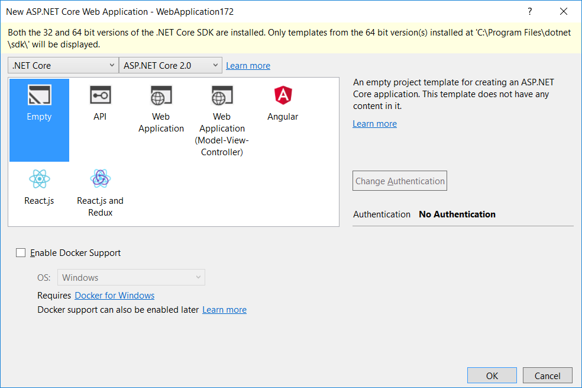
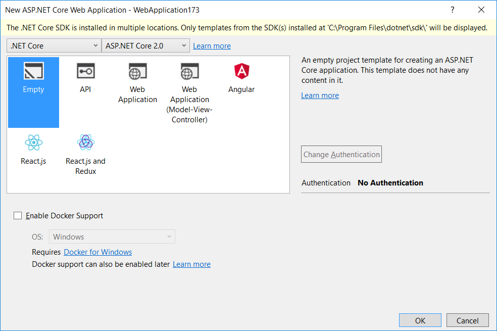
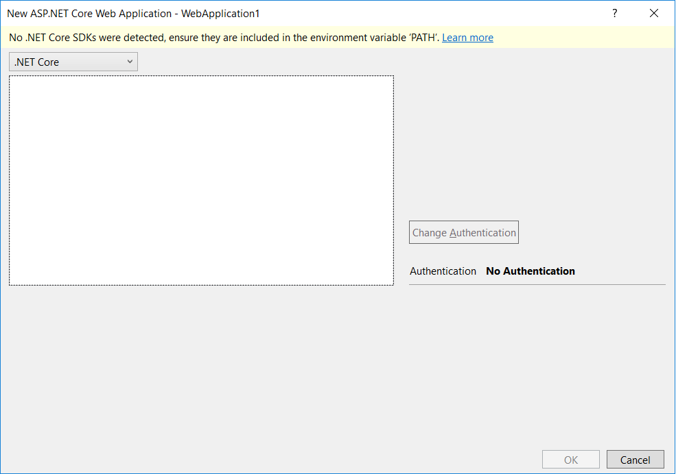

# Troubleshoot ASP.NET Core projects

By [Rick Anderson](https://twitter.com/RickAndMSFT)

The following links provide troubleshooting guidance:

* [Troubleshoot ASP.NET Core on Azure App Service](xref:host-and-deploy/azure-apps/troubleshoot)
* [Troubleshoot ASP.NET Core on IIS](xref:host-and-deploy/iis/troubleshoot)
* [Common errors reference for Azure App Service and IIS with ASP.NET Core](xref:host-and-deploy/azure-iis-errors-reference)
* [NDC Conference (London, 2018): Diagnosing issues in ASP.NET Core Applications](https://www.youtube.com/watch?v=RYI0DHoIVaA)
* [ASP.NET Blog: Troubleshooting ASP.NET Core Performance Problems](https://blogs.msdn.microsoft.com/webdev/2018/05/23/asp-net-core-performance-improvements/)

## .NET Core SDK warnings

### Both the 32 bit and 64 bit versions of the .NET Core SDK are installed

In the **New Project** dialog for ASP.NET Core, you may see the following warning:

> Both 32 and 64 bit versions of the .NET Core SDK are installed. Only templates from the 64 bit version(s) installed at 'C:\\Program Files\\dotnet\\sdk\\' will be displayed.

This warning appears when both 32-bit (x86) and 64-bit (x64) versions of the [.NET Core SDK](https://www.microsoft.com/net/download/all) are installed. Common reasons both versions may be installed include:

* You originally downloaded the .NET Core SDK installer using a 32-bit machine but then copied it across and installed it on a 64-bit machine.
* The 32-bit .NET Core SDK was installed by another application.
* The wrong version was downloaded and installed.

Uninstall the 32-bit .NET Core SDK to prevent this warning. Uninstall from **Control Panel** > **Programs and Features** > **Uninstall or change a program**. If you understand why the warning occurs and its implications, you can ignore the warning.

### The .NET Core SDK is installed in multiple locations

In the **New Project** dialog for ASP.NET Core, you may see the following warning:

> The .NET Core SDK is installed in multiple locations. Only templates from the SDK(s) installed at 'C:\\Program Files\\dotnet\\sdk\\' will be displayed.

You see this message when you have at least one installation of the .NET Core SDK in a directory outside of *C:\\Program Files\\dotnet\\sdk\\*. Usually this happens when the .NET Core SDK has been deployed on a machine using copy/paste instead of the MSI installer.

Uninstall the 32-bit .NET Core SDK to prevent this warning. Uninstall from **Control Panel** > **Programs and Features** > **Uninstall or change a program**. If you understand why the warning occurs and its implications, you can ignore the warning.

### No .NET Core SDKs were detected

In the **New Project** dialog for ASP.NET Core, you may see the following warning:

> No .NET Core SDKs were detected, ensure they are included in the environment variable 'PATH'.

This warning appears when the environment variable `PATH` doesn't point to any .NET Core SDKs on the machine. To resolve this problem:

* Install or verify the .NET Core SDK is installed.
* Verify that the `PATH` environment variable points to the location in which the SDK is installed. The installer normally sets the `PATH`.
