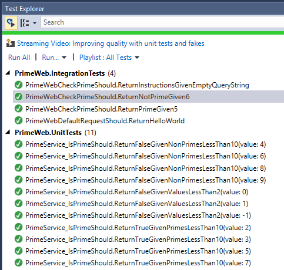

# Integration testing in ASP.NET Core

By [Steve Smith](https://ardalis.com/)

Integration testing ensures that an application's components function correctly when assembled together. ASP.NET Core supports integration testing using unit test frameworks and a built-in test web host that can be used to handle requests without network overhead.

[View or download sample code](https://github.com/aspnet/Docs/tree/master/aspnetcore/testing/integration-testing/sample)

## Introduction to integration testing

Integration tests verify that different parts of an application work correctly together. Unlike [Unit testing](https://docs.microsoft.com/dotnet/articles/core/testing/unit-testing-with-dotnet-test), integration tests frequently involve application infrastructure concerns, such as a database, file system, network resources, or web requests and responses. Unit tests use fakes or mock objects in place of these concerns, but the purpose of integration tests is to confirm that the system works as expected with these systems.

Integration tests, because they exercise larger segments of code and because they rely on infrastructure elements, tend to be orders of magnitude slower than unit tests. Thus, it's a good idea to limit how many integration tests you write, especially if you can test the same behavior with a unit test.

> [!NOTE]
> If some behavior can be tested using either a unit test or an integration test, prefer the unit test, since it will be almost always be faster. You might have dozens or hundreds of unit tests with many different inputs but just a handful of integration tests covering the most important scenarios.

Testing the logic within your own methods is usually the domain of unit tests. Testing how your application works within its framework, for example with ASP.NET Core, or with a database is where integration tests come into play. It doesn't take too many integration tests to confirm that you're able to write a row to the database and read it back. You don't need to test every possible permutation of your data access code - you only need to test enough to give you confidence that your application is working properly.

## Integration testing ASP.NET Core

To get set up to run integration tests, you'll need to create a test project, add a reference to your ASP.NET Core web project, and install a test runner. This process is described in the [Unit testing](https://docs.microsoft.com/dotnet/articles/core/testing/unit-testing-with-dotnet-test) documentation, along with more detailed instructions on running tests and recommendations for naming your tests and test classes.

> [!NOTE]
> Separate your unit tests and your integration tests using different projects. This helps ensure you don't accidentally introduce infrastructure concerns into your unit tests and lets you easily choose which set of tests to run.

### The Test Host

ASP.NET Core includes a test host that can be added to integration test projects and used to host ASP.NET Core applications, serving test requests without the need for a real web host. The provided sample includes an integration test project which has been configured to use [xUnit](https://xunit.github.io) and the Test Host. It uses the `Microsoft.AspNetCore.TestHost` NuGet package.

Once the `Microsoft.AspNetCore.TestHost` package is included in the project, you'll be able to create and configure a `TestServer` in your tests. The following test shows how to verify that a request made to the root of a site returns "Hello World!" and should run successfully against the default ASP.NET Core Empty Web template created by Visual Studio.

[!code-csharp[Main](../testing/integration-testing/sample/test/PrimeWeb.IntegrationTests/PrimeWebDefaultRequestShould.cs?name=snippet_WebDefault&highlight=7,16,22)]

This test is using the Arrange-Act-Assert pattern. The Arrange step is done in the constructor, which creates an instance of `TestServer`. A configured `WebHostBuilder` will be used to create a `TestHost`; in this example, the `Configure` method from the system under test (SUT)'s `Startup` class is passed to the `WebHostBuilder`. This method will be used to configure the request pipeline of the `TestServer` identically to how the SUT server would be configured.

In the Act portion of the test, a request is made to the `TestServer` instance for the "/" path, and the response is read back into a string. This string is compared with the expected string of "Hello World!". If they match, the test passes; otherwise, it fails.

Now you can add a few additional integration tests to confirm that the prime checking functionality works via the web application:

[!code-csharp[Main](../testing/integration-testing/sample/test/PrimeWeb.IntegrationTests/PrimeWebCheckPrimeShould.cs?name=snippet_CheckPrime)]

Note that you're not really trying to test the correctness of the prime number checker with these tests but rather that the web application is doing what you expect. You already have unit test coverage that gives you confidence in `PrimeService`, as you can see here:



You can learn more about the unit tests in the [Unit testing](https://docs.microsoft.com/dotnet/articles/core/testing/unit-testing-with-dotnet-test) article.

## Refactoring to use middleware

Refactoring is the process of changing an application's code to improve its design without changing its behavior. It should ideally be done when there is a suite of passing tests, since these help ensure the system's behavior remains the same before and after the changes. Looking at the way in which the prime checking logic is implemented in the web application's `Configure` method, you see:

```csharp
public void Configure(IApplicationBuilder app, IHostingEnvironment env)
{
    if (env.IsDevelopment())
    {
        app.UseDeveloperExceptionPage();
    }

    app.Run(async (context) =>
    {
        if (context.Request.Path.Value.Contains("checkprime"))
        {
            int numberToCheck;
            try
            {
                numberToCheck = int.Parse(context.Request.QueryString.Value.Replace("?", ""));
                var primeService = new PrimeService();
                if (primeService.IsPrime(numberToCheck))
                {
                    await context.Response.WriteAsync($"{numberToCheck} is prime!");
                }
                else
                {
                    await context.Response.WriteAsync($"{numberToCheck} is NOT prime!");
                }
            }
            catch
            {
                await context.Response.WriteAsync("Pass in a number to check in the form /checkprime?5");
            }
        }
        else
        {
            await context.Response.WriteAsync("Hello World!");
        }
    });
}
```

This code works, but it's far from how you would like to implement this kind of functionality in an ASP.NET Core application, even as simple as this is. Imagine what the `Configure` method would look like if you needed to add this much code to it every time you add another URL endpoint!

One option to consider is adding [MVC](xref:mvc/overview) to the application and creating a controller to handle the prime checking. However, assuming you don't currently need any other MVC functionality, that's a bit overkill.

You can, however, take advantage of ASP.NET Core [middleware](xref:fundamentals/middleware), which will help us encapsulate the prime checking logic in its own class and achieve better [separation of concerns](http://deviq.com/separation-of-concerns/) in the `Configure` method.

You want to allow the path the middleware uses to be specified as a parameter, so the middleware class expects a `RequestDelegate` and a `PrimeCheckerOptions` instance in its constructor. If the path of the request doesn't match what this middleware is configured to expect, you simply call the next middleware in the chain and do nothing further. The rest of the implementation code that was in `Configure` is now in the `Invoke` method.

> [!NOTE]
> Since the middleware depends on the `PrimeService` service, you're also requesting an instance of this service with the constructor. The framework will provide this service via [Dependency Injection](xref:fundamentals/dependency-injection), assuming it has been configured, for example in `ConfigureServices`.

[!code-csharp[Main](../testing/integration-testing/sample/src/PrimeWeb/Middleware/PrimeCheckerMiddleware.cs?highlight=39-63)]

Since this middleware acts as an endpoint in the request delegate chain when its path matches, there is no call to `_next.Invoke` when this middleware handles the request.

With this middleware in place and some helpful extension methods created to make configuring it easier, the refactored `Configure` method looks like this:

[!code-csharp[Main](../testing/integration-testing/sample/src/PrimeWeb/Startup.cs?highlight=9&range=19-33)]

Following this refactoring, you're confident that the web application still works as before, since your integration tests are all passing.

> [!NOTE]
> It's a good idea to commit your changes to source control after you complete a refactoring and your tests pass. If you're practicing Test Driven Development, [consider adding Commit to your Red-Green-Refactor cycle](https://ardalis.com/rgrc-is-the-new-red-green-refactor-for-test-first-development).

## Resources

* [Unit testing](https://docs.microsoft.com/dotnet/articles/core/testing/unit-testing-with-dotnet-test)
* [Middleware](xref:fundamentals/middleware)
* [Testing controllers](xref:mvc/controllers/testing)
