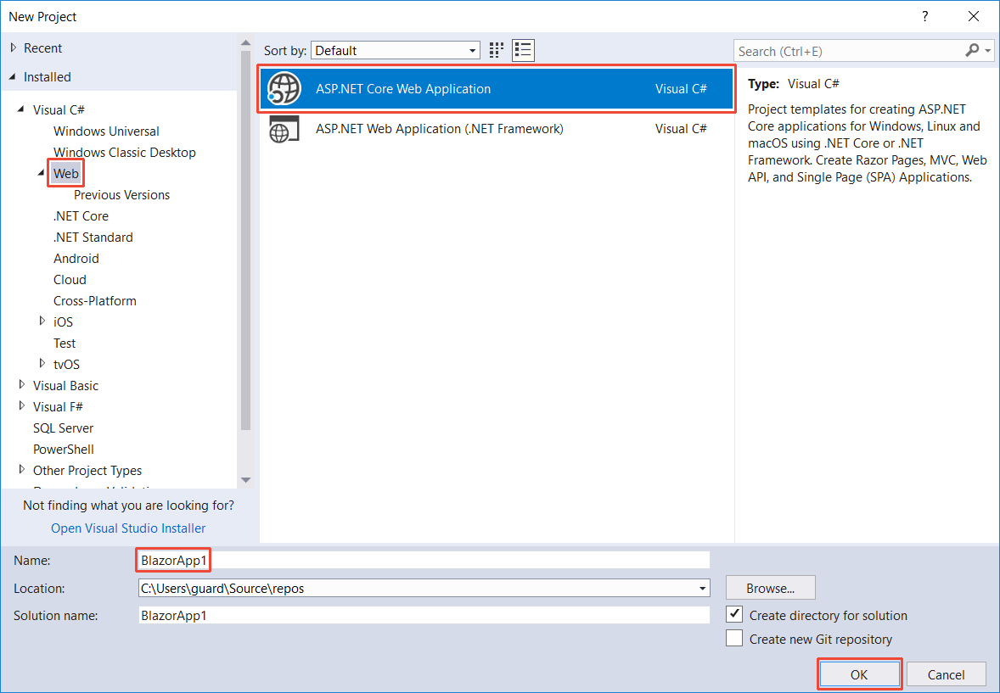
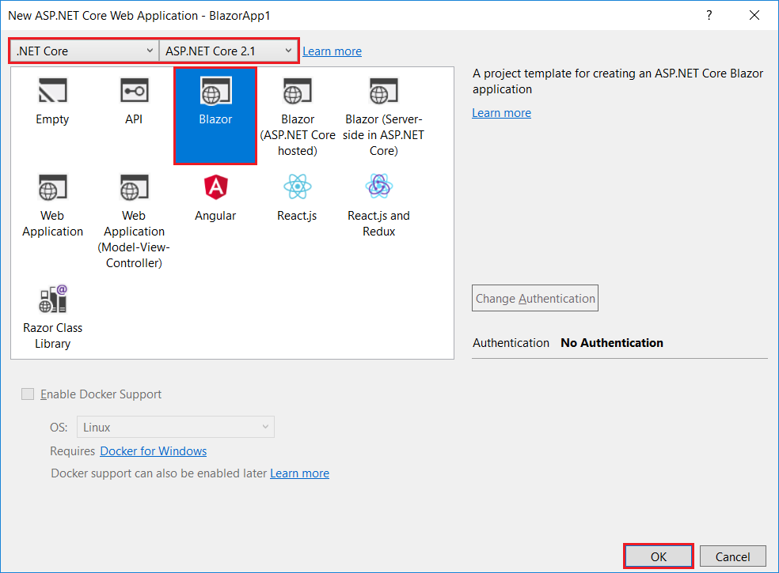
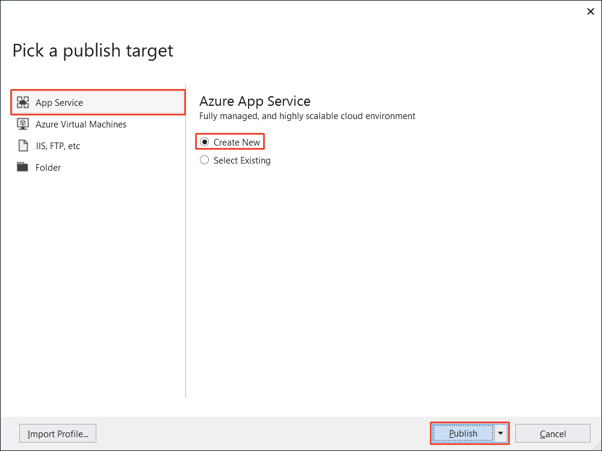
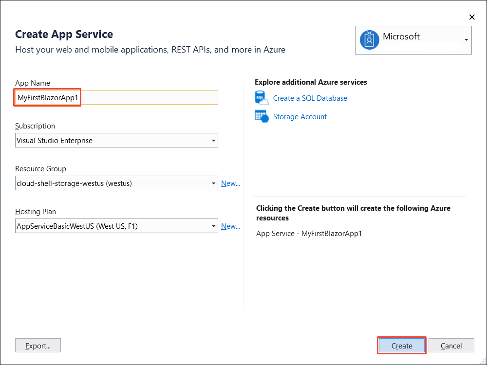

# Build your first Blazor app

[!INCLUDE[](~/includes/razor-components-preview-notice.md)]

In this tutorial, you build a Blazor app step-by-step and quickly learn the basic features of the Razor Components framework.

[View or download sample code](https://github.com/aspnet/Docs/tree/master/aspnetcore/tutorials/build-your-first-blazor-app/samples/) ([how to download](xref:index#how-to-download-a-sample)). See the [Get started](xref:razor-components/get-started) topic for prerequisites.

To create the project in Visual Studio:

1. Select **File** > **New** > **Project**. Select **Web** > **ASP.NET Core Web Application**. Name the project "BlazorApp1" in the **Name** field. Select **OK**.

    

1. The **New ASP.NET Core Web Application** dialog appears. Make sure **.NET Core** is selected at the top. Select **ASP.NET Core 2.1**. Choose the **Blazor** template and select **OK**.

    

1. Once the project is created, press **Ctrl-F5** to run the app *without the debugger*. Running with the debugger (**F5**) isn't supported at this time.

> [!NOTE]
> If not using Visual Studio, create the Blazor app at a command prompt on Windows, macOS, or Linux:
>
> ```console
> dotnet new --install "Microsoft.AspNetCore.Blazor.Templates"
> dotnet new blazor -o BlazorApp1
> cd BlazorApp1
> dotnet run
> ```
>
> Navigate to the app using the localhost address and port provided in the console window output after `dotnet run` is executed. Use **Ctrl-C** in the console window to shutdown the app.

The Blazor app runs in the browser:


## Build components

1. Browse to each of the app's three pages: Home, Counter, and Fetch data.

    These three pages are implemented by the three Razor files in the *Pages* folder: *Index.cshtml*, *Counter.cshtml*, and *FetchData.cshtml*. Each of these files implements a component that's compiled and executed client-side in the browser.

1. Select the button on the Counter page.

    

    Each time the button is selected, the counter is incremented without a page refresh. Normally, this kind of client-side behavior is handled in JavaScript; but here, it's implemented in C# and .NET by the `Counter` component.

1. Take a look at the implementation of the `Counter` component in the *Counter.cshtml* file:

    ```cshtml
    @page "/counter"

    <h1>Counter</h1>

    <p>Current count: @currentCount</p>

    <button class="btn btn-primary" onclick="@IncrementCount">Click me</button>

    @functions {
        int currentCount = 0;

        void IncrementCount()
        {
            currentCount++;
        }
    }
    ```

    The UI for the `Counter` component is defined using normal HTML. Dynamic rendering logic (for example, loops, conditionals, expressions) is added using an embedded C# syntax called [Razor](https://docs.microsoft.com/aspnet/core/mvc/views/razor). The HTML markup and C# rendering logic are converted into a component class at build time. The name of the generated .NET class matches the name of the file.

    Members of the component class are defined in a `@functions` block. In the `@functions` block, component state (properties, fields) and methods can be specified for event handling or for defining other component logic. These members can then be used as part of the component's rendering logic and for handling events.

    When the button is selected, the `Counter` component's registered `onclick` handler is called (the `IncrementCount` method) and the `Counter` component regenerates its render tree. Blazor compares the new render tree against the previous one and applies any modifications to the browser Document Object Model (DOM). The displayed count is updated.

1. Update the markup for the `Counter` component to make the top-level header more *exciting*.

    ```cshtml
    @page "/counter"
    <h1><em>Counter!!</em></h1>
    ```

1. Also modify the C# logic of the `Counter` component to make the count increment by two instead of one.

    ```cshtml
    @functions {
        int currentCount = 0;

        void IncrementCount()
        {
            currentCount += 2;
        }
    }
    ```

1. Refresh the counter page in the browser to see the changes.

    

## Use components

After a component is defined, the component can be used to implement other components. The markup for using a component looks like an HTML tag where the name of the tag is the component type.

1. Add a `Counter` component to the Home page of the app (*Index.cshtml*).

    ```cshtml
    @page "/"

    <h1>Hello, world!</h1>

    Welcome to your new app.

    <SurveyPrompt Title="How is Blazor working for you?" />

    <Counter />
    ```

1. Refresh the home page in the browser. Note the separate instance of the `Counter` component on the Home page.

    

## Component parameters

Components can also have parameters, which are defined using private properties on the component class decorated with `[Parameter]`. Use attributes to specify arguments for a component in markup. 

1. Update the `Counter` component to have an `IncrementAmount` parameter that defaults to 1.

    ```cshtml
    @functions {
        int currentCount = 0;

        [Parameter]
        private int IncrementAmount { get; set; } = 1;

        void IncrementCount()
        {
            currentCount += IncrementAmount;
        }
    }
    ```

    > [!NOTE]
    > From Visual Studio, you can quickly add a component parameter by using the `para` snippet. Type `para` and then press the `Tab` key twice.

1. On the Home page (*Index.cshtml*), change the increment amount for the `Counter` to 10 by setting an attribute that matches the name of the component's property for `IncrementCount`.

    ```cshtml
    <Counter IncrementAmount="10" />
    ```

1. Reload the page.

    The counter on the Home page now increments by 10, while the counter on the Counter page still increments by 1.

    

## Route to components

The `@page` directive at the top of the *Counter.cshtml* file specifies that this component is a page to which requests can be routed. Specifically, the `Counter` component handles requests sent to `/Counter`. Without the `@page` directive, the component wouldn't handle routed requests, but the component could still be used by other components.

## Dependency injection

Services registered with the app's service provider are available to components via [dependency injection (DI)](https://docs.microsoft.com/aspnet/core/fundamentals/dependency-injection). Services can be injected into a component using the `@inject` directive.

Take a look at the implementation of the `FetchData` component in *FetchData.cshtml*. The `@inject` directive is used to inject an [HttpClient](https://docs.microsoft.com/dotnet/api/system.net.http.httpclient) instance into the component.

```cshtml
@page "/fetchdata"
@inject HttpClient Http
```

The `FetchData` component uses the injected `HttpClient` to retrieve JSON data from the server when the component is initialized. Under the covers, the `HttpClient` provided by the Blazor runtime is implemented using JavaScript interop to call the underlying browser's Fetch API to send the request (from C#, it's possible to call any JavaScript library or browser API). The retrieved data is deserialized into the `forecasts` C# variable as an array of `WeatherForecast` objects.

```cshtml
@functions {
    WeatherForecast[] forecasts;

    protected override async Task OnInitAsync()
    {
        forecasts = await Http.GetJsonAsync<WeatherForecast[]>("/sample-data/weather.json");
    }

    class WeatherForecast
    {
        public DateTime Date { get; set; }
        public int TemperatureC { get; set; }
        public int TemperatureF { get; set; }
        public string Summary { get; set; }
    }
}
```

A `@foreach` loop is used to render each forecast instance as a row in the weather table.

```cshtml
<table class="table">
    <thead>
        <tr>
            <th>Date</th>
            <th>Temp. (C)</th>
            <th>Temp. (F)</th>
            <th>Summary</th>
        </tr>
    </thead>
    <tbody>
        @foreach (var forecast in forecasts)
        {
            <tr>
                <td>@forecast.Date.ToShortDateString()</td>
                <td>@forecast.TemperatureC</td>
                <td>@forecast.TemperatureF</td>
                <td>@forecast.Summary</td>
            </tr>
        }
    </tbody>
</table>
```

## Build a todo list

Add a new page to the app that implements a simple todo list.

1. Add an empty text file to the *Pages* folder named *Todo.cshtml*.

1. Provide the initial markup for the page.

    ```cshtml
    @page "/todo"

    <h1>Todo</h1>
    ```

1. Add the Todo page to the navigation bar by updating *Shared/NavMenu.cshtml*. Add a `NavLink` for the Todo page by adding the following list item markup below the existing list items.

    ```cshtml
    <li class="nav-item px-3">
        <NavLink class="nav-link" href="todo">
            <span class="oi oi-list-rich" aria-hidden="true"></span> Todo
        </NavLink>
    </li>
    ```

1. Refresh the app in the browser. See the new Todo page.

    

1. Add a *TodoItem.cs* file to the root of the project to hold a class to represent the todo items.

1. Use the following C# code for the `TodoItem` class.

    ```csharp
    public class TodoItem
    {
        public string Title { get; set; }
        public bool IsDone { get; set; }
    }
    ```

1. Go back to the `Todo` component in *Todo.cshtml* and add a field for the todos in a `@functions` block. The `Todo` component uses this field to maintain the state of the todo list.

    ```cshtml
    @functions {
        IList<TodoItem> todos = new List<TodoItem>();
    }
    ```

1. Add unordered list markup and a `foreach` loop to render each todo item as a list item.

    ```cshtml
    @page "/todo"

    <h1>Todo</h1>

    <ul>
        @foreach (var todo in todos)
        {
            <li>@todo.Title</li>
        }
    </ul>
    ```

1. The app requires UI elements for adding todos to the list. Add a text input and a button below the list.

    ```cshtml
    @page "/todo"

    <h1>Todo</h1>

    <ul>
        @foreach (var todo in todos)
        {
            <li>@todo.Title</li>
        }
    </ul>

    <input placeholder="Something todo" />
    <button>Add todo</button>

    @functions {
        IList<TodoItem> todos = new List<TodoItem>();
    }
    ```

1. Refresh the browser.

    

    Nothing happens when the **Add todo** button is selected because no event handler is wired up to the button.

1. Add an `AddTodo` method to the `Todo` component and register it for button clicks using the `onclick` attribute.

    ```cshtml
    <input placeholder="Something todo" />
    <button onclick="@AddTodo">Add todo</button>

    @functions {
        IList<TodoItem> todos = new List<TodoItem>();

        void AddTodo()
        {
            // Todo: Add the todo
        }
    }
    ```

    The `AddTodo` C# method is called every time the button is selected.

1. To get the title of the new todo item, add a `newTodo` string field and bind it to the value of the text input using the `bind` attribute.

    ```csharp
    IList<TodoItem> todos = new List<TodoItem>();
    string newTodo;
    ```

    ```cshtml
    <input placeholder="Something todo" bind="@newTodo" />
    ```

1. Update the `AddTodo` method to add the `TodoItem` with the specified title to the list. Don't forget to clear the value of the text input by setting `newTodo` to an empty string.

    ```cshtml
    @page "/todo"

    <h1>Todo</h1>

    <ul>
        @foreach (var todo in todos)
        {
            <li>@todo.Title</li>
        }
    </ul>

    <input placeholder="Something todo" bind="@newTodo" />
    <button onclick="@AddTodo">Add todo</button>

    @functions {
        IList<TodoItem> todos = new List<TodoItem>();
        string newTodo;

        void AddTodo()
        {
            if (!string.IsNullOrWhiteSpace(newTodo))
            {
                todos.Add(new TodoItem { Title = newTodo });
                newTodo = string.Empty;
            }
        }
    }
    ```

1. Refresh the browser. Add some todos to the todo list.

    

1. Lastly, what's a todo list without check boxes? The title text for each todo item can be made editable as well. Add a check box input and text input for each todo item and bind their values to the `Title` and `IsDone` properties, respectively.

    ```cshtml
    <ul>
        @foreach (var todo in todos)
        {
            <li>
                <input type="checkbox" bind="@todo.IsDone" />
                <input bind="@todo.Title" />
            </li>
        }
    </ul>
    ```

1. To verify that these values are bound, update the `h1` header to show a count of the number of todo items that are not yet done (`IsDone` is `false`).

    ```cshtml
    <h1>Todo (@todos.Count(todo => !todo.IsDone))</h1>
    ```

1. The completed `Todo` component should look like this:

    ```cshtml
    @page "/todo"

    <h1>Todo (@todos.Count(todo => !todo.IsDone))</h1>

    <ul>
        @foreach (var todo in todos)
        {
            <li>
                <input type="checkbox" bind="@todo.IsDone" />
                <input bind="@todo.Title" />
            </li>
        }
    </ul>

    <input placeholder="Something todo" bind="@newTodo" />
    <button onclick="@AddTodo">Add todo</button>

    @functions {
        IList<TodoItem> todos = new List<TodoItem>();
        string newTodo;

        void AddTodo()
        {
            if (!string.IsNullOrWhiteSpace(newTodo))
            {
                todos.Add(new TodoItem { Title = newTodo });
                newTodo = string.Empty;
            }
        }
    }
    ```

Refresh the app in the browser. Try adding some todo items.


## Publish and deploy

When using Visual Studio, perform the following steps to publish the Todo Blazor app to Azure:

1. Right-click on the project in **Solution Explorer** and select **Publish**.

1. In the **Pick a publish target** dialog, select **App Service** and **Create New**. Select **Publish**.

    

1. In the **Create App Service** dialog, choose a name for the app and select the subscription, resource group, and hosting plan. Select **Create** to create the app service and publish the app.

    

Wait a minute or so for the app to be deployed.

The app should now be running in Azure. Mark the todo item to build your first Blazor app as *done*. Nice job!


> [!NOTE]
> If not using Visual Studio, publish the Blazor app at a command prompt on Windows, macOS, or Linux:
>
> ```console
> dotnet publish -c Release
> ```
>
> The deployment is created in the */bin/Release/\<target-framework>/publish* folder. Move the contents of the *publish* folder to the server or hosting service.
>
> For more information, see the [Host and deploy](xref:host-and-deploy/razor-components/index#publish-the-app) topic.

## Additional resources

For a more involved Blazor sample app, check out the [Flight Finder sample](https://github.com/aspnet/samples/tree/master/samples/aspnetcore/blazor) on GitHub.


