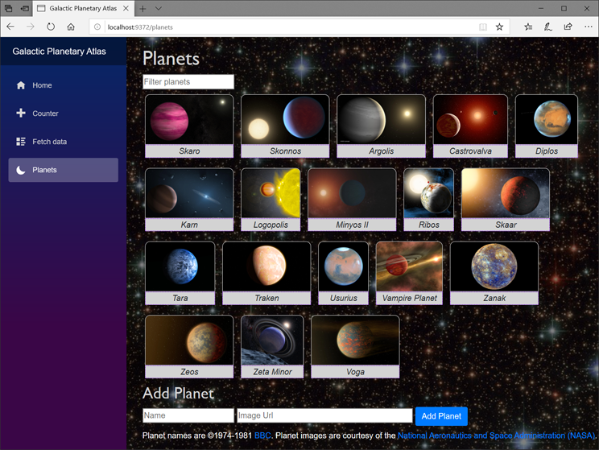

# Build your first Blazor app

By [Luke Latham](https://github.com/guardrex) and [Daniel Roth](https://github.com/danroth27)

This tutorial teaches concepts and techniques for building Blazor apps. In this tutorial, you build the *Galactic Planetary Atlas* app, an app that manages a list of planets.

Learn how to:

> [!div class="checklist"]
> * Create a new component.
> * Route to a component.
> * Display, filter, and add items using data binding and event handling.
> * Create services and use them through [dependency injection (DI)](xref:fundamentals/dependency-injection).



## Prepare the project

Follow the guidance in the <xref:blazor/get-started> article to create a Blazor project for this tutorial.

### Update the title

If building a Blazor server-side app, open the *Pages/\_Host.cshtml* file. If building a Blazor client-side app, open the *wwwroot/index.html* file.

Change the content of the `<title>` element to `Galactic Planetary Atlas`:

```html
<title>Planetary Atlas</title>
```

### Add the app's namespace to the \_Imports.razor file

*This section only applies to Blazor server-side apps.*

If building a Blazor server-side app, add the app's namespace to the *\_Imports.razor* file. The following [\@using](xref:mvc/views/razor#section-1) directive assumes that the app's namespace is `WebApplication`:

```cshtml
@using WebApplication
```

Blazor client-side apps include the app's namespace by default in the *\_Imports.razor* file.

### Provide CSS styles

This tutorial adds a component to the template app with new HTML elements. In order to style the added elements and the background of the `<body>` element, add the following styles to the *wwwroot/css/site.css* file:

[!code-css[](build-your-first-blazor-app/samples_snapshot/3.x/site.css)]

The background image is provided as a courtesy of the [National Aeronautics and Space Administration (NASA)](https://www.nasa.gov/).

Build and run the app to confirm that there are no errors.

## Create a model for planet data


Create a *Models* folder. In the folder, add a planet model class (`Planet`). Use an `ImageUrl` property to hold an image URL. Use a `Name` property to hold the name of the planet.

*Models/Planet.cs*:

[!code-csharp[](build-your-first-blazor-app/samples_snapshot/3.x/Planet.cs)]

> [!NOTE]
> Throughout this tutorial, code examples assume that the app's namespace is `WebApplication`. If your app's namespace is different, change the namespace in the example code to match your app.

## Create a service for working with planets

Services registered in the app's service container are available to components throughout the app via [dependency injection (DI)](xref:fundamentals/dependency-injection).

This app can benefit from DI by using a service that defines methods to:

* Return a set of planets for display.
* Add a planet to the data source.

Create an interface for the service with two methods defined:

* `GetPlanets` &ndash; Since the app should have the capacity to filter planets, use a `filter` string parameter in the method's signature.
* `AddPlanet`&ndash; The `AddPlanet` method has a `Planet` parameter to receive a planet from the user.

Create a *Data* folder. In the folder, create an interface for the Planet Service named `IPlanetService`. An [\@using](xref:mvc/views/razor#section-1) statement for the `WebApplication.Models` namespace provides the interface with access to the `Planet` model.

*Data/IPlanetService.cs*:

[!code-csharp[](build-your-first-blazor-app/samples_snapshot/3.x/IPlanetService.cs)]

The service requires an implementation that provides the `GetPlanets` and `AddPlanet` methods with a data source for the planets:

* For the data source, a production app would use persistent data storage, such as an [Azure Cosmos database](https://azure.microsoft.com/free/cosmos-db/) accessed by [Entity Framework (EF) Core](/ef/core/) ([in preview for Azure Cosmos](https://github.com/aspnet/EntityFrameworkCore/issues/12086)). For this tutorial experience, the app uses a `List<Planet>` stored in the app's memory.
* In the `GetPlanets` method, the app uses [Linq](/dotnet/csharp/programming-guide/concepts/linq/) to filter planets from the planet list (`_planets`) if the `filter` has a value.
* In the `AddPlanet` method, the app calls [ICollection\<T>.Add(T)](xref:System.Collections.Generic.ICollection`1.Add*) to add a new planet to the list.

In the *Data* folder, create the Planet Service implementation (`PlanetService`) that implements the `IPlanetService` interface.

*Data/PlanetService.cs*:

[!code-csharp[](build-your-first-blazor-app/samples_snapshot/3.x/PlanetService.cs)]

Planet names are &copy;1974-1981 [BBC](https://www.bbc.co.uk/programmes/b006q2x0). Planet images are provided as a courtesy of the [National Aeronautics and Space Administration (NASA)](https://www.nasa.gov/).

The service implementation is registered in the app's DI container. Add the following namespace to the *Startup.cs* file:

```csharp
using WebApplication.Data;
```

Add the service registration to the `Startup.ConfigureServices` method:

```csharp
services.AddSingleton<IPlanetService, PlanetService>();
```

The Planet Service is ready for injection wherever it's required in the app.

For more information, see <xref:blazor/dependency-injection>.

## Build the Planets component

In the following sections, a Planets component is added to the app.

The Planets component:

* Obtains planets from the Planet Service.
* Displays planets in a UI.
* Receives filter characters from the user and filters the list of planets.
* Receives a new planet from the user and adds it to the list of planets.

### Create the initial component

The app can use the Planet Service in a component to display the planets. Namespaces for the app's interfaces and models are provided by [\@using](xref:mvc/views/razor#section-1) directives. The Planet Service (an instance of `IPlanetService`) is injected with the [\@inject](xref:mvc/views/razor#section-4) directive.

The component:

* Specifies a routing endpoint at `/planets` with the [\@page](xref:blazor/components?view=aspnetcore-3.0#routing) directive. For more information, see <xref:blazor/routing>.
* Uses the injected Planet Service to obtain the planets and store them in a field after the component is initialized in [OnInit](xref:blazor/components#lifecycle-methods).
* Uses a [\@foreach](/dotnet/csharp/language-reference/keywords/foreach-in) loop to render each planet instance as a `<figure>` with an image (``) and caption (`<figurecaption>`). For more information, see <xref:mvc/views/razor>.

Create the Planets component in the *Pages* folder named *Planets.razor*.

*Pages/Planets.razor*:

[!code-cshtml[](build-your-first-blazor-app/samples_snapshot/3.x/Planets_1.razor)]

### Provide navigation to the component

Update the app's navigation sidebar with the app's name and provide a link to the new component:

1. Open the Navigation Menu component (*Shared/NavMenu.razor*).
1. On the second line, change the text of the hyperlink to *Galactic Planetary Atlas*.
1. Add a list item (`<li>...</li>`) for the Planets components to the unordered list `<ul>...</ul>` immediately below the list item for the Fetch Data component:

   ```cshtml
   <li class="nav-item px-3">
       <NavLink class="nav-link" href="planets" Match="NavLinkMatch.All">
           <span class="oi oi-moon" aria-hidden="true"></span> Planets
       </NavLink>
   </li>
   ```

   The moon icon for the NavLink component (`oi-moon` CSS class) is provided by [Open Iconic](https://useiconic.com/open), which is available by default in the Blazor template used to create the project.

1. Save and close the Navigation Menu component.

Run the app and navigate to the Planets component to see the rendered planets.

### Provide a planet filter

In the Planets component (*Pages/Planets.razor*), create a `FilterPlanets` method in the [\@functions](xref:mvc/views/razor#section-5) block:

```csharp
private void FilterPlanets(UIChangeEventArgs e)
{
    _planets = PlanetService.GetPlanets(e.Value.ToString());
}
```

The `FilterPlanets` method:

* Receives `UIChangeEventArgs` from the browser, which includes the value of an `<input>` element when the user modifies the input.
* The value of the change event arguments (an `object`) is converted into a `string` and passed to the `GetPlanets` method of the Planet Service.
* The Planet Service returns the filtered list of planets, which is assigned to the `_planets` field.
* The DOM is updated, and the filtered planets are rendered in the UI.

Add an `<input>` element immediately under the 1st level heading (`<h1>`). The element's `oninput` event triggers the `FilterPlanets` method when the user changes the value of the `<input>` element:

```cshtml
<div>
    <input oninput="@FilterPlanets" placeholder="Filter planets" />
</div>
```

Run the app and navigate to the Planets component.

To filter the planets displayed in the UI:

1. Set the focus on the filter element.
1. Type one or a few letters to filter the planets by name. The component event handler executes for every character added or removed from the filter `<input>` element.

For more information, see:

* [Data binding](xref:blazor/components#data-binding)
* [Event handling](xref:blazor/components#event-handling)

### Add planets

Create an `AddPlanet` method in the [\@functions](xref:mvc/views/razor#section-5) block with a private field for a new `Planet`:

```csharp
private Planet _newPlanet = new Planet();

private void AddPlanet()
{
    PlanetService.AddPlanet(_newPlanet);
    _newPlanet = new Planet();
}
```

The component's `AddPlanet` method:

* Uses the `Planet` instance held in a `_newPlanet` field, which is bound to elements in the component.
* Calls the Planet Service's `AddPlanet` method with the planet.
* Resets the `_newPlanet` to a new instance of `Planet`.

Below the division (`<div>...</div>`) that displays the planets, add a division to hold the elements that bind the new planet (`_newPlanet`). Provide a button with an `onclick` attribute assigned to the `AddPlanet` method. The `AddPlanet` method is executed when the button is selected in the UI:

```cshtml
<div>
    <h2>Add Planet</h2>

    <input bind="@_newPlanet.Name" placeholder="Name" />
    <input bind="@_newPlanet.ImageUrl" placeholder="Image Url" style="width:350px" />

    <button class="btn btn-primary" onclick="@AddPlanet">Add Planet</button>
</div>
```

Run the app and navigate to the Planets component.

To add a new planet:

1. Clear any filter characters from the filter `<input>` to ensure that the new planet appears when added.
1. Provide a link to an image that can be hotlinked into the app's UI. For example, use the following NASA image:

   ```
   https://images-assets.nasa.gov/image/PIA19346/PIA19346~orig.jpg
   ```

1. Provide a name for the new planet. For example, type the name "Cassius" in the text box.
1. Select the **Add Planet** button.

To learn how to validate user input, see <xref:blazor/forms-validation>.

### Completed Planets component

The completed Planets component (*Pages/Planets.razor*):

[!code-cshtml[](build-your-first-blazor-app/samples_snapshot/3.x/Planets_final.razor)]

## Publish and deploy the app

To publish the app, see <xref:host-and-deploy/blazor/index>.

## Next steps

* Explore the [Blazor app building workshop: Blazing Pizza](https://aka.ms/blazorworkshop).
* Learn more on how to [create and use Razor Components](xref:blazor/components).
