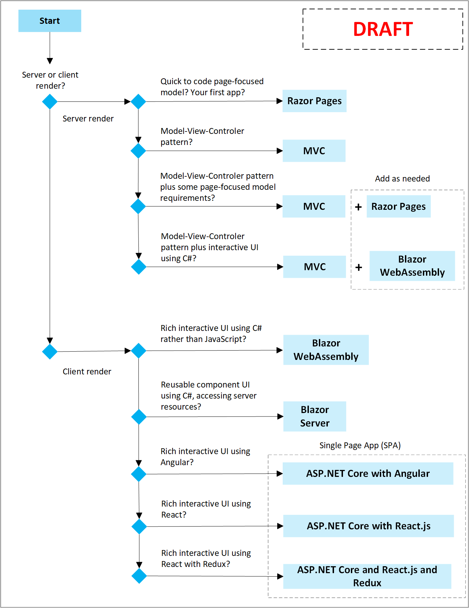

# Choose an ASP.NET Core web UI

ASP.NET Core is a complete end to end UI framework. You choose which functionalities to combine that fit your web UI app needs.

Start by determining if your web UI app will primarily benefit from pre-rendering UI on the server, or rendering UI at the client browser. Then review the server rendered or client rendered ASP.NET Core project types to find which best fit your apps needs. 

## Choose an ASP.NET Core web UI technology

Use the following flowchart to select an ASP.NET Core web UI technology:

## Choose server rendered UI or client rendered UI

There are two general approaches to building modern web UI:

* Apps that render UI on the server.
* Apps that render UI on the client in the browser.

There are benefits and drawbacks to consider for either approach. A hybrid approach is also possible. For example, most of the web UI is rendered on the server, and client rendered pages are added as needed.

### When to choose a server rendered UI approach

A web UI app that renders on the server dynamically generates the page's HTML and CSS on the server. The page arrives at the client ready to display.

Benefits:

* The client requirements are minimal since the server does the work of logic and page generation:
  * Great for low-end devices and low-bandwidth connections.
  * Allows for a broad range of browser versions at the client.
  * Minimal to no code to pull to the client.
* Flexibility of access to server resources, in a protected environment. For example:
  * Database access.
  * Access to secrets, such as an access key used for API calls to Azure storage.
* Uses a token-based security model, rather than using cookies.

Examples of server rendered web UI apps:

* A website for bank services.
* A blog.
* A public-facing content management system.

Drawbacks:

* The cost of compute and memory use are concentrated on the server, rather than each client.
* Rich interactivity isn't instant: Rich interactive-driven changes are best generated on the client, rather than requiring a round trip to the server to generate an updated page.

### When to choose a client rendered UI approach

A client rendered web UI app dynamically renders UI on the client, generating and updating the page on the client.

Benefits:

* Takes advantage of the capabilities of the user’s device.
* Allows for rich interactivity that is instant, without requiring a round trip to the server. UI event handling and logic runs locally on the user's device with minimal latency. Choose a client rendered application if your app's requirements include rich functionality that goes beyond what typical HTML forms offer.
* Supports incremental updates, saving partially completed forms or documents without the user having to select a button to submit a form.
* Can be designed to run in a disconnected mode. Updates to the client-side model that are eventually synchronized back to the server once a connection is re-established.

Examples of client rendered web UI:

* An interactive dashboard.
* An app featuring drag-and-drop functionality
* A responsive and collaborative social app.

Drawbacks:

* Code for the logic has to be downloaded to the client, adding to the initial load time.
* Uses cookies rather than a Token based security model. Cookies may or may not be enabled on the user's browser.
* Client requirements may exclude user's who have low-end devices, older browser versions, or low-bandwidth connections.

## Choose a server rendered ASP.NET Core UI solution

The following section briefly explains the ASP.NET Core web UI server rendered models available and directs next steps to get started. ASP.NET Core Razor Pages and ASP.NET Core MVC are server-based frameworks for building web apps with .NET.

### ASP.NET Core Razor Pages

Razor Pages is a page-based model that is easy to get started with. UI and business logic concerns are kept separate, but within the page. Razor Pages is the preferred way to create page-based or form-based apps in ASP.NET Core.

Razor Pages benefits, in addition to the server rendering benefits previously listed:

* Quickly build and update UI. What you need to code for the page is kept with the page, while keeping UI and business logic concerns separate.
* Testable and scales to large apps.
* Keep your ASP.NET Core pages organized in a simpler way:
  * All view (page) specific logic and page properties (view model) can be kept together in their own namespace and directory.
  * Groups of related pages can be kept in their own namespace and directory.

To get started with your first ASP.NET Core Razor Pages app, see [Get started with Razor Pages](xref:tutorials/razor-pages/razor-pages-start). For a complete overview of ASP.NET Core Razor Pages, its architecture and benefits, see: [Introduction to Razor Pages in ASP.NET Core](xref:razor-pages/index)

### ASP.NET MVC

ASP.NET MVC renders UI on the server and uses a Model-View-Controller (MVC) architectural pattern. The MVC pattern separates an application into three main groups of components: Models, Views, and Controllers. User requests are routed to a Controller.The Controller is responsible for working with the Model to perform user actions and, or retrieve results of queries. The Controller chooses the View to display to the user, and provides it with any Model data it requires.

MVC benefits, in addition to the server rendering benefits previously listed:

* Easier to scale the web UI application in terms of complexity. It's easier to code, debug, and test something (model, view, or controller) that has a single job.
* Clear [separation of concerns](/dotnet/standard/modern-web-apps-azure-architecture/architectural-principles#separation-of-concerns) for maximum flexibility.
* The Model-View-Controller separation of responsibilities ensures that the business model can evolve without being tightly coupled to low-level implementation details.

To get started with your first ASP.NET Core MVC app, see [Get started with MVC](xref:tutorials/first-mvc-app/start-mvc). For a complete overview of ASP.NET Core MVC, its architecture and benefits, see [Overview of ASP.NET Core MVC](xref:mvc/overview)

## Choose a client rendered ASP.NET Core solution

The following section briefly explains the ASP.NET Core web UI client rendered models available and directs you to the next steps to get started.

### ASP.NET Core Blazor WebAssembly

Blazor WebAssembly is a [single-page app (SPA) framework](/dotnet/architecture/modern-web-apps-azure/choose-between-traditional-web-and-single-page-apps) for building interactive client-side web apps that run in the browser on a [WebAssembly](https://webassembly.org/)-based .NET runtime (*Blazor WebAssembly*). Blazor WebAssembly uses open web standards without plugins or recompiling code into other languages. Blazor WebAssembly works in all modern web browsers, including mobile browsers.

Running .NET code inside web browsers is made possible by [WebAssembly](https://webassembly.org) (abbreviated `wasm`). WebAssembly is a compact bytecode format optimized for fast download and maximum execution speed. WebAssembly is an open web standard and supported in web browsers without plugins.

WebAssembly code can access the full functionality of the browser via JavaScript, called *JavaScript interoperability*. .NET code executed via WebAssembly in the browser runs in the browser's JavaScript sandbox with the protections that the sandbox provides against malicious actions on the client machine.

Benefits:

* Build interactive web UIs using C# instead of JavaScript. Using the same language for front-end and back-end code can:
  * Accelerate app development.
  * Reduce build pipeline complexity.
  * Simplify maintenance.
  * Leverage the existing .NET ecosystem of [.NET libraries](/dotnet/standard/class-libraries).
  * Let developers understand and work on both client-side and server-side code.
* Reusable, sharable UI components: Blazor apps are composed of reusable web UI components implemented using C#, HTML, and CSS. Both client and server code are written in C#, allowing you to share code and libraries.
* Blazor works in all modern web browsers, including mobile browsers. Blazor uses open web standards without plug-ins or code transpilation.
* Quickly get productive with Blazor reusable UI components from top component vendors like:
  * [Telerik](https://www.telerik.com/blazor-ui)
  * [DevExpress](https://www.devexpress.com/blazor/)
  * [Syncfusion](https://www.syncfusion.com/blazor-components)
  * [Radzen](https://blazor.radzen.com/)
  * [Infragistics](https://www.infragistics.com/products/ignite-ui-blazor)
  * [GrapeCity](https://www.grapecity.com/componentone/blazor-ui-controls)
  * [jQWidgets](https://www.htmlelements.com/blazor/), and others.

To get started with your first ASP.NET Core Blazor WebAssembly app, see [Tooling for ASP.NET Core Blazor](xref:blazor/tooling). For a complete overview of ASP.NET Core Blazor WebAssembly, its architecture and benefits, see [Overview of Blazor WebAssembly](xref:blazor/index#blazor-webassembly).

### ASP.NET Core Blazor Server

ASP.NET Core Blazor Server has the advantage of direct access to server resources, while providing model for building rich, interactive, and composable user interfaces in C#. Blazor Server components are UI elements such as a page, dialog, or data entry form, that handle client-side web UI interactions. The client-side web UI interactions are handled over a websocket connection, and can span multiple connections to increase speed. Blazor components keep track of the state of the client-side DOM and efficiently apply updates to only the components that need it.

Blazor Server benefits:

* Create rich interactive UIs using [C#](/dotnet/csharp/) instead of [JavaScript](https://www.javascript.com).
* Share server-side and client-side app logic written in .NET.
* Render the UI as HTML and CSS for wide browser support, including mobile browsers.
* Share app logic across server and client.
* Leverage the existing .NET ecosystem of [.NET libraries](/dotnet/standard/class-libraries).
* Flexibility of access to server resources, in a protected environment. For example:
  * Database access.
  * Access to secrets, such as an access key used for API calls to Azure storage.
* Uses a token-based security model, rather than using cookies that may or may not be enabled on the browser.

To get started with your first ASP.NET Core Blazor Server app, see [Get started with Blazor](https://dotnet.microsoft.com/learn/aspnet/blazor-tutorial/intro). For a complete overview of ASP.NET Core Blazor Server, its architecture and benefits, see [Introduction to ASP.NET Core Blazor](xref:blazor/index).

### ASP.NET Core MVC plus hosted Blazor WebAssembly

MVC and Blazor are both part of the ASP.NET Core framework and are designed to be used together. Razor components can be integrated into Razor Pages and MVC apps in a hosted Blazor WebAssembly solution. When the page or view is rendered, components can be prerendered at the same time.

Choose ASP.NET Core MVC plus Blazor WebAssembly when these benefits best fit your Web UI app needs:

* Prerendering:
  * Executes Blazor components on the server and renders them into a page or view.
	* Improves the perceived load time of the app while interactivity is being set up.
* Add islands of interactivity to existing views (pages), using the component tag helper.

To get started with ASP.NET Core MVC plus Blazor WebAssembly, see [Prerender and integrate ASP.NET Core Razor components](xref:blazor/components/prerendering-and-integration).

### ASP.NET Core Single Page Application (SPA) with JavaScript Frameworks such as Angular and React

Build client-side logic for ASP.NET Core apps using popular JavaScript frameworks, like [Angular](https://angular.io/) or [React](https://facebook.github.io/react/).  ASP.NET Core provides project templates for Angular, React, and React plus Redux.

Benefits of ASP.NET Core SPA with JavaScript Frameworks, in addition to the client rendering benefits previously listed:

* Client-side UI frameworks run on the user’s device in the browser
* Client-based apps take advantage of the capabilities of the user’s device and provide rich interactivity.
* Build client-side logic for ASP.NET Core apps using popular JS frameworks, like Angular and React, or build your client-side logic with .NET using Blazor.
* Client-based apps can be deployed as standalone static sites, but often call into server hosted functionality through APIs.
* Make your app installable and run offline by turning it into a Progressive Web App (PWA).

To get started, see:

* [Use the Angular project template with ASP.NET Core](xref:spa/angular)
* [Use the React project template with ASP.NET Core](xref:spa/react)
* [Use the React-with-Redux project template with ASP.NET Core](xref:spa/react-with-redux)

## Next steps

For more information, see:

* [Blazor hosting models: Server vs WebAssembly](xref:blazor/hosting-models)
* [Provide an API for your web UI app: Compare gRPC services with HTTP APIS and SignalR](xref:grpc/comparison)
* [Prerender and integrate ASP.NET Core Razor components](xref:blazor/components/prerendering-and-integration)
