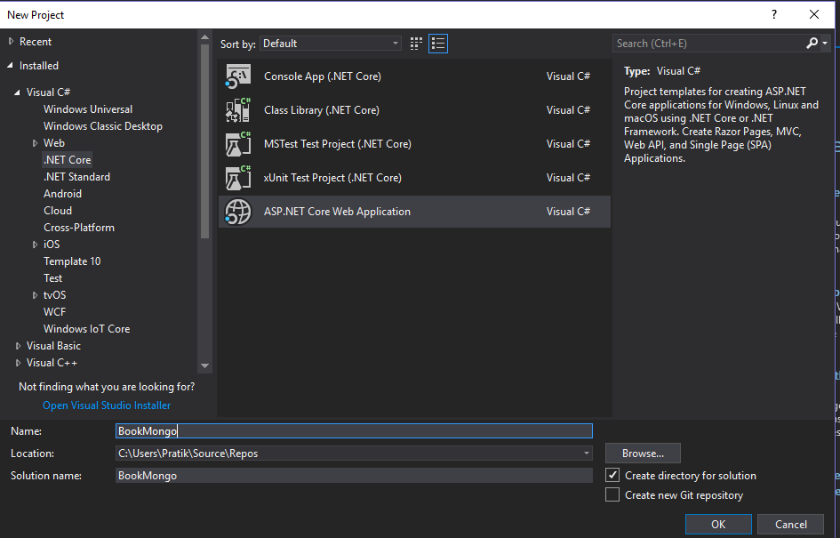
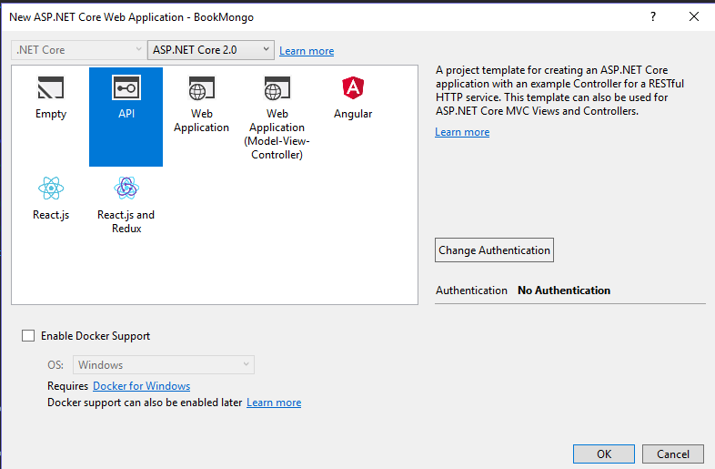
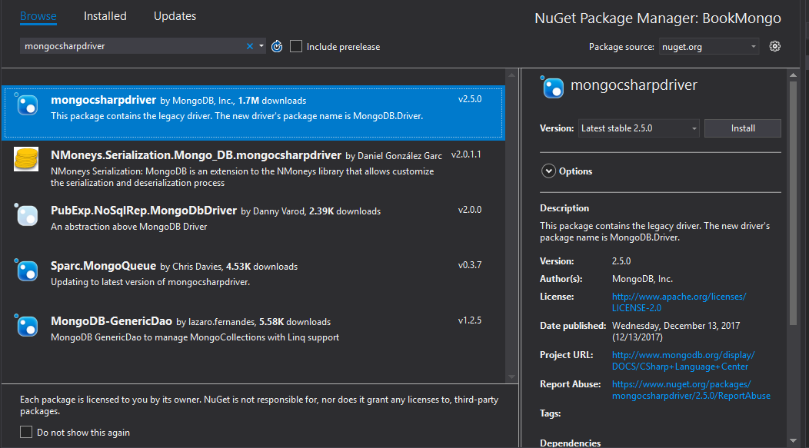
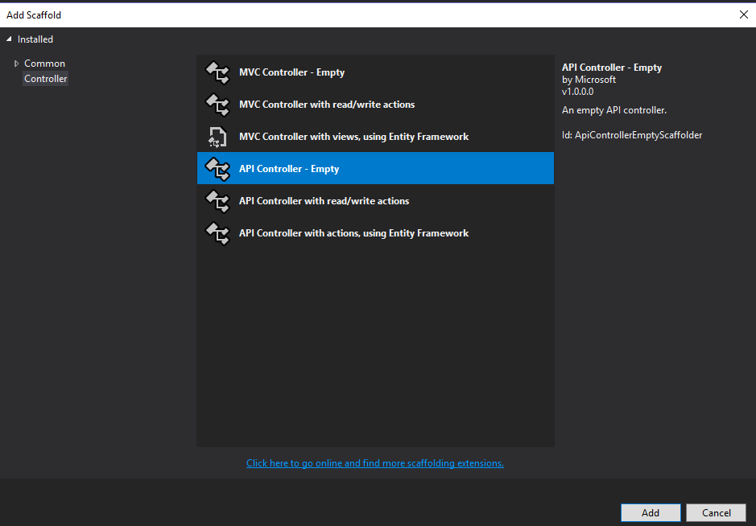

# Create a web API with ASP.NET Core and MongoDB

By [Pratik Khandelwal](https://twitter.com/K2Prk)

In this tutorial, we will create a web API using ASP.NET Core to perform CRUD operations on a MongoDB collection.

### What is MongoDB

MongoDB is an open-source, non-relational database developed by MongoDB, Inc. MongoDB stores data as documents in a binary representation called BSON (Binary JSON). In modern web app, the use of NoSQL databases is becoming popular due to its non-relational bahavior.


### Set up MongoDB

To get started, install MongoDB on your system. You can download MongoDB from [here](https://docs.mongodb.com/manual/administration/install-community/). If you're using Windows, MongoDB is installed in the following path:

C:\Program Files\MongoDB

Add *C:\Program Files\MongoDB\Server\3.4\bin* to the `Path` environment variable to access MongoDB from anywhere.

### MongoDB implementation

To use MongoDB, we have to create a database, make collections, and store documents in it. To do that, create a a data folder where your data will be stored. You can choose any location on your system as the data folder. (Keep note that the MongoDB CLI doesn't create new directories).

Open a command shell:

```console
mongod --dbpath <enter-the-path>
```

This will connect to MongoDB on port 27017.

Open another command shell instance and run the following:	

```console
mongo
```

This connects to the default test database. Run the following command in command shell:

```console
useBookstoreDb
```

If it doesn't already exist, a database named *BookstoreDb* is created. If the database does exist, its connection is opened for transactions.

We can create a collection using following command:

```console
db.createCollection('Books')
```

The schema for the `Books` collection can be defined with the following command:

```console
db.Books.insert({'BookId':1,'BookName':'Design Patterns','Price':3000,'Category':'Computers', 'Author':' Ralph Johnson'})
```

To see the entries in your database, you can use following command:

```console
db.Books.find({})
```

The following result will be displayed:

```console
db.Books.find({})
{ "_id" : ObjectId("5ad08f91a4f1c236ef1b4fff"), "BookId" : 1, "BookName" : "Design Patterns", "Price" : 3000, "Category" : "Computers", "Author" : " Ralph Johnson" }
```

The schema will add `_id` property. This property will be an `ObjectId` which will be generated automatically.

Now that our database is ready, we can start creating our web API using .NET Core.

### Create the ASP.NET Core web API

You need Visual Studio with .NET Core SDK for creating the .NET app. For the purpose of this article, I will be using Visual Studio 2017.

In visual studio, go to **File** > **New** > **Project** and select ASP.NET Core Web app from .NET Core tab.



Name the project "BookMongo" (or whatever you like) and click OK. This will open a window for selecting templates. Choose the **API** template and click OK.



This will create your web API project.

Right-click the project in Solution Explorer and select Manage NuGet Packages.

Search for *mongocsharpdriver* and install the package.



### Add a model

Now, in the project, add a *Models* folder. In this folder, add a new class file of name *Book.cs*. Add the following code in this file:

[!code-csharp[](~/tutorials/first-mongo-app/sample/BookstoreAPI/Models/Book.cs?name=snippet_1)]

The class also contains `Id` property of the type `ObjectId`. This property is mandatory so that the CLR object can be mapped with Collection in MongoDB. The class contains properties having the `BsonElement` attribute applied on it. This represents the mapped property with the MongoDB collection.

### Write a class for CRUD operations

Now, add a *DataAccess.cs* class file in the *Models* folder with the following code in it:

[!code-csharp[](~/tutorials/first-mongo-app/sample/BookstoreAPI/Models/DataAccess.cs?name=snippet_1)]

The preceding code uses the following classes:

**MongoServer** - This represents an instance of the MongoDB Server.

**MongoClient** - This class is used to read the server instance for performing operations on the database. The constructor of this class is passed with the MongoDB Connection string as shown in the following box:

```console
"mongodb://localhost:27017"
```

**MongoDatabase** - This represents Mongo Database for performing operations. This class provides following methods:

GetCollection<T>(*collection*) => T is the CLR object to be *collection*. The method returns a *MongoCollection*.

**FindAll()** - Returns all documents in collection()

**FindOne()** - Returns a single document based on Mongo Query object generated based on `_id`.

**Save()** - Save a new document in collection.

**Update()** - Update a document.

**Remove()** - Remove a document.

Our code in *DataAccess.cs* uses all these methods for performing CRUD operations on the data stored in the MongoDB server.

### Add a controller

Now, click right on the *Controllers* folder and add a controller



Choose the *API Controller - Empty* to scaffold and name it *BooksController*.

In the controller class, add the following code:

[!code-csharp[](~/tutorials/first-mongo-app/sample/BookstoreAPI/Controllers/BooksController.cs?name=snippet_1)]

The preceding web API controller class uses DataAccess class for performing CRUD operations. The web API class contains GET, POST, PUT, DELETE methods for HTTP operations.

Build and run the app. Call the API from your browser. 
(localhost:port/api/controllerName)

```console
http://localhost:51496/api/Books
```

You will receive a similar JSON response depending on your data.


Using Mongo C# Driver, one can easily connect to the MongoDB database and perform CRUD operations. Using ASP.NET Core, MongoDB data can be easily made available to various client apps for storing and reading data. This will provide you the power of .NET Core with flexibility of MongoDB NoSQL database.

