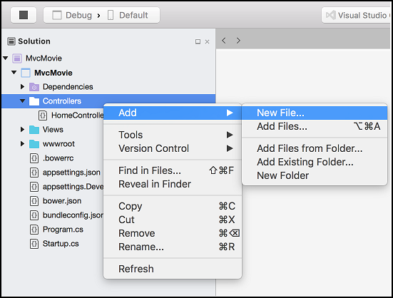
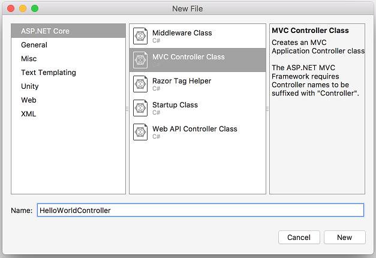

# Adding a controller to an ASP.NET Core MVC app with Visual Studio for Mac

By [Rick Anderson](https://twitter.com/RickAndMSFT)

[!INCLUDE[adding-controller](../../includes/mvc-intro/adding-controller1.md)]

## Add a controller 

In **Solution Explorer**, right-click **Controllers > Add > New File**.

Select **ASP.NET Core** and **MVC Controller Class**.

Name the controller **HelloWorldController**.

[!INCLUDE[adding-controller2](../../includes/mvc-intro/adding-controller2.md)]

>[!div class="step-by-step"]
[Previous](../first-mvc-app/start-mvc.md)
[Next](adding-view.md)
