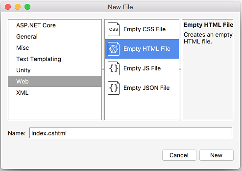

[!INCLUDE[adding-view](../../includes/mvc-intro/adding_view1.md)]

## Add a view 

* Right click on the *Views* folder, and then **Add > New Folder** and name the folder *HelloWorld*.
* Right click on the *Views/HelloWorld* folder, and then **Add > New File**.
* In the **New File** dialog:

  * Select **Web** in the left pane.
  * Select **Empty HTML file** in the center pane.
  * Type *Index.cshtml* in the **Name** box.
  * Select **New**.

[!INCLUDE[adding-view22](../../includes/mvc-intro/adding_view2.md)]

>[!div class="step-by-step"]
[Previous](adding-controller.md)
[Next](adding-model.md)