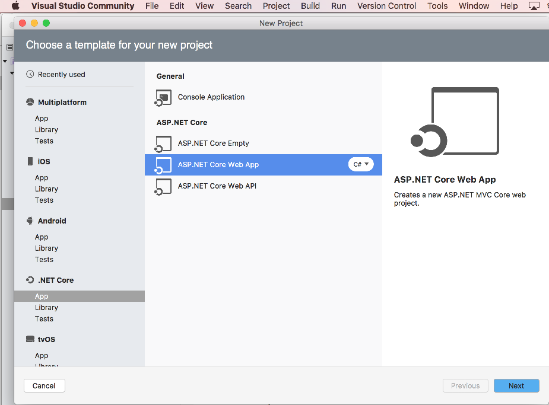
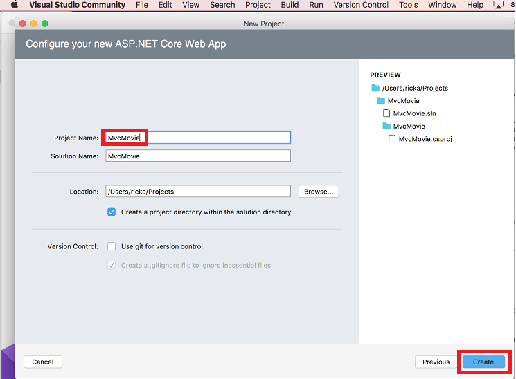
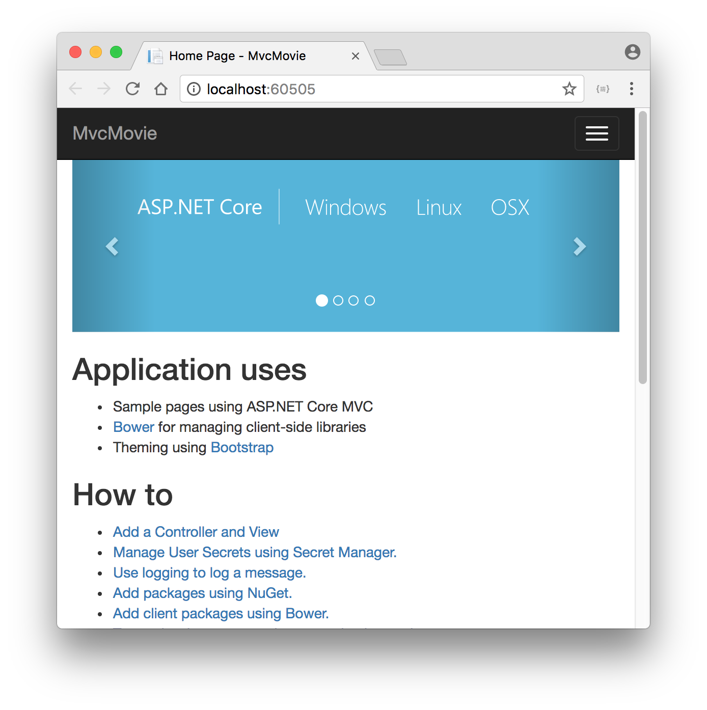

# Get started with ASP.NET Core MVC and Visual Studio for Mac

By [Rick Anderson](https://twitter.com/RickAndMSFT)

This tutorial teaches you the basics of building an ASP.NET Core MVC web app using [Visual Studio for Mac](https://www.visualstudio.com/vs/visual-studio-mac/). 

[!INCLUDE [consider RP](../../includes/razor.md)]

There are 3 versions of this tutorial:

* macOS: [Build an ASP.NET Core MVC app with Visual Studio for Mac](xref:tutorials/first-mvc-app-mac/start-mvc)
* Windows: [Build an ASP.NET Core MVC app with Visual Studio](xref:tutorials/first-mvc-app/start-mvc)
* Linux, macOS, and Windows: [Build an ASP.NET Core MVC app with Visual Studio Code](xref:tutorials/first-mvc-app-xplat/start-mvc)

## Prerequisites

[!INCLUDE ]

## Create a web app

From Visual Studio, select **File > New Solution**.

Select **.NET Core App >  ASP.NET Core > Web App > Next**.

Name the project **MvcMovie**, and then select **Create**.

### Launch the app

In Visual Studio, select **Run > Start Without Debugging** to launch the app. Visual Studio starts [Kestrel](xref:fundamentals/servers/index#kestrel), launches a browser, and navigates to `http://localhost:port`, where *port* is a randomly chosen port number.

* The address bar shows `localhost:port#` and not something like `example.com`. That's because `localhost` is the standard hostname for your local computer. When Visual Studio creates a web project, a random port is used for the web server. When you run the app, you'll see a different port number.
* You can launch the app in debug or non-debug mode from the **Run** menu.

The default template gives you **Home, About** and **Contact** links. The browser image above doesn't show these links. Depending on the size of your browser, you might need to click the navigation icon to show them.

In the next part of this tutorial, you learn about MVC and start writing some code.

> [!div class="step-by-step"]
> [Next](adding-controller.md)  
