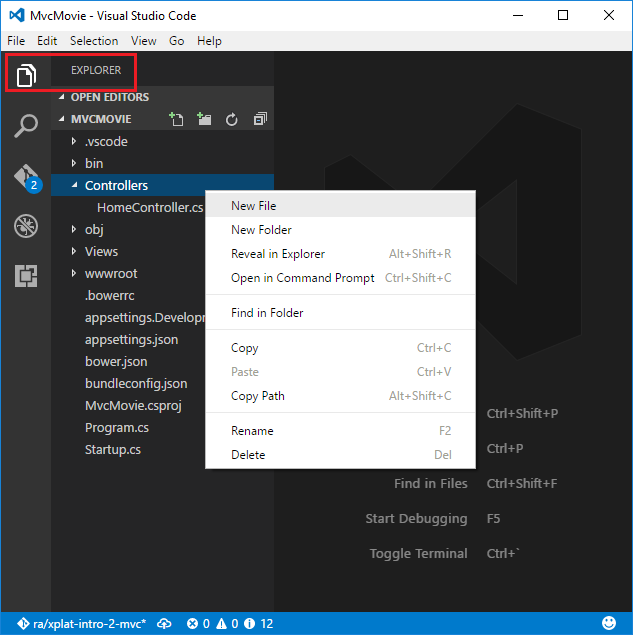

# Adding a controller to an ASP.NET Core MVC app with Visual Studio Code

By [Rick Anderson](https://twitter.com/RickAndMSFT)

[!INCLUDE[adding-controller](../../includes/mvc-intro/adding-controller1.md)]

* In **VS Code**, select the **EXPLORER** icon and then control-click (right-click) **Controllers > New File** and name the new file HelloWorldController.cs.

 

[!INCLUDE[adding-controller2](../../includes/mvc-intro/adding-controller2.md)]

>[!div class="step-by-step"]
[Previous - Add a controller](start-mvc.md)
[Next - Add a view](adding-view.md)  
