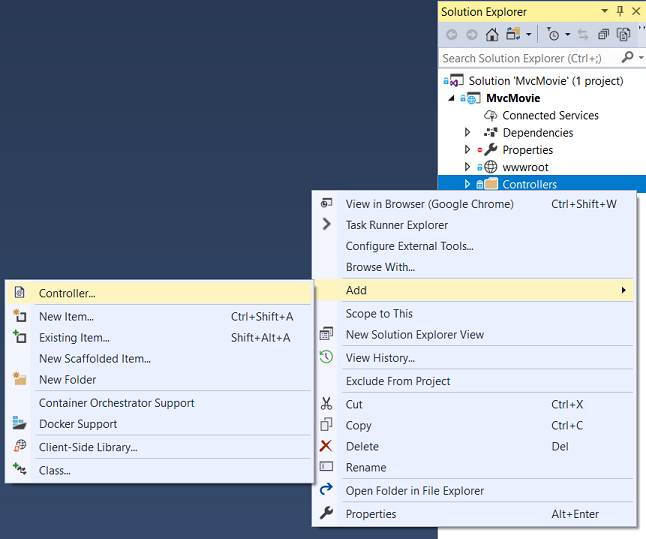
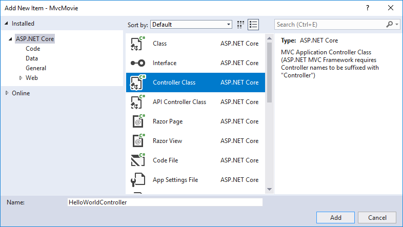

# Adding a controller to a ASP.NET Core MVC app with Visual Studio

By [Rick Anderson](https://twitter.com/RickAndMSFT)

[!INCLUDE[adding-controller1](../../includes/mvc-intro/adding-controller1.md)]

* In **Solution Explorer**, right-click **Controllers > Add > New Item**

* Select **MVC Controller Class**
* In the **Add New Item** dialog, enter **HelloWorldController**.

[!INCLUDE[adding-controller2](../../includes/mvc-intro/adding-controller2.md)]

In Visual Studio, in non-debug mode (Ctrl+F5), you don't need to build the app after changing  code. Just save the file, refresh your browser and you can see the changes.

>[!div class="step-by-step"]
[Previous](start-mvc.md)
[Next](adding-view.md)  
