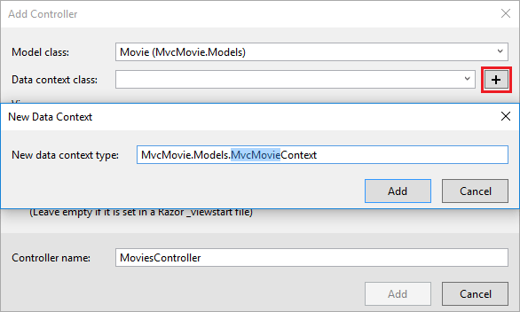
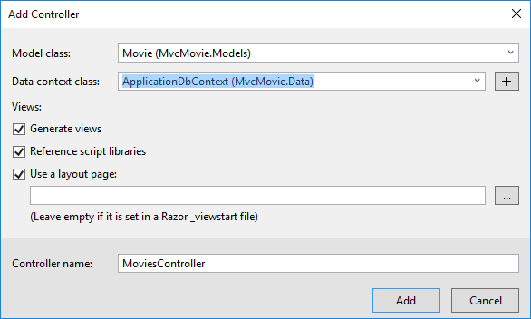

# Add a model to an ASP.NET Core MVC app

By [Rick Anderson](https://twitter.com/RickAndMSFT) and [Tom Dykstra](https://github.com/tdykstra)

In this section, you add classes for managing movies in a database. These classes will be the "**M**odel" part of the **M**VC app.

You use these classes with [Entity Framework Core](/ef/core) (EF Core) to work with a database. EF Core is an object-relational mapping (ORM) framework that simplifies the data access code that you have to write.

The model classes you create are known as POCO classes (from **P**lain **O**ld **C**LR **O**bjects) because they don't have any dependency on EF Core. They just define the properties of the data that will be stored in the database.

In this tutorial, you write the model classes first, and EF Core creates the database.

::: moniker range=">= aspnetcore-3.0"

## Add a data model class

# [Visual Studio](#tab/visual-studio)

Right-click the *Models* folder > **Add** > **Class**. Name the file *Movie.cs*.

# [Visual Studio Code](#tab/visual-studio-code)

Add a file named *Movie.cs* to the *Models* folder.

# [Visual Studio for Mac](#tab/visual-studio-mac)

Right-click the *Models* folder > **Add** > **New Class** > **Empty Class**. Name the file *Movie.cs*.

---

Update the *Movie.cs* file with the following code:

[!code-csharp[](~/tutorials/first-mvc-app/start-mvc/sample/MvcMovie3/Models/Movie.cs)]

The `Movie` class contains an `Id` field, which is required by the database for the primary key.

The <xref:System.ComponentModel.DataAnnotations.DataType> attribute on `ReleaseDate` specifies the type of the data (`Date`). With this attribute:

* The user is not required to enter time information in the date field.
* Only the date is displayed, not time information.

[DataAnnotations](/dotnet/api/system.componentmodel.dataannotations) are covered in a later tutorial.

## Add NuGet packages

# [Visual Studio](#tab/visual-studio)

From the **Tools** menu, select **NuGet Package Manager** > **Package Manager Console** (PMC).


In the PMC, run the following command:

```powershell
Install-Package Microsoft.EntityFrameworkCore.SqlServer
```

The preceding command adds the EF Core SQL Server provider. The provider package installs the EF Core package as a dependency. Additional packages are installed automatically in the scaffolding step later in the tutorial.

# [Visual Studio Code](#tab/visual-studio-code)

[!INCLUDE[](~/includes/add-EF-NuGet-SQLite-CLI.md)]

# [Visual Studio for Mac](#tab/visual-studio-mac)

From the **Project** menu, select **Manage NuGet Packages**.

In the **Search** field in the upper right, enter `Microsoft.EntityFrameworkCore.SQLite` and press the **Return** key to search. Select the matching NuGet package and press the **Add Package** button.


The **Select Projects** dialog will be displayed, with the `MvcMovie` project selected. Press the **Ok** button.

A **License Acceptance** dialog will be displayed. Review the licenses as desired, then click the **Accept** button.

Repeat the above steps to install the following NuGet packages:

* `Microsoft.VisualStudio.Web.CodeGeneration.Design`
* `Microsoft.EntityFrameworkCore.SqlServer`
* `Microsoft.EntityFrameworkCore.Design`

---

<a name="dc"></a>

## Create a database context class

A database context class is needed to coordinate EF Core functionality (Create, Read, Update, Delete) for the `Movie` model. The database context is derived from [Microsoft.EntityFrameworkCore.DbContext](/dotnet/api/microsoft.entityframeworkcore.dbcontext) and specifies the entities to include in the data model.

Create a *Data* folder.

Add a *Data/MvcMovieContext.cs* file with the following code: 

[!code-csharp[](~/tutorials/first-mvc-app/start-mvc/sample/MvcMovie3/zDocOnly/MvcMovieContext.cs?name=snippet)]

The preceding code creates a [DbSet\<Movie>](/dotnet/api/microsoft.entityframeworkcore.dbset-1) property for the entity set. In Entity Framework terminology, an entity set typically corresponds to a database table. An entity corresponds to a row in the table.

<a name="reg"></a>

## Register the database context

ASP.NET Core is built with [dependency injection (DI)](xref:fundamentals/dependency-injection). Services (such as the EF Core DB context) must be registered with DI during application startup. Components that require these services (such as Razor Pages) are provided these services via constructor parameters. The constructor code that gets a DB context instance is shown later in the tutorial. In this section, you register the database context with the DI container.

Add the following `using` statements at the top of *Startup.cs*:

```csharp
using MvcMovie.Data;
using Microsoft.EntityFrameworkCore;
```

Add the following highlighted code in `Startup.ConfigureServices`:

# [Visual Studio](#tab/visual-studio)

[!code-csharp[](~/tutorials/first-mvc-app/start-mvc/sample/MvcMovie3/Startup.cs?name=snippet_ConfigureServices&highlight=6-7)]

# [Visual Studio Code / Visual Studio for Mac](#tab/visual-studio-code+visual-studio-mac)

[!code-csharp[](~/tutorials/first-mvc-app/start-mvc/sample/MvcMovie3/Startup.cs?name=snippet_UseSqlite&highlight=6-7)]

---

The name of the connection string is passed in to the context by calling a method on a [DbContextOptions](/dotnet/api/microsoft.entityframeworkcore.dbcontextoptions) object. For local development, the [ASP.NET Core configuration system](xref:fundamentals/configuration/index) reads the connection string from the *appsettings.json* file.

<a name="cs"></a>

## Add a database connection string

Add a connection string to the *appsettings.json* file:

# [Visual Studio](#tab/visual-studio)

[!code-json[](~/tutorials/first-mvc-app/start-mvc/sample/MvcMovie3/appsettings.json?highlight=10-12)]

# [Visual Studio Code / Visual Studio for Mac](#tab/visual-studio-code+visual-studio-mac)

[!code-json[](~/tutorials/first-mvc-app/start-mvc/sample/MvcMovie3/appsettings_SQLite.json?highlight=10-12)]

---

Build the project as a check for compiler errors.

## Scaffold movie pages

Use the scaffolding tool to produce Create, Read, Update, and Delete (CRUD) pages for the movie model.

# [Visual Studio](#tab/visual-studio)

In **Solution Explorer**, right-click the *Controllers* folder **> Add > New Scaffolded Item**.


In the **Add Scaffold** dialog, select **MVC Controller with views, using Entity Framework > Add**.


Complete the **Add Controller** dialog:

* **Model class:** *Movie (MvcMovie.Models)*
* **Data context class:** *MvcMovieContext (MvcMovie.Data)*


* **Views:** Keep the default of each option checked
* **Controller name:** Keep the default *MoviesController*
* Select **Add**

Visual Studio creates:

* A movies controller (*Controllers/MoviesController.cs*)
* Razor view files for Create, Delete, Details, Edit, and Index pages (*Views/Movies/\*.cshtml*)

The automatic creation of these files is known as *scaffolding*.

### [Visual Studio Code](#tab/visual-studio-code) 

* Open a command window in the project directory (The directory that contains the *Program.cs*, *Startup.cs*, and *.csproj* files).

* On Linux, export the scaffold tool path:

  ```console
  export PATH=$HOME/.dotnet/tools:$PATH
  ```

* Run the following command:

  ```dotnetcli
  dotnet aspnet-codegenerator controller -name MoviesController -m Movie -dc MvcMovieContext --relativeFolderPath Controllers --useDefaultLayout --referenceScriptLibraries
  ```

  [!INCLUDE [explains scaffold generated params](~/includes/mvc-intro/model4.md)]

### [Visual Studio for Mac](#tab/visual-studio-mac)

* Open a command window in the project directory (The directory that contains the *Program.cs*, *Startup.cs*, and *.csproj* files).

* Run the following command:

  ```dotnetcli
  dotnet aspnet-codegenerator controller -name MoviesController -m Movie -dc MvcMovieContext --relativeFolderPath Controllers --useDefaultLayout --referenceScriptLibraries
  ```

  [!INCLUDE [explains scaffold generated params](~/includes/mvc-intro/model4.md)]

---

<!-- End of tabs                  -->

You can't use the scaffolded pages yet because the database doesn't exist. If you run the app and click on the **Movie App** link, you get a *Cannot open database* or *no such table: Movie* error message.

<a name="migration"></a>

## Initial migration

Use the EF Core [Migrations](xref:data/ef-mvc/migrations) feature to create the database. Migrations is a set of tools that let you create and update a database to match your data model.

# [Visual Studio](#tab/visual-studio)

From the **Tools** menu, select **NuGet Package Manager** > **Package Manager Console** (PMC).

In the PMC, enter the following commands:

```powershell
Add-Migration InitialCreate
Update-Database
```

* `Add-Migration InitialCreate`: Generates a *Migrations/{timestamp}_InitialCreate.cs* migration file. The `InitialCreate` argument is the migration name. Any name can be used, but by convention, a name is selected that describes the migration. Because this is the first migration, the generated class contains code to create the database schema. The database schema is based on the model specified in the `MvcMovieContext` class.

* `Update-Database`: Updates the database to the latest migration, which the previous command created. This command runs the `Up` method in the *Migrations/{time-stamp}_InitialCreate.cs* file, which creates the database.

  The database update command generates the following warning: 

  > No type was specified for the decimal column 'Price' on entity type 'Movie'. This will cause values to be silently truncated if they do not fit in the default precision and scale. Explicitly specify the SQL server column type that can accommodate all the values using 'HasColumnType()'.

  You can ignore that warning, it will be fixed in a later tutorial.

[!INCLUDE [more information on the PMC tools for EF Core](~/includes/ef-pmc.md)]

# [Visual Studio Code / Visual Studio for Mac](#tab/visual-studio-code+visual-studio-mac)

Run the following .NET Core CLI commands:

```dotnetcli
dotnet ef migrations add InitialCreate
dotnet ef database update
```

* `ef migrations add InitialCreate`: Generates an *Migrations/{timestamp}_InitialCreate.cs* migration file. The `InitialCreate` argument is the migration name. Any name can be used, but by convention, a name is selected that describes the migration. Because this is the first migration, the generated class contains code to create the database schema. The database schema is based on the model specified in the `MvcMovieContext` class (in the *Data/MvcMovieContext.cs* file).

* `ef database update`: Updates the database to the latest migration, which the previous command created. This command runs the `Up` method in the *Migrations/{time-stamp}_InitialCreate.cs* file, which creates the database.

[!INCLUDE [more information on the CLI for EF Core](~/includes/ef-cli.md)]

---

### The InitialCreate class

Examine the *Migrations/{timestamp}_InitialCreate.cs* migration file:

[!code-csharp[](~/tutorials/first-mvc-app/start-mvc/sample/MvcMovie3/Migrations/20190805165915_InitialCreate.cs?name=snippet)]

The `Up` method creates the Movie table and configures `Id` as the primary key. The `Down` method reverts the schema changes made by the `Up` migration.

<a name="test"></a>

## Test the app

* Run the app and click the **Movie App** link.

  If you get an exception similar to one of the following:

# [Visual Studio](#tab/visual-studio)

  ```console
  SqlException: Cannot open database "MvcMovieContext-1" requested by the login. The login failed.
  ```

# [Visual Studio Code / Visual Studio for Mac](#tab/visual-studio-code+visual-studio-mac)

  ```console
  SqliteException: SQLite Error 1: 'no such table: Movie'.
  ```

---
  You probably missed the [migrations step](#migration).

* Test the **Create** page. Enter and submit data.

  > [!NOTE]
  > You may not be able to enter decimal commas in the `Price` field. To support [jQuery validation](https://jqueryvalidation.org/) for non-English locales that use a comma (",") for a decimal point and for non US-English date formats, the app must be globalized. For globalization instructions, see [this GitHub issue](https://github.com/dotnet/AspNetCore.Docs/issues/4076#issuecomment-326590420).

* Test the **Edit**, **Details**, and **Delete** pages.

## Dependency injection in the controller

# [Visual Studio](#tab/visual-studio)

Open the *Controllers/MoviesController.cs* file and examine the constructor:

<!-- l.. Make copy of Movies controller (or use the old one as I did in the 3.0 upgrade) because we comment out the initial index method and update it later  -->

[!code-csharp[](~/tutorials/first-mvc-app/start-mvc/sample/MvcMovie22/Controllers/MC1.cs?name=snippet_1)]

The constructor uses [Dependency Injection](xref:fundamentals/dependency-injection) to inject the database context (`MvcMovieContext`) into the controller. The database context is used in each of the [CRUD](https://wikipedia.org/wiki/Create,_read,_update_and_delete) methods in the controller.

# [Visual Studio Code / Visual Studio for Mac](#tab/visual-studio-code+visual-studio-mac)

[!code-csharp[](~/tutorials/first-mvc-app/start-mvc/sample/MvcMovie22/Controllers/MC1.cs?name=snippet_1)]

The constructor uses [Dependency Injection](xref:fundamentals/dependency-injection) to inject the database context (`MvcMovieContext`) into the controller. The database context is used in each of the [CRUD](https://wikipedia.org/wiki/Create,_read,_update_and_delete) methods in the controller.

### Use SQLite for development, SQL Server for production

When SQLite is selected, the template generated code is ready for development. The following code shows how to inject <xref:Microsoft.AspNetCore.Hosting.IWebHostEnvironment> into Startup. `IWebHostEnvironment` is injected so `ConfigureServices` can use SQLite in development and SQL Server in production.

[!code-csharp[](~/tutorials/first-mvc-app/start-mvc/sample/MvcMovie3/StartupDevProd.cs?name=snippet_StartupClass&highlight=5,10,16-28)]

---
<!-- end of tabs --->

<a name="strongly-typed-models-keyword-label"></a>
<a name="strongly-typed-models-and-the--keyword"></a>

## Strongly typed models and the @model keyword

Earlier in this tutorial, you saw how a controller can pass data or objects to a view using the `ViewData` dictionary. The `ViewData` dictionary is a dynamic object that provides a convenient late-bound way to pass information to a view.

MVC also provides the ability to pass strongly typed model objects to a view. This strongly typed approach enables compile time code checking. The scaffolding mechanism used this approach (that is, passing a strongly typed model) with the `MoviesController` class and views.

Examine the generated `Details` method in the *Controllers/MoviesController.cs* file:

[!code-csharp[](~/tutorials/first-mvc-app/start-mvc/sample/MvcMovie22/Controllers/MC1.cs?name=snippet_details)]

The `id` parameter is generally passed as route data. For example `https://localhost:5001/movies/details/1` sets:

* The controller to the `movies` controller (the first URL segment).
* The action to `details` (the second URL segment).
* The id to 1 (the last URL segment).

You can also pass in the `id` with a query string as follows:

`https://localhost:5001/movies/details?id=1`

The `id` parameter is defined as a [nullable type](/dotnet/csharp/programming-guide/nullable-types/index) (`int?`) in case an ID value isn't provided.

A [lambda expression](/dotnet/articles/csharp/programming-guide/statements-expressions-operators/lambda-expressions) is passed in to `FirstOrDefaultAsync` to select movie entities that match the route data or query string value.

```csharp
var movie = await _context.Movie
    .FirstOrDefaultAsync(m => m.Id == id);
```

If a movie is found, an instance of the `Movie` model is passed to the `Details` view:

```csharp
return View(movie);
```

Examine the contents of the *Views/Movies/Details.cshtml* file:

[!code-cshtml[](~/tutorials/first-mvc-app/start-mvc/sample/MvcMovie22/Views/Movies/DetailsOriginal.cshtml)]

The `@model` statement at the top of the view file specifies the type of object that the view expects. When the movie controller was created, the following `@model` statement was included:

```cshtml
@model MvcMovie.Models.Movie
```

This `@model` directive allows access to the movie that the controller passed to the view. The `Model` object is strongly typed. For example, in the *Details.cshtml* view, the code passes each movie field to the `DisplayNameFor` and `DisplayFor` HTML Helpers with the strongly typed `Model` object. The `Create` and `Edit` methods and views also pass a `Movie` model object.

Examine the *Index.cshtml* view and the `Index` method in the Movies controller. Notice how the code creates a `List` object when it calls the `View` method. The code passes this `Movies` list from the `Index` action method to the view:

[!code-csharp[](~/tutorials/first-mvc-app/start-mvc/sample/MvcMovie22/Controllers/MC1.cs?name=snippet_index)]

When the movies controller was created, scaffolding included the following `@model` statement at the top of the *Index.cshtml* file:

<!-- Copy Index.cshtml to IndexOriginal.cshtml -->

[!code-cshtml[](~/tutorials/first-mvc-app/start-mvc/sample/MvcMovie22/Views/Movies/IndexOriginal.cshtml?range=1)]

The `@model` directive allows you to access the list of movies that the controller passed to the view by using a `Model` object that's strongly typed. For example, in the *Index.cshtml* view, the code loops through the movies with a `foreach` statement over the strongly typed `Model` object:

[!code-cshtml[](~/tutorials/first-mvc-app/start-mvc/sample/MvcMovie22/Views/Movies/IndexOriginal.cshtml?highlight=1,31,34,37,40,43,46-48)]

Because the `Model` object is strongly typed (as an `IEnumerable<Movie>` object), each item in the loop is typed as `Movie`. Among other benefits, this means that you get compile time checking of the code.

## Additional resources

* [Tag Helpers](xref:mvc/views/tag-helpers/intro)
* [Globalization and localization](xref:fundamentals/localization)

> [!div class="step-by-step"]
> [Previous Adding a View](adding-view.md)
> [Next Working with SQL](working-with-sql.md)

::: moniker-end

::: moniker range="< aspnetcore-3.0"

## Add a data model class

# [Visual Studio](#tab/visual-studio)

Right-click the *Models* folder > **Add** > **Class**. Name the class **Movie**.

[!INCLUDE [model 1b](~/includes/mvc-intro/model1b.md)]

# [Visual Studio Code / Visual Studio for Mac](#tab/visual-studio-code+visual-studio-mac)

* Add a class to the *Models* folder named *Movie.cs*.

[!INCLUDE [model 1b](~/includes/mvc-intro/model1b.md)]
[!INCLUDE [model 2](~/includes/mvc-intro/model2.md)]

---

## Scaffold the movie model

In this section, the movie model is scaffolded. That is, the scaffolding tool produces pages for Create, Read, Update, and Delete (CRUD) operations for the movie model.

# [Visual Studio](#tab/visual-studio)

In **Solution Explorer**, right-click the *Controllers* folder **> Add > New Scaffolded Item**.


In the **Add Scaffold** dialog, select **MVC Controller with views, using Entity Framework > Add**.


Complete the **Add Controller** dialog:

* **Model class:** *Movie (MvcMovie.Models)*
* **Data context class:** Select the **+** icon and add the default **MvcMovie.Models.MvcMovieContext**



* **Views:** Keep the default of each option checked
* **Controller name:** Keep the default *MoviesController*
* Select **Add**



Visual Studio creates:

* An Entity Framework Core [database context class](xref:data/ef-mvc/intro#create-the-database-context) (*Data/MvcMovieContext.cs*)
* A movies controller (*Controllers/MoviesController.cs*)
* Razor view files for Create, Delete, Details, Edit, and Index pages (*Views/Movies/\*.cshtml*)

The automatic creation of the database context and [CRUD](https://wikipedia.org/wiki/Create,_read,_update_and_delete) (create, read, update, and delete) action methods and views is known as *scaffolding*.

# [Visual Studio Code](#tab/visual-studio-code)

<!--  Until https://github.com/aspnet/Scaffolding/issues/582 is fixed windows needs backslash or the namespace is namespace RazorPagesMovie.Pages_Movies rather than namespace RazorPagesMovie.Pages.Movies
-->

* Open a command window in the project directory (The directory that contains the *Program.cs*, *Startup.cs*, and *.csproj* files).
* Install the scaffolding tool:

  ```dotnetcli
   dotnet tool install --global dotnet-aspnet-codegenerator
   ```

* On Linux, export the scaffold tool path:

  ```console
    export PATH=$HOME/.dotnet/tools:$PATH
  ```

* Run the following command:

  ```dotnetcli
   dotnet aspnet-codegenerator controller -name MoviesController -m Movie -dc MvcMovieContext --relativeFolderPath Controllers --useDefaultLayout --referenceScriptLibraries
  ```

[!INCLUDE [explains scaffold generated params](~/includes/mvc-intro/model4.md)]

<!-- Mac -------------------------->

# [Visual Studio for Mac](#tab/visual-studio-mac)

* Open a command window in the project directory (The directory that contains the *Program.cs*, *Startup.cs*, and *.csproj* files).
* Install the scaffolding tool:

  ```dotnetcli
   dotnet tool install --global dotnet-aspnet-codegenerator
   ```

* Run the following command:

  ```dotnetcli
   dotnet aspnet-codegenerator controller -name MoviesController -m Movie -dc MvcMovieContext --relativeFolderPath Controllers --useDefaultLayout --referenceScriptLibraries
  ```

[!INCLUDE [explains scaffold generated params](~/includes/mvc-intro/model4.md)]

---

<!-- End of VS tabs                  -->

If you run the app and click on the **Mvc Movie** link, you get an error similar to the following:

# [Visual Studio](#tab/visual-studio)

```
An unhandled exception occurred while processing the request.

SqlException: Cannot open database "MvcMovieContext-<GUID removed>" requested by the login. The login failed.
Login failed for user 'Rick'.

System.Data.SqlClient.SqlInternalConnectionTds..ctor(DbConnectionPoolIdentity identity, SqlConnectionString
```

# [Visual Studio Code / Visual Studio for Mac](#tab/visual-studio-code+visual-studio-mac)

```
An unhandled exception occurred while processing the request.
SqliteException: SQLite Error 1: 'no such table: Movie'.
Microsoft.Data.Sqlite.SqliteException.ThrowExceptionForRC(int rc, sqlite3 db)

```

---

You need to create the database, and you use the EF Core [Migrations](xref:data/ef-mvc/migrations) feature to do that. Migrations lets you create a database that matches your data model and update the database schema when your data model changes.

<a name="pmc"></a>

## Initial migration

In this section, the following tasks are completed:

* Add an initial migration.
* Update the database with the initial migration.

# [Visual Studio](#tab/visual-studio)

1. From the **Tools** menu, select **NuGet Package Manager** > **Package Manager Console** (PMC).

   

1. In the PMC, enter the following commands:

   ```powershell
   Add-Migration Initial
   Update-Database
   ```

   The `Add-Migration` command generates code to create the initial database schema.

   The database schema is based on the model specified in the `MvcMovieContext` class. The `Initial` argument is the migration name. Any name can be used, but by convention, a name that describes the migration is used. For more information, see <xref:data/ef-mvc/migrations>.

   The `Update-Database` command runs the `Up` method in the *Migrations/{time-stamp}_InitialCreate.cs* file, which creates the database.

# [Visual Studio Code / Visual Studio for Mac](#tab/visual-studio-code+visual-studio-mac)

[!INCLUDE [initial migration](~/includes/RP/model3.md)]

The `ef migrations add InitialCreate` command generates code to create the initial database schema.

The database schema is based on the model specified in the `MvcMovieContext` class (in the *Data/MvcMovieContext.cs* file). The `InitialCreate` argument is the migration name. Any name can be used, but by convention, a name is selected that describes the migration.

---

## Examine the context registered with dependency injection

ASP.NET Core is built with [dependency injection (DI)](xref:fundamentals/dependency-injection). Services (such as the EF Core DB context) are registered with DI during application startup. Components that require these services (such as Razor Pages) are provided these services via constructor parameters. The constructor code that gets a DB context instance is shown later in the tutorial.

# [Visual Studio](#tab/visual-studio)

The scaffolding tool automatically created a DB context and registered it with the DI container.

Examine the following `Startup.ConfigureServices` method. The highlighted line was added by the scaffolder:

[!code-csharp[](~/tutorials/first-mvc-app/start-mvc/sample/MvcMovie22/Startup.cs?name=snippet_ConfigureServices&highlight=14-15)]

The `MvcMovieContext` coordinates EF Core functionality (Create, Read, Update, Delete, etc.) for the `Movie` model. The data context (`MvcMovieContext`) is derived from [Microsoft.EntityFrameworkCore.DbContext](/dotnet/api/microsoft.entityframeworkcore.dbcontext). The data context specifies which entities are included in the data model:

[!code-csharp[](~/tutorials/first-mvc-app/start-mvc/sample/MvcMovie3/Data/MvcMovieContext.cs)]

The preceding code creates a [DbSet\<Movie>](/dotnet/api/microsoft.entityframeworkcore.dbset-1) property for the entity set. In Entity Framework terminology, an entity set typically corresponds to a database table. An entity corresponds to a row in the table.

The name of the connection string is passed in to the context by calling a method on a [DbContextOptions](/dotnet/api/microsoft.entityframeworkcore.dbcontextoptions) object. For local development, the [ASP.NET Core configuration system](xref:fundamentals/configuration/index) reads the connection string from the *appsettings.json* file.

# [Visual Studio Code / Visual Studio for Mac](#tab/visual-studio-code+visual-studio-mac)

You created a DB context and registered it with the DI container.

---

<a name="test"></a>

### Test the app

* Run the app and append `/Movies` to the URL in the browser (`http://localhost:port/movies`).

If you get a database exception similar to the following:

```console
SqlException: Cannot open database "MvcMovieContext-GUID" requested by the login. The login failed.
Login failed for user 'User-name'.
```

You missed the [migrations step](#pmc).

* Test the **Create** link. Enter and submit data.

  > [!NOTE]
  > You may not be able to enter decimal commas in the `Price` field. To support [jQuery validation](https://jqueryvalidation.org/) for non-English locales that use a comma (",") for a decimal point and for non US-English date formats, the app must be globalized. For globalization instructions, see [this GitHub issue](https://github.com/dotnet/AspNetCore.Docs/issues/4076#issuecomment-326590420).

* Test the **Edit**, **Details**, and **Delete** links.

Examine the `Startup` class:

[!code-csharp[](~/tutorials/first-mvc-app/start-mvc/sample/MvcMovie22/Startup.cs?name=snippet_ConfigureServices&highlight=13-99)]

The preceding highlighted code shows the movie database context being added to the [Dependency Injection](xref:fundamentals/dependency-injection) container:

* `services.AddDbContext<MvcMovieContext>(options =>` specifies the database to use and the connection string.
* `=>` is a [lambda operator](/dotnet/articles/csharp/language-reference/operators/lambda-operator)

Open the *Controllers/MoviesController.cs* file and examine the constructor:

<!-- l.. Make copy of Movies controller because we comment out the initial index method and update it later  -->

[!code-csharp[](~/tutorials/first-mvc-app/start-mvc/sample/MvcMovie22/Controllers/MC1.cs?name=snippet_1)]

The constructor uses [Dependency Injection](xref:fundamentals/dependency-injection) to inject the database context (`MvcMovieContext`) into the controller. The database context is used in each of the [CRUD](https://wikipedia.org/wiki/Create,_read,_update_and_delete) methods in the controller.

<a name="strongly-typed-models-keyword-label"></a>
<a name="strongly-typed-models-and-the--keyword"></a>

## Strongly typed models and the @model keyword

Earlier in this tutorial, you saw how a controller can pass data or objects to a view using the `ViewData` dictionary. The `ViewData` dictionary is a dynamic object that provides a convenient late-bound way to pass information to a view.

MVC also provides the ability to pass strongly typed model objects to a view. This strongly typed approach enables better compile time checking of your code. The scaffolding mechanism used this approach (that is, passing a strongly typed model) with the `MoviesController` class and views when it created the methods and views.

Examine the generated `Details` method in the *Controllers/MoviesController.cs* file:

[!code-csharp[](~/tutorials/first-mvc-app/start-mvc/sample/MvcMovie22/Controllers/MC1.cs?name=snippet_details)]

The `id` parameter is generally passed as route data. For example `https://localhost:5001/movies/details/1` sets:

* The controller to the `movies` controller (the first URL segment).
* The action to `details` (the second URL segment).
* The id to 1 (the last URL segment).

You can also pass in the `id` with a query string as follows:

`https://localhost:5001/movies/details?id=1`

The `id` parameter is defined as a [nullable type](/dotnet/csharp/programming-guide/nullable-types/index) (`int?`) in case an ID value isn't provided.

A [lambda expression](/dotnet/articles/csharp/programming-guide/statements-expressions-operators/lambda-expressions) is passed in to `FirstOrDefaultAsync` to select movie entities that match the route data or query string value.

```csharp
var movie = await _context.Movie
    .FirstOrDefaultAsync(m => m.Id == id);
```

If a movie is found, an instance of the `Movie` model is passed to the `Details` view:

```csharp
return View(movie);
   ```

Examine the contents of the *Views/Movies/Details.cshtml* file:

[!code-html[](~/tutorials/first-mvc-app/start-mvc/sample/MvcMovie22/Views/Movies/DetailsOriginal.cshtml)]

By including a `@model` statement at the top of the view file, you can specify the type of object that the view expects. When you created the movie controller, the following `@model` statement was automatically included at the top of the *Details.cshtml* file:

```cshtml
@model MvcMovie.Models.Movie
```

This `@model` directive allows you to access the movie that the controller passed to the view by using a `Model` object that's strongly typed. For example, in the *Details.cshtml* view, the code passes each movie field to the `DisplayNameFor` and `DisplayFor` HTML Helpers with the strongly typed `Model` object. The `Create` and `Edit` methods and views also pass a `Movie` model object.

Examine the *Index.cshtml* view and the `Index` method in the Movies controller. Notice how the code creates a `List` object when it calls the `View` method. The code passes this `Movies` list from the `Index` action method to the view:

[!code-csharp[](~/tutorials/first-mvc-app/start-mvc/sample/MvcMovie22/Controllers/MC1.cs?name=snippet_index)]

When you created the movies controller, scaffolding automatically included the following `@model` statement at the top of the *Index.cshtml* file:

<!-- Copy Index.cshtml to IndexOriginal.cshtml -->

[!code-html[](~/tutorials/first-mvc-app/start-mvc/sample/MvcMovie22/Views/Movies/IndexOriginal.cshtml?range=1)]

The `@model` directive allows you to access the list of movies that the controller passed to the view by using a `Model` object that's strongly typed. For example, in the *Index.cshtml* view, the code loops through the movies with a `foreach` statement over the strongly typed `Model` object:

[!code-html[](~/tutorials/first-mvc-app/start-mvc/sample/MvcMovie22/Views/Movies/IndexOriginal.cshtml?highlight=1,31,34,37,40,43,46-48)]

Because the `Model` object is strongly typed (as an `IEnumerable<Movie>` object), each item in the loop is typed as `Movie`. Among other benefits, this means that you get compile time checking of the code:

## Additional resources

* [Tag Helpers](xref:mvc/views/tag-helpers/intro)
* [Globalization and localization](xref:fundamentals/localization)

> [!div class="step-by-step"]
> [Previous Adding a View](adding-view.md)
> [Next Working with a database](working-with-sql.md)

::: moniker-end
