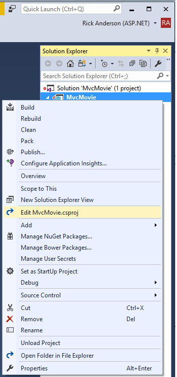

[!INCLUDE[adding-model](../../includes/mvc-intro/adding-model1.md)]

In Solution Explorer, right click the **MvcMovie** project > **Add** > **New Folder**. Name the folder *Models*.

In Solution Explorer, right click the *Models* folder > **Add** > **Class**. Name the class **Movie** and add the following properties:

[!code-csharp[Main](../../tutorials/first-mvc-app/start-mvc/sample/MvcMovie/Models/MovieNoEF.cs?name=snippet_1&highlight=7)]

In addition to the properties you'd expect to model a movie, the `ID` field is required by the database for the primary key. Build the project. Build the app to verify you don't have any errors.

We've finally added a **M**odel to our **M**VC app.

## Scaffolding a controller

In **Solution Explorer**, right-click the *Controllers* folder **> Add > Controller**.


In the **Add MVC Dependencies** dialog, select **Minimal Dependencies**, and select **Add**.


Visual Studio adds the dependencies needed to scaffold a controller. A *ScaffoldingReadMe.txt* file is created which you can delete.  

In **Solution Explorer**, right-click the *Controllers* folder **> Add > Controller**.


In the **Add Scaffold** dialog, tap **MVC Controller with views, using Entity Framework > Add**.


Complete the **Add Controller** dialog:

* **Model class:** *Movie (MvcMovie.Models)*
* **Data context class:** Select the **+** icon and add the default **MvcMovie.Models.MvcMovieContext**


* **Views:** Keep the default of each option checked
* **Controller name:** Keep the default *MoviesController*
* Tap **Add**


The scaffolding engine creates the following:

* A movies controller (*Controllers/MoviesController.cs*)
* Create, Delete, Details, Edit and Index Razor view files (*Views/Movies*)

Scaffolding automatically created the [CRUD](https://en.wikipedia.org/wiki/Create,_read,_update_and_delete) (create, read, update, and delete) action methods and views for you. The automatic creation of CRUD action methods and views is known as *scaffolding*. You'll soon have a fully functional web application that lets you create, list, edit, and delete movie entries.

If you run the app and click on the **Mvc Movie** link, you'll get an error similar to the following:

```text
An unhandled exception occurred while processing the request.
SqlException: Cannot open database "MvcMovieContext-<GUID removed>" 
requested by the login. The login failed.
Login failed for user Rick
```

## Add EF tooling

- In Solution Explorer, right click the **MvcMovie** project > **Edit MvcMovie.csproj**.

   

- Add the `"Microsoft.EntityFrameworkCore.Tools.DotNet"` NuGet package:

[!code-xml[Main](start-mvc/sample/MvcMovie/MvcMovie.csproj?range=22-25&highlight=3)] 

Note: The version numbers shown above were correct at the time of writing.

[!INCLUDE[adding-model](../../includes/mvc-intro/adding-model3.md)]


You now have a database and pages to display, edit, update and delete data. In the next tutorial, we'll work with the database.

### Additional resources

* [Tag Helpers](xref:mvc/views/tag-helpers/intro)
* [Globalization and localization](xref:fundamentals/localization)

>[!div class="step-by-step"]
[Previous Adding a View](adding-view.md)
<!--
[Next Working with SQL](working-with-sql.md)  
-->
