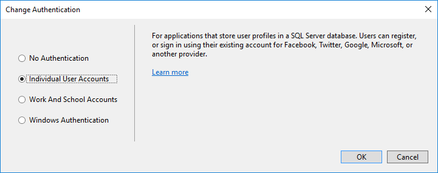
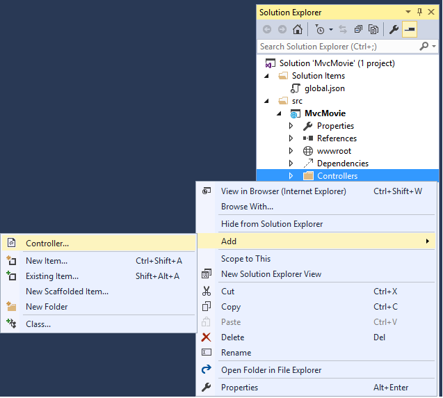
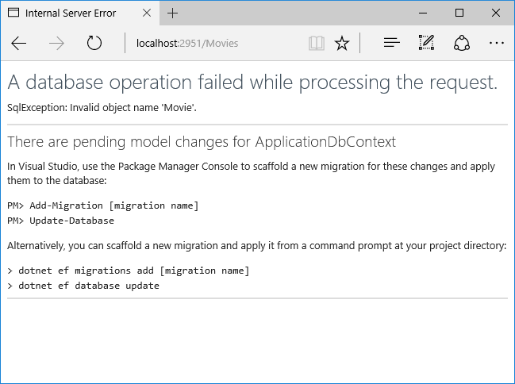
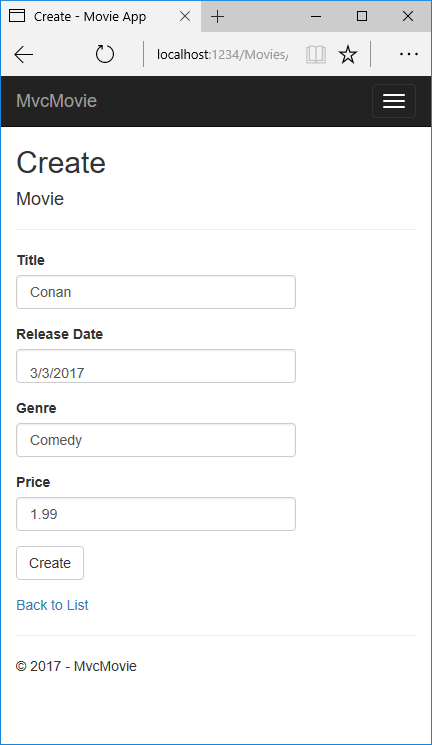
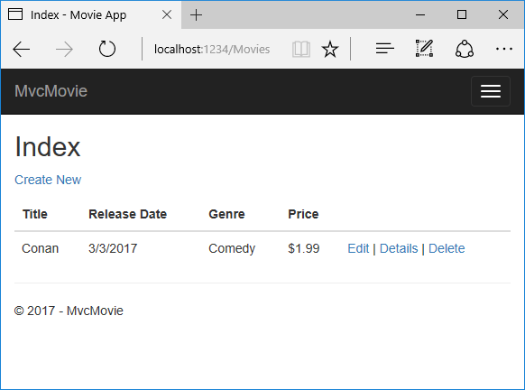

# Adding a model

By [Rick Anderson](https://twitter.com/RickAndMSFT)

In this section you'll add some classes for managing movies in a database. These classes will be the "**M**odel" part of the **M**VC app.

You’ll use a .NET Framework data-access technology known as the [Entity Framework Core](http://ef.readthedocs.org/) to define and work with these data model classes. Entity Framework Core (often referred to as **EF** Core) features a development paradigm called *Code First*. You write the code first, and the database tables are created from this code. Code First allows you to create data model objects by writing simple classes. (These are also known as POCO classes, from "plain-old CLR objects.") The database is created from your classes. If you are required to create the database first, you can still follow this tutorial to learn about MVC and EF app development.

## Create a new project with individual user accounts

In the current version of the ASP.NET Core MVC tools for Visual Studio, scaffolding a model is only supported when you create a new project with individual user accounts. We hope to have this fixed in the next tooling update. Until that's fixed, you'll need to create a new project with the same name. Because the project has the same name, you'll need to create it in another directory.

From the Visual Studio **Start** page, tap **New Project**.


Alternatively, you can use the menus to create a new project. Tap **File > New > Project**.


Complete the **New Project** dialog:

* In the left pane, tap **Web**

* In the center pane, tap **ASP.NET Core Web Application (.NET Core)**

* Change the location to a different directory from the previous project you created or you'll get an error

* Name the project "MvcMovie" (It's important to name the project "MvcMovie" so when you copy code, the namespace will match.)

* Tap **OK**


> [!WARNING]
> You must have the **Authentication** set to **Individual User Accounts** in this release for the scaffolding engine to work.

In the **New ASP.NET Core Web Application - MvcMovie** dialog:

* tap **Web Application**

* tap the **Change Authentication** button and change the authentication to **Individual User Accounts** and tap **OK**




Follow the instructions in [Change the title and menu link in the layout file](adding-view.md#change-title-link-reference-label) so you can tap the **MvcMovie** link to invoke the Movie controller. We'll scaffold the movies controller in this tutorial.

### Adding data model classes

In Solution Explorer, right click the *Models* folder > **Add** > **Class**. Name the class **Movie** and add the following properties:

[!code-csharp[Main](start-mvc/sample2/src/MvcMovie/Models/MovieNoEF.cs?name=snippet_1&highlight=7)]

In addition to the properties you'd expect to model a movie, the `ID` field is required by the DB for the primary key. Build the project. If you don't build the app, you'll get an error in the next section. We've finally added a **M**odel to our **M**VC app.

### Scaffolding a controller

In **Solution Explorer**, right-click the *Controllers* folder **> Add > Controller**.



In the **Add Scaffold** dialog, tap **MVC Controller with views, using Entity Framework > Add**.


Complete the **Add Controller** dialog:

* **Model class:** *Movie (MvcMovie.Models)*
* **Data context class:** *ApplicationDbContext (MvcMovie.Data)*
* **Views:** Keep the default of each option checked
* **Controller name:** Keep the default *MoviesController*
* Tap **Add**


The Visual Studio scaffolding engine creates the following:

* A movies controller (*Controllers/MoviesController.cs*)
* Create, Delete, Details, Edit and Index Razor view files (*Views/Movies*)

Visual Studio automatically created the [CRUD](https://en.wikipedia.org/wiki/Create,_read,_update_and_delete) (create, read, update, and delete) action methods and views for you (the automatic creation of CRUD action methods and views is known as *scaffolding*). You'll soon have a fully functional web application that lets you create, list, edit, and delete movie entries.

If you run the app and click on the **Mvc Movie** link, you'll get the following errors:




We'll follow those instructions to get the database ready for our Movie app.

### Update the database

* Open a command prompt and navigate to the project directory (*your_path*/MvcMovie/src/MvcMovie). You can find the path by selecting the `web.config` file in Solution Explorer and viewing the `Full Path` property in the Properties window.

* Run the following commands in the command prompt:

  ```console
  dotnet ef migrations add Initial
  dotnet ef database update
  ```
  
## dotnet ef commands

* `dotnet` (.NET Core) is a cross-platform implementation of .NET. You can read about it [here](http://go.microsoft.com/fwlink/?LinkID=517853)

* `dotnet ef migrations add Initial` Runs the Entity Framework .NET Core CLI migrations command and creates the initial migration. The parameter "Initial" is arbitrary, but customary for the first (*initial*) database migration. This operation creates the *Data/Migrations/<date-time>_Initial.cs* file containing the migration commands to add (or drop) the *Movie* table to the database

* `dotnet ef database update`  Updates the database with the migration we just created

### Test the app

Notes: 

* If your browser is unable to connect to the movie app you might need to wait for IIS Express to load the app. It can sometimes take up to 30 seconds to build the app and have it ready to respond to requests.

  * Run the app and tap the **Mvc Movie** link
  * Tap the **Create New** link and create a movie

  

* You may not be able to enter decimal points or commas in the `Price` field. To support [jQuery validation](http://jqueryvalidation.org/) for non-English locales that use a comma (",") for a decimal point, and non US-English date formats, you must take steps to globalize your app. See [Additional resources](#additional-resources) for more information. For now, just enter whole numbers like 10.

<a name=displayformatdatelocal></a>

* In some locales you'll need to specify the date format. See the highlighted code below.

[!code-csharp[Main](start-mvc/sample2/src/MvcMovie/Models/MovieDateFormat.cs?name=snippet_1&highlight=2,10)]

* You may wish to change the `ReleaseDate` label text from the default property name text. To accomplish this, add the highlighted code below.

[!code-csharp[Main](start-mvc/sample2/src/MvcMovie/Models/MovieDisplayName.cs?name=snippet_1&highlight=2,10)] 

Tapping **Create** causes the form to be posted to the server, where the movie information is saved in a database. You are then redirected to the */Movies* URL, where you can see the newly created movie in the listing.



Create a couple more movie entries. Try the **Edit**, **Details**, and **Delete** links, which are all functional.

### Examining the Generated Code

Open the *Controllers/MoviesController.cs* file and examine the generated `Index` method. A portion of the movie controller with the `Index` method is shown below:

<!-- l.. can't use literalinclude  because we comment out the initial index method and update it later
.. comment :: start-mvc/sample2/src/MvcMovie/Controllers/MoviesController.cs -->

```csharp
public class MoviesController : Controller
{
    private readonly ApplicationDbContext _context;

    public MoviesController(ApplicationDbContext context)
    {
        _context = context;
    }

    // GET: Movies
    public async Task<IActionResult> Index()
    {
        return View(await _context.Movie.ToListAsync());
    }
}
```

The constructor uses [Dependency Injection](../../fundamentals/dependency-injection.md) to inject the database context into the controller. The database context is used in each of the [CRUD](https://en.wikipedia.org/wiki/Create,_read,_update_and_delete) methods in the controller.

A request to the Movies controller returns all the entries in the `Movies` table and then passes the data to the `Index` view.

<a name=strongly-typed-models-keyword-label></a>

## Strongly typed models and the @model keyword

Earlier in this tutorial, you saw how a controller can pass data or objects to a view using the `ViewData` dictionary. The `ViewData` dictionary is a dynamic object that provides a convenient late-bound way to pass information to a view.

MVC also provides the ability to pass strongly typed objects to a view. This strongly typed approach enables better compile-time checking of your code and richer [IntelliSense](https://msdn.microsoft.com/en-us/library/hcw1s69b.aspx) in Visual Studio (VS). The scaffolding mechanism in VS used this approach (that is, passing a strongly typed model) with the `MoviesController` class and views when it created the methods and views.

Examine the generated `Details` method in the *Controllers/MoviesController.cs* file:

[!code-csharp[Main](start-mvc/sample2/src/MvcMovie/Controllers/MoviesController.cs?name=snippet_details)]

The `id` parameter is generally passed as route data, for example `http://localhost:1234/movies/details/1` sets:

* The controller to the `movies` controller (the first URL segment)

* The action to `details` (the second URL segment)

* The id to 1 (the last URL segment)

You could also pass in the `id` with a query string as follows:

`http://localhost:1234/movies/details?id=1`

If a Movie is found, an instance of the `Movie` model is passed to the `Details` view:

```csharp
return View(movie);
   ```

Examine the contents of the *Views/Movies/Details.cshtml* file:

[!code-html[Main](start-mvc/sample2/src/MvcMovie/Views/Movies/DetailsOriginal.cshtml)]

By including a `@model` statement at the top of the view file, you can specify the type of object that the view expects. When you created the movie controller, Visual Studio automatically included the following `@model` statement at the top of the *Details.cshtml* file:

```HTML
@model MvcMovie.Models.Movie
   ```

This `@model` directive allows you to access the movie that the controller passed to the view by using a `Model` object that's strongly typed. For example, in the *Details.cshtml* view, the code passes each movie field to the `DisplayNameFor` and `DisplayFor` HTML Helpers with the strongly typed `Model` object. The `Create` and `Edit` methods and views also pass a `Movie` model object.

Examine the *Index.cshtml* view and the `Index` method in the Movies controller. Notice how the code creates a `List` object when it calls the View method. The code passes this `Movies` list from the `Index` action method to the view:

[!code-csharp[Main](start-mvc/sample2/src/MvcMovie/Controllers/MoviesController.cs?name=snippet_index&highlight=1)]

When you created the movies controller, Visual Studio automatically included the following `@model` statement at the top of the *Index.cshtml* file:

<!-- Copy Index.cshtml to IndexOriginal.cshtml -->

[!code-html[Main](start-mvc/sample2/src/MvcMovie/Views/Movies/IndexOriginal.cshtml?range=1)]

The `@model` directive allows you to access the list of movies that the controller passed to the view by using a `Model` object that's strongly typed. For example, in the *Index.cshtml* view, the code loops through the movies with a `foreach` statement over the strongly typed `Model` object:

[!code-html[Main](start-mvc/sample2/src/MvcMovie/Views/Movies/IndexOriginal.cshtml?highlight=1,31,34,37,40,43,46-48)]

Because the `Model` object is strongly typed (as an `IEnumerable<Movie>` object), each item in the loop is typed as `Movie`. Among other benefits, this means that you get compile-time checking of the code and full [IntelliSense](https://msdn.microsoft.com/en-us/library/hcw1s69b.aspx) support in the code editor:


You now have a database and pages to display, edit, update and delete data. In the next tutorial, we'll work with the database.

### Additional resources

* [Tag Helpers](../../mvc/views/tag-helpers/index.md)

* [Globalization and localization](../../fundamentals/localization.md)

>[!div class="step-by-step"]
[Previous](adding-view.md)
[Next](working-with-sql.md)  
