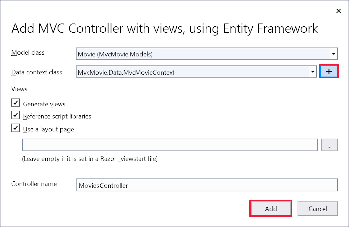

# Part 4, add a model to an ASP.NET Core MVC app

By [Rick Anderson](https://twitter.com/RickAndMSFT) and [Jon P Smith](https://twitter.com/thereformedprog).

In this tutorial, classes are added for managing movies in a database. These classes are the "**M**odel" part of the **M**VC app.

These model classes are used with [Entity Framework Core](/ef/core) (EF Core) to work with a database. EF Core is an object-relational mapping (ORM) framework that simplifies the data access code that you have to write.

The model classes created are known as ***POCO*** classes, from **P**lain **O**ld **C**LR **O**bjects. POCO classes don't have any dependency on EF Core. They only define the properties of the data to be stored in the database.

In this tutorial,  model classes are created first, and EF Core creates the database.

:::moniker range=">= aspnetcore-6.0"

## Add a data model class

# [Visual Studio](#tab/visual-studio)

Right-click the *Models* folder > **Add** > **Class**. Name the file `Movie.cs`.

# [Visual Studio Code](#tab/visual-studio-code)

Add a file named `Movie.cs` to the *Models* folder.

# [Visual Studio for Mac](#tab/visual-studio-mac)

For Visual Studio for Mac, see the .NET 5 version of this tutorial.

<!-- 
Control-click the *Models* folder > **Add** > **New Class** > **Empty Class**. Name the file `Movie.cs`.
 -->

---

Update the `Models/Movie.cs` file with the following code:

[!code-csharp[](~/tutorials/first-mvc-app/start-mvc/sample/MvcMovie60/Models/Movie.cs?name=First)]

The `Movie` class contains an `Id` field, which is required by the database for the primary key.

The <xref:System.ComponentModel.DataAnnotations.DataType> attribute on `ReleaseDate` specifies the type of the data (`Date`). With this attribute:

* The user isn't required to enter time information in the date field.
* Only the date is displayed, not time information.

[DataAnnotations](xref:System.ComponentModel.DataAnnotations) are covered in a later tutorial.

The question mark after `string` indicates that the property is nullable. For more information, see [Nullable reference types](/dotnet/csharp/nullable-references). 

## Add NuGet packages

# [Visual Studio](#tab/visual-studio)

From the **Tools** menu, select **NuGet Package Manager** > **Package Manager Console** (PMC).


<!-- When https://dev.azure.com/devdiv/DevDiv/_workitems/edit/1320544 is fixed, we can remove the following install package instruction for Microsoft.EntityFrameworkCore.Design  -->

In the PMC, run the following command:

```powershell
Install-Package Microsoft.EntityFrameworkCore.Design
Install-Package Microsoft.EntityFrameworkCore.SqlServer
```

The preceding commands add:

* The EF Core SQL Server provider. The provider package installs the EF Core package as a dependency.
* The utilities used by the packages installed automatically in the scaffolding step, later in the tutorial.

# [Visual Studio Code](#tab/visual-studio-code)

[!INCLUDE[](~/includes/add-EF-NuGet-SQLite-CLI-6.md)]

# [Visual Studio for Mac](#tab/visual-studio-mac)

For Visual Studio for Mac, see the .NET 5 version of this tutorial.

<!--
From the **Project** menu, select **Manage NuGet Packages**.

In the **Search** field in the upper right:

* Enter `Microsoft.EntityFrameworkCore.SQLite`.
* Press the <kbd>Return</kbd> key to search.
* Select the matching NuGet package and select the **Add Package** button.


The **Select Projects** dialog displays, with the `MvcMovie` project selected. Select the **Ok** button.

A **License Acceptance** dialog displays. Review the licenses, then select the **Accept** button.

Repeat the above steps to install the following NuGet packages:

* `Microsoft.VisualStudio.Web.CodeGeneration.Design`
* `Microsoft.EntityFrameworkCore.SqlServer`
* `Microsoft.EntityFrameworkCore.Design`

Run the following .NET CLI command:

```dotnetcli
dotnet tool install --global dotnet-aspnet-codegenerator
```

The preceding command adds the [aspnet-codegenerator scaffolding tool](xref:fundamentals/tools/dotnet-aspnet-codegenerator).
-->

---

Build the project as a check for compiler errors.

## Scaffold movie pages

Use the scaffolding tool to produce `Create`, `Read`, `Update`, and `Delete` (CRUD) pages for the movie model.

# [Visual Studio](#tab/visual-studio)

In **Solution Explorer**, right-click the *Controllers* folder and select **Add > New Scaffolded Item**.


In the **Add Scaffold** dialog, select **MVC Controller with views, using Entity Framework > Add**.


Complete the **Add MVC Controller with views, using Entity Framework** dialog:

* In the **Model class** drop down, select **Movie (MvcMovie.Models)**.
* In the **Data context class** row, select the **+** (plus) sign.
  * In the **Add Data Context** dialog, the class name *MvcMovie.Data.MvcMovieContext* is generated.
  * Select **Add**.
* **Views** and **Controller name**: Keep the default.
* Select **Add**.



If you get an error message, select **Add** a second time to try it again.

<a name="scaffolding-created"></a>

Scaffolding updates the following:

* Inserts required package references in the `MvcMovie.csproj` project file.
* Registers the database context in the `Program.cs` file.
* Adds a database connection string to the `appsettings.json` file.

# [Visual Studio Code](#tab/visual-studio-code)

Open a command window in the project directory. The project directory is the directory that contains the `Program.cs` and `.csproj` files.

On macOS and Linux, export the scaffold tool path:

```console
export PATH=$HOME/.dotnet/tools:$PATH
```

Run the following command:

```dotnetcli
dotnet-aspnet-codegenerator controller -name MoviesController -m Movie -dc MvcMovieContext --relativeFolderPath Controllers --useDefaultLayout --referenceScriptLibraries -sqlite
```

[!INCLUDE [explains scaffold generated params](~/includes/mvc-intro/model4.md)]

<a name="sqlite-dev-vsc"></a>

### Use SQLite for development, SQL Server for production

The following highlighted code in `Program.cs` shows how to use SQLite in development and SQL Server in production.

[!code-csharp[](~/tutorials/first-mvc-app/start-mvc/sample/MvcMovie60/Program.cs?name=SQLiteDevProd&highlight=3-99)]

<a name="scaffolding-created"></a>

Scaffolding updates the following:

* Registers the database context in the `Program.cs` file
* Adds a database connection string to the `appsettings.json` file.

# [Visual Studio for Mac](#tab/visual-studio-mac)

For Visual Studio for Mac, see the .NET 5 version of this tutorial.

<!--
Open a command window in the project directory. The project directory is the directory that contains the `Program.cs`, `Startup.cs`, and `.csproj` files.

Export the scaffold tool path:

```console
export PATH=$HOME/.dotnet/tools:$PATH
```

Run the following command:

```dotnetcli
dotnet-aspnet-codegenerator controller -name MoviesController -m Movie -dc MvcMovieContext --relativeFolderPath Controllers --useDefaultLayout --referenceScriptLibraries -sqlite
```

[!INCLUDE [explains scaffold generated params](~/includes/mvc-intro/model4.md)]

<a name="sqlite-dev-vs-mac"></a>

### Use SQLite for development, SQL Server for production

When SQLite is selected, the template generated code is ready for development. The following code shows how to inject <xref:Microsoft.AspNetCore.Hosting.IWebHostEnvironment> into `Startup`. `IWebHostEnvironment` is injected so `ConfigureServices` can use SQLite in development and SQL Server in production.

[!code-csharp[](~/tutorials/first-mvc-app/start-mvc/sample/MvcMovie3/StartupDevProd.cs?name=snippet_StartupClass&highlight=3,5,10,16-28)]

<a name="scaffolding-created"></a>

Scaffolding updates the following:

* Registers the database context in `Startup.ConfigureServices` of the `Startup.cs` file.
* Adds a database connection string to the `appsettings.json` file.
-->

---

<!-- End of tabs                  -->

Scaffolding creates the following:

* A movies controller: `Controllers/MoviesController.cs`
* Razor view files for **Create**, **Delete**, **Details**, **Edit**, and **Index** pages: `Views/Movies/*.cshtml`
* A database context class: `Data/MvcMovieContext.cs`

The automatic creation of these files and file updates is known as *scaffolding*.

The scaffolded pages can't be used yet because the database doesn't exist. Running the app and selecting the **Movie App** link results in a *Cannot open database* or *no such table: Movie* error message.

<a name="migration"></a>

## Build the app

Build the app. The compiler generates several warnings about how `null` values are handled. See [this GitHub issue](https://github.com/dotnet/Scaffolding/issues/1594) and [Nullable reference types](/dotnet/csharp/nullable-references) for more information.

To eliminate the warnings from nullable reference types, remove the following line from the `MvcMovie.csproj` file:

```xml
<Nullable>enable</Nullable>
```

We hope to fix this issue in the next release.

## Initial migration

Use the EF Core [Migrations](xref:data/ef-mvc/migrations) feature to create the database. *Migrations* is a set of tools that create and update a database to match the data model.

# [Visual Studio](#tab/visual-studio)

From the **Tools** menu, select **NuGet Package Manager** > **Package Manager Console** .

In the Package Manager Console (PMC), enter the following commands:

```powershell
Add-Migration InitialCreate
Update-Database
 
```

* `Add-Migration InitialCreate`: Generates a `Migrations/{timestamp}_InitialCreate.cs` migration file. The `InitialCreate` argument is the migration name. Any name can be used, but by convention, a name is selected that describes the migration. Because this is the first migration, the generated class contains code to create the database schema. The database schema is based on the model specified in the `MvcMovieContext` class.

* `Update-Database`: Updates the database to the latest migration, which the previous command created. This command runs the `Up` method in the `Migrations/{time-stamp}_InitialCreate.cs` file, which creates the database.

The `Update-Database` command generates the following warning:

> No type was specified for the decimal column 'Price' on entity type 'Movie'. This will cause values to be silently truncated if they do not fit in the default precision and scale. Explicitly specify the SQL server column type that can accommodate all the values using 'HasColumnType()'.

Ignore the preceding warning, it's fixed in a later tutorial.

[!INCLUDE [more information on the PMC tools for EF Core](~/includes/ef-pmc.md)]

# [Visual Studio Code / Visual Studio for Mac](#tab/visual-studio-code+visual-studio-mac)

[!INCLUDE [more information on the CLI for EF Core](~/includes/ef-cli.md)]

Run the following .NET CLI commands:

```dotnetcli
dotnet ef migrations add InitialCreate
dotnet ef database update
```

* `ef migrations add InitialCreate`: Generates a `Migrations/{timestamp}_InitialCreate.cs` migration file. The `InitialCreate` argument is the migration name. Any name can be used, but by convention, a name is selected that describes the migration. This is the first migration, so the generated class contains code to create the database schema. The database schema is based on the model specified in the `MvcMovieContext` class, in the `Data/MvcMovieContext.cs` file.
* `ef database update`: Updates the database to the latest migration, which the previous command created. This command runs the `Up` method in the `Migrations/{time-stamp}_InitialCreate.cs` file, which creates the database.

---

<a name="test"></a>

## Test the app

Run the app and select the **Movie App** link.

If you get an exception similar to the following, you may have missed the [migrations step](#migration):

# [Visual Studio](#tab/visual-studio)

```console
SqlException: Cannot open database "MvcMovieContext-1" requested by the login. The login failed.
```

# [Visual Studio Code / Visual Studio for Mac](#tab/visual-studio-code+visual-studio-mac)

```console
SqliteException: SQLite Error 1: 'no such table: Movie'.
```

---

> [!NOTE]
> You may not be able to enter decimal commas in the `Price` field. To support [jQuery validation](https://jqueryvalidation.org/) for non-English locales that use a comma (",") for a decimal point and for non US-English date formats, the app must be globalized. For globalization instructions, see [this GitHub issue](https://github.com/dotnet/AspNetCore.Docs/issues/4076#issuecomment-326590420).

<a name="dc"></a>

### Examine the generated database context class and registration

With EF Core, data access is performed using a model. A model is made up of entity classes and a context object that represents a session with the database. The context object allows querying and saving data. The database context is derived from [Microsoft.EntityFrameworkCore.DbContext](xref:Microsoft.EntityFrameworkCore.DbContext) and specifies the entities to include in the data model.

Scaffolding creates the `Data/MvcMovieContext.cs` database context class:

[!code-csharp[](~/tutorials/first-mvc-app/start-mvc/sample/MvcMovie60/Data/MvcMovieContext.cs?name=First)]

The preceding code creates a [DbSet\<Movie>](xref:Microsoft.EntityFrameworkCore.DbSet%601) property that represents the movies in the database.

### Dependency injection

ASP.NET Core is built with [dependency injection (DI)](xref:fundamentals/dependency-injection). Services, such as the database context, are registered with DI in `Program.cs`. These services are provided to components that require them via constructor parameters.

In the `Controllers/MoviesController.cs` file, the constructor uses [Dependency Injection](xref:fundamentals/dependency-injection) to inject the `MvcMovieContext` database context into the controller. The database context is used in each of the [CRUD](https://wikipedia.org/wiki/Create,_read,_update_and_delete) methods in the controller.

Scaffolding generated the following highlighted code in `Program.cs`:

# [Visual Studio](#tab/visual-studio)

[!code-csharp[](~/tutorials/first-mvc-app/start-mvc/sample/MvcMovie60/Program.cs?name=FirstSQLServer&highlight=3-4)]

# [Visual Studio Code](#tab/visual-studio-code)

[!code-csharp[](~/tutorials/first-mvc-app/start-mvc/sample/MvcMovie60/Program.cs?name=FirstSQLite&highlight=3-4)]

# [Visual Studio for Mac](#tab/visual-studio-mac)

For Visual Studio for Mac, see the .NET 5 version of this tutorial.

<!--
[!code-csharp[](~/tutorials/first-mvc-app/start-mvc/sample/MvcMovie3/Startup.cs?name=snippet_UseSqlite&highlight=5-6)]
-->

---

The [ASP.NET Core configuration system](xref:fundamentals/configuration/index) reads the "MvcMovieContext" database connection string.

<a name="cs"></a>

### Examine the generated database connection string

Scaffolding added a connection string to the `appsettings.json` file:

# [Visual Studio](#tab/visual-studio)

[!code-json[](~/tutorials/first-mvc-app/start-mvc/sample/MvcMovie60/appsettings.json?highlight=9-10)]

# [Visual Studio Code / Visual Studio for Mac](#tab/visual-studio-code+visual-studio-mac)

[!code-json[](~/tutorials/first-mvc-app/start-mvc/sample/MvcMovie60/appsettings_SQLite.json?highlight=9-10)]

---

For local development, the [ASP.NET Core configuration system](xref:fundamentals/configuration/index) reads the `ConnectionString` key from the `appsettings.json` file.

### The `InitialCreate` class

Examine the `Migrations/{timestamp}_InitialCreate.cs` migration file:

[!code-csharp[](~/tutorials/first-mvc-app/start-mvc/sample/MvcMovie60/Migrations/20210915202210_InitialCreate.cs)]

In the preceding code:

* `InitialCreate.Up` creates the Movie table and configures `Id` as the primary key.
* `InitialCreate.Down` reverts the schema changes made by the `Up` migration.

## Dependency injection in the controller

Open the `Controllers/MoviesController.cs` file and examine the constructor:

<!-- l.. Make copy of Movies controller (or use the old one as I did in the 3.0 upgrade) because we comment out the initial index method and update it later  -->

[!code-csharp[](~/tutorials/first-mvc-app/start-mvc/sample/MvcMovie60/Controllers/MoviesController.cs?name=Constructor)]

The constructor uses [Dependency Injection](xref:fundamentals/dependency-injection) to inject the database context (`MvcMovieContext`) into the controller. The database context is used in each of the [CRUD](https://wikipedia.org/wiki/Create,_read,_update_and_delete) methods in the controller.

Test the **Create** page. Enter and submit data.

Test the **Edit**, **Details**, and **Delete** pages.

<a name="strongly-typed-models-and-the--keyword"></a>

## Strongly typed models and the `@model` directive

Earlier in this tutorial, you saw how a controller can pass data or objects to a view using the `ViewData` dictionary. The `ViewData` dictionary is a dynamic object that provides a convenient late-bound way to pass information to a view.

MVC provides the ability to pass strongly typed model objects to a view. This strongly typed approach enables compile time code checking. The scaffolding mechanism passed a strongly typed model in the `MoviesController` class and views.

Examine the generated `Details` method in the `Controllers/MoviesController.cs` file:

[!code-csharp[](~/tutorials/first-mvc-app/start-mvc/sample/MvcMovie60/Controllers/MoviesController.cs?name=Details)]

The `id` parameter is generally passed as route data. For example, `https://localhost:5001/movies/details/1` sets:

* The controller to the `movies` controller, the first URL segment.
* The action to `details`, the second URL segment.
* The `id` to 1, the last URL segment.

The `id` can be passed in with a query string, as in the following example:

`https://localhost:5001/movies/details?id=1`

The `id` parameter is defined as a [nullable type](/dotnet/csharp/programming-guide/nullable-types/index) (`int?`) in cases when the `id` value isn't provided.

A [lambda expression](/dotnet/articles/csharp/programming-guide/statements-expressions-operators/lambda-expressions) is passed in to the <xref:System.Data.Entity.QueryableExtensions.FirstOrDefaultAsync%2A> method to select movie entities that match the route data or query string value.

```csharp
var movie = await _context.Movie
    .FirstOrDefaultAsync(m => m.Id == id);
```

If a movie is found, an instance of the `Movie` model is passed to the `Details` view:

```csharp
return View(movie);
```

Examine the contents of the `Views/Movies/Details.cshtml` file:

[!code-cshtml[](~/tutorials/first-mvc-app/start-mvc/sample/MvcMovie60/Views/Movies/DetailsOriginal.cshtml)]

The `@model` statement at the top of the view file specifies the type of object that the view expects. When the movie controller was created, the following `@model` statement was included:

```cshtml
@model MvcMovie.Models.Movie
```

This `@model` directive allows access to the movie that the controller passed to the view. The `Model` object is strongly typed. For example, in the `Details.cshtml` view, the code passes each movie field to the `DisplayNameFor` and `DisplayFor` HTML Helpers with the strongly typed `Model` object. The `Create` and `Edit` methods and views also pass a `Movie` model object.

Examine the `Index.cshtml` view and the `Index` method in the Movies controller. Notice how the code creates a `List` object when it calls the `View` method. The code passes this `Movies` list from the `Index` action method to the view:

[!code-csharp[](~/tutorials/first-mvc-app/start-mvc/sample/MvcMovie60/Controllers/MoviesController.cs?name=FirstIndex)]

When the movies controller was created, scaffolding included the following `@model` statement at the top of the `Index.cshtml` file:

<!-- Copy Index.cshtml to IndexOriginal.cshtml -->

[!code-cshtml[](~/tutorials/first-mvc-app/start-mvc/sample/MvcMovie60/Views/Movies/IndexOriginal.cshtml?range=1)]

The `@model` directive allows access to the list of movies that the controller passed to the view by using a `Model` object that's strongly typed. For example, in the `Index.cshtml` view, the code loops through the movies with a `foreach` statement over the strongly typed `Model` object:

[!code-cshtml[](~/tutorials/first-mvc-app/start-mvc/sample/MvcMovie60/Views/Movies/IndexOriginal.cshtml?highlight=1,31,34,37,40,43,46-48)]

Because the `Model` object is strongly typed as an `IEnumerable<Movie>` object, each item in the loop is typed as `Movie`. Among other benefits, the compiler validates the types used in the code.

## Additional resources

* [Entity Framework Core for Beginners](https://www.youtube.com/playlist?list=PLdo4fOcmZ0oXCPdC3fTFA3Z79-eVH3K-s)
* [Tag Helpers](xref:mvc/views/tag-helpers/intro)
* [Globalization and localization](xref:fundamentals/localization)

> [!div class="step-by-step"]
> [Previous: Adding a View](adding-view.md)
> [Next: Working with SQL](working-with-sql.md)

:::moniker-end

:::moniker range="= aspnetcore-5.0"

## Add a data model class

# [Visual Studio](#tab/visual-studio)

Right-click the *Models* folder > **Add** > **Class**. Name the file `Movie.cs`.

# [Visual Studio Code](#tab/visual-studio-code)

Add a file named `Movie.cs` to the *Models* folder.

# [Visual Studio for Mac](#tab/visual-studio-mac)

Control-click the *Models* folder > **Add** > **New Class** > **Empty Class**. Name the file `Movie.cs`.

---

Update the `Models/Movie.cs` file with the following code:

[!code-csharp[](~/tutorials/first-mvc-app/start-mvc/sample/MvcMovie3/Models/Movie.cs)]

The `Movie` class contains an `Id` field, which is required by the database for the primary key.

The <xref:System.ComponentModel.DataAnnotations.DataType> attribute on `ReleaseDate` specifies the type of the data (`Date`). With this attribute:

* The user isn't required to enter time information in the date field.
* Only the date is displayed, not time information.

[DataAnnotations](xref:System.ComponentModel.DataAnnotations) are covered in a later tutorial.

## Add NuGet packages

# [Visual Studio](#tab/visual-studio)

From the **Tools** menu, select **NuGet Package Manager** > **Package Manager Console** (PMC).


<!-- When https://dev.azure.com/devdiv/DevDiv/_workitems/edit/1320544 is fixed, we can remove the following install package instruction for Microsoft.EntityFrameworkCore.Design  -->

In the PMC, run the following command:

```powershell
Install-Package Microsoft.EntityFrameworkCore.Design
 
```

The preceding commands add:

* The EF Core SQL Server provider. The provider package installs the EF Core package as a dependency.
* The utilities used by the packages installed automatically in the scaffolding step, later in the tutorial.

# [Visual Studio Code](#tab/visual-studio-code)

[!INCLUDE[](~/includes/add-EF-NuGet-SQLite-CLI-5.md)]

# [Visual Studio for Mac](#tab/visual-studio-mac)

From the **Project** menu, select **Manage NuGet Packages**.

In the **Search** field in the upper right:

* Enter `Microsoft.EntityFrameworkCore.SQLite`.
* Press the <kbd>Return</kbd> key to search.
* Select the matching NuGet package and select the **Add Package** button.


The **Select Projects** dialog displays, with the `MvcMovie` project selected. Select the **Ok** button.

A **License Acceptance** dialog displays. Review the licenses, then select the **Accept** button.

Repeat the above steps to install the following NuGet packages:

* `Microsoft.VisualStudio.Web.CodeGeneration.Design`
* `Microsoft.EntityFrameworkCore.SqlServer`
* `Microsoft.EntityFrameworkCore.Design`

Run the following .NET CLI command:

```dotnetcli
dotnet tool install --global dotnet-aspnet-codegenerator
```

The preceding command adds the [aspnet-codegenerator scaffolding tool](xref:fundamentals/tools/dotnet-aspnet-codegenerator).

---

Build the project as a check for compiler errors.

## Scaffold movie pages

Use the scaffolding tool to produce `Create`, `Read`, `Update`, and `Delete` (CRUD) pages for the movie model.

# [Visual Studio](#tab/visual-studio)

In **Solution Explorer**, right-click the *Controllers* folder and select **Add > New Scaffolded Item**.


In the **Add Scaffold** dialog, select **MVC Controller with views, using Entity Framework > Add**.


Complete the **Add MVC Controller with views, using Entity Framework** dialog:

* In the **Model class** drop down, select **Movie (MvcMovie.Models)**.
* In the **Data context class** row, select the **+** (plus) sign.
  * In the **Add Data Context** dialog, the class name *MvcMovie.Data.MvcMovieContext* is generated.
  * Select **Add**.
* **Views** and **Controller name**: Keep the default.
* Select **Add**.


<a name="scaffolding-created"></a>

Scaffolding updates the following:

* Inserts required package references in the `MvcMovie.csproj` project file.
* Registers the database context in `Startup.ConfigureServices` of the `Startup.cs` file.
* Adds a database connection string to the `appsettings.json` file.

# [Visual Studio Code](#tab/visual-studio-code)

Open a command window in the project directory. The project directory is the directory that contains the `Program.cs`, `Startup.cs`, and `.csproj` files.

On macOS and Linux, export the scaffold tool path:

```console
export PATH=$HOME/.dotnet/tools:$PATH
```

Run the following command:

```dotnetcli
dotnet-aspnet-codegenerator controller -name MoviesController -m Movie -dc MvcMovieContext --relativeFolderPath Controllers --useDefaultLayout --referenceScriptLibraries -sqlite
```

[!INCLUDE [explains scaffold generated params](~/includes/mvc-intro/model4.md)]

<a name="sqlite-dev-vsc"></a>

### Use SQLite for development, SQL Server for production

When SQLite is selected, the template generated code is ready for development. The following code shows how to inject <xref:Microsoft.AspNetCore.Hosting.IWebHostEnvironment> into `Startup`. `IWebHostEnvironment` is injected so `ConfigureServices` can use SQLite in development and SQL Server in production.

[!code-csharp[](~/tutorials/first-mvc-app/start-mvc/sample/MvcMovie3/StartupDevProd.cs?name=snippet_StartupClass&highlight=3,5,10,16-28)]

<a name="scaffolding-created"></a>

Scaffolding updates the following:

* Registers the database context in `Startup.ConfigureServices` of the `Startup.cs` file.
* Adds a database connection string to the `appsettings.json` file.

# [Visual Studio for Mac](#tab/visual-studio-mac)

Open a command window in the project directory. The project directory is the directory that contains the `Program.cs`, `Startup.cs`, and `.csproj` files.

Export the scaffold tool path:

```console
export PATH=$HOME/.dotnet/tools:$PATH
```

Run the following command:

```dotnetcli
dotnet-aspnet-codegenerator controller -name MoviesController -m Movie -dc MvcMovieContext --relativeFolderPath Controllers --useDefaultLayout --referenceScriptLibraries -sqlite

```

[!INCLUDE [explains scaffold generated params](~/includes/mvc-intro/model4.md)]

<a name="sqlite-dev-vs-mac"></a>

### Use SQLite for development, SQL Server for production

When SQLite is selected, the template generated code is ready for development. The following code shows how to inject <xref:Microsoft.AspNetCore.Hosting.IWebHostEnvironment> into `Startup`. `IWebHostEnvironment` is injected so `ConfigureServices` can use SQLite in development and SQL Server in production.

[!code-csharp[](~/tutorials/first-mvc-app/start-mvc/sample/MvcMovie3/StartupDevProd.cs?name=snippet_StartupClass&highlight=3,5,10,16-28)]

<a name="scaffolding-created"></a>

Scaffolding updates the following:

* Registers the database context in `Startup.ConfigureServices` of the `Startup.cs` file.
* Adds a database connection string to the `appsettings.json` file.

---

<!-- End of tabs                  -->

Scaffolding creates the following:

* A movies controller: `Controllers/MoviesController.cs`
* Razor view files for **Create**, **Delete**, **Details**, **Edit**, and **Index** pages: `Views/Movies/*.cshtml`
* A database context class: `Data/MvcMovieContext.cs`

The automatic creation of these files and file updates are known as *scaffolding*.

The scaffolded pages can't be used yet because the database doesn't exist. Running the app and selecting the **Movie App** link results in a *Cannot open database* or *no such table: Movie* error message.

<a name="migration"></a>

## Initial migration

Use the EF Core [Migrations](xref:data/ef-mvc/migrations) feature to create the database. Migrations are a set of tools that create and update a database to match the data model.

# [Visual Studio](#tab/visual-studio)

From the **Tools** menu, select **NuGet Package Manager** > **Package Manager Console** .

In the Package Manager Console (PMC), enter the following commands:

```powershell
Add-Migration InitialCreate
Update-Database
 
```

* `Add-Migration InitialCreate`: Generates a `Migrations/{timestamp}_InitialCreate.cs` migration file. The `InitialCreate` argument is the migration name. Any name can be used, but by convention, a name is selected that describes the migration. Because this is the first migration, the generated class contains code to create the database schema. The database schema is based on the model specified in the `MvcMovieContext` class.

* `Update-Database`: Updates the database to the latest migration, which the previous command created. This command runs the `Up` method in the `Migrations/{time-stamp}_InitialCreate.cs` file, which creates the database.

The `Update-Database` command generates the following warning:

> No type was specified for the decimal column 'Price' on entity type 'Movie'. This will cause values to be silently truncated if they do not fit in the default precision and scale. Explicitly specify the SQL server column type that can accommodate all the values using 'HasColumnType()'.

Ignore the preceding warning, it's fixed in a later tutorial.

[!INCLUDE [more information on the PMC tools for EF Core](~/includes/ef-pmc.md)]

# [Visual Studio Code / Visual Studio for Mac](#tab/visual-studio-code+visual-studio-mac)

[!INCLUDE [more information on the CLI for EF Core](~/includes/ef-cli.md)]

Run the following .NET CLI commands:

```dotnetcli
dotnet ef migrations add InitialCreate
dotnet ef database update
```

* `ef migrations add InitialCreate`: Generates an `Migrations/{timestamp}_InitialCreate.cs` migration file. The `InitialCreate` argument is the migration name. Any name can be used, but by convention, a name is selected that describes the migration. This is the first migration, so the generated class contains code to create the database schema. The database schema is based on the model specified in the `MvcMovieContext` class, in the `Data/MvcMovieContext.cs` file.
* `ef database update`: Updates the database to the latest migration, which the previous command created. This command runs the `Up` method in the `Migrations/{time-stamp}_InitialCreate.cs` file, which creates the database.

---

<a name="test"></a>

## Test the app

Run the app and select the **Movie App** link.

If you get an exception similar to the following, you may have missed the [migrations step](#migration):

# [Visual Studio](#tab/visual-studio)

```console
SqlException: Cannot open database "MvcMovieContext-1" requested by the login. The login failed.
```

# [Visual Studio Code / Visual Studio for Mac](#tab/visual-studio-code+visual-studio-mac)

```console
SqliteException: SQLite Error 1: 'no such table: Movie'.
```

---

> [!NOTE]
> You may not be able to enter decimal commas in the `Price` field. To support [jQuery validation](https://jqueryvalidation.org/) for non-English locales that use a comma (",") for a decimal point and for non US-English date formats, the app must be globalized. For globalization instructions, see [this GitHub issue](https://github.com/dotnet/AspNetCore.Docs/issues/4076#issuecomment-326590420).

<a name="dc"></a>

### Examine the generated database context class and registration

With EF Core, data access is performed using a model. A model is made up of entity classes and a context object that represents a session with the database. The context object allows querying and saving data. The database context is derived from [Microsoft.EntityFrameworkCore.DbContext](xref:Microsoft.EntityFrameworkCore.DbContext) and specifies the entities to include in the data model.

Scaffolding creates the `Data/MvcMovieContext.cs` database context class:

[!code-csharp[](~/tutorials/first-mvc-app/start-mvc/sample/MvcMovie3/zDocOnly/MvcMovieContext.cs?name=snippet)]

The preceding code creates a [DbSet\<Movie>](xref:Microsoft.EntityFrameworkCore.DbSet%601) property that represents the movies in the database.

ASP.NET Core is built with [dependency injection (DI)](xref:fundamentals/dependency-injection). Services, such as the database context, must be registered with DI in `Startup`. Components that require these services are provided via constructor parameters.

In the `Controllers/MoviesController.cs` file, the constructor uses [Dependency Injection](xref:fundamentals/dependency-injection) to inject the `MvcMovieContext` database context into the controller. The database context is used in each of the [CRUD](https://wikipedia.org/wiki/Create,_read,_update_and_delete) methods in the controller.

Scaffolding generated the following highlighted code in `Startup.ConfigureServices`:

# [Visual Studio](#tab/visual-studio)

[!code-csharp[](~/tutorials/first-mvc-app/start-mvc/sample/MvcMovie3/Startup.cs?name=snippet_ConfigureServices&highlight=5-6)]

# [Visual Studio Code](#tab/visual-studio-code)

[!code-csharp[](~/tutorials/first-mvc-app/start-mvc/sample/MvcMovie3/Startup.cs?name=snippet_UseSqlite&highlight=5-6)]

# [Visual Studio for Mac](#tab/visual-studio-mac)

[!code-csharp[](~/tutorials/first-mvc-app/start-mvc/sample/MvcMovie3/Startup.cs?name=snippet_UseSqlite&highlight=5-6)]

---

The [ASP.NET Core configuration system](xref:fundamentals/configuration/index) reads the "MvcMovieContext" database connection string.

<a name="cs"></a>

### Examine the generated database connection string

Scaffolding added a connection string to the `appsettings.json` file:

# [Visual Studio](#tab/visual-studio)

[!code-json[](~/tutorials/first-mvc-app/start-mvc/sample/MvcMovie3/appsettings.json?highlight=10-12)]

# [Visual Studio Code / Visual Studio for Mac](#tab/visual-studio-code+visual-studio-mac)

[!code-json[](~/tutorials/first-mvc-app/start-mvc/sample/MvcMovie3/appsettings_SQLite.json?highlight=10-12)]

---

For local development, the [ASP.NET Core configuration system](xref:fundamentals/configuration/index) reads the `ConnectionString` key from the `appsettings.json` file.

### The `InitialCreate` class

Examine the `Migrations/{timestamp}_InitialCreate.cs` migration file:

[!code-csharp[](~/tutorials/first-mvc-app/start-mvc/sample/MvcMovie5/Migrations/20201107014924_InitialCreate.cs?name=snippet)]

In the preceding code:

* `InitialCreate.Up` creates the Movie table and configures `Id` as the primary key.
* `InitialCreate.Down` reverts the schema changes made by the `Up` migration.

## Dependency injection in the controller

Open the `Controllers/MoviesController.cs` file and examine the constructor:

<!-- l.. Make copy of Movies controller (or use the old one as I did in the 3.0 upgrade) because we comment out the initial index method and update it later  -->

[!code-csharp[](~/tutorials/first-mvc-app/start-mvc/sample/MvcMovie22/Controllers/MC1.cs?name=snippet_1)]

The constructor uses [Dependency Injection](xref:fundamentals/dependency-injection) to inject the database context (`MvcMovieContext`) into the controller. The database context is used in each of the [CRUD](https://wikipedia.org/wiki/Create,_read,_update_and_delete) methods in the controller.

Test the **Create** page. Enter and submit data.

Test the **Edit**, **Details**, and **Delete** pages.

<a name="strongly-typed-models-and-the--keyword"></a>

## Strongly typed models and the `@model` directive

Earlier in this tutorial, you saw how a controller can pass data or objects to a view using the `ViewData` dictionary. The `ViewData` dictionary is a dynamic object that provides a convenient late-bound way to pass information to a view.

MVC provides the ability to pass strongly typed model objects to a view. This strongly typed approach enables compile time code checking. The scaffolding mechanism passed a strongly typed model in the `MoviesController` class and views.

Examine the generated `Details` method in the `Controllers/MoviesController.cs` file:

[!code-csharp[](~/tutorials/first-mvc-app/start-mvc/sample/MvcMovie22/Controllers/MC1.cs?name=snippet_details)]

The `id` parameter is generally passed as route data. For example, `https://localhost:5001/movies/details/1` sets:

* The controller to the `movies` controller, the first URL segment.
* The action to `details`, the second URL segment.
* The `id` to 1, the last URL segment.

The `id` can be passed in with a query string, as in the following example:

`https://localhost:5001/movies/details?id=1`

The `id` parameter is defined as a [nullable type](/dotnet/csharp/programming-guide/nullable-types/index) (`int?`) in cases when the `id` value isn't provided.

A [lambda expression](/dotnet/articles/csharp/programming-guide/statements-expressions-operators/lambda-expressions) is passed in to the <xref:System.Data.Entity.QueryableExtensions.FirstOrDefaultAsync%2A> method to select movie entities that match the route data or query string value.

```csharp
var movie = await _context.Movie
    .FirstOrDefaultAsync(m => m.Id == id);
```

If a movie is found, an instance of the `Movie` model is passed to the `Details` view:

```csharp
return View(movie);
```

Examine the contents of the `Views/Movies/Details.cshtml` file:

[!code-cshtml[](~/tutorials/first-mvc-app/start-mvc/sample/MvcMovie22/Views/Movies/DetailsOriginal.cshtml)]

The `@model` statement at the top of the view file specifies the type of object that the view expects. When the movie controller was created, the following `@model` statement was included:

```cshtml
@model MvcMovie.Models.Movie
```

This `@model` directive allows access to the movie that the controller passed to the view. The `Model` object is strongly typed. For example, in the `Details.cshtml` view, the code passes each movie field to the `DisplayNameFor` and `DisplayFor` HTML Helpers with the strongly typed `Model` object. The `Create` and `Edit` methods and views also pass a `Movie` model object.

Examine the `Index.cshtml` view and the `Index` method in the Movies controller. Notice how the code creates a `List` object when it calls the `View` method. The code passes this `Movies` list from the `Index` action method to the view:

[!code-csharp[](~/tutorials/first-mvc-app/start-mvc/sample/MvcMovie22/Controllers/MC1.cs?name=snippet_index)]

When the movies controller was created, scaffolding included the following `@model` statement at the top of the `Index.cshtml` file:

<!-- Copy Index.cshtml to IndexOriginal.cshtml -->

[!code-cshtml[](~/tutorials/first-mvc-app/start-mvc/sample/MvcMovie22/Views/Movies/IndexOriginal.cshtml?range=1)]

The `@model` directive allows access to the list of movies that the controller passed to the view by using a `Model` object that's strongly typed. For example, in the `Index.cshtml` view, the code loops through the movies with a `foreach` statement over the strongly typed `Model` object:

[!code-cshtml[](~/tutorials/first-mvc-app/start-mvc/sample/MvcMovie22/Views/Movies/IndexOriginal.cshtml?highlight=1,31,34,37,40,43,46-48)]

Because the `Model` object is strongly typed as an `IEnumerable<Movie>` object, each item in the loop is typed as `Movie`. Among other benefits, the compiler validates the types used in the code.

[!INCLUDE[s](~/includes/sql-log.md)]

## Additional resources

* [Entity Framework Core for Beginners](https://www.youtube.com/playlist?list=PLdo4fOcmZ0oXCPdC3fTFA3Z79-eVH3K-s)
* [Tag Helpers](xref:mvc/views/tag-helpers/intro)
* [Globalization and localization](xref:fundamentals/localization)

> [!div class="step-by-step"]
> [Previous: Adding a View](adding-view.md)
> [Next: Working with SQL](working-with-sql.md)

:::moniker-end

:::moniker range=">= aspnetcore-3.0 < aspnetcore-5.0"

## Add a data model class

# [Visual Studio](#tab/visual-studio)

Right-click the *Models* folder > **Add** > **Class**. Name the file `Movie.cs`.

# [Visual Studio Code](#tab/visual-studio-code)

Add a file named `Movie.cs` to the *Models* folder.

# [Visual Studio for Mac](#tab/visual-studio-mac)

Right-click the *Models* folder > **Add** > **New Class** > **Empty Class**. Name the file `Movie.cs`.

---

Update the `Movie.cs` file with the following code:

[!code-csharp[](~/tutorials/first-mvc-app/start-mvc/sample/MvcMovie3/Models/Movie.cs)]

The `Movie` class contains an `Id` field, which is required by the database for the primary key.

The <xref:System.ComponentModel.DataAnnotations.DataType> attribute on `ReleaseDate` specifies the type of the data (`Date`). With this attribute:

* The user is not required to enter time information in the date field.
* Only the date is displayed, not time information.

[DataAnnotations](xref:System.ComponentModel.DataAnnotations) are covered in a later tutorial.

## Add NuGet packages

# [Visual Studio](#tab/visual-studio)

From the **Tools** menu, select **NuGet Package Manager** > **Package Manager Console** (PMC).


In the PMC, run the following command:

```powershell
Install-Package Microsoft.EntityFrameworkCore.SqlServer
```

The preceding command adds the EF Core SQL Server provider. The provider package installs the EF Core package as a dependency. Additional packages are installed automatically in the scaffolding step later in the tutorial.

# [Visual Studio Code](#tab/visual-studio-code)

[!INCLUDE[](~/includes/add-EF-NuGet-SQLite-CLI.md)]

# [Visual Studio for Mac](#tab/visual-studio-mac)

From the **Project** menu, select **Manage NuGet Packages**.

In the **Search** field in the upper right, enter `Microsoft.EntityFrameworkCore.SQLite` and press the **Return** key to search. Select the matching NuGet package and press the **Add Package** button.


The **Select Projects** dialog will be displayed, with the `MvcMovie` project selected. Press the **Ok** button.

A **License Acceptance** dialog will be displayed. Review the licenses as desired, then click the **Accept** button.

Repeat the above steps to install the following NuGet packages:

* `Microsoft.VisualStudio.Web.CodeGeneration.Design`
* `Microsoft.EntityFrameworkCore.SqlServer`
* `Microsoft.EntityFrameworkCore.Design`

---

<a name="dc"></a>

## Create a database context class

A database context class is needed to coordinate EF Core functionality (Create, Read, Update, Delete) for the `Movie` model. The database context is derived from <xref:Microsoft.EntityFrameworkCore.DbContext?displayProperty=fullName> and specifies the entities to include in the data model.

Create a *Data* folder.

Add a `Data/MvcMovieContext.cs` file with the following code:

[!code-csharp[](~/tutorials/first-mvc-app/start-mvc/sample/MvcMovie3/zDocOnly/MvcMovieContext.cs?name=snippet)]

The preceding code creates a [DbSet\<Movie>](xref:Microsoft.EntityFrameworkCore.DbSet%601) property for the entity set. In Entity Framework terminology, an entity set typically corresponds to a database table. An entity corresponds to a row in the table.

<a name="reg"></a>

## Register the database context

ASP.NET Core is built with [dependency injection (DI)](xref:fundamentals/dependency-injection). Services (such as the EF Core DB context) must be registered with DI during application startup. Components that require these services (such as Razor Pages) are provided via constructor parameters. The constructor code that gets a DB context instance is shown later in the tutorial. In this section, you register the database context with the DI container.

Add the following `using` statements at the top of `Startup.cs`:

```csharp
using MvcMovie.Data;
using Microsoft.EntityFrameworkCore;
```

Add the following highlighted code in `Startup.ConfigureServices`:

# [Visual Studio](#tab/visual-studio)

[!code-csharp[](~/tutorials/first-mvc-app/start-mvc/sample/MvcMovie3/Startup.cs?name=snippet_ConfigureServices&highlight=6-7)]

# [Visual Studio Code / Visual Studio for Mac](#tab/visual-studio-code+visual-studio-mac)

[!code-csharp[](~/tutorials/first-mvc-app/start-mvc/sample/MvcMovie3/Startup.cs?name=snippet_UseSqlite&highlight=6-7)]

---

The name of the connection string is passed in to the context by calling a method on a <xref:Microsoft.EntityFrameworkCore.DbContextOptions> object. For local development, the [ASP.NET Core configuration system](xref:fundamentals/configuration/index) reads the connection string from the `appsettings.json` file.

<a name="cs"></a>

## Examine the database connection string

Add a connection string to the `appsettings.json` file:

# [Visual Studio](#tab/visual-studio)

[!code-json[](~/tutorials/first-mvc-app/start-mvc/sample/MvcMovie3/appsettings.json?highlight=10-13)]

# [Visual Studio Code / Visual Studio for Mac](#tab/visual-studio-code+visual-studio-mac)

[!code-json[](~/tutorials/first-mvc-app/start-mvc/sample/MvcMovie3/appsettings_SQLite.json?highlight=10-13)]

---

Build the project as a check for compiler errors.

## Scaffold movie pages

Use the scaffolding tool to produce Create, Read, Update, and Delete (CRUD) pages for the movie model.

# [Visual Studio](#tab/visual-studio)

In **Solution Explorer**, right-click the *Controllers* folder **> Add > New Scaffolded Item**.


In the **Add Scaffold** dialog, select **MVC Controller with views, using Entity Framework > Add**.


Complete the **Add Controller** dialog:

* **Model class:** *Movie (MvcMovie.Models)*
* **Data context class:** *MvcMovieContext (MvcMovie.Data)*


* **Views:** Keep the default of each option checked
* **Controller name:** Keep the default *MoviesController*
* Select **Add**

Visual Studio creates:

* A movies controller (`Controllers/MoviesController.cs`)
* Razor view files for Create, Delete, Details, Edit, and Index pages (*Views/Movies/\`.cshtml`)

The automatic creation of these files is known as *scaffolding*.

# [Visual Studio Code](#tab/visual-studio-code) 

* Open a command window in the project directory (The directory that contains the `Program.cs`, `Startup.cs`, and `.csproj` files).

* On macOS and Linux, export the scaffold tool path:

  ```console
  export PATH=$HOME/.dotnet/tools:$PATH
  ```

* Run the following command:

  ```dotnetcli
  dotnet-aspnet-codegenerator controller -name MoviesController -m Movie -dc MvcMovieContext --relativeFolderPath Controllers --useDefaultLayout --referenceScriptLibraries -sqlite
  ```

  [!INCLUDE [explains scaffold generated params](~/includes/mvc-intro/model4.md)]

# [Visual Studio for Mac](#tab/visual-studio-mac)

* Open a command window in the project directory (The directory that contains the `Program.cs`, `Startup.cs`, and `.csproj` files).

* Run the following command:

  ```dotnetcli
  dotnet-aspnet-codegenerator controller -name MoviesController -m Movie -dc MvcMovieContext --relativeFolderPath Controllers --useDefaultLayout --referenceScriptLibraries -sqlite
  ```

  [!INCLUDE [explains scaffold generated params](~/includes/mvc-intro/model4.md)]

---

<!-- End of tabs                  -->

You can't use the scaffolded pages yet because the database doesn't exist. If you run the app and click on the **Movie App** link, you get a *Cannot open database* or *no such table: Movie* error message.

<a name="migration"></a>

## Initial migration

Use the EF Core [Migrations](xref:data/ef-mvc/migrations) feature to create the database. Migrations is a set of tools that let you create and update a database to match your data model.

# [Visual Studio](#tab/visual-studio)

From the **Tools** menu, select **NuGet Package Manager** > **Package Manager Console** (PMC).

In the PMC, enter the following commands:

```powershell
Add-Migration InitialCreate
Update-Database
```

* `Add-Migration InitialCreate`: Generates a `Migrations/{timestamp}_InitialCreate.cs` migration file. The `InitialCreate` argument is the migration name. Any name can be used, but by convention, a name is selected that describes the migration. Because this is the first migration, the generated class contains code to create the database schema. The database schema is based on the model specified in the `MvcMovieContext` class.

* `Update-Database`: Updates the database to the latest migration, which the previous command created. This command runs the `Up` method in the `Migrations/{time-stamp}_InitialCreate.cs` file, which creates the database.

  The database update command generates the following warning: 

  > No type was specified for the decimal column 'Price' on entity type 'Movie'. This will cause values to be silently truncated if they do not fit in the default precision and scale. Explicitly specify the SQL server column type that can accommodate all the values using 'HasColumnType()'.

  You can ignore that warning, it will be fixed in a later tutorial.

[!INCLUDE [more information on the PMC tools for EF Core](~/includes/ef-pmc.md)]

# [Visual Studio Code / Visual Studio for Mac](#tab/visual-studio-code+visual-studio-mac)

[!INCLUDE [more information on the CLI for EF Core](~/includes/ef-cli.md)]

Run the following .NET Core CLI commands:

```dotnetcli
dotnet ef migrations add InitialCreate
dotnet ef database update
```

* `ef migrations add InitialCreate`: Generates an `Migrations/{timestamp}_InitialCreate.cs` migration file. The `InitialCreate` argument is the migration name. Any name can be used, but by convention, a name is selected that describes the migration. Because this is the first migration, the generated class contains code to create the database schema. The database schema is based on the model specified in the `MvcMovieContext` class (in the `Data/MvcMovieContext.cs` file).

* `ef database update`: Updates the database to the latest migration, which the previous command created. This command runs the `Up` method in the `Migrations/{time-stamp}_InitialCreate.cs` file, which creates the database.

---

### The InitialCreate class

Examine the `Migrations/{timestamp}_InitialCreate.cs` migration file:

[!code-csharp[](~/tutorials/first-mvc-app/start-mvc/sample/MvcMovie3/Migrations/20190805165915_InitialCreate.cs?name=snippet)]

The `Up` method creates the Movie table and configures `Id` as the primary key. The `Down` method reverts the schema changes made by the `Up` migration.

<a name="test"></a>

## Test the app

* Run the app and click the **Movie App** link.

  If you get an exception similar to one of the following:

# [Visual Studio](#tab/visual-studio)

  ```console
  SqlException: Cannot open database "MvcMovieContext-1" requested by the login. The login failed.
  ```

# [Visual Studio Code / Visual Studio for Mac](#tab/visual-studio-code+visual-studio-mac)

  ```console
  SqliteException: SQLite Error 1: 'no such table: Movie'.
  ```

---
  You probably missed the [migrations step](#migration).

* Test the **Create** page. Enter and submit data.

  > [!NOTE]
  > You may not be able to enter decimal commas in the `Price` field. To support [jQuery validation](https://jqueryvalidation.org/) for non-English locales that use a comma (",") for a decimal point and for non US-English date formats, the app must be globalized. For globalization instructions, see [this GitHub issue](https://github.com/dotnet/AspNetCore.Docs/issues/4076#issuecomment-326590420).

* Test the **Edit**, **Details**, and **Delete** pages.

## Dependency injection in the controller

# [Visual Studio](#tab/visual-studio)

Open the `Controllers/MoviesController.cs` file and examine the constructor:

<!-- l.. Make copy of Movies controller (or use the old one as I did in the 3.0 upgrade) because we comment out the initial index method and update it later  -->

[!code-csharp[](~/tutorials/first-mvc-app/start-mvc/sample/MvcMovie22/Controllers/MC1.cs?name=snippet_1)]

The constructor uses [Dependency Injection](xref:fundamentals/dependency-injection) to inject the database context (`MvcMovieContext`) into the controller. The database context is used in each of the [CRUD](https://wikipedia.org/wiki/Create,_read,_update_and_delete) methods in the controller.

# [Visual Studio Code / Visual Studio for Mac](#tab/visual-studio-code+visual-studio-mac)

[!code-csharp[](~/tutorials/first-mvc-app/start-mvc/sample/MvcMovie22/Controllers/MC1.cs?name=snippet_1)]

The constructor uses [Dependency Injection](xref:fundamentals/dependency-injection) to inject the database context (`MvcMovieContext`) into the controller. The database context is used in each of the [CRUD](https://wikipedia.org/wiki/Create,_read,_update_and_delete) methods in the controller.

### Use SQLite for development, SQL Server for production

When SQLite is selected, the template generated code is ready for development. The following code shows how to inject <xref:Microsoft.AspNetCore.Hosting.IWebHostEnvironment> into Startup. `IWebHostEnvironment` is injected so `ConfigureServices` can use SQLite in development and SQL Server in production.

[!code-csharp[](~/tutorials/first-mvc-app/start-mvc/sample/MvcMovie3/StartupDevProd.cs?name=snippet_StartupClass&highlight=3,5,10,16-28)]

---
<!-- end of tabs --->

<a name="strongly-typed-models-keyword-label"></a>
<a name="strongly-typed-models-and-the--keyword"></a>

## Strongly typed models and the @model keyword

Earlier in this tutorial, you saw how a controller can pass data or objects to a view using the `ViewData` dictionary. The `ViewData` dictionary is a dynamic object that provides a convenient late-bound way to pass information to a view.

MVC also provides the ability to pass strongly typed model objects to a view. This strongly typed approach enables compile time code checking. The scaffolding mechanism used this approach (that is, passing a strongly typed model) with the `MoviesController` class and views.

Examine the generated `Details` method in the `Controllers/MoviesController.cs` file:

[!code-csharp[](~/tutorials/first-mvc-app/start-mvc/sample/MvcMovie22/Controllers/MC1.cs?name=snippet_details)]

The `id` parameter is generally passed as route data. For example `https://localhost:5001/movies/details/1` sets:

* The controller to the `movies` controller (the first URL segment).
* The action to `details` (the second URL segment).
* The id to 1 (the last URL segment).

You can also pass in the `id` with a query string as follows:

`https://localhost:5001/movies/details?id=1`

The `id` parameter is defined as a [nullable type](/dotnet/csharp/programming-guide/nullable-types/index) (`int?`) in case an ID value isn't provided.

A [lambda expression](/dotnet/articles/csharp/programming-guide/statements-expressions-operators/lambda-expressions) is passed in to `FirstOrDefaultAsync` to select movie entities that match the route data or query string value.

```csharp
var movie = await _context.Movie
    .FirstOrDefaultAsync(m => m.Id == id);
```

If a movie is found, an instance of the `Movie` model is passed to the `Details` view:

```csharp
return View(movie);
```

Examine the contents of the `Views/Movies/Details.cshtml` file:

[!code-cshtml[](~/tutorials/first-mvc-app/start-mvc/sample/MvcMovie22/Views/Movies/DetailsOriginal.cshtml)]

The `@model` statement at the top of the view file specifies the type of object that the view expects. When the movie controller was created, the following `@model` statement was included:

```cshtml
@model MvcMovie.Models.Movie
```

This `@model` directive allows access to the movie that the controller passed to the view. The `Model` object is strongly typed. For example, in the `Details.cshtml` view, the code passes each movie field to the `DisplayNameFor` and `DisplayFor` HTML Helpers with the strongly typed `Model` object. The `Create` and `Edit` methods and views also pass a `Movie` model object.

Examine the `Index.cshtml` view and the `Index` method in the Movies controller. Notice how the code creates a `List` object when it calls the `View` method. The code passes this `Movies` list from the `Index` action method to the view:

[!code-csharp[](~/tutorials/first-mvc-app/start-mvc/sample/MvcMovie22/Controllers/MC1.cs?name=snippet_index)]

When the movies controller was created, scaffolding included the following `@model` statement at the top of the `Index.cshtml` file:

<!-- Copy Index.cshtml to IndexOriginal.cshtml -->

[!code-cshtml[](~/tutorials/first-mvc-app/start-mvc/sample/MvcMovie22/Views/Movies/IndexOriginal.cshtml?range=1)]

The `@model` directive allows you to access the list of movies that the controller passed to the view by using a `Model` object that's strongly typed. For example, in the `Index.cshtml` view, the code loops through the movies with a `foreach` statement over the strongly typed `Model` object:

[!code-cshtml[](~/tutorials/first-mvc-app/start-mvc/sample/MvcMovie22/Views/Movies/IndexOriginal.cshtml?highlight=1,31,34,37,40,43,46-48)]

Because the `Model` object is strongly typed (as an `IEnumerable<Movie>` object), each item in the loop is typed as `Movie`. Among other benefits, this means that you get compile time checking of the code.

## Additional resources

* [Entity Framework Core for Beginners](https://www.youtube.com/playlist?list=PLdo4fOcmZ0oXCPdC3fTFA3Z79-eVH3K-s)
* [Tag Helpers](xref:mvc/views/tag-helpers/intro)
* [Globalization and localization](xref:fundamentals/localization)

> [!div class="step-by-step"]
> [Previous Adding a View](adding-view.md)
> [Next Working with SQL](working-with-sql.md)

:::moniker-end
