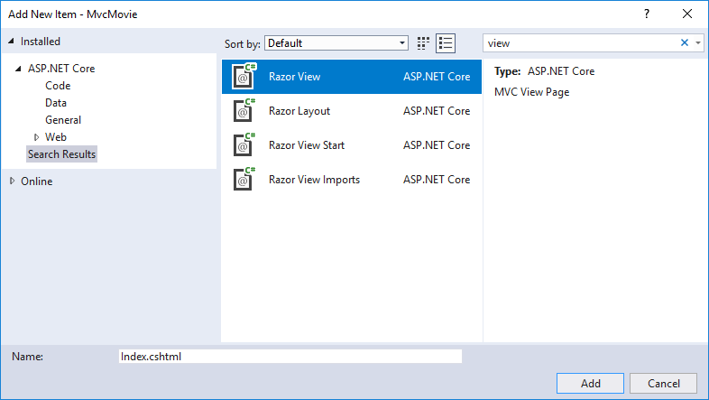

[!INCLUDE[adding-view](../../includes/mvc-intro/adding_view1.md)]

* Right click on the *Views* folder, and then **Add > New Folder** and name the folder *HelloWorld*.

* Right click on the *Views/HelloWorld* folder, and then **Add > New Item**.

* In the **Add New Item - MvcMovie** dialog

  * In the search box in the upper-right, enter *view*

  * Tap **MVC View Page**

  * In the **Name** box, change the name if necessary to *Index.cshtml*.

  * Tap **Add**

[!INCLUDE[adding-view22](../../includes/mvc-intro/adding_view2.md)]

>[!div class="step-by-step"]
[Previous](adding-controller.md)
[Next](adding-model.md)