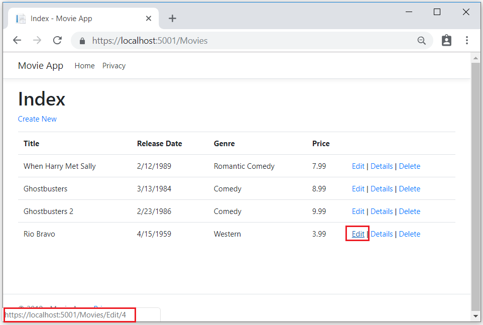
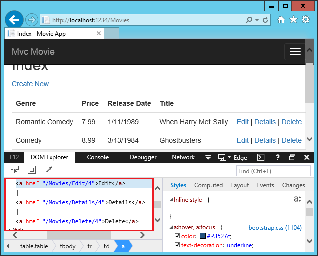
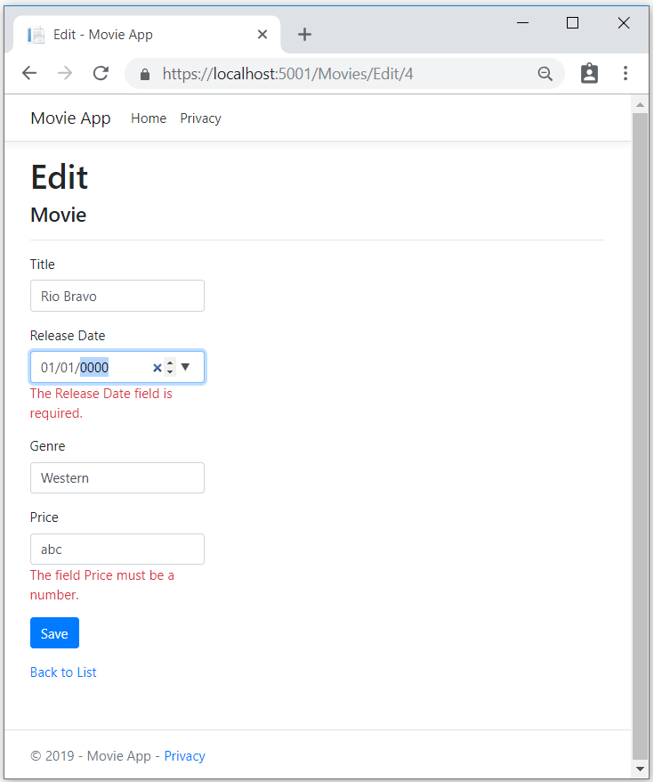

# Controller methods and views

By [Rick Anderson](https://twitter.com/RickAndMSFT)

We have a good start to the movie app, but the presentation is not ideal. We don't want to see the time (12:00:00 AM in the image below) and **ReleaseDate** should be two words.

Open the *Models/Movie.cs* file and add the highlighted lines shown below:

<!-- next update, create MovieDateWithExtraUsings that has all the using we remove
in the next step 
-->
[!code-csharp[Main](start-mvc/sample/MvcMovie/Models/MovieDate.cs?name=snippet_1&highlight=11-12)]

Right click on a red squiggly line **> Quick Actions and Refactorings**.

  

Tap `using System.ComponentModel.DataAnnotations;`

  

  Visual studio adds `using System.ComponentModel.DataAnnotations;`.

Let's remove the `using` statements that are not needed. They show up by default in a light grey font. Right click anywhere in the *Movie.cs* file **> Remove and Sort Usings**.

The updated code:

[!code-csharp[Main](./start-mvc/sample/MvcMovie/Models/MovieDate.cs?name=snippet_1)]

We'll cover [DataAnnotations](http://msdn.microsoft.com/library/system.componentmodel.dataannotations.aspx) in the next tutorial. The [Display](https://msdn.microsoft.com/library/system.componentmodel.dataannotations.displayattribute.aspx) attribute specifies what to display for the name of a field (in this case "Release Date" instead of "ReleaseDate"). The [DataType](https://msdn.microsoft.com/library/system.componentmodel.dataannotations.datatypeattribute.aspx) attribute specifies the type of the data (Date), so the time information stored in the field is not displayed.

Browse to the `Movies` controller and hold the mouse pointer over an **Edit** link to see the target URL.

The **Edit**, **Details**, and **Delete** links are generated by the MVC Core Anchor Tag Helper in the *Views/Movies/Index.cshtml* file.

[!code-HTML[Main](start-mvc/sample/MvcMovie/Views/Movies/IndexOriginal.cshtml?highlight=1-3&range=46-50)]

[Tag Helpers](xref:mvc/views/tag-helpers/intro) enable server-side code to participate in creating and rendering HTML elements in Razor files. In the code above, the `AnchorTagHelper` dynamically generates the HTML `href` attribute value from the controller action method and route id. You use **View Source** from your favorite browser or use the **F12** tools to examine the generated markup. The **F12** tools are shown below.

Recall the format for [routing](xref:mvc/controllers/routing) set in the *Startup.cs* file:

[!code-csharp[Main](start-mvc/sample/MvcMovie/Startup.cs?name=snippet_1&highlight=5)]

ASP.NET Core translates `http://localhost:1234/Movies/Edit/4` into a request to the `Edit` action method of the `Movies` controller with the parameter `Id` of 4. (Controller methods are also known as action methods.)

[Tag Helpers](xref:mvc/views/tag-helpers/intro) are one of the most popular new features in ASP.NET Core. See [Additional resources](#additional-resources) for more information.

Open the `Movies` controller and examine the two `Edit` action methods. The following code shows the `HTTP GET Edit` method, which fetchs the movie and populates the edit form generated by the *Edit.cshtml* Razor file.

[!code-csharp[Main](start-mvc/sample/MvcMovie/Controllers/MC1.cs?name=snippet_edit1)]

The following code shows the `HTTP POST Edit` method, which proccess the posted movie values:

[!code-csharp[Main](start-mvc/sample/MvcMovie/Controllers/MC1.cs?name=snippet_edit2)]

The `[Bind]` attribute is one way to protect against [over-posting](https://docs.microsoft.com/aspnet/mvc/overview/getting-started/getting-started-with-ef-using-mvc/implementing-basic-crud-functionality-with-the-entity-framework-in-asp-net-mvc-application#overpost). You should only include properties in the `[Bind]` attribute that you want to change. See [Protect your controller from over-posting](http://www.asp.net/mvc/overview/getting-started/getting-started-with-ef-using-mvc/implementing-basic-crud-functionality-with-the-entity-framework-in-asp-net-mvc-application#overpost) for more information. [ViewModels](http://rachelappel.com/use-viewmodels-to-manage-data-amp-organize-code-in-asp-net-mvc-applications/) provide an alternative approach to prevent over-posting.

Notice the second `Edit` action method is preceded by the `[HttpPost]` attribute.

[!code-csharp[Main](start-mvc/sample/MvcMovie/Controllers/MC1.cs?name=snippet_edit2&highlight=4)]

The `HttpPostAttribute` attribute specifies that this `Edit` method can be invoked *only* for `POST` requests. You could apply the `[HttpGet]` attribute to the first edit method, but that's not necessary because `[HttpGet]` is the default.

The `ValidateAntiForgeryTokenAttribute` attribute is used to [prevent forgery of a request](xref:security/anti-request-forgery) and is paired up with an anti-forgery token generated in the edit view file (*Views/Movies/Edit.cshtml*). The edit view file generates the anti-forgery token with the [Form Tag Helper](xref:mvc/views/working-with-forms).

[!code-HTML[Main](start-mvc/sample/MvcMovie/Views/Movies/Edit.cshtml?range=9)]

The [Form Tag Helper](xref:mvc/views/working-with-forms) generates a hidden anti-forgery token that must match the `[ValidateAntiForgeryToken]` generated anti-forgery token in the `Edit` method of the Movies controller. For more information, see [Anti-Request Forgery](xref:security/anti-request-forgery).

The `HttpGet Edit` method takes the movie `ID` parameter, looks up the movie using the Entity Framework `SingleOrDefaultAsync` method, and returns the selected movie to the Edit view. If a movie cannot be found, `NotFound` (HTTP 404) is returned.

[!code-csharp[Main](start-mvc/sample/MvcMovie/Controllers/MC1.cs?name=snippet_edit1)]

When the scaffolding system created the Edit view, it examined the `Movie` class and created code to render `<label>` and `<input>` elements for each property of the class. The following example shows the Edit view that was generated by the Visual Studio scaffolding system:

[!code-HTML[Main](start-mvc/sample/MvcMovie/Views/Movies/EditCopy.cshtml?highlight=1)]

Notice how the view template has a `@model MvcMovie.Models.Movie` statement at the top of the file. `@model MvcMovie.Models.Movie` specifies that the view expects the model for the view template to be of type `Movie`.

The scaffolded code uses several Tag Helper methods to streamline the HTML markup. The - [Label Tag Helper](xref:mvc/views/working-with-forms) displays the name of the field ("Title", "ReleaseDate", "Genre", or "Price"). The [Input Tag Helper](xref:mvc/views/working-with-forms) renders an HTML `<input>` element. The [Validation Tag Helper](xref:mvc/views/working-with-forms) displays any validation messages associated with that property.

Run the application and navigate to the `/Movies` URL. Click an **Edit** link. In the browser, view the source for the page. The generated HTML for the `<form>` element is shown below.

[!code-HTML[Main](start-mvc/sample/MvcMovie/Views/Shared/edit_view_source.html?highlight=1,6,10,17,24,28)]

The `<input>` elements are in an `HTML <form>` element whose `action` attribute is set to post to the `/Movies/Edit/id` URL. The form data will be posted to the server when the `Save` button is clicked. The last line before the closing `</form>` element shows the hidden [XSRF](xref:security/anti-request-forgery) token generated by the [Form Tag Helper](xref:mvc/views/working-with-forms).

## Processing the POST Request

The following listing shows the `[HttpPost]` version of the `Edit` action method.

[!code-csharp[Main](start-mvc/sample/MvcMovie/Controllers/MC1.cs?name=snippet_edit2)]

The `[ValidateAntiForgeryToken]` attribute validates the hidden [XSRF](xref:security/anti-request-forgery) token generated by the anti-forgery token generator in the [Form Tag Helper](xref:mvc/views/working-with-forms)

The [model binding](xref:mvc/models/model-binding) system takes the posted form values and creates a `Movie` object that's passed as the `movie` parameter. The `ModelState.IsValid` method verifies that the data submitted in the form can be used to modify (edit or update) a `Movie` object. If the data is valid it's saved. The updated (edited) movie data is saved to the database by calling the `SaveChangesAsync` method of database context. After saving the data, the code redirects the user to the `Index` action method of the `MoviesController` class, which displays the movie collection, including the changes just made.

Before the form is posted to the server, client side validation checks any validation rules on the fields. If there are any validation errors, an error message is displayed and the form is not posted. If JavaScript is disabled, you won't have client side validation but the server will detect the posted values that are not valid, and the form values will be redisplayed with error messages. Later in the tutorial we examine [Model Validation](xref:mvc/models/validation) in more detail. The [Validation Tag Helper](xref:mvc/views/working-with-forms) in the *Views/Movies/Edit.cshtml* view template takes care of displaying appropriate error messages.

All the `HttpGet` methods in the movie controller follow a similar pattern. They get a movie object (or list of objects, in the case of `Index`), and pass the object (model) to the view. The `Create` method passes an empty movie object to the `Create` view. All the methods that create, edit, delete, or otherwise modify data do so in the `[HttpPost]` overload of the method. Modifying data in an HTTP GET method is a security risk. Modifying data in a `HTTP GET` method also violates HTTP best practices and the architectural [REST](http://rest.elkstein.org/) pattern, which specifies that GET requests should not change the state of your application. In other words, performing a GET operation should be a safe operation that has no side effects and doesn't modify your persisted data.

## Additional resources

* [Globalization and localization](xref:fundamentals/localization)
* [Introduction to Tag Helpers](xref:mvc/views/tag-helpers/intro)
* [Authoring Tag Helpers](xref:mvc/views/tag-helpers/authoring)
* [Anti-Request Forgery](xref:security/anti-request-forgery)
* Protect your controller from [over-posting](http://www.asp.net/mvc/overview/getting-started/getting-started-with-ef-using-mvc/implementing-basic-crud-functionality-with-the-entity-framework-in-asp-net-mvc-application#overpost)
* [ViewModels](http://rachelappel.com/use-viewmodels-to-manage-data-amp-organize-code-in-asp-net-mvc-applications/)
* [Form Tag Helper](xref:mvc/views/working-with-forms)
* [Input Tag Helper](xref:mvc/views/working-with-forms)
* [Label Tag Helper](xref:mvc/views/working-with-forms)
* [Select Tag Helper](xref:mvc/views/working-with-forms)
* [Validation Tag Helper](xref:mvc/views/working-with-forms)

>[!div class="step-by-step"]
[Previous](working-with-sql.md)
[Next](search.md)  
