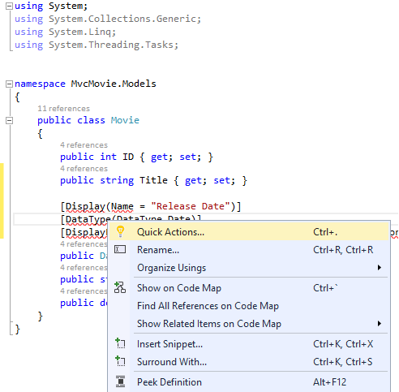
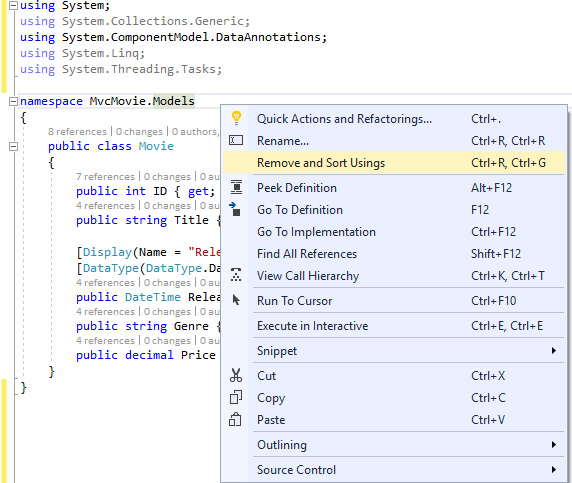

# Controller methods and views

By [Rick Anderson](https://twitter.com/RickAndMSFT)

We have a good start to the movie app, but the presentation is not ideal. We don't want to see the time (12:00:00 AM in the image below) and **ReleaseDate** should be two words.

Open the *Models/Movie.cs* file and add the highlighted lines shown below:

[!code-csharp[Main](start-mvc/sample/MvcMovie/Models/MovieDateWithExtraUsings.cs?name=snippet_1&highlight=13-14)]

Right click on a red squiggly line **> Quick Actions and Refactorings**.

  

Tap `using System.ComponentModel.DataAnnotations;`

  

  Visual studio adds `using System.ComponentModel.DataAnnotations;`.

Let's remove the `using` statements that are not needed. They show up by default in a light grey font. Right click anywhere in the *Movie.cs* file **> Remove and Sort Usings**.

The updated code:

[!code-csharp[Main](./start-mvc/sample/MvcMovie/Models/MovieDate.cs?name=snippet_1)]

<!-- include start -->

[!INCLUDE[adding-model](../../includes/mvc-intro/controller-methods-views.md)]

>[!div class="step-by-step"]
[Previous](working-with-sql.md)
[Next](search.md)  
