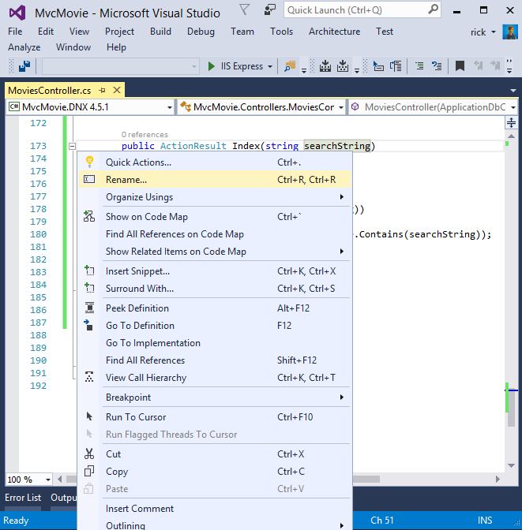
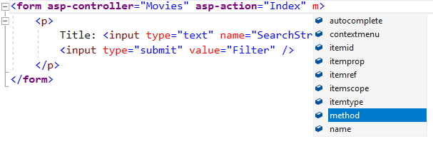
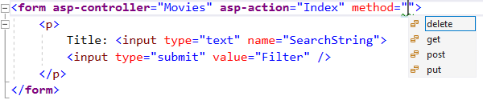
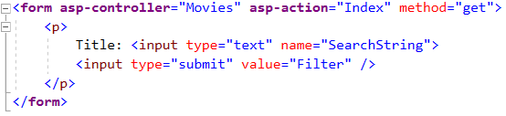

[!INCLUDE[adding-model](../../includes/mvc-intro/search1.md)]

You can quickly rename the `searchString` parameter to `id` with the **rename** command. Right click on `searchString` **> Rename**.

The rename targets are highlighted.

Change the parameter to `id` and all occurrences of `searchString` change to `id`.

[!INCLUDE[adding-model](../../includes/mvc-intro/search2.md)]

Notice how intelliSense helps us update the markup.

Notice the distinctive font in the `<form>` tag. That distinctive font indicates the tag is supported by [Tag Helpers](../../mvc/views/tag-helpers/intro.md).

[!INCLUDE[adding-model](../../includes/mvc-intro/search3.md)]

>[!div class="step-by-step"]
[Previous](controller-methods-views.md)
[Next](new-field.md)  
