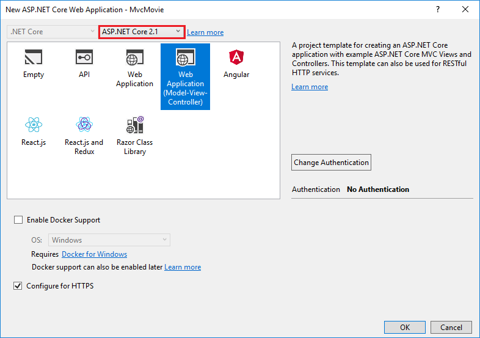
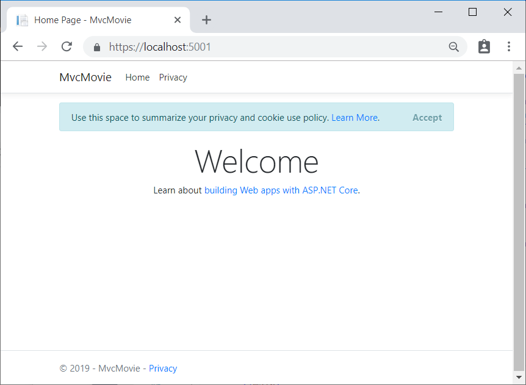

# Get started with ASP.NET Core MVC

By [Rick Anderson](https://twitter.com/RickAndMSFT)

::: moniker range=">= aspnetcore-3.0"

[!INCLUDE [consider RP](~/includes/razor.md)]

This tutorial teaches the basics of building an ASP.NET Core MVC web app.

The app manages a database of movie titles. You learn how to:

> [!div class="checklist"]
> * Create a web app.
> * Add and scaffold a model.
> * Work with a database.
> * Add search and validation.

At the end, you have an app that can manage and display movie data.

[!INCLUDE[](~/includes/mvc-intro/download.md)]

## Prerequisites

# [Visual Studio](#tab/visual-studio)

[!INCLUDE[](~/includes/net-core-prereqs-vs-3.1.md)]

# [Visual Studio Code](#tab/visual-studio-code)

[!INCLUDE[](~/includes/net-core-prereqs-vsc-3.1.md)]

# [Visual Studio for Mac](#tab/visual-studio-mac)

[!INCLUDE[](~/includes/net-core-prereqs-mac-3.1.md)]

---

## Create a web app

# [Visual Studio](#tab/visual-studio)

* From the Visual Studio select **Create a new project**.

* Select **ASP.NET Core Web Application** > **Next**.


* Name the project **MvcMovie** and select **Create**. It's important to name the project **MvcMovie** so when you copy code, the namespace will match.

  

* Select **Web Application(Model-View-Controller)**. From the dropdown boxes, select **.NET Core** and **ASP.NET Core 3.1**, then select **Create**.


Visual Studio used the default template for the MVC project you just created. You have a working app right now by entering a project name and selecting a few options. This is a basic starter project.

# [Visual Studio Code](#tab/visual-studio-code)

The tutorial assumes familarity with VS Code. See [Getting started with VS Code](https://code.visualstudio.com/docs) and [Visual Studio Code help](#visual-studio-code-help) for more information.

* Open the [integrated terminal](https://code.visualstudio.com/docs/editor/integrated-terminal).
* Change directories (`cd`) to a folder which will contain the project.
* Run the following command:

   ```dotnetcli
   dotnet new mvc -o MvcMovie
   code -r MvcMovie
   ```

  * A dialog box appears with **Required assets to build and debug are missing from 'MvcMovie'. Add them?**  Select **Yes**

  * `dotnet new mvc -o MvcMovie`: creates a new ASP.NET Core MVC project in the *MvcMovie* folder.
  * `code -r MvcMovie`: Loads the *MvcMovie.csproj* project file in Visual Studio Code.

# [Visual Studio for Mac](#tab/visual-studio-mac)

* Select **File** > **New Solution**.

  

* In Visual Studio for Mac earlier than version 8.6, select **.NET Core** > **App** > **Web Application (Model-View-Controller)** > **Next**. In version 8.6 or later, select **Web and Console** > **App** > **Web Application (Model-View-Controller)** > **Next**.

  

* In the **Configure your new Web Application** dialog:

  * Confirm that **Authentication** is set to **No Authentication**.
  * If presented an option to select a **Target Framework**, select the latest 3.x version.

  Select **Next**.

* Name the project **MvcMovie**, and then select **Create**.

  

---

### Run the app

# [Visual Studio](#tab/visual-studio)

Select **Ctrl-F5** to run the app in non-debug mode.

[!INCLUDE[](~/includes/trustCertVS.md)]

* Visual Studio starts [IIS Express](/iis/extensions/introduction-to-iis-express/iis-express-overview) and runs the app. Notice that the address bar shows `localhost:port#` and not something like `example.com`. That's because `localhost` is the standard hostname for your local computer. When Visual Studio creates a web project, a random port is used for the web server.
* Launching the app with Ctrl+F5 (non-debug mode) allows you to make code changes, save the file, refresh the browser, and see the code changes. Many developers prefer to use non-debug mode to quickly launch the app and view changes.
* You can launch the app in debug or non-debug mode from the **Debug** menu item:

  

* You can debug the app by selecting the **IIS Express** button

  

  The following image shows the app:

  

# [Visual Studio Code](#tab/visual-studio-code)

Press Ctrl+F5 to run without the debugger.

[!INCLUDE[](~/includes/trustCertVSC.md)]

  Visual Studio Code starts [Kestrel](xref:fundamentals/servers/kestrel), launches a browser, and navigates to `https://localhost:5001`. The address bar shows `localhost:port:5001` and not something like `example.com`. That's because `localhost` is the standard hostname for  local computer. Localhost only serves web requests from the local computer.

  Launching the app with Ctrl+F5 (non-debug mode) allows you to make code changes, save the file, refresh the browser, and see the code changes. Many developers prefer to use non-debug mode to refresh the page and view changes.

  

# [Visual Studio for Mac](#tab/visual-studio-mac)

Select **Run** > **Start Without Debugging** to launch the app. Visual Studio for Mac starts [Kestrel](xref:fundamentals/servers/index#kestrel) server, launches a browser, and navigates to `http://localhost:port`, where *port* is a randomly chosen port number.

[!INCLUDE[](~/includes/trustCertMac.md)]

* The address bar shows `localhost:port#` and not something like `example.com`. That's because `localhost` is the standard hostname for your local computer. When Visual Studio creates a web project, a random port is used for the web server. When you run the app, you'll see a different port number.
* You can launch the app in debug or non-debug mode from the **Run** menu.

  The following image shows the app:

  

---

[!INCLUDE[](~/includes/vs-vsc-vsmac-help.md)]

In the next part of this tutorial, you learn about MVC and start writing some code.

> [!div class="step-by-step"]
> [Next](adding-controller.md)

::: moniker-end

::: moniker range="< aspnetcore-3.0"

[!INCLUDE [consider RP](~/includes/razor.md)]

This tutorial teaches the basics of building an ASP.NET Core MVC web app.

The app manages a database of movie titles. You learn how to:

> [!div class="checklist"]
> * Create a web app.
> * Add and scaffold a model.
> * Work with a database.
> * Add search and validation.

At the end, you have an app that can manage and display movie data.

[!INCLUDE[](~/includes/mvc-intro/download.md)]

## Prerequisites

# [Visual Studio](#tab/visual-studio)

[!INCLUDE[](~/includes/net-core-prereqs-vs2019-2.2.md)]

# [Visual Studio Code](#tab/visual-studio-code)

[!INCLUDE[](~/includes/net-core-prereqs-vsc-2.2.md)]

# [Visual Studio for Mac](#tab/visual-studio-mac)

[!INCLUDE[](~/includes/net-core-prereqs-mac-2.2.md)]

---
## Create a web app

# [Visual Studio](#tab/visual-studio)

* From the Visual Studio select **Create a new project**.

* Select **ASP.NET Core Web Application** and then select **Next**.


* Name the project **MvcMovie** and select **Create**. It's important to name the project **MvcMovie** so when you copy code, the namespace will match.

  


* Select **Web Application(Model-View-Controller)**, and then select **Create**.



Visual Studio used the default template for the MVC project you just created. You have a working app right now by entering a project name and selecting a few options. This is a basic starter project, and it's a good place to start.

# [Visual Studio Code](#tab/visual-studio-code)

The tutorial assumes familarity with VS Code. See [Getting started with VS Code](https://code.visualstudio.com/docs) and [Visual Studio Code help](#visual-studio-code-help) for more information.

* Open the [integrated terminal](https://code.visualstudio.com/docs/editor/integrated-terminal).
* Change directories (`cd`) to a folder which will contain the project.
* Run the following command:

   ```dotnetcli
   dotnet new mvc -o MvcMovie
   code -r MvcMovie
   ```

  * A dialog box appears with **Required assets to build and debug are missing from 'MvcMovie'. Add them?**  Select **Yes**

  * `dotnet new mvc -o MvcMovie`: creates a new ASP.NET Core MVC project in the *MvcMovie* folder.
  * `code -r MvcMovie`: Loads the *MvcMovie.csproj* project file in Visual Studio Code.

# [Visual Studio for Mac](#tab/visual-studio-mac)

* Select **File** > **New Solution**.

  

* In Visual Studio for Mac earlier than version 8.6, select **.NET Core** > **App** > **Web Application (Model-View-Controller)** > **Next**. In version 8.6 or later, select **Web and Console** > **App** > **Web Application (Model-View-Controller)** > **Next**.

* In the **Configure your new Web Application** dialog:

  * Confirm that **Authentication** is set to **No Authentication**.
  * If presented an option to select a **Target Framework**, select the latest 2.x version.

  Select **Next**.

* Name the project **MvcMovie**, and then select **Create**.

---

### Run the app

# [Visual Studio](#tab/visual-studio)

Select **Ctrl-F5** to run the app in non-debug mode.

[!INCLUDE[](~/includes/trustCertVS.md)]

* Visual Studio starts [IIS Express](/iis/extensions/introduction-to-iis-express/iis-express-overview) and runs the app. Notice that the address bar shows `localhost:port#` and not something like `example.com`. That's because `localhost` is the standard hostname for your local computer. When Visual Studio creates a web project, a random port is used for the web server.
* Launching the app with Ctrl+F5 (non-debug mode) allows you to make code changes, save the file, refresh the browser, and see the code changes. Many developers prefer to use non-debug mode to quickly launch the app and view changes.
* You can launch the app in debug or non-debug mode from the **Debug** menu item:

  

* You can debug the app by selecting the **IIS Express** button

  

* Select **Accept** to consent to tracking. This app doesn't track personal information. The template generated code includes assets to help meet [General Data Protection Regulation (GDPR)](xref:security/gdpr).

  

  The following image shows the app after accepting tracking:

  

# [Visual Studio Code](#tab/visual-studio-code)

Press Ctrl+F5 to run without the debugger.

[!INCLUDE[](~/includes/trustCertVSC.md)]

  Visual Studio Code starts [Kestrel](xref:fundamentals/servers/kestrel), launches a browser, and navigates to `https://localhost:5001`. The address bar shows `localhost:port:5001` and not something like `example.com`. That's because `localhost` is the standard hostname for  local computer. Localhost only serves web requests from the local computer.

  Launching the app with Ctrl+F5 (non-debug mode) allows you to make code changes, save the file, refresh the browser, and see the code changes. Many developers prefer to use non-debug mode to refresh the page and view changes.

* Select **Accept** to consent to tracking. This app doesn't track personal information. The template generated code includes assets to help meet [General Data Protection Regulation (GDPR)](xref:security/gdpr).

  

  The following image shows the app after accepting tracking:

  

# [Visual Studio for Mac](#tab/visual-studio-mac)

Select **Run** > **Start Without Debugging** to launch the app. Visual Studio for Mac starts [Kestrel](xref:fundamentals/servers/index#kestrel) server, launches a browser, and navigates to `http://localhost:port`, where *port* is a randomly chosen port number.

[!INCLUDE[](~/includes/trustCertMac.md)]

* The address bar shows `localhost:port#` and not something like `example.com`. That's because `localhost` is the standard hostname for your local computer. When Visual Studio creates a web project, a random port is used for the web server. When you run the app, you'll see a different port number.
* You can launch the app in debug or non-debug mode from the **Run** menu.

* Select **Accept** to consent to tracking. This app doesn't track personal information. The template generated code includes assets to help meet [General Data Protection Regulation (GDPR)](xref:security/gdpr).

  

  The following image shows the app after accepting tracking:

  

---

[!INCLUDE[](~/includes/vs-vsc-vsmac-help.md)]

In the next part of this tutorial, you learn about MVC and start writing some code.

> [!div class="step-by-step"]
> [Next](adding-controller.md)

::: moniker-end
