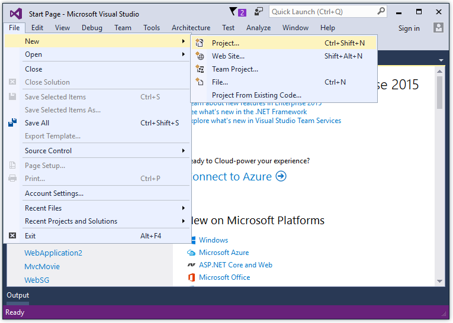
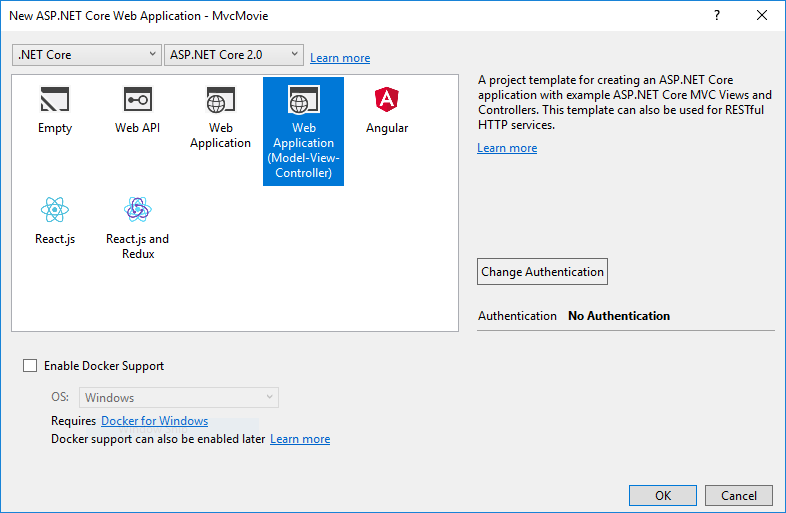
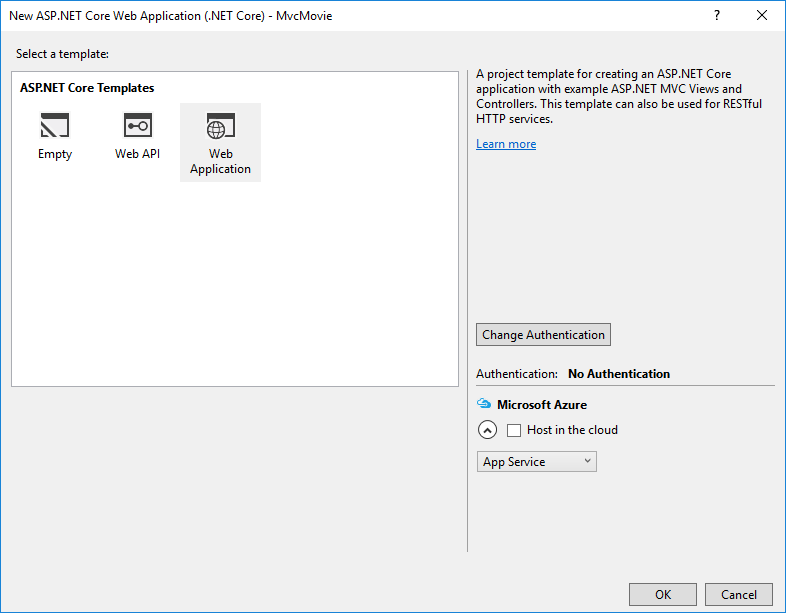
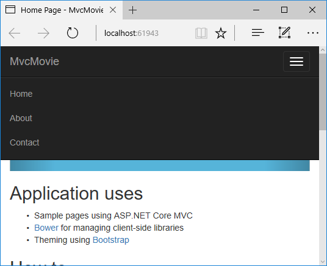

# Getting started with ASP.NET Core MVC and Visual Studio

By [Rick Anderson](https://twitter.com/RickAndMSFT)

This tutorial will teach you the basics of building an ASP.NET Core MVC web app using [Visual Studio 2017](https://www.visualstudio.com/). [!INCLUDE[consider RP](../../includes/razor.md)]

There are 3 versions of this tutorial:

* macOS: [Create an ASP.NET Core MVC app with Visual Studio for Mac](xref:tutorials/first-mvc-app-mac/start-mvc)
* Windows: [Create an ASP.NET Core MVC app with Visual Studio](xref:tutorials/first-mvc-app/start-mvc)
* macOS, Linux, and Windows: [Create an ASP.NET Core MVC app with Visual Studio Code](xref:tutorials/first-mvc-app-xplat/start-mvc)

For the Visual Studio 2015 version of this tutorial, see the [VS 2015 version of ASP.NET Core documentation in PDF format](https://github.com/aspnet/Docs/blob/master/aspnetcore/common/_static/aspnet-core-project-json.pdf).

## Install Visual Studio and .NET Core

# [ASP.NET Core 2.x](#tab/aspnetcore2x)

[!INCLUDE[install 2.0](../../includes/install2.0.md)]

# [ASP.NET Core 1.x](#tab/aspnetcore1x)

Install Visual Studio Community 2017. Select the Community download. Skip this step if you have Visual Studio 2017 installed.

* [Visual Studio 2017 Home page installer](https://www.visualstudio.com/)

Run the installer and select the following workloads:

* **ASP.NET and web development** (under **Web & Cloud**)
* **.NET Core cross-platform development** (under **Other Toolsets**)

---

## Create a web app

From Visual Studio, select  **File > New > Project**.

Complete the **New Project** dialog:

* In the left pane, tap **.NET Core**
* In the center pane, tap **ASP.NET Core Web Application (.NET Core)**
* Name the project "MvcMovie" (It's important to name the project "MvcMovie" so when you copy code, the namespace will match.)
* Tap **OK**

# [ASP.NET Core 2.x](#tab/aspnetcore2x)

Complete the **New ASP.NET Core Web Application (.NET Core) - MvcMovie** dialog:

* In the version selector drop-down box select **ASP.NET Core 2.-**
* Select **Web Application(Model-View-Controller)**
* Tap **OK**.

# [ASP.NET Core 1.x](#tab/aspnetcore1x)

Complete the **New ASP.NET Core Web Application (.NET Core) - MvcMovie** dialog:

* In the version selector drop-down box tap **ASP.NET Core 1.1**
* Tap **Web Application**
* Keep the default **No Authentication**
* Tap **OK**.

---

Visual Studio used a default template for the MVC project you just created. You have a working app right now by entering a project name and selecting a few options. This is a simple starter project, and it's a good place to start,

Tap **F5** to run the app in debug mode or **Ctrl-F5** in non-debug mode.
<!-- These images are also used by uid: tutorials/first-mvc-app-xplat/start-mvc -->

* Visual Studio starts [IIS Express](https://docs.microsoft.com/iis/extensions/introduction-to-iis-express/iis-express-overview) and runs your app. Notice that the address bar shows `localhost:port#` and not something like `example.com`. That's because `localhost` is the standard hostname for your local computer. When Visual Studio creates a web project, a random port is used for the web server. In the image above, the port number is 5000. When you run the app, you'll see a different port number.
* Launching the app with **Ctrl+F5** (non-debug mode) allows you to make code changes, save the file, refresh the browser, and see the code changes. Many developers prefer to use non-debug mode to quickly launch the app and view changes.
* You can launch the app in debug or non-debug mode from the **Debug** menu item:

* You can debug the app by tapping the **IIS Express** button

The default template gives you working **Home, About** and **Contact** links. The browser image above doesn't show these links. Depending on the size of your browser, you might need to click the navigation icon to show them.

If you were running in debug mode, tap **Shift-F5** to stop debugging.

In the next part of this tutorial, we'll learn about MVC and start writing some code.

>[!div class="step-by-step"]
[Next](adding-controller.md)  
