# Get started with ASP.NET Core MVC

By [Rick Anderson](https://twitter.com/RickAndMSFT)

:::moniker range=">= aspnetcore-6.0"

[!INCLUDE [consider RP](~/includes/razor.md)]

This is the first tutorial of a series that teaches ASP.NET Core MVC web development with controllers and views.

At the end of the series, you'll have an app that manages and displays movie data. You learn how to:

> [!div class="checklist"]
> * Create a web app.
> * Add and scaffold a model.
> * Work with a database.
> * Add search and validation.

[View or download sample code](https://github.com/dotnet/AspNetCore.Docs/tree/main/aspnetcore/tutorials/first-mvc-app/start-mvc/sample) ([how to download](xref:index#how-to-download-a-sample)).

## Prerequisites

# [Visual Studio](#tab/visual-studio)

[!INCLUDE[](~/includes/net-prereqs-vs-6.0.md)]

# [Visual Studio Code](#tab/visual-studio-code)

[!INCLUDE[](~/includes/net-prereqs-vsc-6.0.md)]

# [Visual Studio for Mac](#tab/visual-studio-mac)

For Visual Studio for Mac, see the .NET 5 version of this tutorial.

<!--
[!INCLUDE[](~/includes/net-core-prereqs-mac-5.0.md)]
-->
>
---

## Create a web app

# [Visual Studio](#tab/visual-studio)

* Start Visual Studio and select **Create a new project**.
* In the **Create a new project** dialog, select **ASP.NET Core Web App (Model-View-Controller)** > **Next**.
* In the **Configure your new project** dialog, enter `MvcMovie` for **Project name**. It's important to name the project *MvcMovie*. Capitalization needs to match each `namespace` when code is copied.
* Select **Next**.
* In the **Additional information** dialog, select **.NET 6.0 (Long-term support)**.
* Select **Create**.

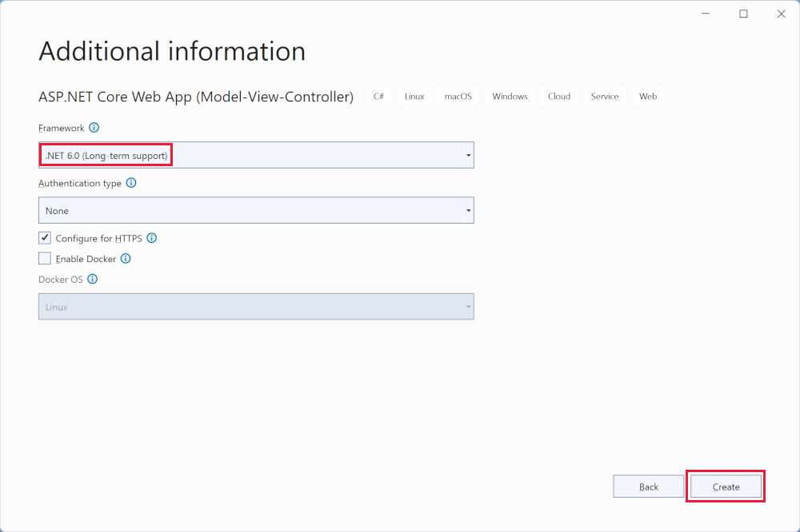

For alternative approaches to create the project, see [Create a new project in Visual Studio](/visualstudio/ide/create-new-project).

Visual Studio uses the default project template for the created MVC project. The created project:

* Is a working app.
* Is a basic starter project.

# [Visual Studio Code](#tab/visual-studio-code)

The tutorial assumes familiarity with VS Code. For more information, see [Getting started with VS Code](https://code.visualstudio.com/docs) and [Visual Studio Code help](#visual-studio-code-help).

* Open the [integrated terminal](https://code.visualstudio.com/docs/editor/integrated-terminal).
* Change to the directory (`cd`) that will contain the project.
* Run the following command:

   ```dotnetcli
   dotnet new mvc -o MvcMovie
   code -r MvcMovie
   ```

  * If a dialog box appears with **Required assets to build and debug are missing from 'MvcMovie'. Add them?**, select **Yes**

  * `dotnet new mvc -o MvcMovie`: Creates a new ASP.NET Core MVC project in the *MvcMovie* folder.
  * `code -r MvcMovie`: Loads the `MvcMovie.csproj` project file in Visual Studio Code.

# [Visual Studio for Mac](#tab/visual-studio-mac)

For Visual Studio for Mac, see the .NET 5 version of this tutorial.

<!--
* Select **File** > **New Solution**.

  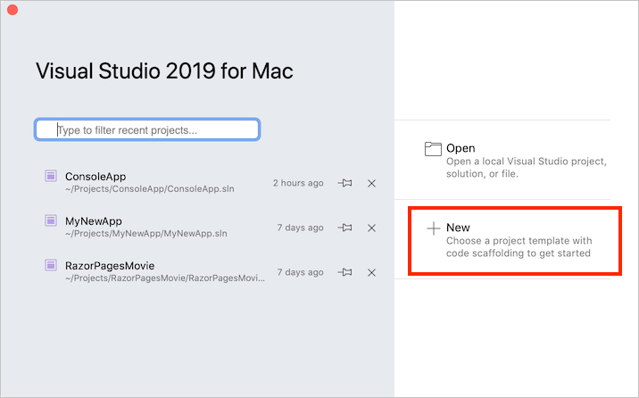

* In Visual Studio for Mac earlier than version 8.6, select **.NET Core** > **App** > **Web Application (Model-View-Controller)** > **Next**. In version 8.6 or later, select **Web and Console** > **App** > **Web Application (Model-View-Controller)** > **Next**.

  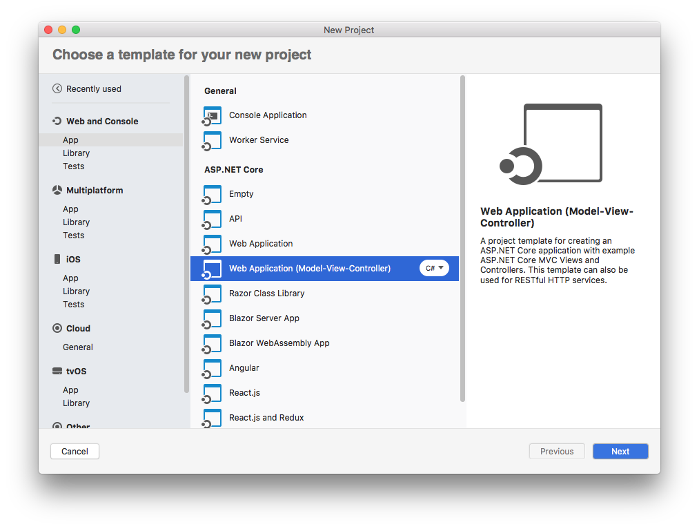

* In the **Configure your new Web Application** dialog:

  * Confirm that **Authentication** is set to **No Authentication**.
  * If an option to select a **Target Framework** is presented, select the latest 5.x version.
  * Select **Next**.

* Name the project **MvcMovie**, and then select **Create**.

  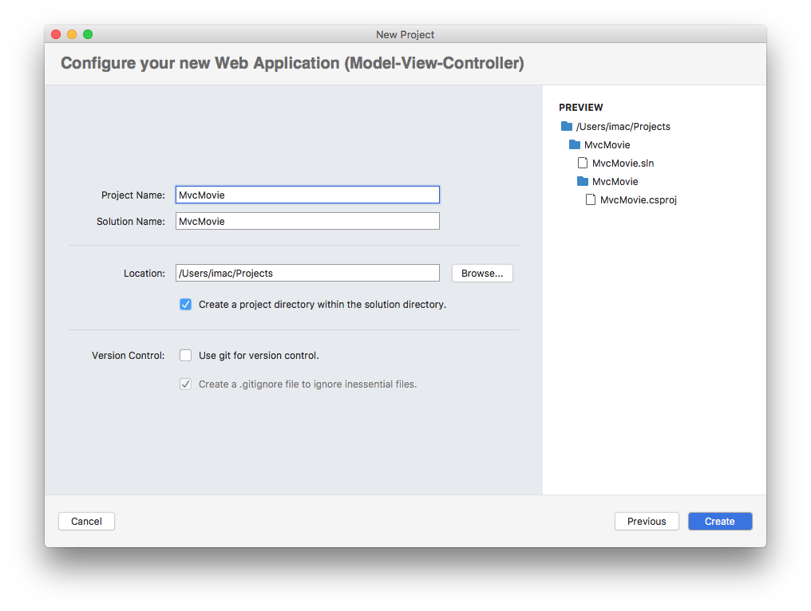
-->

---

### Run the app

# [Visual Studio](#tab/visual-studio)

* Select Ctrl+F5 to run the app without the debugger.

  [!INCLUDE[](~/includes/trustCertVS.md)]

Visual Studio runs the app and opens the default browser.

The address bar shows `localhost:port#` and not something like `example.com`. The standard hostname for your local computer is `localhost`. When Visual Studio creates a web project, a random port is used for the web server.

Launching the app without debugging by selecting Ctrl+F5 allows you to:

* Make code changes.
* Save the file.
* Quickly refresh the browser and see the code changes.

You can launch the app in debug or non-debug mode from the **Debug** menu:

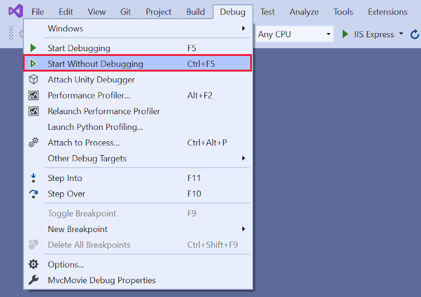

You can debug the app by selecting the **MvcMovie** button in the toolbar:

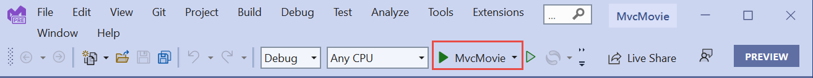

The following image shows the app:


# [Visual Studio Code](#tab/visual-studio-code)

* Select Ctrl+F5 to run without the debugger.

  [!INCLUDE[](~/includes/trustCertVSC.md)]

  Visual Studio Code:

  * Starts [Kestrel](xref:fundamentals/servers/kestrel)
  * Launches a browser.
  * Navigates to `https://localhost:5001`.

  The address bar shows `localhost:port:5001` and not something like `example.com`. The standard hostname for your local computer is `localhost`. Localhost only serves web requests from the local computer.

Launching the app without debugging by selecting Ctrl+F5 allows you to:

* Make code changes.
* Save the file.
* Quickly refresh the browser and see the code changes.

  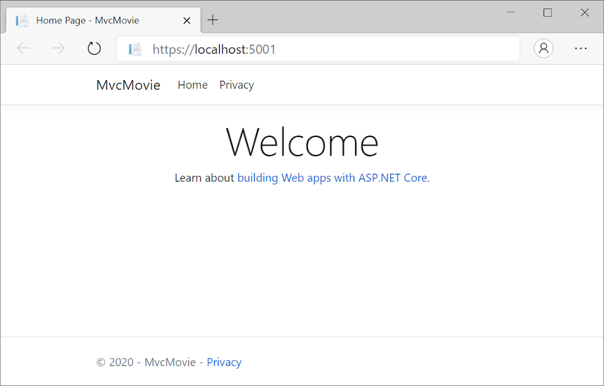

# [Visual Studio for Mac](#tab/visual-studio-mac)

For Visual Studio for Mac, see the .NET 5 version of this tutorial.

<!--
* Select **Run** > **Start Without Debugging** to launch the app.

  Visual Studio for Mac:

  * Starts [Kestrel](xref:fundamentals/servers/index#kestrel) server.
  * Launches a browser.
  * Navigates to `http://localhost:port`, where *port* is a randomly chosen port number.

  [!INCLUDE[](~/includes/trustCertMac.md)]

  The address bar shows `localhost:port#` and not something like `example.com`. The standard hostname for your local computer is `localhost`. When Visual Studio creates a web project, a random port is used for the web server.

You can launch the app in debug or non-debug mode from the **Run** menu.

The following image shows the app:

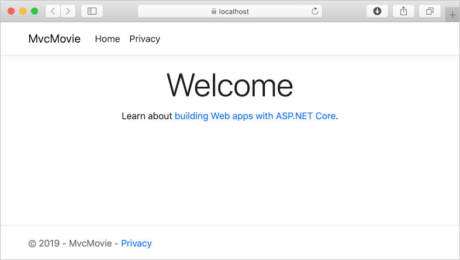
-->

---

[!INCLUDE[](~/includes/vs-vsc-vsmac-help.md)]

In the next tutorial in this series, you learn about MVC and start writing some code.

> [!div class="step-by-step"]
> [Next: Add a controller](adding-controller.md)

:::moniker-end

:::moniker range="= aspnetcore-5.0"

[!INCLUDE [consider RP](~/includes/razor.md)]

This is the first tutorial of a series that teaches ASP.NET Core MVC web development with controllers and views.

At the end of the series, you'll have an app that manages and displays movie data. You learn how to:

> [!div class="checklist"]
> * Create a web app.
> * Add and scaffold a model.
> * Work with a database.
> * Add search and validation.

[View or download sample code](https://github.com/dotnet/AspNetCore.Docs/tree/main/aspnetcore/tutorials/first-mvc-app/start-mvc/sample) ([how to download](xref:index#how-to-download-a-sample)).

## Prerequisites

# [Visual Studio](#tab/visual-studio)

[!INCLUDE[](~/includes/net-core-prereqs-vs-5.0.md)]

# [Visual Studio Code](#tab/visual-studio-code)

[!INCLUDE[](~/includes/net-core-prereqs-vsc-5.0.md)]

# [Visual Studio for Mac](#tab/visual-studio-mac)

[!INCLUDE[](~/includes/net-core-prereqs-mac-5.0.md)]

---

## Create a web app

# [Visual Studio](#tab/visual-studio)

* Start Visual Studio and select **Create a new project**.
* In the **Create a new project** dialog, select **ASP.NET Core Web Application** > **Next**.
* In the **Configure your new project** dialog, enter `MvcMovie` for **Project name**. It's important to name the project *MvcMovie*. Capitalization needs to match each `namespace` matches when code is copied.
* Select **Create**.
* In the **Create a new ASP.NET Core web application** dialog, select:
  * **.NET Core** and **ASP.NET Core 5.0** in the dropdowns.
  * **ASP.NET Core Web App (Model-View-Controller)**.
  * **Create**.

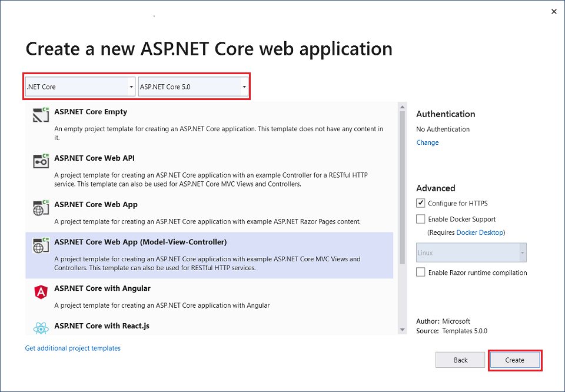

For alternative approaches to create the project, see [Create a new project in Visual Studio](/visualstudio/ide/create-new-project).

Visual Studio used the default project template for the created MVC project. The created project:

* Is a working app.
* Is a basic starter project.

# [Visual Studio Code](#tab/visual-studio-code)

The tutorial assumes familiarity with VS Code. For more information, see [Getting started with VS Code](https://code.visualstudio.com/docs) and [Visual Studio Code help](#visual-studio-code-help).

* Open the [integrated terminal](https://code.visualstudio.com/docs/editor/integrated-terminal).
* Change to the directory (`cd`) that will contain the project.
* Run the following command:

   ```dotnetcli
   dotnet new mvc -o MvcMovie
   code -r MvcMovie
   ```

  * If a dialog box appears with **Required assets to build and debug are missing from 'MvcMovie'. Add them?**, select **Yes**

  * `dotnet new mvc -o MvcMovie`: Creates a new ASP.NET Core MVC project in the *MvcMovie* folder.
  * `code -r MvcMovie`: Loads the `MvcMovie.csproj` project file in Visual Studio Code.

# [Visual Studio for Mac](#tab/visual-studio-mac)

* Select **File** > **New Solution**.

  

* In Visual Studio for Mac earlier than version 8.6, select **.NET Core** > **App** > **Web Application (Model-View-Controller)** > **Next**. In version 8.6 or later, select **Web and Console** > **App** > **Web Application (Model-View-Controller)** > **Next**.

  

* In the **Configure your new Web Application** dialog:

  * Confirm that **Authentication** is set to **No Authentication**.
  * If an option to select a **Target Framework** is presented, select the latest 5.x version.
  * Select **Next**.

* Name the project **MvcMovie**, and then select **Create**.

  

---

### Run the app

# [Visual Studio](#tab/visual-studio)

* Select Ctrl+F5 to run the app without the debugger.

  [!INCLUDE[](~/includes/trustCertVS.md)]

  Visual Studio:

  * Starts [IIS Express](/iis/extensions/introduction-to-iis-express/iis-express-overview).
  * Runs the app.

  The address bar shows `localhost:port#` and not something like `example.com`. The standard hostname for your local computer is `localhost`. When Visual Studio creates a web project, a random port is used for the web server.

Launching the app without debugging by selecting Ctrl+F5 allows you to:

* Make code changes.
* Save the file.
* Quickly refresh the browser and see the code changes.

You can launch the app in debug or non-debug mode from the **Debug** menu item:


You can debug the app by selecting the **IIS Express** button

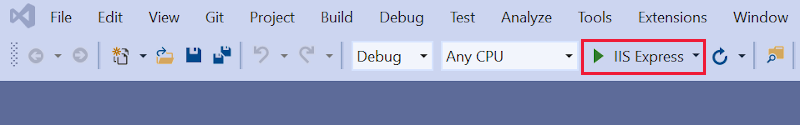

The following image shows the app:


# [Visual Studio Code](#tab/visual-studio-code)

* Select Ctrl+F5 to run without the debugger.

  [!INCLUDE[](~/includes/trustCertVSC.md)]

  Visual Studio Code:

  * Starts [Kestrel](xref:fundamentals/servers/kestrel)
  * Launches a browser.
  * Navigates to `https://localhost:5001`.

  The address bar shows `localhost:port:5001` and not something like `example.com`. The standard hostname for your local computer is `localhost`. Localhost only serves web requests from the local computer.

Launching the app without debugging by selecting Ctrl+F5 allows you to:

* Make code changes.
* Save the file.
* Quickly refresh the browser and see the code changes.

  

# [Visual Studio for Mac](#tab/visual-studio-mac)

* Select **Run** > **Start Without Debugging** to launch the app.

  Visual Studio for Mac:

  * Starts [Kestrel](xref:fundamentals/servers/index#kestrel) server.
  * Launches a browser.
  * Navigates to `http://localhost:port`, where *port* is a randomly chosen port number.

  [!INCLUDE[](~/includes/trustCertMac.md)]

  The address bar shows `localhost:port#` and not something like `example.com`. The standard hostname for your local computer is `localhost`. When Visual Studio creates a web project, a random port is used for the web server.

You can launch the app in debug or non-debug mode from the **Run** menu.

The following image shows the app:


---

[!INCLUDE[](~/includes/vs-vsc-vsmac-help.md)]

In the next part of this tutorial, you learn about MVC and start writing some code.

> [!div class="step-by-step"]
> [Next: Add a controller](adding-controller.md)

:::moniker-end

:::moniker range="< aspnetcore-5.0"

[!INCLUDE [consider RP](~/includes/razor.md)]

This is the first tutorial of a series that teaches ASP.NET Core MVC web development with controllers and views.

At the end of the series, you'll have an app that manages and displays movie data. You learn how to:

> [!div class="checklist"]
> * Create a web app.
> * Add and scaffold a model.
> * Work with a database.
> * Add search and validation.

[View or download sample code](https://github.com/dotnet/AspNetCore.Docs/tree/main/aspnetcore/tutorials/first-mvc-app/start-mvc/sample) ([how to download](xref:index#how-to-download-a-sample)).

## Prerequisites

# [Visual Studio](#tab/visual-studio)

[!INCLUDE[](~/includes/net-core-prereqs-vs-3.1.md)]

# [Visual Studio Code](#tab/visual-studio-code)

[!INCLUDE[](~/includes/net-core-prereqs-vsc-3.1.md)]

# [Visual Studio for Mac](#tab/visual-studio-mac)

[!INCLUDE[](~/includes/net-core-prereqs-mac-3.1.md)]

---

## Create a web app

# [Visual Studio](#tab/visual-studio)

* From the Visual Studio, select **Create a new project**.

* Select **ASP.NET Core Web Application** > **Next**.

  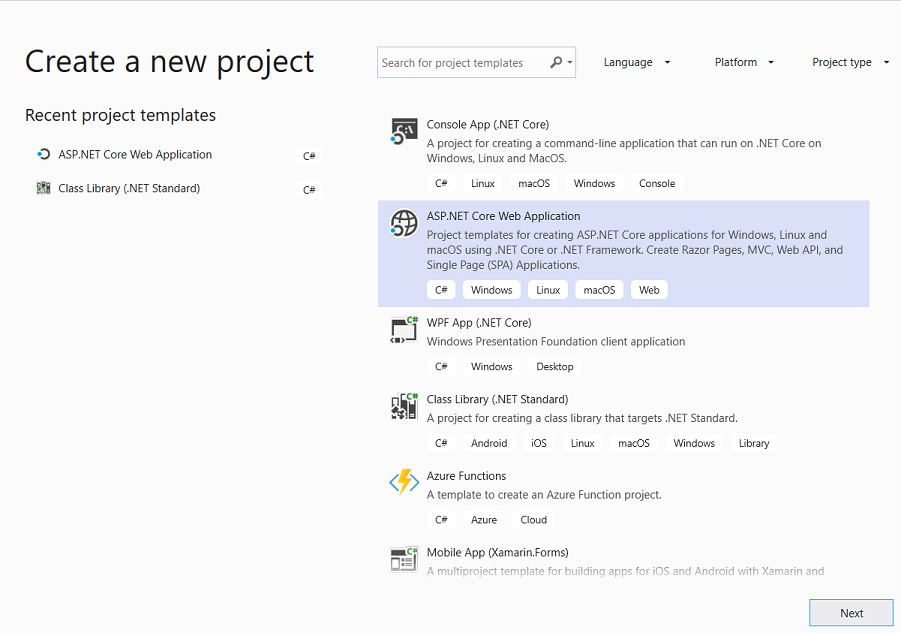

* Name the project **MvcMovie** and select **Create**. It's important to name the project **MvcMovie** so when you copy code, the namespace will match.

  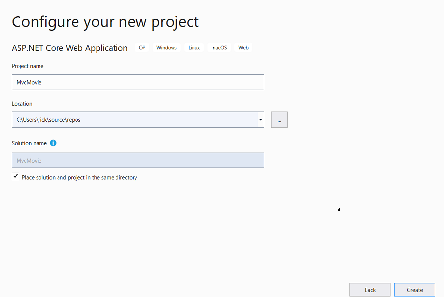

* Select **Web Application(Model-View-Controller)**. From the dropdown boxes, select **.NET Core** and **ASP.NET Core 3.1**, then select **Create**.

  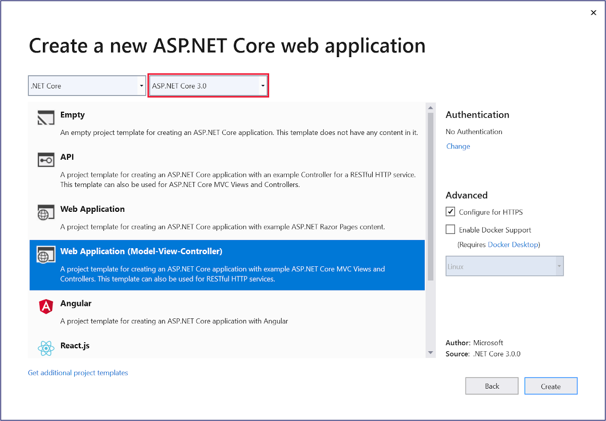

Visual Studio used the default project template for the created MVC project. The created project:

* Is a working app.
* Is a basic starter project.

# [Visual Studio Code](#tab/visual-studio-code)

The tutorial assumes familiarity with VS Code. For more information, see [Getting started with VS Code](https://code.visualstudio.com/docs) and [Visual Studio Code help](#visual-studio-code-help).

* Open the [integrated terminal](https://code.visualstudio.com/docs/editor/integrated-terminal).
* Change directories (`cd`) to a folder that will contain the project.
* Run the following command:

   ```dotnetcli
   dotnet new mvc -o MvcMovie
   code -r MvcMovie
   ```

  * A dialog box appears with **Required assets to build and debug are missing from 'MvcMovie'. Add them?**, select **Yes**.

  * `dotnet new mvc -o MvcMovie`: Creates a new ASP.NET Core MVC project in the *MvcMovie* folder.
  * `code -r MvcMovie`: Loads the `MvcMovie.csproj` project file in Visual Studio Code.

# [Visual Studio for Mac](#tab/visual-studio-mac)

* Select **File** > **New Solution**.

  

* In Visual Studio for Mac earlier than version 8.6, select **.NET Core** > **App** > **Web Application (Model-View-Controller)** > **Next**. In version 8.6 or later, select **Web and Console** > **App** > **Web Application (Model-View-Controller)** > **Next**.

  

* In the **Configure your new Web Application** dialog:

  * Confirm that **Authentication** is set to **No Authentication**.
  * If an option to select a **Target Framework** is presented, select the latest 3.x version.
  * Select **Next**.

* Name the project **MvcMovie**, and then select **Create**.

  

---

### Run the app

# [Visual Studio](#tab/visual-studio)

* Select Ctrl+F5 to run the app without debugging.

  [!INCLUDE[](~/includes/trustCertVS.md)]

  Visual Studio:

  * Starts [IIS Express](/iis/extensions/introduction-to-iis-express/iis-express-overview).
  * Runs the app.

  The address bar shows `localhost:port#` and not something like `example.com`. The standard hostname for your local computer is `localhost`. When Visual Studio creates a web project, a random port is used for the web server.

Launching the app without debugging by selecting Ctrl+F5 allows you to:

* Make code changes.
* Save the file.
* Quickly refresh the browser and see the code changes.

You can launch the app in debug or non-debug mode from the **Debug** menu item:

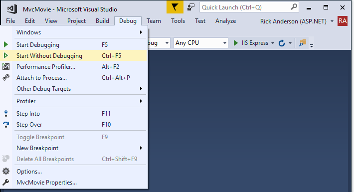

You can debug the app by selecting the **IIS Express** button

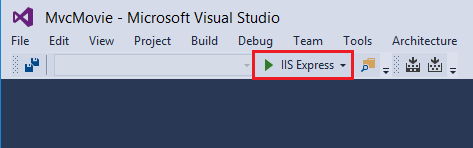

The following image shows the app:

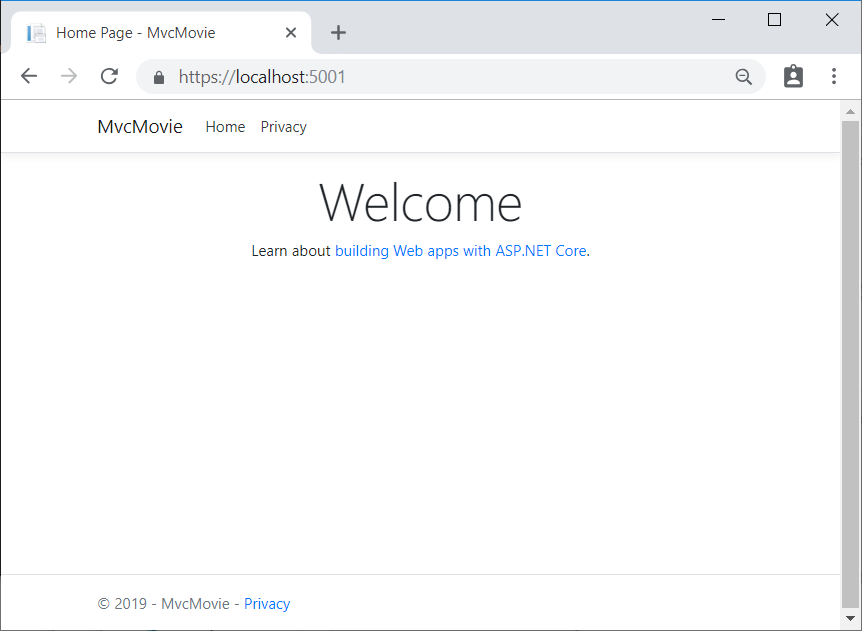

# [Visual Studio Code](#tab/visual-studio-code)

* Select Ctrl+F5 to run the app without debugging.

  [!INCLUDE[](~/includes/trustCertVSC.md)]

  Visual Studio Code:

  * Starts [Kestrel](xref:fundamentals/servers/kestrel)
  * Launches a browser.
  * Navigates to `https://localhost:5001`.

  The address bar shows `localhost:port:5001` and not something like `example.com`. The standard hostname for your local computer is `localhost`. Localhost only serves web requests from the local computer.

Launching the app without debugging by selecting Ctrl+F5 allows you to:

* Make code changes.
* Save the file.
* Quickly refresh the browser and see the code changes.

  

# [Visual Studio for Mac](#tab/visual-studio-mac)

* Select **Run** > **Start Without Debugging** to launch the app.

  Visual Studio for Mac: starts [Kestrel](xref:fundamentals/servers/index#kestrel) server, launches a browser, and navigates to `http://localhost:port`, where *port* is a randomly chosen port number.

[!INCLUDE[](~/includes/trustCertMac.md)]

The address bar shows `localhost:port#` and not something like `example.com`. The standard hostname for your local computer is `localhost`. When Visual Studio creates a web project, a random port is used for the web server. When you run the app, you'll see a different port number.

You can launch the app in debug or non-debug mode from the **Run** menu.

The following image shows the app:


---

[!INCLUDE[](~/includes/vs-vsc-vsmac-help.md)]

In the next part of this tutorial, you learn about MVC and start writing some code.

> [!div class="step-by-step"]
> [Next](adding-controller.md)

:::moniker-end
