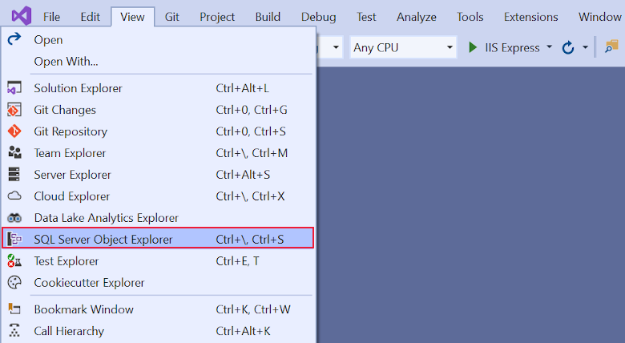
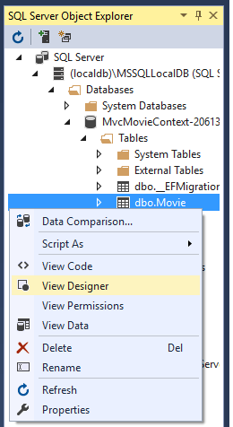
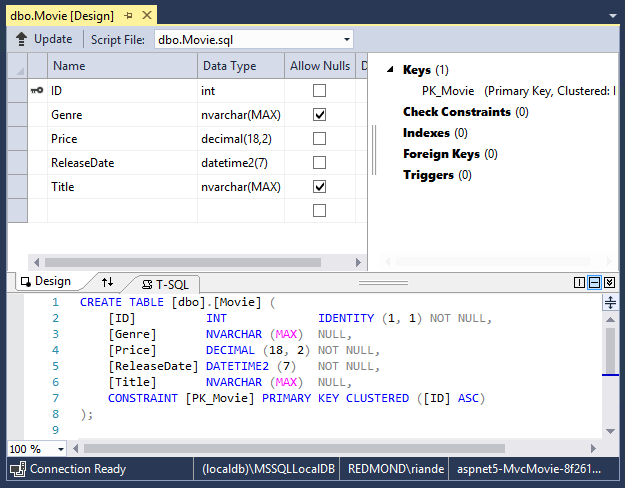
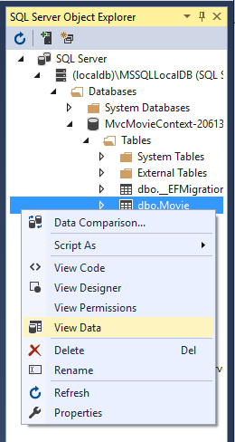
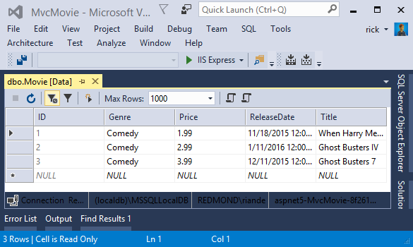
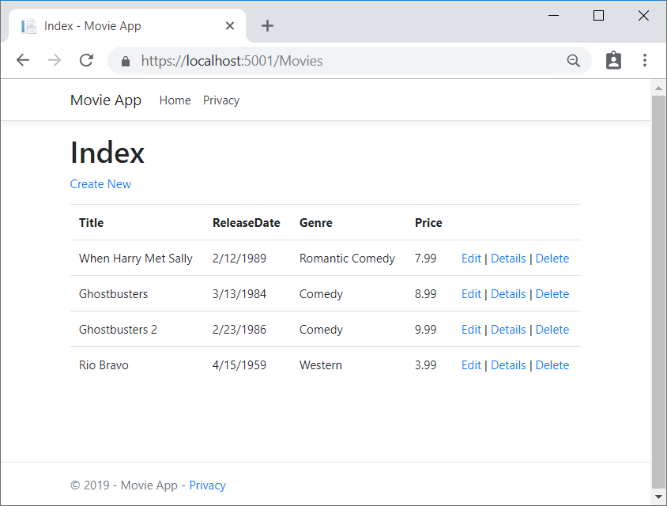
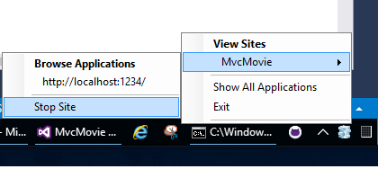

# Part 5, work with a database in an ASP.NET Core MVC app

:::moniker range=">= aspnetcore-6.0"

By [Rick Anderson](https://twitter.com/RickAndMSFT) and [Jon P Smith](https://twitter.com/thereformedprog).

The `MvcMovieContext` object handles the task of connecting to the database and mapping `Movie` objects to database records. The database context is registered with the [Dependency Injection](xref:fundamentals/dependency-injection) container in the `Program.cs` file:

# [Visual Studio](#tab/visual-studio)

[!code-csharp[](~/tutorials/first-mvc-app/start-mvc/sample/MvcMovie60/Program.cs?name=FirstSQLServer&highlight=3-4)]

The ASP.NET Core [Configuration](xref:fundamentals/configuration/index) system reads the `ConnectionString` key. For local development, it gets the connection string from the `appsettings.json` file:

[!code-json[](start-mvc/sample/MvcMovie60/appsettings.json?highlight=2&range=9-11)]

# [Visual Studio Code / Visual Studio for Mac](#tab/visual-studio-code+visual-studio-mac)

[!code-csharp[](~/tutorials/first-mvc-app/start-mvc/sample/MvcMovie60/Program.cs?name=FirstSQLite&highlight=3-4)]

The ASP.NET Core [Configuration](xref:fundamentals/configuration/index) system reads the `ConnectionString`. For local development, it gets the connection string from the `appsettings.json` file:

[!code-json[](~/tutorials/first-mvc-app/start-mvc/sample/MvcMovie60/appsettings_SQLite.json?highlight=2&range=9-11)]

---

When the app is deployed to a test or production server, an environment variable can be used to set the connection string to a production SQL Server. For more information, see [Configuration](xref:fundamentals/configuration/index).

# [Visual Studio](#tab/visual-studio)

## SQL Server Express LocalDB

LocalDB:

* Is a lightweight version of the SQL Server Express Database Engine, installed by default with Visual Studio.
* Starts on demand by using a connection string.
* Is targeted for program development. It runs in user mode, so there's no complex configuration.
* By default creates *.mdf* files in the *C:/Users/{user}* directory.

<!--
Temporarily commented out because SSOX isn't available in VS 2022 Preview
### Examine the database

From the **View** menu, open **SQL Server Object Explorer** (SSOX).



Right-click on the `Movie` table **> View Designer**





Note the key icon next to `ID`. By default, EF makes a property named `ID` the primary key.

Right-click on the `Movie` table **> View Data**




-->

# [Visual Studio Code / Visual Studio for Mac](#tab/visual-studio-code+visual-studio-mac)

[!INCLUDE[](~/includes/rp/sqlite.md)]
[!INCLUDE[](~/includes/RP-mvc-shared/sqlite-warn.md)]

---
<!-- End of VS tabs -->

## Seed the database

Create a new class named `SeedData` in the *Models* folder. Replace the generated code with the following:

[!code-csharp[](~/tutorials/first-mvc-app/start-mvc/sample/MvcMovie60/Models/SeedData.cs?name=FirstVersion)]

If there are any movies in the database, the seed initializer returns and no movies are added.

```csharp
if (context.Movie.Any())
{
    return;  // DB has been seeded.
}
```

<a name="si"></a>

### Add the seed initializer

# [Visual Studio](#tab/visual-studio)

Replace the contents of `Program.cs` with the following code. The new code is highlighted.

[!code-csharp[](~/tutorials/first-mvc-app/start-mvc/sample/MvcMovie60/Program.cs?name=SQLServerSeedData&highlight=4,16-21)]

Delete all the records in the database. You can do this with the delete links in the browser or from SSOX.

Test the app. Force the app to initialize, calling the code in the `Program.cs` file, so the seed method runs. To force initialization, close the command prompt window that Visual Studio opened, and restart by pressing Ctrl+F5.

# [Visual Studio Code / Visual Studio for Mac](#tab/visual-studio-code+visual-studio-mac)

Update `Program.cs` with the following highlighted code:

[!code-csharp[](~/tutorials/first-mvc-app/start-mvc/sample/MvcMovie60/Program.cs?name=SQLiteSeedData&highlight=4,16-21)]

Delete all the records in the database.

Test the app. Stop it and restart it so the `SeedData.Initialize` method runs and seeds the database.

---

The app shows the seeded data.



> [!div class="step-by-step"]
> [Previous: Adding a model](adding-model.md)
> [Next: Adding controller methods and views](controller-methods-views.md)

:::moniker-end

:::moniker range="< aspnetcore-6.0"

By [Rick Anderson](https://twitter.com/RickAndMSFT) and [Jon P Smith](https://twitter.com/thereformedprog).

The `MvcMovieContext` object handles the task of connecting to the database and mapping `Movie` objects to database records. The database context is registered with the [Dependency Injection](xref:fundamentals/dependency-injection) container in the `ConfigureServices` method in the `Startup.cs` file:

# [Visual Studio](#tab/visual-studio)

[!code-csharp[](~/tutorials/first-mvc-app/start-mvc/sample/MvcMovie3/Startup.cs?name=snippet_ConfigureServices&highlight=5-6)]

The ASP.NET Core [Configuration](xref:fundamentals/configuration/index) system reads the `ConnectionString` key. For local development, it gets the connection string from the `appsettings.json` file:

[!code-json[](start-mvc/sample/MvcMovie/appsettings.json?highlight=2&range=8-10)]

# [Visual Studio Code / Visual Studio for Mac](#tab/visual-studio-code+visual-studio-mac)

[!code-csharp[](~/tutorials/first-mvc-app/start-mvc/sample/MvcMovie3/Startup.cs?name=snippet_UseSqlite&highlight=5-6)]

The ASP.NET Core [Configuration](xref:fundamentals/configuration/index) system reads the `ConnectionString`. For local development, it gets the connection string from the `appsettings.json` file:

[!code-json[](~/tutorials/first-mvc-app/start-mvc/sample/MvcMovie22/appsettingsSQLite.json?highlight=2&range=8-10)]

---

When the app is deployed to a test or production server, an environment variable can be used to set the connection string to a production SQL Server. For more information, see [Configuration](xref:fundamentals/configuration/index).

# [Visual Studio](#tab/visual-studio)

## SQL Server Express LocalDB

LocalDB:

* Is a lightweight version of the SQL Server Express Database Engine, installed by default with Visual Studio.
* Starts on demand by using a connection string.
* Is targeted for program development. It runs in user mode, so there's no complex configuration.
* By default creates *.mdf* files in the *C:/Users/{user}* directory.

### Examine the database

From the **View** menu, open **SQL Server Object Explorer** (SSOX).


Right-click on the `Movie` table **> View Designer**


Note the key icon next to `ID`. By default, EF makes a property named `ID` the primary key.

Right-click on the `Movie` table **> View Data**


# [Visual Studio Code / Visual Studio for Mac](#tab/visual-studio-code+visual-studio-mac)

[!INCLUDE[](~/includes/rp/sqlite.md)]
[!INCLUDE[](~/includes/RP-mvc-shared/sqlite-warn.md)]

---
<!-- End of VS tabs -->

## Seed the database

Create a new class named `SeedData` in the *Models* folder. Replace the generated code with the following:

[!code-csharp[](~/tutorials/first-mvc-app/start-mvc/sample/MvcMovie3/Models/SeedData.cs?name=snippet_1)]

If there are any movies in the database, the seed initializer returns and no movies are added.

```csharp
if (context.Movie.Any())
{
    return;  // DB has been seeded.
}
```

<a name="si"></a>

### Add the seed initializer

Replace the contents of `Program.cs` with the following code:

[!code-csharp[](~/tutorials/first-mvc-app/start-mvc/sample/MvcMovie3/Program.cs)]

Test the app.

# [Visual Studio](#tab/visual-studio)

Delete all the records in the database. You can do this with the delete links in the browser or from SSOX.

Force the app to initialize, calling the methods in the `Startup` class, so the seed method runs. To force initialization, IIS Express must be stopped and restarted. You can do this with any of the following approaches:

* Right-click the IIS Express system tray icon in the notification area and tap **Exit** or **Stop Site**:

  

  

    * If you were running VS in non-debug mode, press F5 to run in debug mode
    * If you were running VS in debug mode, stop the debugger and press F5

# [Visual Studio Code / Visual Studio for Mac](#tab/visual-studio-code+visual-studio-mac)

Delete all the records in the database. Stop and start the app  so the `SeedData.Initialize` method runs and seeds the database.

---

The app shows the seeded data.


> [!div class="step-by-step"]
> [Previous: Adding a model](adding-model.md)
> [Next: Adding controller methods and views](controller-methods-views.md)

:::moniker-end
