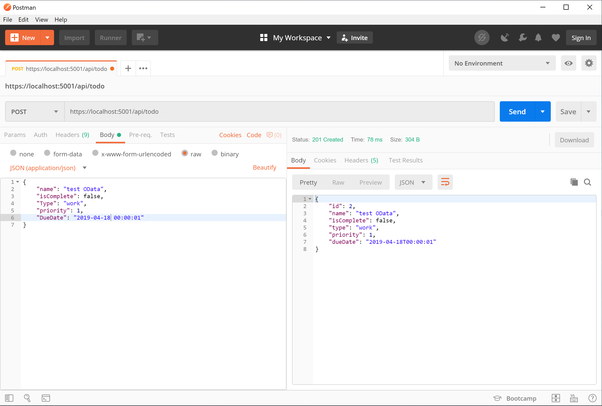

# Tutorial: Build web APIs with OData support using ASP.NET Core

By [FIVIL](https://github.com/fivil)

This tutorial demonstrates how you can add OData Query Options support on top of your existing ASP.NET Core Web API.

In this tutorial, you learn how to:

> [!div class="checklist"]
> * Opening an existing project or solution.
> * Update the model class.
> * Register the required services.
> * Configure middleware.
> * Update the controller.
> * Query resources using OData.

At the end, you have a web API that can Query, filter and sort data.

## Overview

The Open Data Protocol (OData) is a data access protocol for the web. OData provides a uniform way to query and manipulate data sets through CRUD operations (create, read, update, and delete).

For this tutorial we use [to-do Web API](xref:first-web-api) as an existing Web API.

[!INCLUDE[](~/includes/net-core-prereqs-all-2.2.md)]

## Create the ASP.NET Core web API project

# [Visual Studio](#tab/visual-studio)

1. Go to **File** > **Open** > **Project/Solution**.
1. Find and select **TodoApi.csproj**, and click **Open**.
1. Visit the [NuGet Gallery: Microsoft.AspNetCore.OData](https://www.nuget.org/packages/Microsoft.AspNetCore.OData/) to determine the latest stable version of the .NET Core OData package. In the **Package Manager Console** window, navigate to the project root. Run the following command to install the .NET Core OData package:

    ```powershell
    Install-Package Microsoft.AspNetCore.OData -Version {VERSION}
    ```

# [Visual Studio Code](#tab/visual-studio-code)

1. Open a command shell
1. Navigate to **TodoApi** root Directory inside your command shell
1. Run the following command:

    ```console
    code .
    ```

    TodoApi is opened in Visual Studio Code.

1. Click **Yes** when the *Required assets to build and debug are missing from 'TodoApi'. Add them?* notification appears.
1. Visit the [NuGet Gallery: Microsoft.AspNetCore.OData](https://www.nuget.org/packages/Microsoft.AspNetCore.OData/) to determine the latest stable version of the .NET Core OData package. Open **Integrated Terminal** and navigate to the project root. Run the following command to install the .NET Core OData package:

    ```console
    dotnet add TodoApi.csproj package Microsoft.AspNetCore.OData -Version {VERSION}
    ```

# [Visual Studio for Mac](#tab/visual-studio-mac)

1. Go to **File** > **Open**.
1. Find and select **TodoApi.csproj**, and click **Open**.
1. In the **Solution** pad, right-click the project's **Dependencies** node and select **Add Packages**.
1. Enter *Microsoft.AspNetCore.OData* in the search box, select the *Microsoft.AspNetCore.OData* package, and click **Add Package**.
1. Click the **Accept** button in the **License Acceptance** dialog.

---

## Update the model class

Open the model class *TodoItem.cs* under *Models* directory.

The model class contains these properties:

 [!code-csharp[](first-odata-api/samples/2.2/TodoApi/Models/TodoItem.cs?name=OldProps)]

However for better demonstration of OData capabilities, you should add below properties as well:

 [!code-csharp[](first-odata-api/samples/2.2/TodoApi/Models/TodoItem.cs?name=NewProps)]

Finally your *TodoItem.cs* class should look like:

 [!code-csharp[](first-odata-api/samples/2.2/TodoApi/Models/TodoItem.cs)]

> [!TIP]
> Since this tutorial uses **InMemoryDatabase**  you dont need to add migrations, however if you want to use other type of database providers such as **SqlServer** you must migrate your database. for more information about migrations visit: @data/ef-mvc/migrations

## Register the required services

In ASP.NET Core you should register OData service inside [dependency injection (DI)](xref:fundamentals/dependency-injection) container.

Update the `ConfigureServices` method in *Startup.cs* with the following highlighted code:

 [!code-csharp[](first-odata-api/samples/2.2/TodoApi/Startup.cs?highlight=6&name=snippet_dic)]

You should also add the *Microsoft.AspNet.OData.Extensions* Directive to your *Startup.cs*:

```csharp
using Microsoft.AspNet.OData.Extensions;
```

## Configure middleware

OData can preform sorting, filtering, querying related data and ect. You can enable/disable each of these capabilities using a middleware.

Update the `Configure` method in *Startup.cs* with the following highlighted code:

 [!code-csharp[](first-odata-api/samples/2.2/TodoApi/Startup.cs?highlight=17-21&name=snippet_configure)]

Finally your *Startup.cs* class should look like:

[!code-csharp[](first-odata-api/samples/2.2/TodoApi/Startup.cs?highlight=9,30,52-56)]

## Update the controller

Update *TodoController.cs* under *Controllers* directory, add `[EnableQuery()]` attribute:

[!code-csharp[](first-odata-api/samples/2.2/TodoApi/Controllers/TodoController.cs?highlight=9,37-41)]

> [!TIP]
> Returning `IQueryable` or `ActionResult<IQueryable>` enables **OData** to translate your queries to **SQL** queries using *ef core* capabilities, you may also return other types such as `IEnumerable` which makes **OData** to preform queries inside your app.

## Query resources using OData

First send some data to your web API:

> [!TIP]
> You can use Postman to send data, for more information visit: [How to use Postman](xref:tutorials/first-web-api#test-the-getTodoItems-method)



Post the entire data set below using Postman, each at a time

```json
{
    "name": "test OData",
    "isComplete": false,
    "Type": "work",
    "priority": 1,
    "DueDate": "2019-04-18 00:00:01"
},
{
    "name": "test 2",
    "isComplete": true,
    "Type": "shopping",
    "priority": 2,
    "DueDate": "2019-04-18 08:00:01"
},
{
    "name": "test 3",
    "isComplete": true,
    "Type": "work",
    "priority": 1,
    "DueDate": "2019-04-18 09:00:01"
},
{
    "name": "test 4",
    "isComplete": false,
    "Type": "shopping",
    "priority": 3,
    "DueDate": "2019-04-18 12:00:01"
},
{
    "name": "test 5",
    "isComplete": false,
    "Type": "work",
    "priority": 2,
    "DueDate": "2019-04-18 15:00:01"
}
```


>[!div class="step-by-step"]
>[Previous](./first-web-api.md)