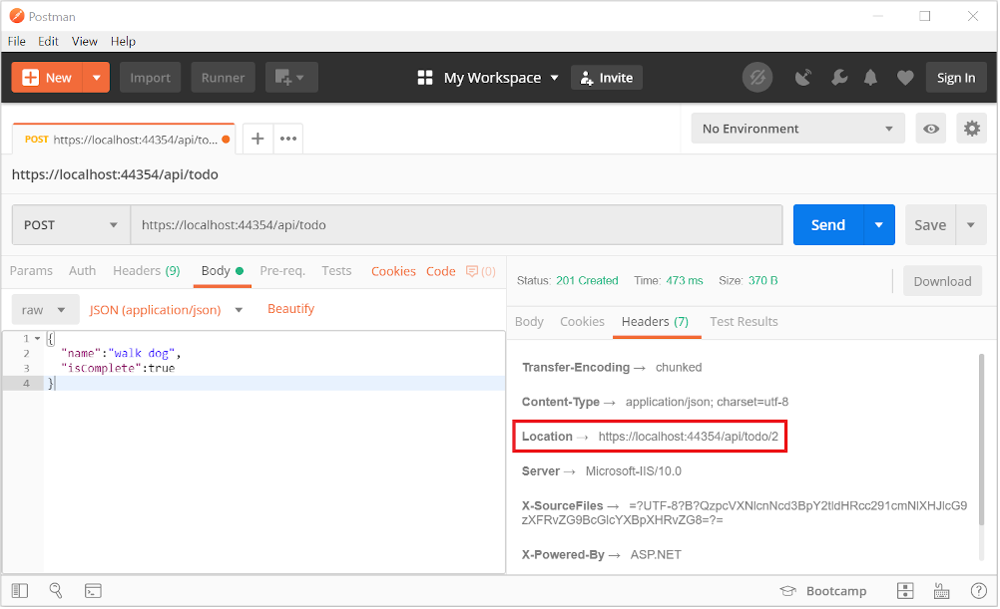

# Create a Web API with ASP.NET Core and Visual Studio for Mac

By [Rick Anderson](https://twitter.com/RickAndMSFT) and [Mike Wasson](https://github.com/mikewasson)

In this tutorial, build a web API for managing a list of "to-do" items. The UI isn't constructed.

There are three versions of this tutorial:

* macOS: Web API with Visual Studio for Mac (This tutorial)
* Windows: [Web API with Visual Studio for Windows](xref:tutorials/first-web-api)
* macOS, Linux, Windows: [Web API with Visual Studio Code](xref:tutorials/web-api-vsc)

<!-- WARNING: The code AND images in this doc are used by uid: tutorials/web-api-vsc, tutorials/first-web-api-mac and tutorials/first-web-api. If you change any code/images in this tutorial, update uid: tutorials/web-api-vsc -->

[!INCLUDE[template files](../includes/webApi/intro.md)]

See [Introduction to ASP.NET Core MVC on macOS or Linux](xref:tutorials/first-mvc-app-xplat/index) for an example that uses a persistent database.

## Prerequisites

[!INCLUDE[](~/includes/net-core-prereqs-macos.md)]

## Create the project

From Visual Studio, select **File** > **New Solution**.


Select **.NET Core App** > **ASP.NET Core Web API** > **Next**.


Enter *TodoApi* for the **Project Name**, and then click **Create**.


### Launch the app

In Visual Studio, select **Run** > **Start With Debugging** to launch the app. Visual Studio launches a browser and navigates to `http://localhost:5000`. You get an HTTP 404 (Not Found) error. Change the URL to `http://localhost:<port>/api/values`. The `ValuesController` data is displayed:

```json
["value1","value2"]
```

### Add support for Entity Framework Core

Install the [Entity Framework Core InMemory](/ef/core/providers/in-memory/) database provider. This database provider allows Entity Framework Core to be used with an in-memory database.

* From the **Project** menu, select **Add NuGet Packages**.

  * Alternatively, you can right-click **Dependencies**, and then select **Add Packages**.

* Enter `EntityFrameworkCore.InMemory` in the search box.
* Select `Microsoft.EntityFrameworkCore.InMemory`, and then select **Add Package**.

### Add a model class

A model is an object representing the data in your app. In this case, the only model is a to-do item.

In Solution Explorer, right-click the project. Select **Add** > **New Folder**. Name the folder *Models*.


> [!NOTE]
> You can put model classes anywhere in your project, but the *Models* folder is used by convention.

Right-click the *Models* folder, and select **Add** > **New File** > **General** > **Empty Class**. Name the class *TodoItem*, and then click **New**.

Replace the generated code with:

[!code-csharp[](first-web-api/samples/2.0/TodoApi/Models/TodoItem.cs)]

The database generates the `Id` when a `TodoItem` is created.

### Create the database context

The *database context* is the main class that coordinates Entity Framework functionality for a given data model. You create this class by deriving from the `Microsoft.EntityFrameworkCore.DbContext` class.

Add a `TodoContext` class to the *Models* folder.

[!code-csharp[](first-web-api/samples/2.0/TodoApi/Models/TodoContext.cs)]

[!INCLUDE[Register the database context](../includes/webApi/register_dbContext.md)]

## Add a controller

In Solution Explorer, in the *Controllers* folder, add the class `TodoController`.

Replace the generated code with the following:

[!INCLUDE[code and get todo items](../includes/webApi/getTodoItems.md)]

### Launch the app

In Visual Studio, select **Run** > **Start With Debugging** to launch the app. Visual Studio launches a browser and navigates to `http://localhost:<port>`, where `<port>` is a randomly chosen port number. You get an HTTP 404 (Not Found) error. Change the URL to `http://localhost:<port>/api/values`. The `ValuesController` data is displayed:

```json
["value1","value2"]
```

Navigate to the `Todo` controller at `http://localhost:<port>/api/todo`. The following JSON is returned:

```json
[{"key":1,"name":"Item1","isComplete":false}]
```

## Implement the other CRUD operations

We'll add `Create`, `Update`, and `Delete` methods to the controller. These methods are variations on a theme, so I'll just show the code and highlight the main differences. Build the project after adding or changing code.

### Create

::: moniker range="<= aspnetcore-2.0"
[!code-csharp[](first-web-api/samples/2.0/TodoApi/Controllers/TodoController.cs?name=snippet_Create)]

The preceding method responds to an HTTP POST, as indicated by the [[HttpPost]](/dotnet/api/microsoft.aspnetcore.mvc.httppostattribute) attribute. The [[FromBody]](/dotnet/api/microsoft.aspnetcore.mvc.frombodyattribute) attribute tells MVC to get the value of the to-do item from the body of the HTTP request.
::: moniker-end
::: moniker range=">= aspnetcore-2.1"
[!code-csharp[](first-web-api/samples/2.1/TodoApi/Controllers/TodoController.cs?name=snippet_Create)]

The preceding method responds to an HTTP POST, as indicated by the [[HttpPost]](/dotnet/api/microsoft.aspnetcore.mvc.httppostattribute) attribute. MVC gets the value of the to-do item from the body of the HTTP request.
::: moniker-end

The `CreatedAtRoute` method returns a 201 response. It's the standard response for an HTTP POST method that creates a new resource on the server. `CreatedAtRoute` also adds a Location header to the response. The Location header specifies the URI of the newly created to-do item. See [10.2.2 201 Created](https://www.w3.org/Protocols/rfc2616/rfc2616-sec10.html).

### Use Postman to send a Create request

* Start the app (**Run** > **Start With Debugging**).
* Open Postman.


* Update the port number in the localhost URL.
* Set the HTTP method to *POST*.
* Click the **Body** tab.
* Select the **raw** radio button.
* Set the type to *JSON (application/json)*.
* Enter a request body with a to-do item resembling the following JSON:

```json
{
  "name":"walk dog",
  "isComplete":true
}
```

* Click the **Send** button.

::: moniker range=">= aspnetcore-2.1"
> [!TIP]
> If no response displays after clicking **Send**, disable the **SSL certification verification** option. This is found under **File** > **Settings**. Click the **Send** button again after disabling the setting.
::: moniker-end

Click the **Headers** tab in the **Response** pane and copy the **Location** header value:



You can use the Location header URI to access the resource you created. The `Create` method returns [CreatedAtRoute](/dotnet/api/microsoft.aspnetcore.mvc.controllerbase.createdatroute#Microsoft_AspNetCore_Mvc_ControllerBase_CreatedAtRoute_System_String_System_Object_System_Object_). The first parameter passed to `CreatedAtRoute` represents the named route to use for generating the URL. Recall that the `GetById` method created the `"GetTodo"` named route:

```csharp
[HttpGet("{id}", Name = "GetTodo")]
```

### Update

::: moniker range="<= aspnetcore-2.0"
[!code-csharp[](first-web-api/samples/2.0/TodoApi/Controllers/TodoController.cs?name=snippet_Update)]
::: moniker-end
::: moniker range=">= aspnetcore-2.1"
[!code-csharp[](first-web-api/samples/2.1/TodoApi/Controllers/TodoController.cs?name=snippet_Update)]
::: moniker-end

`Update` is similar to `Create`, but uses HTTP PUT. The response is [204 (No Content)](https://www.w3.org/Protocols/rfc2616/rfc2616-sec9.html). According to the HTTP spec, a PUT request requires the client to send the entire updated entity, not just the deltas. To support partial updates, use HTTP PATCH.

```json
{
  "key": 1,
  "name": "walk dog",
  "isComplete": true
}
```


### Delete

[!code-csharp[](first-web-api/samples/2.0/TodoApi/Controllers/TodoController.cs?name=snippet_Delete)]

The response is [204 (No Content)](https://www.w3.org/Protocols/rfc2616/rfc2616-sec9.html).


[!INCLUDE[jQuery](../includes/webApi/add-jquery.md)]

[!INCLUDE[next steps](../includes/webApi/next.md)]
