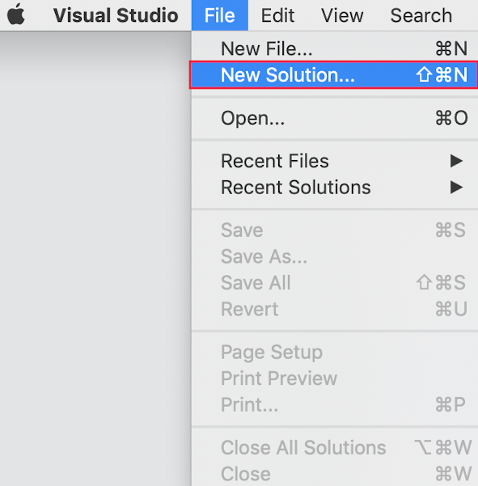
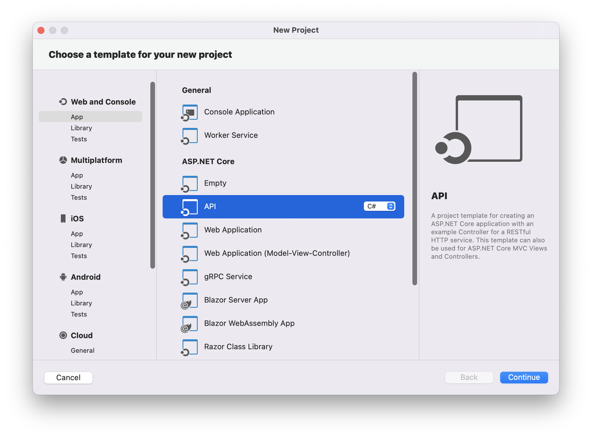
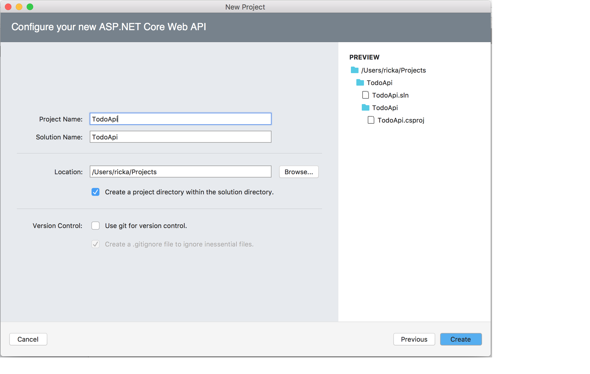
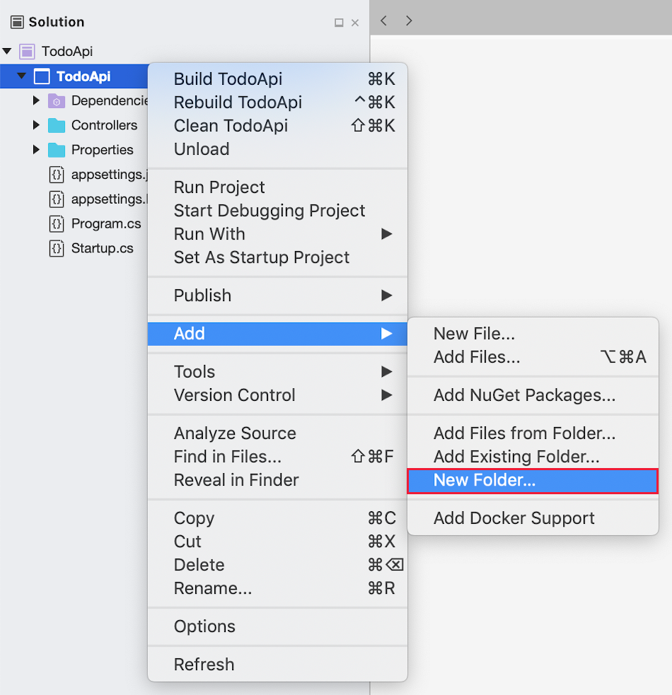
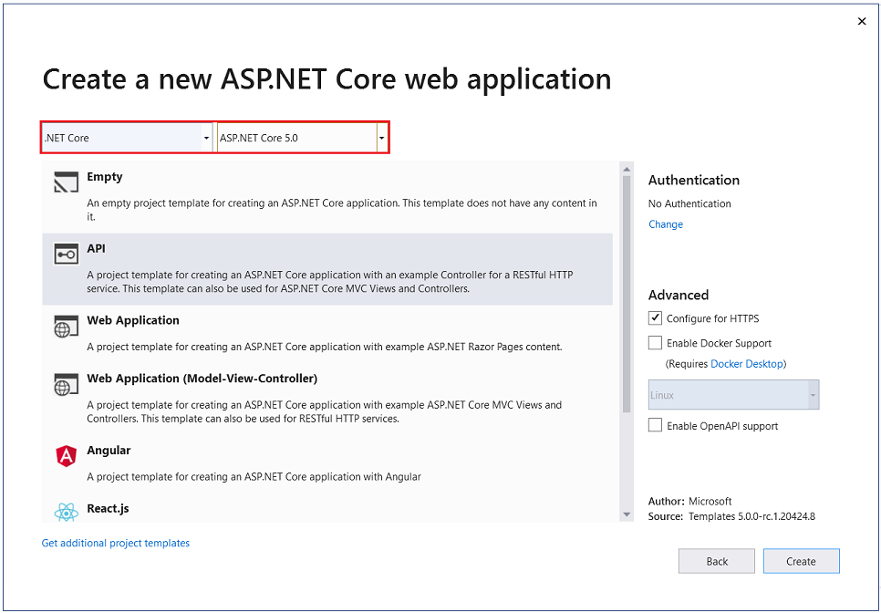
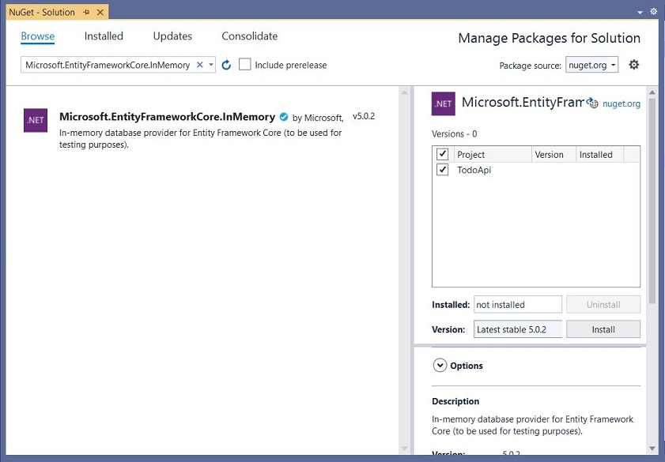
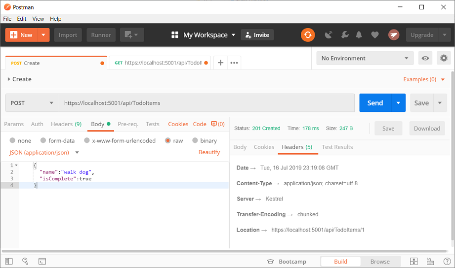
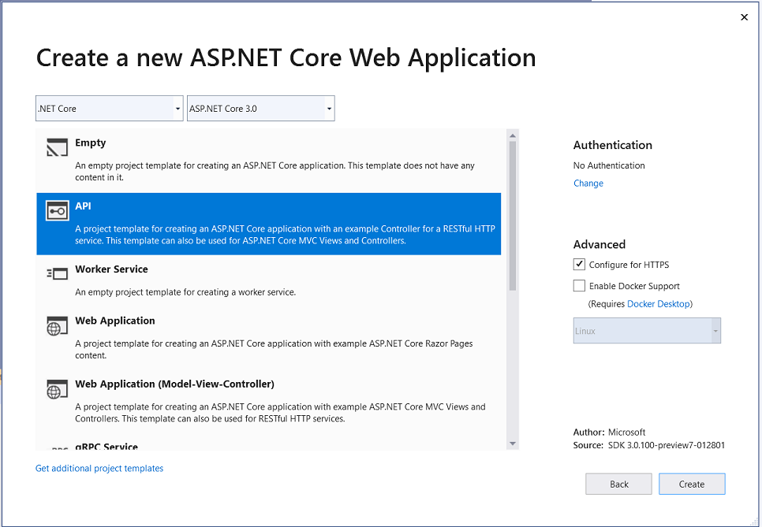
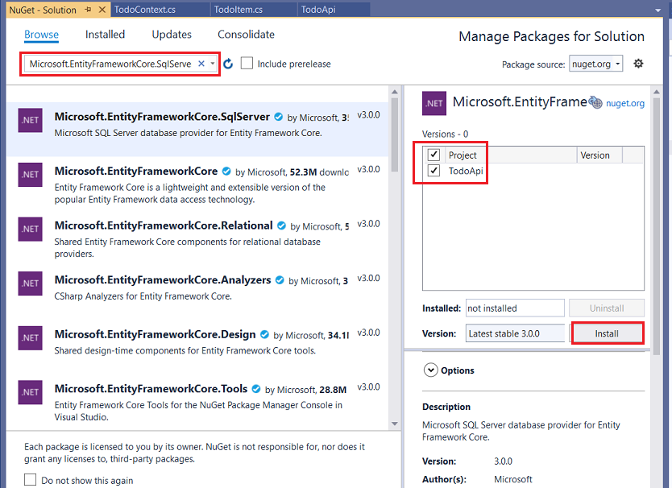

# Tutorial: Create a web API with ASP.NET Core

By [Rick Anderson](https://twitter.com/RickAndMSFT) and [Kirk Larkin](https://twitter.com/serpent5)

This tutorial teaches the basics of building a web API with ASP.NET Core.

:::moniker range=">= aspnetcore-6.0"

In this tutorial, you learn how to:

> [!div class="checklist"]
> * Create a web API project.
> * Add a model class and a database context.
> * Scaffold a controller with CRUD methods.
> * Configure routing, URL paths, and return values.
> * Call the web API with Postman.

At the end, you have a web API that can manage "to-do" items stored in a database.

## Overview

This tutorial creates the following API:

|API | Description | Request body | Response body |
|--- | ---- | ---- | ---- |
|`GET /api/todoitems` | Get all to-do items | None | Array of to-do items|
|`GET /api/todoitems/{id}` | Get an item by ID | None | To-do item|
|`POST /api/todoitems` | Add a new item | To-do item | To-do item |
|`PUT /api/todoitems/{id}` | Update an existing item &nbsp; | To-do item | None |
|`DELETE /api/todoitems/{id}` &nbsp; &nbsp; | Delete an item &nbsp; &nbsp; | None | None|

The following diagram shows the design of the app.


## Prerequisites

# [Visual Studio](#tab/visual-studio)

[!INCLUDE[](~/includes/net-prereqs-vs-6.0.md)]

# [Visual Studio Code](#tab/visual-studio-code)

[!INCLUDE[](~/includes/net-prereqs-vsc-6.0.md)]

# [Visual Studio for Mac](#tab/visual-studio-mac)

For Visual Studio for Mac, see the .NET 5 version of this tutorial.
<!-- [!INCLUDE[](~/includes/net-core-prereqs-mac-5.0.md)] -->

---

## Create a web project

# [Visual Studio](#tab/visual-studio)

* From the **File** menu, select **New** > **Project**.
* Enter *Web API* in the search box.
* Select the **ASP.NET Core Web API** template and select **Next**.
* In the **Configure your new project dialog**, name the project *TodoApi* and select **Next**.
* In the **Additional information** dialog:
  * Confirm the **Framework** is **.NET 6.0 (Long-term support)**.
  * Confirm the checkbox for **Use controllers(uncheck to use minimal APIs)** is checked.
  * Select **Create**.

# [Visual Studio Code](#tab/visual-studio-code)

* Open the [integrated terminal](https://code.visualstudio.com/docs/editor/integrated-terminal).
* Change directories (`cd`) to the folder that will contain the project folder.
* Run the following commands:

   ```dotnetcli
   dotnet new webapi -o TodoApi
   cd TodoApi
   dotnet add package Microsoft.EntityFrameworkCore.InMemory
   code -r ../TodoApi
   ```

  These commands:

  * Create a new web API project and open it in Visual Studio Code.
  * Add a NuGet package that is needed for the next section.

* When a dialog box asks if you want to add required assets to the project, select **Yes**.

# [Visual Studio for Mac](#tab/visual-studio-mac)

For Visual Studio for Mac, see the .NET 5 version of this tutorial.

<!--
* Select **File** > **New Solution**.

  

* In Visual Studio for Mac earlier than version 8.6, select **.NET Core** > **App** > **API** > **Next**. In version 8.6 or later, select **Web and Console** > **App** > **API** > **Next**.

  

* In the **Configure the new ASP.NET Core Web API** dialog, select the latest .NET Core 5.x **Target Framework**. Select **Next**.

* Enter *TodoApi* for the **Project Name** and then select **Create**.

  

[!INCLUDE[](~/includes/mac-terminal-access.md)]

Open a command terminal in the project folder and run the following command:

   ```dotnetcli
   dotnet add package Microsoft.EntityFrameworkCore.InMemory
   ```
-->

---

[!INCLUDE[](~/includes/package-reference.md)]

### Test the project

The project template creates a `WeatherForecast` API with support for [Swagger](xref:tutorials/web-api-help-pages-using-swagger).

# [Visual Studio](#tab/visual-studio)

Press Ctrl+F5 to run without the debugger.

[!INCLUDE[](~/includes/trustCertVS.md)]

Visual Studio launches the default browser and navigates to `https://localhost:<port>/swagger/index.html`, where `<port>` is a randomly chosen port number.

# [Visual Studio Code](#tab/visual-studio-code)

[!INCLUDE[](~/includes/trustCertVSC.md)]

Run the app:

* Press Ctrl+F5.
* At the **Select environment** prompt, choose **.NET Core**.
* Select **Add Configuration** > **.NET: Launch a local .NET Core Console App**.
* In the configuration JSON:
  * Replace `<target-framework>` with `net6.0`.
  * Replace  `<project-name.dll>` with `TodoApi.dll`.
* Press Ctrl+F5.
* In the **Could not find the task 'build'** dialog, select **Configure Task**.
* Select **Create `tasks.json` file from template**.
* Select the **.NET Core** task template.
* Press Ctrl+F5.

In a browser, navigate to `https://localhost:<port>/swagger`, where `<port>` is the randomly chosen port number displayed in the output.

# [Visual Studio for Mac](#tab/visual-studio-mac)

For Visual Studio for Mac, see the .NET 5 version of this tutorial.

<!--
Select **Run** > **Start Debugging** to launch the app. Visual Studio for Mac launches a browser and navigates to `https://localhost:<port>`, where `<port>` is a randomly chosen port number. An HTTP 404 (Not Found) error is returned. Append `/swagger` to the URL (change the URL to `https://localhost:<port>/swagger`).
-->

---

The Swagger page `/swagger/index.html` is displayed. Select **GET** > **Try it out** > **Execute**. The page displays:

* The [Curl](https://curl.haxx.se/) command to test the WeatherForecast API.
* The URL to test the WeatherForecast API.
* The response code, body, and headers.
* A drop down list box with media types and the example value and schema.

If the Swagger page doesn't appear, see [this GitHub issue](https://github.com/dotnet/AspNetCore.Docs/issues/21647).

Swagger is used to generate useful documentation and help pages for web APIs. This tutorial focuses on creating a web API. For more information on Swagger, see <xref:tutorials/web-api-help-pages-using-swagger>.

Copy and paste the **Request URL** in the browser:  `https://localhost:<port>/weatherforecast`

JSON similar to the following example is returned:

```json
[
    {
        "date": "2019-07-16T19:04:05.7257911-06:00",
        "temperatureC": 52,
        "temperatureF": 125,
        "summary": "Mild"
    },
    {
        "date": "2019-07-17T19:04:05.7258461-06:00",
        "temperatureC": 36,
        "temperatureF": 96,
        "summary": "Warm"
    },
    {
        "date": "2019-07-18T19:04:05.7258467-06:00",
        "temperatureC": 39,
        "temperatureF": 102,
        "summary": "Cool"
    },
    {
        "date": "2019-07-19T19:04:05.7258471-06:00",
        "temperatureC": 10,
        "temperatureF": 49,
        "summary": "Bracing"
    },
    {
        "date": "2019-07-20T19:04:05.7258474-06:00",
        "temperatureC": -1,
        "temperatureF": 31,
        "summary": "Chilly"
    }
]
```

### Update the launchUrl

In *Properties\launchSettings.json*, update `launchUrl` from `"swagger"` to `"api/todoitems"`:

```json
"launchUrl": "api/todoitems",
```

Because Swagger will be removed, the preceding markup changes the URL that is launched to the GET method of the controller added in the following sections.

## Add a model class

A *model* is a set of classes that represent the data that the app manages. The model for this app is a single `TodoItem` class.

# [Visual Studio](#tab/visual-studio)

* In **Solution Explorer**, right-click the project. Select **Add** > **New Folder**. Name the folder *Models*.

* Right-click the *Models* folder and select **Add** > **Class**. Name the class *TodoItem* and select **Add**.

* Replace the template code with the following:

# [Visual Studio Code](#tab/visual-studio-code)

* Add a folder named *Models*.

* Add a `TodoItem.cs` file to the *Models* folder with the following code:

# [Visual Studio for Mac](#tab/visual-studio-mac)

For Visual Studio for Mac, see the .NET 5 version of this tutorial.

<!--
* Right-click the project. Select **Add** > **New Folder**. Name the folder *Models*.

  

* Right-click the *Models* folder, and select **Add** > **New File** > **General** > **Empty Class**.

* Name the class *TodoItem*, and then click **New**.

* Replace the template code with the following:
-->

---

  [!code-csharp[](first-web-api/samples/6.0/TodoApi/Models/TodoItem.cs)]

The `Id` property functions as the unique key in a relational database.

Model classes can go anywhere in the project, but the *Models* folder is used by convention.

## Add a database context

The *database context* is the main class that coordinates Entity Framework functionality for a data model. This class is created by deriving from the <xref:Microsoft.EntityFrameworkCore.DbContext?displayProperty=fullName> class.

# [Visual Studio](#tab/visual-studio)

### Add NuGet packages

* From the **Tools** menu, select **NuGet Package Manager > Manage NuGet Packages for Solution**.
* Select the **Browse** tab, and then enter `Microsoft.EntityFrameworkCore.InMemory` in the search box.
* Select `Microsoft.EntityFrameworkCore.InMemory` in the left pane.
* Select the **Project** checkbox in the right pane and then select **Install**.

## Add the TodoContext database context

* Right-click the *Models* folder and select **Add** > **Class**. Name the class *TodoContext* and click **Add**.

# [Visual Studio Code](#tab/visual-studio-code)

* Add a `TodoContext.cs` file to the *Models* folder. 

# [Visual Studio for Mac](#tab/visual-studio-mac)

For Visual Studio for Mac, see the .NET 5 version of this tutorial.

<!--
# [Visual Studio Code / Visual Studio for Mac](#tab/visual-studio-code+visual-studio-mac)

* Add a `TodoContext` class to the *Models* folder.
-->

---

* Enter the following code:

  [!code-csharp[](first-web-api/samples/6.0/TodoApi/Models/TodoContext.cs)]

## Register the database context

In ASP.NET Core, services such as the DB context must be registered with the [dependency injection (DI)](xref:fundamentals/dependency-injection) container. The container provides the service to controllers.

Update `Program.cs` with the following code:

[!code-csharp[](first-web-api/samples/6.0/TodoApi/Program.cs?highlight=1-2,10-15,23-24)]

The preceding code:

* Removes the Swagger calls.
* Removes unused `using` directives.
* Adds the database context to the DI container.
* Specifies that the database context will use an in-memory database.

## Scaffold a controller

# [Visual Studio](#tab/visual-studio)

* Right-click the *Controllers* folder.
* Select **Add** > **New Scaffolded Item**.
* Select **API Controller with actions, using Entity Framework**, and then select **Add**.
* In the **Add API Controller with actions, using Entity Framework** dialog:

  * Select **TodoItem (TodoApi.Models)** in the **Model class**.
  * Select **TodoContext (TodoApi.Models)** in the **Data context class**.
  * Select **Add**.

  If the scaffolding operation fails, select **Add** to try scaffolding a second time.

# [Visual Studio Code](#tab/visual-studio-code)
<!-- # [Visual Studio Code / Visual Studio for Mac](#tab/visual-studio-code+visual-studio-mac)-->

Make sure that all of your changes so far are saved.

Run the following commands from the project folder, that is, the `TodoApi` folder:

```dotnetcli
dotnet add package Microsoft.VisualStudio.Web.CodeGeneration.Design
dotnet add package Microsoft.EntityFrameworkCore.Design
dotnet add package Microsoft.EntityFrameworkCore.SqlServer
dotnet tool install -g dotnet-aspnet-codegenerator
dotnet aspnet-codegenerator controller -name TodoItemsController -async -api -m TodoItem -dc TodoContext -outDir Controllers
```

The preceding commands:

* Add NuGet packages required for scaffolding.
* Install the scaffolding engine (`dotnet-aspnet-codegenerator`).
* Scaffold the `TodoItemsController`.

# [Visual Studio for Mac](#tab/visual-studio-mac)

For Visual Studio for Mac, see the .NET 5 version of this tutorial.

---

The generated code:

* Marks the class with the [`[ApiController]`](xref:Microsoft.AspNetCore.Mvc.ApiControllerAttribute) attribute. This attribute indicates that the controller responds to web API requests. For information about specific behaviors that the attribute enables, see <xref:web-api/index>.
* Uses DI to inject the database context (`TodoContext`) into the controller. The database context is used in each of the [CRUD](https://wikipedia.org/wiki/Create,_read,_update_and_delete) methods in the controller.

The ASP.NET Core templates for:

* Controllers with views include `[action]` in the route template.
* API controllers don't include `[action]` in the route template.

When the `[action]` token isn't in the route template, the [action](xref:mvc/controllers/routing#action) name is excluded from the route. That is, the action's associated method name isn't used in the matching route.

## Update the PostTodoItem create method

Update the return statement in the `PostTodoItem` to use the [nameof](/dotnet/csharp/language-reference/operators/nameof) operator:

[!code-csharp[](first-web-api/samples/6.0/TodoApi/Controllers/TodoItemsController.cs?name=snippet_Create)]

The preceding code is an HTTP POST method, as indicated by the [`[HttpPost]`](xref:Microsoft.AspNetCore.Mvc.HttpPostAttribute) attribute. The method gets the value of the to-do item from the body of the HTTP request.

For more information, see [Attribute routing with Http[Verb] attributes](xref:mvc/controllers/routing#verb).

The <xref:Microsoft.AspNetCore.Mvc.ControllerBase.CreatedAtAction%2A> method:

* Returns an [HTTP 201 status code](https://developer.mozilla.org/docs/Web/HTTP/Status/201) if successful. HTTP 201 is the standard response for an HTTP POST method that creates a new resource on the server.
* Adds a [Location](https://developer.mozilla.org/docs/Web/HTTP/Headers/Location) header to the response. The `Location` header specifies the [URI](https://developer.mozilla.org/docs/Glossary/URI) of the newly created to-do item. For more information, see [10.2.2 201 Created](https://www.w3.org/Protocols/rfc2616/rfc2616-sec10.html).
* References the `GetTodoItem` action to create the `Location` header's URI. The C# `nameof` keyword is used to avoid hard-coding the action name in the `CreatedAtAction` call.

### Install http-repl

This tutorial uses [http-repl](../web-api/http-repl/index.md) to test the web API.

* Run the following command at a command prompt:

  ```dotnetcli
  dotnet tool install -g Microsoft.dotnet-httprepl
  ```

* If you don't have the .NET 6.0 SDK or runtime installed, install the [.NET 6.0 runtime](https://dotnet.microsoft.com/download/dotnet/6.0/runtime).
  
<a name="post"></a>

### Test PostTodoItem

* Press Ctrl+F5 to run the app.

* Open a new terminal window, and run the following commands. If your app uses a different port number, replace 5001 in the httprepl command with your port number.

  ```dotnetcli
  httprepl https://localhost:5001/api/todoitems
  post -h Content-Type=application/json -c "{"name":"walk dog","isComplete":true}"
  ```
  
  Here's an example of the output from the command:
  
  ```output
  HTTP/1.1 201 Created
  Content-Type: application/json; charset=utf-8
  Date: Tue, 07 Sep 2021 20:39:47 GMT
  Location: https://localhost:5001/api/TodoItems/1
  Server: Kestrel
  Transfer-Encoding: chunked
  
  {
    "id": 1,
    "name": "walk dog",
    "isComplete": true
  }
  ```
  
### Test the location header URI

To test the location header, copy and paste it into an httprepl `get` command.

The following example assumes that you're still in an httprepl session. If you ended the previous httprepl session, replace `connect` with `httprepl` in the following commands:

```dotnetcli
connect https://localhost:5001/api/todoitems/1
get
```

Here's an example of the output from the command:

```output
HTTP/1.1 200 OK
Content-Type: application/json; charset=utf-8
Date: Tue, 07 Sep 2021 20:48:10 GMT
Server: Kestrel
Transfer-Encoding: chunked

{
  "id": 1,
  "name": "walk dog",
  "isComplete": true
}
```

## Examine the GET methods

Two GET endpoints are implemented:

* `GET /api/todoitems`
* `GET /api/todoitems/{id}`

You just saw an example of the `/api/todoitems/{id}` route. Test the `/api/todoitems` route:

```dotnetcli
connect https://localhost:5001/api/todoitems
get
```

Here's an example of the output from the command:

```output
HTTP/1.1 200 OK
Content-Type: application/json; charset=utf-8
Date: Tue, 07 Sep 2021 20:59:21 GMT
Server: Kestrel
Transfer-Encoding: chunked

[
  {
    "id": 1,
    "name": "walk dog",
    "isComplete": true
  }
]
```

This time, the JSON returned is an array of one item.

This app uses an in-memory database. If the app is stopped and started, the preceding GET request will not return any data. If no data is returned, [POST](#post) data to the app.

## Routing and URL paths

The [`[HttpGet]`](xref:Microsoft.AspNetCore.Mvc.HttpGetAttribute) attribute denotes a method that responds to an HTTP GET request. The URL path for each method is constructed as follows:

* Start with the template string in the controller's `Route` attribute:

  [!code-csharp[](first-web-api/samples/6.0/TodoApi/Controllers/TodoItemsController.cs?name=snippet_Route&highlight=1)]

* Replace `[controller]` with the name of the controller, which by convention is the controller class name minus the "Controller" suffix. For this sample, the controller class name is **TodoItems**Controller, so the controller name is "TodoItems". ASP.NET Core [routing](xref:mvc/controllers/routing) is case insensitive.
* If the `[HttpGet]` attribute has a route template (for example, `[HttpGet("products")]`), append that to the path. This sample doesn't use a template. For more information, see [Attribute routing with Http[Verb] attributes](xref:mvc/controllers/routing#verb).

In the following `GetTodoItem` method, `"{id}"` is a placeholder variable for the unique identifier of the to-do item. When `GetTodoItem` is invoked, the value of `"{id}"` in the URL is provided to the method in its `id` parameter.

[!code-csharp[](first-web-api/samples/6.0/TodoApi/Controllers/TodoItemsController.cs?name=snippet_GetByID&highlight=1-2)]

## Return values

The return type of the `GetTodoItems` and `GetTodoItem` methods is [ActionResult\<T> type](xref:web-api/action-return-types#actionresultt-type). ASP.NET Core automatically serializes the object to [JSON](https://www.json.org/) and writes the JSON into the body of the response message. The response code for this return type is [200 OK](https://developer.mozilla.org/docs/Web/HTTP/Status/200), assuming there are no unhandled exceptions. Unhandled exceptions are translated into 5xx errors.

`ActionResult` return types can represent a wide range of HTTP status codes. For example, `GetTodoItem` can return two different status values:

* If no item matches the requested ID, the method returns a [404 status](https://developer.mozilla.org/docs/Web/HTTP/Status/404) <xref:Microsoft.AspNetCore.Mvc.ControllerBase.NotFound%2A> error code.
* Otherwise, the method returns 200 with a JSON response body. Returning `item` results in an HTTP 200 response.

## The PutTodoItem method

Examine the `PutTodoItem` method:

[!code-csharp[](first-web-api/samples/6.0/TodoApi/Controllers/TodoItemsController.cs?name=snippet_Update)]

`PutTodoItem` is similar to `PostTodoItem`, except it uses HTTP PUT. The response is [204 (No Content)](https://www.w3.org/Protocols/rfc2616/rfc2616-sec9.html). According to the HTTP specification, a PUT request requires the client to send the entire updated entity, not just the changes. To support partial updates, use [HTTP PATCH](xref:Microsoft.AspNetCore.Mvc.HttpPatchAttribute).

If you get an error calling `PutTodoItem` in the following section, call `GET` to ensure there's an item in the database.

### Test the PutTodoItem method

This sample uses an in-memory database that must be initialized each time the app is started. There must be an item in the database before you make a PUT call. Call GET to ensure there's an item in the database before making a PUT call.

Update the to-do item that has Id = 1 and set its name to `"feed fish"`:

```dotnetcli
connect https://localhost:5001/api/todoitems/1
put -h Content-Type=application/json -c "{"id":1,"name":"feed fish","isComplete":true}"
```

Here's an example of the output from the command:

```output
HTTP/1.1 204 No Content
Date: Tue, 07 Sep 2021 21:20:47 GMT
Server: Kestrel
```

## The DeleteTodoItem method

Examine the `DeleteTodoItem` method:

[!code-csharp[](first-web-api/samples/6.0/TodoApi/Controllers/TodoItemsController.cs?name=snippet_Delete)]

### Test the DeleteTodoItem method

Delete the to-do item that has Id = 1:

```dotnetcli
connect https://localhost:5001/api/todoitems/1
delete
```

Here's an example of the output from the command:

```output
HTTP/1.1 204 No Content
Date: Tue, 07 Sep 2021 21:43:00 GMT
Server: Kestrel
```

<a name="over-post"></a>
## Prevent over-posting

Currently the sample app exposes the entire `TodoItem` object. Production apps typically limit the data that's input and returned using a subset of the model. There are multiple reasons behind this, and security is a major one. The subset of a model is usually referred to as a Data Transfer Object (DTO), input model, or view model. **DTO** is used in this tutorial.

A DTO may be used to:

* Prevent over-posting.
* Hide properties that clients are not supposed to view.
* Omit some properties in order to reduce payload size.
* Flatten object graphs that contain nested objects. Flattened object graphs can be more convenient for clients.

To demonstrate the DTO approach, update the `TodoItem` class to include a secret field:

[!code-csharp[](first-web-api/samples/6.0/TodoApiDTO/Models/TodoItem.cs?highlight=8)]

The secret field needs to be hidden from this app, but an administrative app could choose to expose it.

Verify you can post and get the secret field.

Create a DTO model:

[!code-csharp[](first-web-api/samples/6.0/TodoApiDTO/Models/TodoItemDTO.cs)]

Update the `TodoItemsController` to use `TodoItemDTO`:

[!code-csharp[](first-web-api/samples/6.0/TodoApiDTO/Controllers/TodoItemsController.cs)]

Verify you can't post or get the secret field.

## Call the web API with JavaScript

See [Tutorial: Call an ASP.NET Core web API with JavaScript](xref:tutorials/web-api-javascript).

:::moniker-end

:::moniker range="= aspnetcore-5.0"

In this tutorial, you learn how to:

> [!div class="checklist"]
> * Create a web API project.
> * Add a model class and a database context.
> * Scaffold a controller with CRUD methods.
> * Configure routing, URL paths, and return values.
> * Call the web API with Postman.

At the end, you have a web API that can manage "to-do" items stored in a database.

## Overview

This tutorial creates the following API:

|API | Description | Request body | Response body |
|--- | ---- | ---- | ---- |
|`GET /api/todoitems` | Get all to-do items | None | Array of to-do items|
|`GET /api/todoitems/{id}` | Get an item by ID | None | To-do item|
|`POST /api/todoitems` | Add a new item | To-do item | To-do item |
|`PUT /api/todoitems/{id}` | Update an existing item &nbsp; | To-do item | None |
|`DELETE /api/todoitems/{id}` &nbsp; &nbsp; | Delete an item &nbsp; &nbsp; | None | None|

The following diagram shows the design of the app.


## Prerequisites

# [Visual Studio](#tab/visual-studio)

[!INCLUDE[](~/includes/net-core-prereqs-vs-5.0.md)]

# [Visual Studio Code](#tab/visual-studio-code)

[!INCLUDE[](~/includes/net-core-prereqs-vsc-5.0.md)]

# [Visual Studio for Mac](#tab/visual-studio-mac)

[!INCLUDE[](~/includes/net-core-prereqs-mac-5.0.md)]

---

## Create a web project

# [Visual Studio](#tab/visual-studio)

* From the **File** menu, select **New** > **Project**.
* Select the **ASP.NET Core Web API** template and click **Next**.
* Name the project *TodoApi* and click **Create**.
* In the **Create a new ASP.NET Core Web Application** dialog, confirm that **.NET Core** and **ASP.NET Core 5.0** are selected. Select the **API** template and click **Create**.



# [Visual Studio Code](#tab/visual-studio-code)

* Open the [integrated terminal](https://code.visualstudio.com/docs/editor/integrated-terminal).
* Change directories (`cd`) to the folder that will contain the project folder.
* Run the following commands:

   ```dotnetcli
   dotnet new webapi -o TodoApi
   cd TodoApi
   dotnet add package Microsoft.EntityFrameworkCore.InMemory
   code -r ../TodoApi
   ```

* When a dialog box asks if you want to add required assets to the project, select **Yes**.

  The preceding commands:

  * Creates a new web API project and opens it in Visual Studio Code.
  * Adds the NuGet packages which are required in the next section.

# [Visual Studio for Mac](#tab/visual-studio-mac)

* Select **File** > **New Solution**.

  

* In Visual Studio for Mac earlier than version 8.6, select **.NET Core** > **App** > **API** > **Next**. In version 8.6 or later, select **Web and Console** > **App** > **API** > **Next**.

  

* In the **Configure the new ASP.NET Core Web API** dialog, select the latest .NET Core 5.x **Target Framework**. Select **Next**.

* Enter *TodoApi* for the **Project Name** and then select **Create**.

  

[!INCLUDE[](~/includes/mac-terminal-access.md)]

Open a command terminal in the project folder and run the following command:

   ```dotnetcli
   dotnet add package Microsoft.EntityFrameworkCore.InMemory
   ```

---

[!INCLUDE[](~/includes/package-reference.md)]

### Test the project

The project template creates a `WeatherForecast` API with support for [Swagger](xref:tutorials/web-api-help-pages-using-swagger).

# [Visual Studio](#tab/visual-studio)

Press Ctrl+F5 to run without the debugger.

[!INCLUDE[](~/includes/trustCertVS.md)]

  Visual Studio launches:

* The IIS Express web server.
* The default browser and navigates to `https://localhost:<port>/swagger/index.html`, where `<port>` is a randomly chosen port number.

# [Visual Studio Code](#tab/visual-studio-code)

[!INCLUDE[](~/includes/trustCertVSC.md)]

Press Ctrl+F5 to run the app. In a browser, go to following URL: [https://localhost:5001/swagger](https://localhost:5001/swagger)

# [Visual Studio for Mac](#tab/visual-studio-mac)

Select **Run** > **Start Debugging** to launch the app. Visual Studio for Mac launches a browser and navigates to `https://localhost:<port>`, where `<port>` is a randomly chosen port number. An HTTP 404 (Not Found) error is returned. Append `/swagger` to the URL (change the URL to `https://localhost:<port>/swagger`).

---

The Swagger page `/swagger/index.html` is displayed. Select **GET** > **Try it out** > **Execute**. The page displays:

* The [Curl](https://curl.haxx.se/) command to test the WeatherForecast API.
* The URL to test the WeatherForecast API.
* The response code, body, and headers.
* A drop down list box with media types and the example value and schema.

If the Swagger page doesn't appear, see [this GitHub issue](https://github.com/dotnet/AspNetCore.Docs/issues/21647).

<!-- Review: Do we care the IE generates several errors. It shows the data, but with  Unrecognized response type; displaying content as text.
-->
Swagger is used to generate useful documentation and help pages for web APIs. This tutorial focuses on creating a web API. For more information on Swagger, see <xref:tutorials/web-api-help-pages-using-swagger>.

Copy and paste the **Request URL** in the browser:  `https://localhost:<port>/weatherforecast`

JSON similar to the following is returned:

```json
[
    {
        "date": "2019-07-16T19:04:05.7257911-06:00",
        "temperatureC": 52,
        "temperatureF": 125,
        "summary": "Mild"
    },
    {
        "date": "2019-07-17T19:04:05.7258461-06:00",
        "temperatureC": 36,
        "temperatureF": 96,
        "summary": "Warm"
    },
    {
        "date": "2019-07-18T19:04:05.7258467-06:00",
        "temperatureC": 39,
        "temperatureF": 102,
        "summary": "Cool"
    },
    {
        "date": "2019-07-19T19:04:05.7258471-06:00",
        "temperatureC": 10,
        "temperatureF": 49,
        "summary": "Bracing"
    },
    {
        "date": "2019-07-20T19:04:05.7258474-06:00",
        "temperatureC": -1,
        "temperatureF": 31,
        "summary": "Chilly"
    }
]
```

### Update the launchUrl

In *Properties\launchSettings.json*, update `launchUrl` from `"swagger"` to `"api/todoitems"`:

```json
"launchUrl": "api/todoitems",
```

Because Swagger will be removed, the preceding markup changes the URL that is launched to the GET method of the controller added in the following sections.

## Add a model class

A *model* is a set of classes that represent the data that the app manages. The model for this app is a single `TodoItem` class.

# [Visual Studio](#tab/visual-studio)

* In **Solution Explorer**, right-click the project. Select **Add** > **New Folder**. Name the folder *Models*.

* Right-click the *Models* folder and select **Add** > **Class**. Name the class *TodoItem* and select **Add**.

* Replace the template code with the following:

# [Visual Studio Code](#tab/visual-studio-code)

* Add a folder named *Models*.

* Add a `TodoItem` class to the *Models* folder with the following code:

# [Visual Studio for Mac](#tab/visual-studio-mac)

* Right-click the project. Select **Add** > **New Folder**. Name the folder *Models*.

  

* Right-click the *Models* folder, and select **Add** > **New File** > **General** > **Empty Class**.

* Name the class *TodoItem*, and then click **New**.

* Replace the template code with the following:

---

  [!code-csharp[](first-web-api/samples/5.x/TodoApi/Models/TodoItem.cs?name=snippet)]

The `Id` property functions as the unique key in a relational database.

Model classes can go anywhere in the project, but the *Models* folder is used by convention.

## Add a database context

The *database context* is the main class that coordinates Entity Framework functionality for a data model. This class is created by deriving from the <xref:Microsoft.EntityFrameworkCore.DbContext?displayProperty=fullName> class.

# [Visual Studio](#tab/visual-studio)

### Add NuGet packages

* From the **Tools** menu, select **NuGet Package Manager > Manage NuGet Packages for Solution**.
* Select the **Browse** tab, and then enter `Microsoft.EntityFrameworkCore.InMemory` in the search box.
* Select `Microsoft.EntityFrameworkCore.InMemory` in the left pane.
* Select the **Project** checkbox in the right pane and then select **Install**.



## Add the TodoContext database context

* Right-click the *Models* folder and select **Add** > **Class**. Name the class *TodoContext* and click **Add**.

# [Visual Studio Code / Visual Studio for Mac](#tab/visual-studio-code+visual-studio-mac)

* Add a `TodoContext` class to the *Models* folder.

---

* Enter the following code:

  [!code-csharp[](first-web-api/samples/5.x/TodoApi/Models/TodoContext.cs)]

## Register the database context

In ASP.NET Core, services such as the DB context must be registered with the [dependency injection (DI)](xref:fundamentals/dependency-injection) container. The container provides the service to controllers.

Update `Startup.cs` with the following code:

[!code-csharp[](first-web-api/samples/5.x/TodoApi/Startup.cs?highlight=7-8,25-30,38-39&name=snippet_all)]

The preceding code:

* Removes the Swagger calls.
* Removes unused `using` declarations.
* Adds the database context to the DI container.
* Specifies that the database context will use an in-memory database.

## Scaffold a controller

# [Visual Studio](#tab/visual-studio)

* Right-click the *Controllers* folder.
* Select **Add** > **New Scaffolded Item**.
* Select **API Controller with actions, using Entity Framework**, and then select **Add**.
* In the **Add API Controller with actions, using Entity Framework** dialog:

  * Select **TodoItem (TodoApi.Models)** in the **Model class**.
  * Select **TodoContext (TodoApi.Models)** in the **Data context class**.
  * Select **Add**.

# [Visual Studio Code / Visual Studio for Mac](#tab/visual-studio-code+visual-studio-mac)

Run the following commands from the project folder, `TodoApi/TodoApi`:

```dotnetcli
dotnet add package Microsoft.VisualStudio.Web.CodeGeneration.Design
dotnet add package Microsoft.EntityFrameworkCore.Design
dotnet add package Microsoft.EntityFrameworkCore.SqlServer
dotnet tool install -g dotnet-aspnet-codegenerator
dotnet aspnet-codegenerator controller -name TodoItemsController -async -api -m TodoItem -dc TodoContext -outDir Controllers
```

The preceding commands:

* Add NuGet packages required for scaffolding.
* Installs the scaffolding engine (`dotnet-aspnet-codegenerator`).
* Scaffolds the `TodoItemsController`.

---

The generated code:

* Marks the class with the [`[ApiController]`](xref:Microsoft.AspNetCore.Mvc.ApiControllerAttribute) attribute. This attribute indicates that the controller responds to web API requests. For information about specific behaviors that the attribute enables, see <xref:web-api/index>.
* Uses DI to inject the database context (`TodoContext`) into the controller. The database context is used in each of the [CRUD](https://wikipedia.org/wiki/Create,_read,_update_and_delete) methods in the controller.

The ASP.NET Core templates for:

* Controllers with views include `[action]` in the route template.
* API controllers don't include `[action]` in the route template.

When the `[action]` token isn't in the route template, the [action](xref:mvc/controllers/routing#action) name is excluded from the route. That is, the action's associated method name isn't used in the matching route.

## Update the PostTodoItem create method

Update the return statement in the `PostTodoItem` to use the [nameof](/dotnet/csharp/language-reference/operators/nameof) operator:

[!code-csharp[](first-web-api/samples/5.x/TodoApi/Controllers/TodoItemsController.cs?name=snippet_Create)]

The preceding code is an HTTP POST method, as indicated by the [`[HttpPost]`](xref:Microsoft.AspNetCore.Mvc.HttpPostAttribute) attribute. The method gets the value of the to-do item from the body of the HTTP request.

For more information, see [Attribute routing with Http[Verb] attributes](xref:mvc/controllers/routing#verb).

The <xref:Microsoft.AspNetCore.Mvc.ControllerBase.CreatedAtAction%2A> method:

* Returns an [HTTP 201 status code](https://developer.mozilla.org/docs/Web/HTTP/Status/201) if successful. HTTP 201 is the standard response for an HTTP POST method that creates a new resource on the server.
* Adds a [Location](https://developer.mozilla.org/docs/Web/HTTP/Headers/Location) header to the response. The `Location` header specifies the [URI](https://developer.mozilla.org/docs/Glossary/URI) of the newly created to-do item. For more information, see [10.2.2 201 Created](https://www.w3.org/Protocols/rfc2616/rfc2616-sec10.html).
* References the `GetTodoItem` action to create the `Location` header's URI. The C# `nameof` keyword is used to avoid hard-coding the action name in the `CreatedAtAction` call.

### Install Postman

This tutorial uses Postman to test the web API.

* Install [Postman](https://www.getpostman.com/downloads/)
* Start the web app.
* Start Postman.
* Disable **SSL certificate verification**
  * From **File** > **Settings** (**General** tab), disable **SSL certificate verification**.
    > [!WARNING]
    > Re-enable SSL certificate verification after testing the controller.

<a name="post"></a>

### Test PostTodoItem with Postman

* Create a new request.
* Set the HTTP method to `POST`.
* Set the URI to `https://localhost:<port>/api/todoitems`. For example, `https://localhost:5001/api/todoitems`.
* Select the **Body** tab.
* Select the **raw** radio button.
* Set the type to **JSON (application/json)**.
* In the request body enter JSON for a to-do item:

    ```json
    {
      "name":"walk dog",
      "isComplete":true
    }
    ```

* Select **Send**.

  

### Test the location header URI

The location header URI can be tested in the browser. Copy and paste the location header URI into the browser.

To test in Postman:

* Select the **Headers** tab in the **Response** pane.
* Copy the **Location** header value:

  

* Set the HTTP method to `GET`.
* Set the URI to `https://localhost:<port>/api/todoitems/1`. For example, `https://localhost:5001/api/todoitems/1`.
* Select **Send**.

## Examine the GET methods

Two GET endpoints are implemented:

* `GET /api/todoitems`
* `GET /api/todoitems/{id}`

Test the app by calling the two endpoints from a browser or Postman. For example:

* `https://localhost:5001/api/todoitems`
* `https://localhost:5001/api/todoitems/1`

A response similar to the following is produced by the call to `GetTodoItems`:

```json
[
  {
    "id": 1,
    "name": "Item1",
    "isComplete": false
  }
]
```

### Test Get with Postman

* Create a new request.
* Set the HTTP method to **GET**.
* Set the request URI to `https://localhost:<port>/api/todoitems`. For example, `https://localhost:5001/api/todoitems`.
* Set **Two pane view** in Postman.
* Select **Send**.

This app uses an in-memory database. If the app is stopped and started, the preceding GET request will not return any data. If no data is returned, [POST](#post) data to the app.

## Routing and URL paths

The [`[HttpGet]`](xref:Microsoft.AspNetCore.Mvc.HttpGetAttribute) attribute denotes a method that responds to an HTTP GET request. The URL path for each method is constructed as follows:

* Start with the template string in the controller's `Route` attribute:

  [!code-csharp[](first-web-api/samples/5.x/TodoApi/Controllers/TodoItemsController.cs?name=TodoController&highlight=1)]

* Replace `[controller]` with the name of the controller, which by convention is the controller class name minus the "Controller" suffix. For this sample, the controller class name is **TodoItems**Controller, so the controller name is "TodoItems". ASP.NET Core [routing](xref:mvc/controllers/routing) is case insensitive.
* If the `[HttpGet]` attribute has a route template (for example, `[HttpGet("products")]`), append that to the path. This sample doesn't use a template. For more information, see [Attribute routing with Http[Verb] attributes](xref:mvc/controllers/routing#verb).

In the following `GetTodoItem` method, `"{id}"` is a placeholder variable for the unique identifier of the to-do item. When `GetTodoItem` is invoked, the value of `"{id}"` in the URL is provided to the method in its `id` parameter.

[!code-csharp[](first-web-api/samples/3.0/TodoApi/Controllers/TodoItemsController.cs?name=snippet_GetByID&highlight=1-2)]

## Return values

The return type of the `GetTodoItems` and `GetTodoItem` methods is [ActionResult\<T> type](xref:web-api/action-return-types#actionresultt-type). ASP.NET Core automatically serializes the object to [JSON](https://www.json.org/) and writes the JSON into the body of the response message. The response code for this return type is [200 OK](https://developer.mozilla.org/docs/Web/HTTP/Status/200), assuming there are no unhandled exceptions. Unhandled exceptions are translated into 5xx errors.

`ActionResult` return types can represent a wide range of HTTP status codes. For example, `GetTodoItem` can return two different status values:

* If no item matches the requested ID, the method returns a [404 status](https://developer.mozilla.org/docs/Web/HTTP/Status/404) <xref:Microsoft.AspNetCore.Mvc.ControllerBase.NotFound%2A> error code.
* Otherwise, the method returns 200 with a JSON response body. Returning `item` results in an HTTP 200 response.

## The PutTodoItem method

Examine the `PutTodoItem` method:

[!code-csharp[](first-web-api/samples/5.x/TodoApi/Controllers/TodoItemsController.cs?name=snippet_Update)]

`PutTodoItem` is similar to `PostTodoItem`, except it uses HTTP PUT. The response is [204 (No Content)](https://www.w3.org/Protocols/rfc2616/rfc2616-sec9.html). According to the HTTP specification, a PUT request requires the client to send the entire updated entity, not just the changes. To support partial updates, use [HTTP PATCH](xref:Microsoft.AspNetCore.Mvc.HttpPatchAttribute).

If you get an error calling `PutTodoItem`, call `GET` to ensure there's an item in the database.

### Test the PutTodoItem method

This sample uses an in-memory database that must be initialized each time the app is started. There must be an item in the database before you make a PUT call. Call GET to ensure there's an item in the database before making a PUT call.

Update the to-do item that has Id = 1 and set its name to `"feed fish"`:

```json
  {
    "Id":1,
    "name":"feed fish",
    "isComplete":true
  }
```

The following image shows the Postman update:


## The DeleteTodoItem method

Examine the `DeleteTodoItem` method:

[!code-csharp[](first-web-api/samples/5.x/TodoApi/Controllers/TodoItemsController.cs?name=snippet_Delete)]

### Test the DeleteTodoItem method

Use Postman to delete a to-do item:

* Set the method to `DELETE`.
* Set the URI of the object to delete (for example `https://localhost:5001/api/todoitems/1`).
* Select **Send**.

<a name="over-post-v5"></a>

## Prevent over-posting

Currently the sample app exposes the entire `TodoItem` object. Production apps typically limit the data that's input and returned using a subset of the model. There are multiple reasons behind this and security is a major one. The subset of a model is usually referred to as a Data Transfer Object (DTO), input model, or view model. **DTO** is used in this article.

A DTO may be used to:

* Prevent over-posting.
* Hide properties that clients are not supposed to view.
* Omit some properties in order to reduce payload size.
* Flatten object graphs that contain nested objects. Flattened object graphs can be more convenient for clients.

To demonstrate the DTO approach, update the `TodoItem` class to include a secret field:

[!code-csharp[](first-web-api/samples/5.x/TodoApiDTO/Models/TodoItem.cs?name=snippet&highlight=8)]

The secret field needs to be hidden from this app, but an administrative app could choose to expose it.

Verify you can post and get the secret field.

Create a DTO model:

[!code-csharp[](first-web-api/samples/5.x/TodoApiDTO/Models/TodoItemDTO.cs?name=snippet)]

Update the `TodoItemsController` to use `TodoItemDTO`:

[!code-csharp[](first-web-api/samples/5.x/TodoApiDTO/Controllers/TodoItemsController.cs?name=snippet)]

Verify you can't post or get the secret field.

## Call the web API with JavaScript

See [Tutorial: Call an ASP.NET Core web API with JavaScript](xref:tutorials/web-api-javascript).

:::moniker-end

:::moniker range="< aspnetcore-5.0"

In this tutorial, you learn how to:

> [!div class="checklist"]
> * Create a web API project.
> * Add a model class and a database context.
> * Scaffold a controller with CRUD methods.
> * Configure routing, URL paths, and return values.
> * Call the web API with Postman.

At the end, you have a web API that can manage "to-do" items stored in a database.

## Overview

This tutorial creates the following API:

|API | Description | Request body | Response body |
|--- | ---- | ---- | ---- |
|`GET /api/todoitems` | Get all to-do items | None | Array of to-do items|
|`GET /api/todoitems/{id}` | Get an item by ID | None | To-do item|
|`POST /api/todoitems` | Add a new item | To-do item | To-do item |
|`PUT /api/todoitems/{id}` | Update an existing item &nbsp; | To-do item | None |
|`DELETE /api/todoitems/{id}` &nbsp; &nbsp; | Delete an item &nbsp; &nbsp; | None | None|

The following diagram shows the design of the app.


## Prerequisites

# [Visual Studio](#tab/visual-studio)

[!INCLUDE[](~/includes/net-core-prereqs-vs-3.1.md)]

# [Visual Studio Code](#tab/visual-studio-code)

[!INCLUDE[](~/includes/net-core-prereqs-vsc-3.1.md)]

# [Visual Studio for Mac](#tab/visual-studio-mac)

[!INCLUDE[](~/includes/net-core-prereqs-mac-3.1.md)]

---

## Create a web project

# [Visual Studio](#tab/visual-studio)

* From the **File** menu, select **New** > **Project**.
* Select the **ASP.NET Core Web Application** template and click **Next**.
* Name the project *TodoApi* and click **Create**.
* In the **Create a new ASP.NET Core Web Application** dialog, confirm that **.NET Core** and **ASP.NET Core 3.1** are selected. Select the **API** template and click **Create**.



# [Visual Studio Code](#tab/visual-studio-code)

* Open the [integrated terminal](https://code.visualstudio.com/docs/editor/integrated-terminal).
* Change directories (`cd`) to the folder that will contain the project folder.
* Run the following commands:

   ```dotnetcli
   dotnet new webapi -o TodoApi
   cd TodoApi
   dotnet add package Microsoft.EntityFrameworkCore.InMemory
   code -r ../TodoApi
   ```

* When a dialog box asks if you want to add required assets to the project, select **Yes**.

  The preceding commands:

  * Creates a new web API project and opens it in Visual Studio Code.
  * Adds the NuGet packages which are required in the next section.

# [Visual Studio for Mac](#tab/visual-studio-mac)

* Select **File** > **New Solution**.

  

* In Visual Studio for Mac earlier than version 8.6, select **.NET Core** > **App** > **API** > **Next**. In version 8.6 or later, select **Web and Console** > **App** > **API** > **Next**.

  

* In the **Configure the new ASP.NET Core Web API** dialog, select the latest .NET Core 3.x **Target Framework**. Select **Next**.

* Enter *TodoApi* for the **Project Name** and then select **Create**.

  

[!INCLUDE[](~/includes/mac-terminal-access.md)]

Open a command terminal in the project folder and run the following command:

   ```dotnetcli
   dotnet add package Microsoft.EntityFrameworkCore.InMemory
   ```

---

[!INCLUDE[](~/includes/package-reference.md)]

### Test the API

The project template creates a `WeatherForecast` API. Call the `Get` method from a browser to test the app.

# [Visual Studio](#tab/visual-studio)

Press Ctrl+F5 to run the app. Visual Studio launches a browser and navigates to `https://localhost:<port>/weatherforecast`, where `<port>` is a randomly chosen port number.

If you get a dialog box that asks if you should trust the IIS Express certificate, select **Yes**. In the **Security Warning** dialog that appears next, select **Yes**.

# [Visual Studio Code](#tab/visual-studio-code)

Press Ctrl+F5 to run the app. In a browser, go to following URL: `https://localhost:5001/weatherforecast`.

# [Visual Studio for Mac](#tab/visual-studio-mac)

Select **Run** > **Start Debugging** to launch the app. Visual Studio for Mac launches a browser and navigates to `https://localhost:<port>`, where `<port>` is a randomly chosen port number. An HTTP 404 (Not Found) error is returned. Append `/weatherforecast` to the URL (change the URL to `https://localhost:<port>/weatherforecast`).

---

JSON similar to the following is returned:

```json
[
    {
        "date": "2019-07-16T19:04:05.7257911-06:00",
        "temperatureC": 52,
        "temperatureF": 125,
        "summary": "Mild"
    },
    {
        "date": "2019-07-17T19:04:05.7258461-06:00",
        "temperatureC": 36,
        "temperatureF": 96,
        "summary": "Warm"
    },
    {
        "date": "2019-07-18T19:04:05.7258467-06:00",
        "temperatureC": 39,
        "temperatureF": 102,
        "summary": "Cool"
    },
    {
        "date": "2019-07-19T19:04:05.7258471-06:00",
        "temperatureC": 10,
        "temperatureF": 49,
        "summary": "Bracing"
    },
    {
        "date": "2019-07-20T19:04:05.7258474-06:00",
        "temperatureC": -1,
        "temperatureF": 31,
        "summary": "Chilly"
    }
]
```

## Add a model class

A *model* is a set of classes that represent the data that the app manages. The model for this app is a single `TodoItem` class.

# [Visual Studio](#tab/visual-studio)

* In **Solution Explorer**, right-click the project. Select **Add** > **New Folder**. Name the folder *Models*.

* Right-click the *Models* folder and select **Add** > **Class**. Name the class *TodoItem* and select **Add**.

* Replace the template code with the following code:

# [Visual Studio Code](#tab/visual-studio-code)

* Add a folder named *Models*.

* Add a `TodoItem` class to the *Models* folder with the following code:

# [Visual Studio for Mac](#tab/visual-studio-mac)

* Right-click the project. Select **Add** > **New Folder**. Name the folder *Models*.

  

* Right-click the *Models* folder, and select **Add** > **New File** > **General** > **Empty Class**.

* Name the class *TodoItem*, and then click **New**.

* Replace the template code with the following code:

---

  [!code-csharp[](first-web-api/samples/3.0/TodoApi/Models/TodoItem.cs?name=snippet)]

The `Id` property functions as the unique key in a relational database.

Model classes can go anywhere in the project, but the *Models* folder is used by convention.

## Add a database context

The *database context* is the main class that coordinates Entity Framework functionality for a data model. This class is created by deriving from the `Microsoft.EntityFrameworkCore.DbContext` class.

# [Visual Studio](#tab/visual-studio)

### Add NuGet packages

* From the **Tools** menu, select **NuGet Package Manager > Manage NuGet Packages for Solution**.
* Select the **Browse** tab, and then enter **Microsoft.EntityFrameworkCore.InMemory** in the search box.
* Select **Microsoft.EntityFrameworkCore.InMemory** in the left pane.
* Select the **Project** checkbox in the right pane and then select **Install**.



## Add the TodoContext database context

* Right-click the *Models* folder and select **Add** > **Class**. Name the class *TodoContext* and click **Add**.

# [Visual Studio Code / Visual Studio for Mac](#tab/visual-studio-code+visual-studio-mac)

* Add a `TodoContext` class to the *Models* folder.

---

* Enter the following code:

  [!code-csharp[](first-web-api/samples/3.0/TodoApi/Models/TodoContext.cs)]

## Register the database context

In ASP.NET Core, services such as the DB context must be registered with the [dependency injection (DI)](xref:fundamentals/dependency-injection) container. The container provides the service to controllers.

Update `Startup.cs` with the following highlighted code:

[!code-csharp[](first-web-api/samples/3.0/TodoApi/Startup.cs?highlight=7-8,23-24&name=snippet_all)]

The preceding code:

* Removes unused `using` declarations.
* Adds the database context to the DI container.
* Specifies that the database context will use an in-memory database.

## Scaffold a controller

# [Visual Studio](#tab/visual-studio)

* Right-click the *Controllers* folder.
* Select **Add** > **New Scaffolded Item**.
* Select **API Controller with actions, using Entity Framework**, and then select **Add**.
* In the **Add API Controller with actions, using Entity Framework** dialog:

  * Select **TodoItem (TodoApi.Models)** in the **Model class**.
  * Select **TodoContext (TodoApi.Models)** in the **Data context class**.
  * Select **Add**.

# [Visual Studio Code / Visual Studio for Mac](#tab/visual-studio-code+visual-studio-mac)

Run the following commands:

```dotnetcli
dotnet add package Microsoft.VisualStudio.Web.CodeGeneration.Design
dotnet add package Microsoft.EntityFrameworkCore.Design
dotnet tool install --global dotnet-aspnet-codegenerator
dotnet tool update -g Dotnet-aspnet-codegenerator
dotnet aspnet-codegenerator controller -name TodoItemsController -async -api -m TodoItem -dc TodoContext -outDir Controllers
```

The preceding commands:

* Add NuGet packages required for scaffolding.
* Installs the scaffolding engine (`dotnet-aspnet-codegenerator`).
* Scaffolds the `TodoItemsController`.

---

The generated code:

* Marks the class with the [`[ApiController]`](xref:Microsoft.AspNetCore.Mvc.ApiControllerAttribute) attribute. This attribute indicates that the controller responds to web API requests. For information about specific behaviors that the attribute enables, see <xref:web-api/index>.
* Uses DI to inject the database context (`TodoContext`) into the controller. The database context is used in each of the [CRUD](https://wikipedia.org/wiki/Create,_read,_update_and_delete) methods in the controller.

The ASP.NET Core templates for:

* Controllers with views include `[action]` in the route template.
* API controllers don't include `[action]` in the route template.

When the `[action]` token isn't in the route template, the [action](xref:mvc/controllers/routing#action) name is excluded from the route. That is, the action's associated method name isn't used in the matching route.

## Examine the PostTodoItem create method

Replace the return statement in the `PostTodoItem` to use the [nameof](/dotnet/csharp/language-reference/operators/nameof) operator:

[!code-csharp[](first-web-api/samples/3.0/TodoApi/Controllers/TodoItemsController.cs?name=snippet_Create)]

The preceding code is an HTTP POST method, as indicated by the [`[HttpPost]`](xref:Microsoft.AspNetCore.Mvc.HttpPostAttribute) attribute. The method gets the value of the to-do item from the body of the HTTP request.

For more information, see [Attribute routing with Http[Verb] attributes](xref:mvc/controllers/routing#attribute-routing-with-httpverb-attributes).

The <xref:Microsoft.AspNetCore.Mvc.ControllerBase.CreatedAtAction%2A> method:

* Returns an HTTP 201 status code if successful. HTTP 201 is the standard response for an HTTP POST method that creates a new resource on the server.
* Adds a [Location](https://developer.mozilla.org/docs/Web/HTTP/Headers/Location) header to the response. The `Location` header specifies the [URI](https://developer.mozilla.org/docs/Glossary/URI) of the newly created to-do item. For more information, see [10.2.2 201 Created](https://www.w3.org/Protocols/rfc2616/rfc2616-sec10.html).
* References the `GetTodoItem` action to create the `Location` header's URI. The C# `nameof` keyword is used to avoid hard-coding the action name in the `CreatedAtAction` call.

### Install Postman

This tutorial uses Postman to test the web API.

* Install [Postman](https://www.getpostman.com/downloads/)
* Start the web app.
* Start Postman.
* Disable **SSL certificate verification**
  * From **File** > **Settings** (**General** tab), disable **SSL certificate verification**.
    > [!WARNING]
    > Re-enable SSL certificate verification after testing the controller.

<a name="post"></a>

### Test PostTodoItem with Postman

* Create a new request.
* Set the HTTP method to `POST`.
* Set the URI to `https://localhost:<port>/api/todoitems`. For example, `https://localhost:5001/api/todoitems`.
* Select the **Body** tab.
* Select the **raw** radio button.
* Set the type to **JSON (application/json)**.
* In the request body enter JSON for a to-do item:

    ```json
    {
      "name":"walk dog",
      "isComplete":true
    }
    ```

* Select **Send**.

  

### Test the location header URI with Postman

* Select the **Headers** tab in the **Response** pane.
* Copy the **Location** header value:

  

* Set the HTTP method to `GET`.
* Set the URI to `https://localhost:<port>/api/todoitems/1`. For example, `https://localhost:5001/api/todoitems/1`.
* Select **Send**.

## Examine the GET methods

These methods implement two GET endpoints:

* `GET /api/todoitems`
* `GET /api/todoitems/{id}`

Test the app by calling the two endpoints from a browser or Postman. For example:

* `https://localhost:5001/api/todoitems`
* `https://localhost:5001/api/todoitems/1`

A response similar to the following is produced by the call to `GetTodoItems`:

```json
[
  {
    "id": 1,
    "name": "Item1",
    "isComplete": false
  }
]
```

### Test Get with Postman

* Create a new request.
* Set the HTTP method to **GET**.
* Set the request URI to `https://localhost:<port>/api/todoitems`. For example, `https://localhost:5001/api/todoitems`.
* Set **Two pane view** in Postman.
* Select **Send**.

This app uses an in-memory database. If the app is stopped and started, the preceding GET request will not return any data. If no data is returned, [POST](#post) data to the app.

## Routing and URL paths

The [`[HttpGet]`](xref:Microsoft.AspNetCore.Mvc.HttpGetAttribute) attribute denotes a method that responds to an HTTP GET request. The URL path for each method is constructed as follows:

* Start with the template string in the controller's `Route` attribute:

  [!code-csharp[](first-web-api/samples/3.0/TodoApi/Controllers/TodoItemsController.cs?name=TodoController&highlight=1)]

* Replace `[controller]` with the name of the controller, which by convention is the controller class name minus the "Controller" suffix. For this sample, the controller class name is **TodoItems**Controller, so the controller name is "TodoItems". ASP.NET Core [routing](xref:mvc/controllers/routing) is case insensitive.
* If the `[HttpGet]` attribute has a route template (for example, `[HttpGet("products")]`), append that to the path. This sample doesn't use a template. For more information, see [Attribute routing with Http[Verb] attributes](xref:mvc/controllers/routing#attribute-routing-with-httpverb-attributes).

In the following `GetTodoItem` method, `"{id}"` is a placeholder variable for the unique identifier of the to-do item. When `GetTodoItem` is invoked, the value of `"{id}"` in the URL is provided to the method in its `id` parameter.

[!code-csharp[](first-web-api/samples/3.0/TodoApi/Controllers/TodoItemsController.cs?name=snippet_GetByID&highlight=1-2)]

## Return values 

The return type of the `GetTodoItems` and `GetTodoItem` methods is [ActionResult\<T> type](xref:web-api/action-return-types#actionresultt-type). ASP.NET Core automatically serializes the object to [JSON](https://www.json.org/) and writes the JSON into the body of the response message. The response code for this return type is 200, assuming there are no unhandled exceptions. Unhandled exceptions are translated into 5xx errors.

`ActionResult` return types can represent a wide range of HTTP status codes. For example, `GetTodoItem` can return two different status values:

* If no item matches the requested ID, the method returns a 404 <xref:Microsoft.AspNetCore.Mvc.ControllerBase.NotFound%2A> error code.
* Otherwise, the method returns 200 with a JSON response body. Returning `item` results in an HTTP 200 response.

## The PutTodoItem method

Examine the `PutTodoItem` method:

[!code-csharp[](first-web-api/samples/3.0/TodoApi/Controllers/TodoItemsController.cs?name=snippet_Update)]

`PutTodoItem` is similar to `PostTodoItem`, except it uses HTTP PUT. The response is [204 (No Content)](https://www.w3.org/Protocols/rfc2616/rfc2616-sec9.html). According to the HTTP specification, a PUT request requires the client to send the entire updated entity, not just the changes. To support partial updates, use [HTTP PATCH](xref:Microsoft.AspNetCore.Mvc.HttpPatchAttribute).

If you get an error calling `PutTodoItem`, call `GET` to ensure there's an item in the database.

### Test the PutTodoItem method

This sample uses an in-memory database that must be initialized each time the app is started. There must be an item in the database before you make a PUT call. Call GET to ensure there's an item in the database before making a PUT call.

Update the to-do item that has Id = 1 and set its name to "feed fish":

```json
  {
    "id":1,
    "name":"feed fish",
    "isComplete":true
  }
```

The following image shows the Postman update:


## The DeleteTodoItem method

Examine the `DeleteTodoItem` method:

[!code-csharp[](first-web-api/samples/3.0/TodoApi/Controllers/TodoItemsController.cs?name=snippet_Delete)]

### Test the DeleteTodoItem method

Use Postman to delete a to-do item:

* Set the method to `DELETE`.
* Set the URI of the object to delete (for example `https://localhost:5001/api/todoitems/1`).
* Select **Send**.

<a name="over-post"></a>
<a name="over-post-v3"></a>

## Prevent over-posting

Currently the sample app exposes the entire `TodoItem` object. Production apps typically limit the data that's input and returned using a subset of the model. There are multiple reasons behind this and security is a major one. The subset of a model is usually referred to as a Data Transfer Object (DTO), input model, or view model. **DTO** is used in this article.

A DTO may be used to:

* Prevent over-posting.
* Hide properties that clients are not supposed to view.
* Omit some properties in order to reduce payload size.
* Flatten object graphs that contain nested objects. Flattened object graphs can be more convenient for clients.

To demonstrate the DTO approach, update the `TodoItem` class to include a secret field:

[!code-csharp[](first-web-api/samples/3.0/TodoApiDTO/Models/TodoItem.cs?name=snippet&highlight=6)]

The secret field needs to be hidden from this app, but an administrative app could choose to expose it.

Verify you can post and get the secret field.

Create a DTO model:

[!code-csharp[](first-web-api/samples/3.0/TodoApiDTO/Models/TodoItemDTO.cs?name=snippet)]

Update the `TodoItemsController` to use `TodoItemDTO`:

[!code-csharp[](first-web-api/samples/3.0/TodoApiDTO/Controllers/TodoItemsController.cs?name=snippet)]

Verify you can't post or get the secret field.

## Call the web API with JavaScript

See [Tutorial: Call an ASP.NET Core web API with JavaScript](xref:tutorials/web-api-javascript).

:::moniker-end

<a name="auth"></a>

## Add authentication support to a web API

[!INCLUDE[](~/includes/DuendeIdentityServer.md)]

## Publish to Azure

For information on deploying to Azure, see [Quickstart: Deploy an ASP.NET web app](/azure/app-service/quickstart-dotnetcore).

## Additional resources

[View or download sample code for this tutorial](https://github.com/dotnet/AspNetCore.Docs/tree/main/aspnetcore/tutorials/first-web-api/samples). See [how to download](xref:index#how-to-download-a-sample).

For more information, see the following resources:

* <xref:web-api/index>
* <xref:tutorials/web-api-help-pages-using-swagger>
* <xref:data/ef-rp/intro>
* <xref:mvc/controllers/routing>
* <xref:web-api/action-return-types>
* <xref:host-and-deploy/azure-apps/index>
* <xref:host-and-deploy/index>
* [Microsoft Learn: Create a web API with ASP.NET Core](/learn/modules/build-web-api-aspnet-core/)
