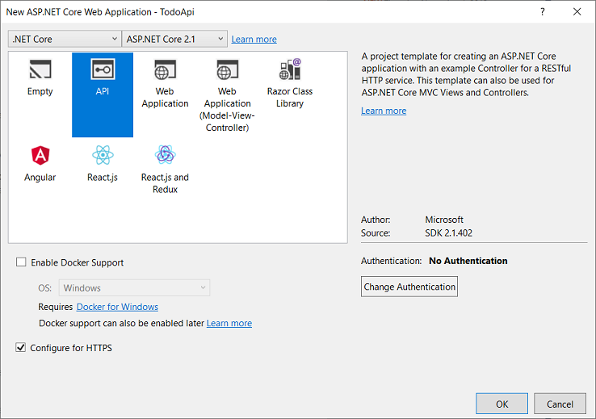

# Tutorial: Create a web api with ASP.NET Core

By [Rick Anderson](https://twitter.com/RickAndMSFT) and [Mike Wasson](https://github.com/mikewasson)

This tutorial teaches the basics of building a web API to manage a list of "to-do" items. A user interface (UI) isn't created. You learn how to:

> [!div class="checklist"]
> * Create a web api project.
> * Add a controller.
> * Add code to get "to-do" items.
> * Create other CRUD operations.
> * Call the web api with jQuery.

At the end, you have a web API that can manage "to-do" items.

## Overview

This tutorial creates the following API:

|API | Description | Request body | Response body |
|--- | ---- | ---- | ---- |
|GET /api/todo | Get all to-do items | None | Array of to-do items|
|GET /api/todo/{id} | Get an item by ID | None | To-do item|
|POST /api/todo | Add a new item | To-do item | To-do item |
|PUT /api/todo/{id} | Update an existing item &nbsp; | To-do item | None |
|DELETE /api/todo/{id} &nbsp; &nbsp; | Delete an item &nbsp; &nbsp; | None | None|

The following diagram shows the basic design of the app.


* The client is whatever consumes the web api (mobile app, browser, etc.). This tutorial doesn't create a client. [Postman](https://www.getpostman.com/) or [curl](https://curl.haxx.se/docs/manpage.html) is used as the client to test the app.

* A *model* is an object that represents the data in the app. In this case, the only model is a to-do item. Models are represented as C# classes, also known as **P**lain **O**ld **C**LR **O**bject (POCOs).
* A *controller* is an object that handles HTTP requests and creates the HTTP response.
* The app doesn't use a persistent database, it stores to-do items in an in-memory database.

## Prerequisites

::: moniker range="= aspnetcore-2.2"
[!INCLUDE[](~/includes/net-core-prereqs-all-2.2.md)]

::: moniker-end
::: moniker range="= aspnetcore-2.1"
[!INCLUDE[](~/includes/net-core-prereqs-all-2.1.md)]

::: moniker-end

## Create a web project

# [Visual Studio](#tab/visual-studio)

* From the **File** menu, select **New** > **Project**.
* Select the **ASP.NET Core Web Application** template. Name the project *TodoApi* and click **OK**.
* In the **New ASP.NET Core Web Application - TodoApi** dialog, choose the ASP.NET Core version. Select the **API** template and click **OK**. Do **not** select **Enable Docker Support**.

::: moniker range="= aspnetcore-2.2"


::: moniker-end
::: moniker range="= aspnetcore-2.1"


::: moniker-end

# [Visual Studio Code](#tab/visual-studio-code)

* Open the [integrated terminal](https://code.visualstudio.com/docs/editor/integrated-terminal).
* Change directories (`cd`) to a folder which will contain the project.
* Run the following command:

   ```console
   dotnet new webapi -o TodoApi
   code -r TodoApi
   ```

  * A dialog box appears with **Required assets to build and debug are missing from 'TodoApi'. Add them?**
  * Select **Yes**
  * `dotnet new webapi -o TodoApi`: creates a new web api project in the *TodoApi* folder.
  * `code -r TodoApi`: Loads the *TodoApi.csproj* project file.

# [Visual Studio for Mac](#tab/visual-studio-mac)

Select **File** > **New Solution**.


Select **.NET Core App** > **ASP.NET Core web api** > **Next**.


Enter *TodoApi* for the **Project Name** > **Create**.


---

### Launch the app

# [Visual Studio](#tab/visual-studio)

Press CTRL+F5 to launch the app. Visual Studio launches a browser and navigates to `https://localhost:<port>/api/values`, where `<port>` is a randomly chosen port number.

# [Visual Studio Code](#tab/visual-studio-code)

Press CTRL+F5 to launch the app. Navigate to the `Values` controller at [https://localhost:5001/api/values](https://localhost:5001/api/values).

# [Visual Studio for Mac](#tab/visual-studio-mac)

Select **Run** > **Start With Debugging** to launch the app. Visual Studio for Mac  launches a browser and navigates to `https://localhost:<port>`, where `<port>` is a randomly chosen port number. An HTTP 404 (Not Found) error is returned. Append `/api/values` to the URI (change the URI to `https://localhost:<port>/api/values`).

---

The following JSON is returned:

```json
["value1","value2"]
```

### Add a model class

A model is an object representing the data in the app. In this case, the only model is a to-do item.

# [Visual Studio](#tab/visual-studio)

Right-click the project. Select **Add** > **New Folder**. Name the folder *Models*.

Right-click the *Models* folder and select **Add** > **Class**. Name the class *TodoItem* and click **Add**.

Update the `TodoItem` class with the following code:

# [Visual Studio Code](#tab/visual-studio-code)

Add a folder named *Models* for the model classes.

Add a `TodoItem` class to the *Models* folder with the following code:

# [Visual Studio for Mac](#tab/visual-studio-mac)

Right-click the project. Select **Add** > **New Folder**. Name the folder *Models*.


Right-click the *Models* folder, and select **Add** > **New File** > **General** > **Empty Class**. Name the class *TodoItem*, and then click **New**.

Update the `TodoItem` class with the following code:

---

[!code-csharp[](first-web-api/samples/2.2/TodoApi/Models/TodoItem.cs)]

Model classes can go anywhere in the project, but the *Models* folder is used by convention.

The database generates the `Id` when a `TodoItem` is created.

### Create the database context

The *database context* is the main class that coordinates Entity Framework functionality for a given data model. This class is created by deriving from the `Microsoft.EntityFrameworkCore.DbContext` class.

# [Visual Studio](#tab/visual-studio)

Right-click the *Models* folder and select **Add** > **Class**. Name the class *TodoContext* and click **Add**.

# [Visual Studio Code](#tab/visual-studio-code)

Add a `TodoContext` class to the *Models* folder.

# [Visual Studio for Mac](#tab/visual-studio-mac)

Add a `TodoContext` class in the *Models* folder:

---

Replace the class with the following code:

[!code-csharp[](first-web-api/samples/2.2/TodoApi/Models/TodoContext.cs)]

## Register the database context

In this step, the database context is registered with the [dependency injection](xref:fundamentals/dependency-injection) container. Services (such as the DB context) that are registered with the dependency injection (DI) container are available to the controllers.

Register the DB context with the service container using the built-in support for [dependency injection](xref:fundamentals/dependency-injection). Update *Startup.cs* with the following highlighted code:

::: moniker range="= aspnetcore-2.2"
[!code-csharp[](first-web-api/samples/2.2/TodoApi/Startup1.cs?highlight=5,8,25-26&name=snippet_all)]
::: moniker-end
::: moniker range="= aspnetcore-2.1"
[!code-csharp[](first-web-api/samples/2.1/TodoApi/Startup.cs?highlight=7-8,25-26)]

::: moniker-end

The preceding code:

* Removes unused `using` declarations.
* Specifies an in-memory database is injected into the service container.

### Add a controller

# [Visual Studio](#tab/visual-studio)

* Right-click the *Controllers* folder.
* Select **Add** > **New Item**.
* In the **Add New Item** dialog, select the **API Controller Class** template.
* Name the class *TodoController*, and click **Add**.


# [Visual Studio Code](#tab/visual-studio-code)

In the *Controllers* folder, create a class named `TodoController`.

# [Visual Studio for Mac](#tab/visual-studio-mac)

In **Solution Explorer**, in the *Controllers* folder, add the class `TodoController`.

---

Replace the `TodoController` class with the following code:

[!code-csharp[](first-web-api/samples/2.2/TodoApi/Controllers/TodoController2.cs?name=snippet_todo1)]

The preceding code:

* Defines an API controller class without methods.
* Creates a new Todo item when `TodoItems` is empty. You won't be able to delete all the Todo items because the constructor creates a new one if `TodoItems` is empty.

In the next sections, methods are added to implement the API. The class is annotated with an [`[ApiController]`](/dotnet/api/microsoft.aspnetcore.mvc.apicontrollerattribute) attribute to:

* Mark the class is used to serve HTTP API responses.
* Enable the class to target conventions, filters, and other behaviors.

For information, see [Annotation with ApiController attribute](xref:web-api/index#annotation-with-apicontroller-attribute).

The controller's constructor uses DI to inject the database context (`TodoContext`) into the controller. The database context is used in each of the [CRUD](https://wikipedia.org/wiki/Create,_read,_update_and_delete) methods in the controller. The constructor adds an item to the in-memory database if one doesn't exist.

## Get to-do items

To get to-do items, add the following methods to the `TodoController` class:

[!code-csharp[](first-web-api/samples/2.2/TodoApi/Controllers/TodoController.cs?name=snippet_GetAll)]

These methods implement the two GET endpoints:

* `GET /api/todo`
* `GET /api/todo/{id}`

Test the app by calling the two endpoints from a browser. For example:

* `https://localhost:5001/api/todo`
* `https://localhost:5001/api/todo/1`

The following HTTP response is produced with the preceding call to `GetAll`:

```json
[
  {
    "id": 1,
    "name": "Item1",
    "isComplete": false
  }
]
```

Later in the tutorial, instructions are provided to view the HTTP response with [Postman](https://www.getpostman.com/) or [curl](https://curl.haxx.se/docs/manpage.html).

### Routing and URL paths

The [`[HttpGet]`](/dotnet/api/microsoft.aspnetcore.mvc.httpgetattribute) attribute denotes a method that responds to an HTTP GET request. The URL path for each method is constructed as follows:

* Take the template string in the controller's `Route` attribute:

[!code-csharp[](first-web-api/samples/2.2/TodoApi/Controllers/TodoController.cs?name=TodoController&highlight=3)]

* Replace `[controller]` with the name of the controller, which by convention is the controller class name minus the "Controller" suffix. For this sample, the controller class name is **Todo**Controller and the root name is "todo". ASP.NET Core [routing](xref:mvc/controllers/routing) is case insensitive.
* If the `[HttpGet]` attribute has a route template (such as `[HttpGet("/products")]`, append that to the path. This sample doesn't use a template. For more information, see [Attribute routing with Http[Verb] attributes](xref:mvc/controllers/routing#attribute-routing-with-httpverb-attributes).

In the following `GetById` method, `"{id}"` is a placeholder variable for the unique identifier of the to-do item. When `GetById` is invoked, it assigns the value of `"{id}"` in the URL to the method's `id` parameter.

[!code-csharp[](first-web-api/samples/2.2/TodoApi/Controllers/TodoController.cs?name=snippet_GetByID&highlight=1-2)]

`Name = "GetTodo"` creates a named route. Named routes:

* Enable the app to create an HTTP link using the route name.
* Are explained later in the tutorial.

### Return values

The `GetAll` method returns an [ActionResult\<T> type](xref:web-api/action-return-types#actionresultt-type). MVC automatically serializes the object to [JSON](https://www.json.org/) and writes the JSON into the body of the response message. The response code for this method is 200, assuming there are no unhandled exceptions. Unhandled exceptions are translated into 5xx errors.

The `GetById` method returns `ActionResult<TodoItem>` The `ActionResult<T>` and `ActionResult` return types represents a wide range of return types. `GetById` has two different return types:

* If no item matches the requested ID, the method returns a 404 error. Returning [NotFound](/dotnet/api/microsoft.aspnetcore.mvc.controllerbase.notfound) returns an HTTP 404 response.
* Otherwise, the method returns 200 with a JSON response body. Returning `item` results in an HTTP 200 response.

## Work with Postman

This tutorial uses Postman to test the web api app.

* Install [Postman](https://www.getpostman.com/apps)
* Start the web app.
* Start Postman.
* Disable **SSL certificate verification**
  
  * From  **File > Settings** (**General* tab), disable **SSL certificate verification**.
  * > [!WARNING]
    > Re-enable SSL certificate verification after testing the controller.

* Create a new request.
* Set the HTTP method to **GET**.
* Set the URI to `https://localhost:<port>/api/todo`. For example, `https://localhost:5001/api/todo`.
* Set **Two pane view** in Postman.
* Select **Send**.


## Create CRUD methods

In the following sections, `Create`, `Update`, and `Delete` methods are added to the controller.

### Create

Add the following `Create` method:

[!code-csharp[](first-web-api/samples/2.2/TodoApi/Controllers/TodoController.cs?name=snippet_Create)]

The preceding code is an HTTP POST method, as indicated by the [[HttpPost]](/dotnet/api/microsoft.aspnetcore.mvc.httppostattribute) attribute. MVC gets the value of the to-do item from the body of the HTTP request.

The `CreatedAtRoute` method:

* Returns a 201 response. HTTP 201 is the standard response for an HTTP POST method that creates a new resource on the server.
* Adds a Location header to the response. The Location header specifies the URI of the newly created to-do item. For more information, see [10.2.2 201 Created](https://www.w3.org/Protocols/rfc2616/rfc2616-sec10.html).
* Uses the "GetTodo" named route to create the URL. The "GetTodo" named route is defined in `GetById`:

[!code-csharp[](first-web-api/samples/2.2/TodoApi/Controllers/TodoController.cs?name=snippet_GetByID&highlight=1-2)]

### Use Postman to send a Create request

* Set the HTTP method to `POST`.
* Select the **Body** tab.
* Select the **raw** radio button.
* Set the type to *JSON (application/json)*.
* Enter a request body with a to-do item:

    ```json
    {
      "name":"walk dog",
      "isComplete":true
    }
    ```

* Select **Send**.


* Select the **Headers** tab in the **Response** pane.
* Copy the **Location** header value:


Test the location header URI:

* Set the method to GET.
* Paste the URI (for example, `https://localhost:5001/api/Todo/2`)
* Select **Send**.

### Update

Add the following `Update` method:

[!code-csharp[](first-web-api/samples/2.2/TodoApi/Controllers/TodoController.cs?name=snippet_Update)]

`Update` is similar to `Create`, except it uses HTTP PUT. The response is [204 (No Content)](https://www.w3.org/Protocols/rfc2616/rfc2616-sec9.html). According to the HTTP specification, a PUT request requires the client to send the entire updated entity, not just the deltas. To support partial updates, use HTTP PATCH.

Update the to-do item's name to "feed fish":

```json
  {
    "name":"feed fish",
    "isComplete":true
  }
```

The following image shows the Postman update:


### Delete

Add the following `Delete` method:

[!code-csharp[](first-web-api/samples/2.2/TodoApi/Controllers/TodoController.cs?name=snippet_Delete)]

The `Delete` response is [204 (No Content)](https://www.w3.org/Protocols/rfc2616/rfc2616-sec9.html).

Use Postman to delete the to-do item:

* Set the method to `DELETE`.
* Set the URI of the object to delete, for example `https://localhost:5001/api/todo/1`
* Select **Send**

The sample app doesn't allow you to delete all the items. When there are no items, a new one is created.

## Call the web api with jQuery

In this section, an HTML page is added that uses jQuery to call the web api. jQuery initiates the request and updates the page with the details from the API's response.

Configure the app to serve static files and to enable default file mapping with the following calls:

* [UseStaticFiles](/dotnet/api/microsoft.aspnetcore.builder.staticfileextensions.usestaticfiles#Microsoft_AspNetCore_Builder_StaticFileExtensions_UseStaticFiles_Microsoft_AspNetCore_Builder_IApplicationBuilder_) 
* [UseDefaultFiles](/dotnet/api/microsoft.aspnetcore.builder.defaultfilesextensions.usedefaultfiles#Microsoft_AspNetCore_Builder_DefaultFilesExtensions_UseDefaultFiles_Microsoft_AspNetCore_Builder_IApplicationBuilder_) extension methods in *Startup.Configure*. For more information, see [Static files](xref:fundamentals/static-files).

[!code-csharp[](first-web-api/samples/2.2/TodoApi/Startup.cs?highlight=14-15&name=snippet_configure)]

::: moniker range=">= aspnetcore-2.2"
Create *wwwroot* directory to contain the assets in this section.
::: moniker-end

Add an HTML file, named *index.html*, to the project's *wwwroot* directory. Replace its contents with the following markup:

[!code-html[](first-web-api/samples/2.2/TodoApi/wwwroot/index.html)]

Add a JavaScript file, named *site.js*, to the project's *wwwroot* directory. Replace its contents with the following code:

[!code-javascript[](first-web-api/samples/2.2/TodoApi/wwwroot/site.js?name=snippet_SiteJs)]

A change to the ASP.NET Core project's launch settings may be required to test the HTML page locally:

* Open *Properties\launchSettings.json*.
* Remove the `launchUrl` property to force the app to open at *index.html*&mdash;the project's default file.

There are several ways to get jQuery. In the preceding snippet, the library is loaded from a CDN. This sample is a complete CRUD example of calling the API with jQuery. There are additional features in this sample to make the experience richer. Below are explanations around the calls to the API.

### Get a list of to-do items

To get a list of to-do items, send an HTTP GET request to */api/todo*.

The jQuery [ajax](https://api.jquery.com/jquery.ajax/) function sends an AJAX request to the API, which returns JSON representing an object or array. This function can handle all forms of HTTP interaction, sending an HTTP request to the specified `url`. `GET` is used as the `type`. The `success` callback function is invoked if the request succeeds. In the callback, the DOM is updated with the to-do information.

[!code-javascript[](first-web-api/samples/2.2/TodoApi/wwwroot/site.js?name=snippet_GetData)]

### Add a to-do item

To add a to-do item, send an HTTP POST request to `/api/todo/`. The request body should contain a to-do object. The [ajax](https://api.jquery.com/jquery.ajax/) function is using `POST` to call the API. For `POST` and `PUT` requests, the request body represents the data sent to the API. The API is expecting a JSON request body. The `accepts` and `contentType` options are set to `application/json` to classify the media type being received and sent, respectively. The data is converted to a JSON object using [`JSON.stringify`](https://developer.mozilla.org/docs/Web/JavaScript/Reference/Global_Objects/JSON/stringify). When the API returns a successful status code, the `getData` function is invoked to update the HTML table.

[!code-javascript[](first-web-api/samples/2.2/TodoApi/wwwroot/site.js?name=snippet_AddItem)]

### Update a to-do item

Updating a to-do item is very similar to adding one, since both rely on a request body. The only real difference between the two in this case is that the `url` changes to add the unique identifier of the item, and the `type` is `PUT`.

[!code-javascript[](first-web-api/samples/2.2/TodoApi/wwwroot/site.js?name=snippet_AjaxPut)]

### Delete a to-do item

Deleting a to-do item is accomplished by setting the `type` on the AJAX call to `DELETE` and specifing the item's unique identifier in the URL.

[!code-javascript[](first-web-api/samples/2.2/TodoApi/wwwroot/site.js?name=snippet_AjaxDelete)]

## Next steps

In this tutorial, you learned how to:

> [!div class="checklist"]
> * Create a web api project.
> * Add a controller.
> * Add code to get "to-do" items.
> * Create other CRUD operations.
> * Call the web api with jQuery.

* For information on using a persistent database, see:

  * <xref:tutorials/razor-pages/index>
  * <xref:data/ef-rp/index>

* <xref:host-and-deploy/azure-apps/index>
* <xref:host-and-deploy/index>
* [ASP.NET Core web api help pages using Swagger](xref:tutorials/web-api-help-pages-using-swagger)
* [Routing to controller actions](xref:mvc/controllers/routing)
* [Build web apis with ASP.NET Core](xref:web-api/index)
* [Controller action return types](xref:web-api/action-return-types)
* [View or download sample code](https://github.com/aspnet/Docs/tree/master/aspnetcore/tutorials/first-web-api/samples). See [how to download](xref:index#how-to-download-a-sample).
