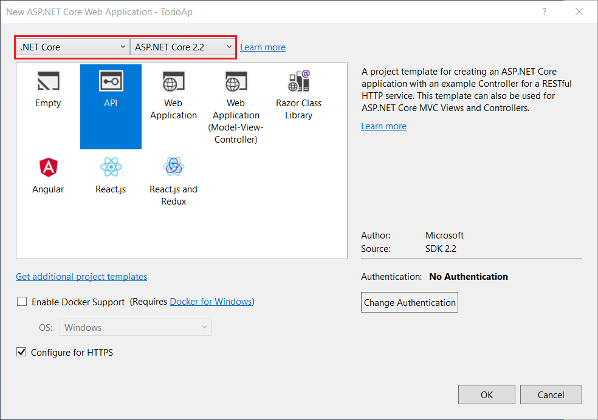
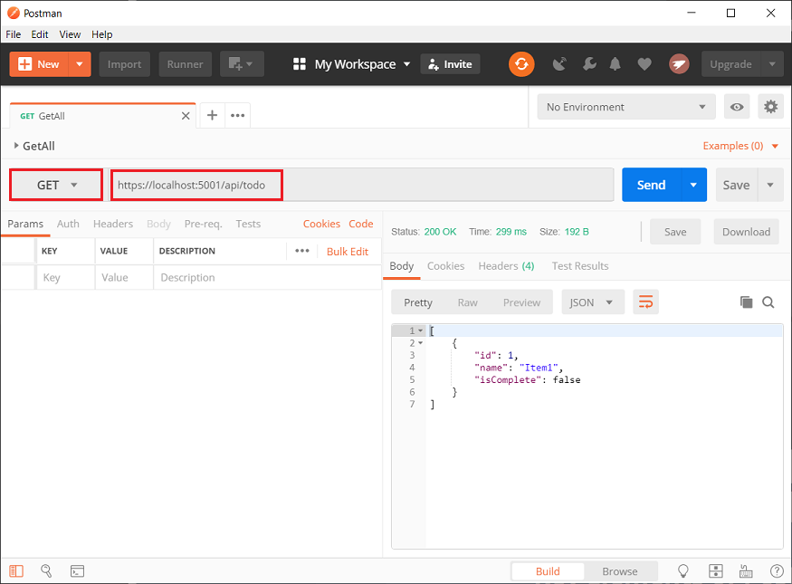
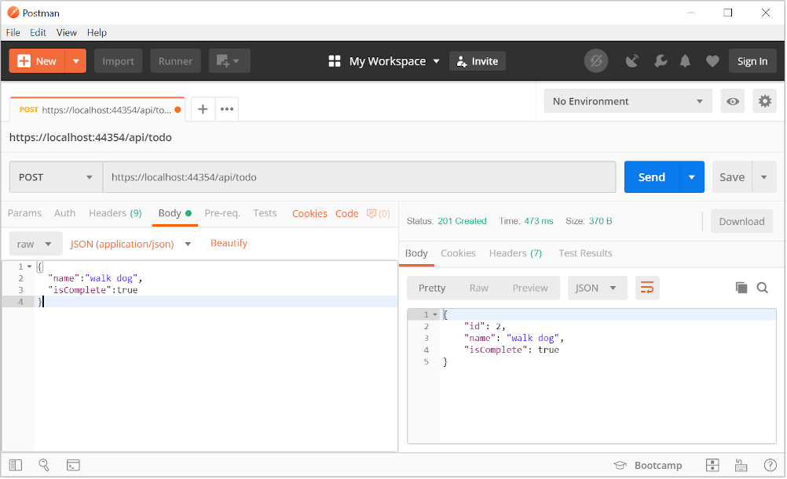

# Tutorial: Create a web API with ASP.NET Core MVC

By [Rick Anderson](https://twitter.com/RickAndMSFT) and [Mike Wasson](https://github.com/mikewasson)

This tutorial teaches the basics of building a web API with ASP.NET Core.

In this tutorial, you learn how to:

> [!div class="checklist"]
> * Create a web api project.
> * Add a model class.
> * Create the database context.
> * Register the database context.
> * Add a controller.
> * Add CRUD methods.
> * Configure routing and URL paths.
> * Specify return values.
> * Call the web API with Postman.
> * Call the web api with jQuery.

At the end, you have a web API that can manage "to-do" items stored in a relational database.

## Overview

This tutorial creates the following API:

|API | Description | Request body | Response body |
|--- | ---- | ---- | ---- |
|GET /api/todo | Get all to-do items | None | Array of to-do items|
|GET /api/todo/{id} | Get an item by ID | None | To-do item|
|POST /api/todo | Add a new item | To-do item | To-do item |
|PUT /api/todo/{id} | Update an existing item &nbsp; | To-do item | None |
|DELETE /api/todo/{id} &nbsp; &nbsp; | Delete an item &nbsp; &nbsp; | None | None|

The following diagram shows the design of the app.


[!INCLUDE[](~/includes/net-core-prereqs-all-2.2.md)]

## Create a web project

# [Visual Studio](#tab/visual-studio)

* From the **File** menu, select **New** > **Project**.
* Select the **ASP.NET Core Web Application** template. Name the project *TodoApi* and click **OK**.
* In the **New ASP.NET Core Web Application - TodoApi** dialog, choose the ASP.NET Core version. Select the **API** template and click **OK**. Do **not** select **Enable Docker Support**.



# [Visual Studio Code](#tab/visual-studio-code)

* Open the [integrated terminal](https://code.visualstudio.com/docs/editor/integrated-terminal).
* Change directories (`cd`) to the folder which will contain the project folder.
* Run the following commands:

   ```console
   dotnet new webapi -o TodoApi
   code -r TodoApi
   ```

  These commands create a new web API project and open a new instance of Visual Studio Code in he new project folder.

* When a dialog box asks if you want to add required assets to the project, select **Yes**

# [Visual Studio for Mac](#tab/visual-studio-mac)

* Select **File** > **New Solution**.

  

* Select **.NET Core App** > **ASP.NET Core Web API** > **Next**.

  
  
* In the **Configure your new ASP.NET Core Web API** dialog, accept the default **Target Framework** of **.NET Core 2.2*.

* Enter *TodoApi* for the **Project Name** and then select **Create**.

  

---

### Test the API

The project template creates a `values` API. Call the `Get` method from a browser to test the app.

# [Visual Studio](#tab/visual-studio)

Press Ctrl+F5 to run the app. Visual Studio launches a browser and navigates to `https://localhost:<port>/api/values`, where `<port>` is a randomly chosen port number.

If you get a dialog box that asks if you should trust the IIS Express certificate, select **Yes**. In the **Security Warning** dialog that appears next, select **Yes**.

# [Visual Studio Code](#tab/visual-studio-code)

Press Ctrl+F5 to run the app. In a browser, go to following URL: [https://localhost:5001/api/values](https://localhost:5001/api/values).

# [Visual Studio for Mac](#tab/visual-studio-mac)

Select **Run** > **Start With Debugging** to launch the app. Visual Studio for Mac launches a browser and navigates to `https://localhost:<port>`, where `<port>` is a randomly chosen port number. An HTTP 404 (Not Found) error is returned. Append `/api/values` to the URL (change the URL to `https://localhost:<port>/api/values`).

---

The following JSON is returned:

```json
["value1","value2"]
```

## Add a model class

A *model* is a set of classes that represent the data that the app manages. The model for this app is a single `TodoItem` class.

# [Visual Studio](#tab/visual-studio)

* In **Solution Explorer**, right-click the project. Select **Add** > **New Folder**. Name the folder *Models*.

* Right-click the *Models* folder and select **Add** > **Class**. Name the class *TodoItem* and select **Add**.

* Replace the template code with the following code:

# [Visual Studio Code](#tab/visual-studio-code)

* Add a folder named *Models*.

* Add a `TodoItem` class to the *Models* folder with the following code:

# [Visual Studio for Mac](#tab/visual-studio-mac)

* Right-click the project. Select **Add** > **New Folder**. Name the folder *Models*.

  

* Right-click the *Models* folder, and select **Add** > **New File** > **General** > **Empty Class**.

* Name the class *TodoItem*, and then click **New**.

* Replace the template code with the following code:

---

  [!code-csharp[](first-web-api/samples/2.2/TodoApi/Models/TodoItem.cs)]

The `Id` property functions as the unique key in a relational database.

Model classes can go anywhere in the project, but the *Models* folder is used by convention.

## Add a database context

The *database context* is the main class that coordinates Entity Framework functionality for a data model. This class is created by deriving from the `Microsoft.EntityFrameworkCore.DbContext` class.

# [Visual Studio](#tab/visual-studio)

* Right-click the *Models* folder and select **Add** > **Class**. Name the class *TodoContext* and click **Add**.

# [Visual Studio Code](#tab/visual-studio-code)

* Add a `TodoContext` class to the *Models* folder.

# [Visual Studio for Mac](#tab/visual-studio-mac)

* Add a `TodoContext` class in the *Models* folder:

---

* Replace the template code with the following code:

  [!code-csharp[](first-web-api/samples/2.2/TodoApi/Models/TodoContext.cs)]

## Register the database context

In ASP.NET Core, services such as the DB context must be registered with the [dependency injection (DI)](xref:fundamentals/dependency-injection) container. The container provides the service to controllers.

Update *Startup.cs* with the following highlighted code:

[!code-csharp[](first-web-api/samples/2.2/TodoApi/Startup1.cs?highlight=5,8,25-26&name=snippet_all)]

The preceding code:

* Removes unused `using` declarations.
* Adds the database context to the DI container.
* Specifies that the database context will use an in-memory database.

## Add a controller

# [Visual Studio](#tab/visual-studio)

* Right-click the *Controllers* folder.
* Select **Add** > **New Item**.
* In the **Add New Item** dialog, select the **API Controller Class** template.
* Name the class *TodoController*, and select **Add**.

  

# [Visual Studio Code](#tab/visual-studio-code)

* In the *Controllers* folder, create a class named `TodoController`.

# [Visual Studio for Mac](#tab/visual-studio-mac)

* In the *Controllers* folder, add the class `TodoController`.

---

* Replace the template code with the following code:

  [!code-csharp[](first-web-api/samples/2.2/TodoApi/Controllers/TodoController2.cs?name=snippet_todo1)]

The preceding code:

* Defines an API controller class without methods.
* Decorates the class with the [`[ApiController]`](/dotnet/api/microsoft.aspnetcore.mvc.apicontrollerattribute) attribute. This attribute indicates that the controller responds to web API requests. For information about specific behaviors that the attribute enables, see [Annotation with ApiController attribute](xref:web-api/index#annotation-with-apicontroller-attribute).
* Uses DI to inject the database context (`TodoContext`) into the controller. The database context is used in each of the [CRUD](https://wikipedia.org/wiki/Create,_read,_update_and_delete) methods in the controller.
* Adds an item named `Item1` to the database if the database is empty. This code is in the constructor, so it runs every time there's a new HTTP request. If you delete all items, the constructor creates `Item1` again the next time an API method is called. So it may look like the deletion didn't work when it actually did work.

## Add Get methods

To provide an API that retrieves to-do items, add the following methods to the `TodoController` class:

[!code-csharp[](first-web-api/samples/2.2/TodoApi/Controllers/TodoController.cs?name=snippet_GetAll)]

These methods implement two GET endpoints:

* `GET /api/todo`
* `GET /api/todo/{id}`

Test the app by calling the two endpoints from a browser. For example:

* `https://localhost:<port>/api/todo`
* `https://localhost:<port>/api/todo/1`

The following HTTP response is produced by the call to `GetTodoItems`:

```json
[
  {
    "id": 1,
    "name": "Item1",
    "isComplete": false
  }
]
```

## Routing and URL paths

The [`[HttpGet]`](/dotnet/api/microsoft.aspnetcore.mvc.httpgetattribute) attribute denotes a method that responds to an HTTP GET request. The URL path for each method is constructed as follows:

* Start with the template string in the controller's `Route` attribute:

  [!code-csharp[](first-web-api/samples/2.2/TodoApi/Controllers/TodoController.cs?name=TodoController&highlight=3)]

* Replace `[controller]` with the name of the controller, which by convention is the controller class name minus the "Controller" suffix. For this sample, the controller class name is **Todo**Controller, so the controller name is "todo". ASP.NET Core [routing](xref:mvc/controllers/routing) is case insensitive.
* If the `[HttpGet]` attribute has a route template (for example, `[HttpGet("/products")]`, append that to the path. This sample doesn't use a template. For more information, see [Attribute routing with Http[Verb] attributes](xref:mvc/controllers/routing#attribute-routing-with-httpverb-attributes).

In the following `GetTodoItem` method, `"{id}"` is a placeholder variable for the unique identifier of the to-do item. When `GetTodoItem` is invoked, the value of `"{id}"` in the URL is provided to the method in its`id` parameter.

[!code-csharp[](first-web-api/samples/2.2/TodoApi/Controllers/TodoController.cs?name=snippet_GetByID&highlight=1-2)]

The `Name = "GetTodo"` parameter creates a named route. You'll see later how the app can use the name to create an HTTP link using the route name.

## Return values

The return type of the `GetTodoItems` and `GetTodoItem` methods is [ActionResult\<T> type](xref:web-api/action-return-types#actionresultt-type). ASP.NET Core automatically serializes the object to [JSON](https://www.json.org/) and writes the JSON into the body of the response message. The response code for this return type is 200, assuming there are no unhandled exceptions. Unhandled exceptions are translated into 5xx errors.

`ActionResult` return types can represent a wide range of HTTP status codes. For example, `GetTodoItem` can return two different status values:

* If no item matches the requested ID, the method returns a 404 [NotFound](/dotnet/api/microsoft.aspnetcore.mvc.controllerbase.notfound) error code.
* Otherwise, the method returns 200 with a JSON response body. Returning `item` results in an HTTP 200 response.

## Test the GetTodoItems method

This tutorial uses Postman to test the web API.

* Install [Postman](https://www.getpostman.com/apps)
* Start the web app.
* Start Postman.
* Disable **SSL certificate verification**
  
  * From  **File > Settings** (**General* tab), disable **SSL certificate verification**.
    > [!WARNING]
    > Re-enable SSL certificate verification after testing the controller.

* Create a new request.
  * Set the HTTP method to **GET**.
  * Set the request URL to `https://localhost:<port>/api/todo`. For example, `https://localhost:5001/api/todo`.
* Set **Two pane view** in Postman.
* Select **Send**.



## Add a Create method

Add the following `PostTodoItem` method:

[!code-csharp[](first-web-api/samples/2.2/TodoApi/Controllers/TodoController.cs?name=snippet_Create)]

The preceding code is an HTTP POST method, as indicated by the [[HttpPost]](/dotnet/api/microsoft.aspnetcore.mvc.httppostattribute) attribute. The method gets the value of the to-do item from the body of the HTTP request.

The `CreatedAtRoute` method:

* Returns a 201 response. HTTP 201 is the standard response for an HTTP POST method that creates a new resource on the server.
* Adds a Location header to the response. The Location header specifies the URI of the newly created to-do item. For more information, see [10.2.2 201 Created](https://www.w3.org/Protocols/rfc2616/rfc2616-sec10.html).
* Uses the "GetTodo" named route to create the URL. The "GetTodo" named route is defined in `GetTodoItem`:

  [!code-csharp[](first-web-api/samples/2.2/TodoApi/Controllers/TodoController.cs?name=snippet_GetByID&highlight=1-2)]

### Test the PostTodoItem method

* Build the project.
* In Postman, set the HTTP method to `POST`.
* Select the **Body** tab.
* Select the **raw** radio button.
* Set the type to **JSON (application/json)**.
* In the request body enter JSON for a to-do item:

    ```json
    {
      "name":"walk dog",
      "isComplete":true
    }
    ```

* Select **Send**.

  

  If you get a 405 Method Not Allowed error, it's probably the result of not compiling the project after adding the after adding the `PostTodoItem` method.

### Test the location header URI

* Select the **Headers** tab in the **Response** pane.
* Copy the **Location** header value:

  

* Set the method to GET.
* Paste the URI (for example, `https://localhost:5001/api/Todo/2`)
* Select **Send**.

## Add a PutTodoItem method

Add the following `PutTodoItem` method:

[!code-csharp[](first-web-api/samples/2.2/TodoApi/Controllers/TodoController.cs?name=snippet_Update)]

`PutTodoItem` is similar to `PostTodoItem`, except it uses HTTP PUT. The response is [204 (No Content)](https://www.w3.org/Protocols/rfc2616/rfc2616-sec9.html). According to the HTTP specification, a PUT request requires the client to send the entire updated entity, not just the changes. To support partial updates, use [HTTP PATCH](/dotnet/api/microsoft.aspnetcore.mvc.httppostattribute).

### Test the PutTodoItem method

Update the to-do item that has id = 1 and set its name to "feed fish":

```json
  {
    "ID":1,
    "name":"feed fish",
    "isComplete":true
  }
```

The following image shows the Postman update:


## Add a DeleteTodoItem method

Add the following `DeleteTodoItem` method:

[!code-csharp[](first-web-api/samples/2.2/TodoApi/Controllers/TodoController.cs?name=snippet_Delete)]

The `DeleteTodoItem` response is [204 (No Content)](https://www.w3.org/Protocols/rfc2616/rfc2616-sec9.html).

### Test the DeleteTodoItem method

Use Postman to delete a to-do item:

* Set the method to `DELETE`.
* Set the URI of the object to delete, for example `https://localhost:5001/api/todo/1`
* Select **Send**

The sample app allows you to delete all the items, but when the last item is deleted, a new one is created by the model class constructor the next time the API is called.

## Call the API with jQuery

In this section, an HTML page is added that uses jQuery to call the web api. jQuery initiates the request and updates the page with the details from the API's response.

Configure the app to [serve static files](/dotnet/api/microsoft.aspnetcore.builder.staticfileextensions.usestaticfiles#Microsoft_AspNetCore_Builder_StaticFileExtensions_UseStaticFiles_Microsoft_AspNetCore_Builder_IApplicationBuilder_) and [enable default file mapping](/dotnet/api/microsoft.aspnetcore.builder.staticfileextensions.usestaticfiles#Microsoft_AspNetCore_Builder_StaticFileExtensions_UseStaticFiles_Microsoft_AspNetCore_Builder_IApplicationBuilder_):

[!code-csharp[](first-web-api/samples/2.2/TodoApi/Startup.cs?highlight=14-15&name=snippet_configure)]

::: moniker range=">= aspnetcore-2.2"
Create a *wwwroot* folder in the project directory.
::: moniker-end

Add an HTML file named *index.html* to the *wwwroot* directory. Replace its contents with the following markup:

[!code-html[](first-web-api/samples/2.2/TodoApi/wwwroot/index.html)]

Add a JavaScript file named *site.js* to the *wwwroot* directory. Replace its contents with the following code:

[!code-javascript[](first-web-api/samples/2.2/TodoApi/wwwroot/site.js?name=snippet_SiteJs)]

A change to the ASP.NET Core project's launch settings may be required to test the HTML page locally:

* Open *Properties\launchSettings.json*.
* Remove the `launchUrl` property to force the app to open at *index.html*&mdash;the project's default file.

There are several ways to get jQuery. In the preceding snippet, the library is loaded from a CDN.

This sample calls all of the CRUD methods of the API. Following are explanations of the calls to the API.

### Get a list of to-do items

The jQuery [ajax](https://api.jquery.com/jquery.ajax/) function sends a `GET` request to the API, which returns JSON representing an array of to-do items. The `success` callback function is invoked if the request succeeds. In the callback, the DOM is updated with the to-do information.

[!code-javascript[](first-web-api/samples/2.2/TodoApi/wwwroot/site.js?name=snippet_GetData)]

### Add a to-do item

The [ajax](https://api.jquery.com/jquery.ajax/) function sends a `POST` request with the to-do item in the request body. The `accepts` and `contentType` options are set to `application/json` to specify the media type being received and sent. The to-do item is converted to JSON by using [JSON.stringify](https://developer.mozilla.org/docs/Web/JavaScript/Reference/Global_Objects/JSON/stringify). When the API returns a successful status code, the `getData` function is invoked to update the HTML table.

[!code-javascript[](first-web-api/samples/2.2/TodoApi/wwwroot/site.js?name=snippet_AddItem)]

### Update a to-do item

Updating a to-do item is similar to adding one. The `url` changes to add the unique identifier of the item, and the `type` is `PUT`.

[!code-javascript[](first-web-api/samples/2.2/TodoApi/wwwroot/site.js?name=snippet_AjaxPut)]

### Delete a to-do item

Deleting a to-do item is accomplished by setting the `type` on the AJAX call to `DELETE` and specifying the item's unique identifier in the URL.

[!code-javascript[](first-web-api/samples/2.2/TodoApi/wwwroot/site.js?name=snippet_AjaxDelete)]

## Additional resources

[View or download sample code for this tutorial](https://github.com/aspnet/Docs/tree/master/aspnetcore/tutorials/first-web-api/samples). See [how to download](xref:index#how-to-download-a-sample).

For more information, see the following resources:

* <xref:web-api/index>
* <xref:tutorials/web-api-help-pages-using-swagger>
* <xref:data/ef-rp/index>
* <xref:mvc/controllers/routing>
* <xref:web-api/action-return-types>
* <xref:host-and-deploy/azure-apps/index>
* <xref:host-and-deploy/index>

## Next steps

In this tutorial, you learned how to:

> [!div class="checklist"]
> * Create a web api project.
> * Add a model class.
> * Create the database context.
> * Register the database context.
> * Add a controller.
> * Add CRUD methods.
> * Configure routing and URL paths.
> * Specify return values.
> * Call the web API with Postman.
> * Call the web api with jQuery.

Advance to the next tutorial to learn how to generate API help pages:

> [!div class="nextstepaction"]
> <xref:tutorials/get-started-with-swashbuckle>
