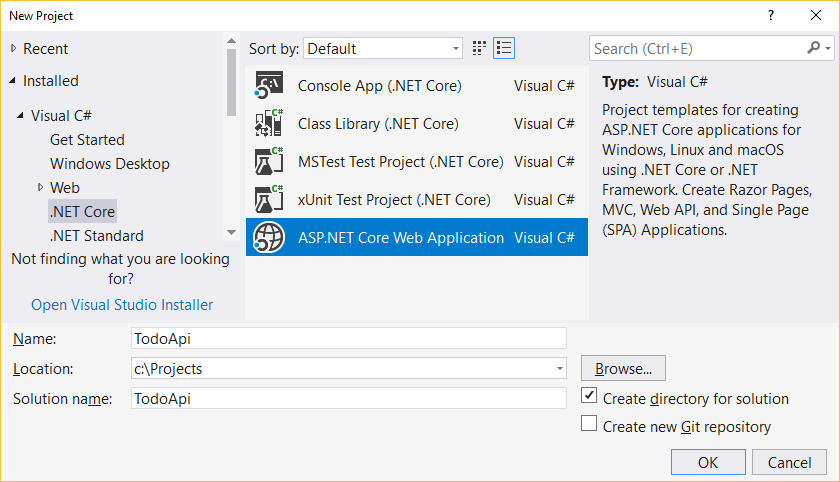
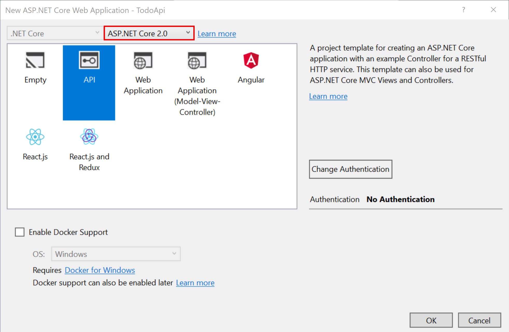
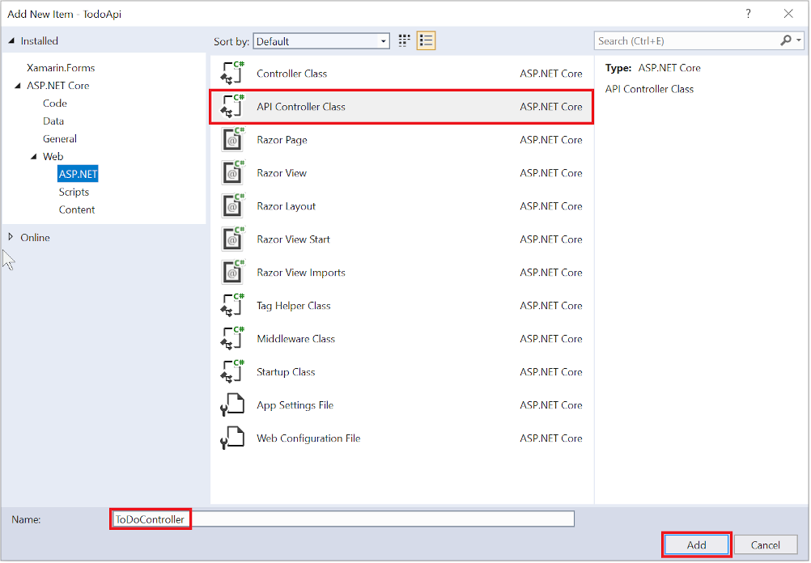

#Create a web API with ASP.NET Core and Visual Studio for Windows

By [Rick Anderson](https://twitter.com/RickAndMSFT) and [Mike Wasson](https://github.com/mikewasson)

In this tutorial, you’ll build a web API for managing a list of "to-do" items. You won’t build a UI.

There are 3 versions of this tutorial:

* Windows: Web API with Visual Studio for Windows (This tutorial)
* macOS: [Web API with Visual Studio for Mac](xref:tutorials/first-web-api-mac)
* macOS, Linux, Windows: [Web API with Visual Studio Code](xref:tutorials/web-api-vsc)

<!-- WARNING: The code AND images in this doc are used by uid: tutorials/web-api-vsc, tutorials/first-web-api-mac and tutorials/first-web-api. If you change any code/images in this tutorial, update uid: tutorials/web-api-vsc -->

[!INCLUDE[intro to web API](../includes/webApi/intro.md)]

## Prerequisites

[!INCLUDE[install 2.0](../includes/install2.0.md)]

See [this PDF](https://github.com/aspnet/Docs/blob/master/aspnetcore/tutorials/first-web-api/_static/_webAPI.pdf) for the ASP.NET Core 1.1 version.

## Create the project

From Visual Studio, select **File** menu, > **New** > **Project**.

Select the **ASP.NET Core Web Application (.NET Core)** project template. Name the project `TodoApi` and select **OK**.



In the **New ASP.NET Core Web Application - TodoApi** dialog, select the **Web API** template. Select **OK**. Do **not** select **Enable Docker Support**.



### Launch the app

In Visual Studio, press CTRL+F5 to launch the app. Visual Studio launches a browser and navigates to `http://localhost:port/api/values`, where *port* is a randomly-chosen port number. Chrome, Edge, and Firefox display the following:

```
["value1","value2"]
``` 

### Add a model class

A model is an object that represents the data in your application. In this case, the only model is a to-do item.

Add a folder named "Models". In Solution Explorer, right-click the project. Select **Add** > **New Folder**. Name the folder *Models*.

Note: The model classes go anywhere in your project, but the *Models* folder is used by convention.

Add a `TodoItem` class. Right-click the *Models* folder and select **Add** > **Class**. Name the class `TodoItem` and select **Add**.

Replace the generated code with the following:

[!code-csharp[Main](first-web-api/sample/TodoApi/Models/TodoItem.cs)]

The database generates the `Id` when a `TodoItem` is created.

### Create the database context

The *database context* is the main class that coordinates Entity Framework functionality for a given data model. This class is created by deriving from the `Microsoft.EntityFrameworkCore.DbContext` class.

Add a `TodoContext` class. Right-click the *Models* folder and select **Add** > **Class**. Name the class `TodoContext` and select **Add**.

Replace the generated code with the following:

[!code-csharp[Main](first-web-api/sample/TodoApi/Models/TodoContext.cs)]

[!INCLUDE[Register the database context](../includes/webApi/register_dbContext.md)]

### Add a controller

In Solution Explorer, right-click the *Controllers* folder. Select **Add** > **New Item**. In the **Add New Item** dialog, select the **Web  API Controller Class** template. Name the class `TodoController`.



Replace the generated code with the following:

[!INCLUDE[code and get todo items](../includes/webApi/getTodoItems.md)]
  
### Launch the app

In Visual Studio, press CTRL+F5 to launch the app. Visual Studio launches a browser and navigates to `http://localhost:port/api/values`, where *port* is a randomly chosen port number. If you're using Chrome, Edge or Firefox, the data will be displayed. If you're using IE, IE will prompt to you open or save the *values.json* file. Navigate to the `Todo` controller we just created `http://localhost:port/api/todo`.

[!INCLUDE[last part of web API](../includes/webApi/end.md)]

[!INCLUDE[next steps](../includes/webApi/next.md)]

