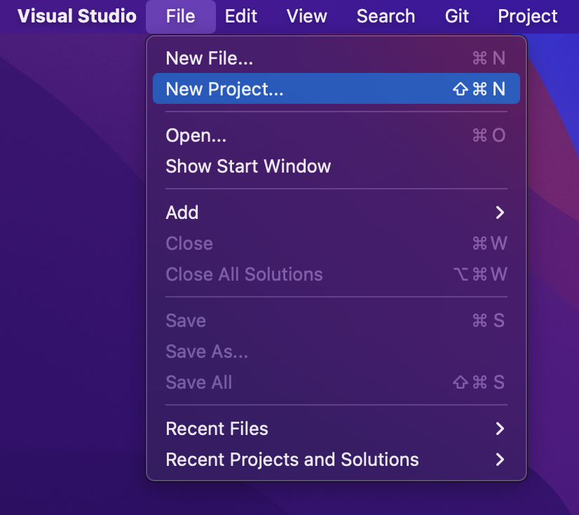

# Tutorial: Create a Web API with ASP.NET Core

https://docs.microsoft.com/en-us/dotnet/api/microsoft.aspnetcore.mvc.apicontrollerattribute?view=aspnetcore-2.1

By [Rick Anderson](https://twitter.com/RickAndMSFT) and [Mike Wasson](https://github.com/mikewasson)

This tutorial teaches the basics of building a web API app. The app manages a list of "to-do" items. A user interface (UI) isn't created. You learn how to:

> [!div class="checklist"]
> * Create a web API project.
> * Add a controller.
> * Add code to get "to-do" items.
> * Create other CRUD operations.
> * Call the Web API with jQuery.

At the end, you have a an app that can manage  "to-do" items.

[!INCLUDE[intro to web API](../includes/webApi/intro.md)]

## Prerequisites

[!INCLUDE[](~/includes/net-core-prereqs-windows-all-2.2.md)]

## Create a web project

# [Visual Studio](#tab/visual-studio)

* From the **File** menu, select **New** > **Project**.
* Select the **ASP.NET Core Web Application** template. Name the project *TodoApi* and click **OK**.
* In the **New ASP.NET Core Web Application - TodoApi** dialog, choose the ASP.NET Core version. Select the **API** template and click **OK**. Do **not** select **Enable Docker Support**.


# [Visual Studio Code](#tab/visual-studio-code)

In the [Integrated Terminal](https://code.visualstudio.com/docs/editor/integrated-terminal), run the following command:

   ```console
   dotnet new webapi -o TodoApi
   ```

# [Visual Studio for Mac](#tab/visual-studio-mac)

From Visual Studio, select **File** > **New Solution**.



Select **.NET Core App** > **ASP.NET Core Web API** > **Next**.


Enter *TodoApi* for the **Project Name** > **Create**.


---

### Launch the app

# [Visual Studio](#tab/visual-studio)

Press CTRL+F5 to launch the app. Visual Studio launches a browser and navigates to `http://localhost:<port>/api/values`, where `<port>` is a randomly chosen port number. Chrome, Microsoft Edge, and Firefox display the following output:

```json
["value1","value2"]
```

Internet Explorer, prompts you to save a *values.json* file.

# [Visual Studio Code](#tab/visual-studio-code)

# [Visual Studio for Mac](#tab/visual-studio-mac)

---

### Add a model class

A model is an object representing the data in the app. In this case, the only model is a to-do item.

# [Visual Studio](#tab/visual-studio)

In Solution Explorer, right-click the project. Select **Add** > **New Folder**. Name the folder *Models*.

Model classes can go anywhere in the project, but the *Models* folder is used by convention.

In Solution Explorer, right-click the *Models* folder and select **Add** > **Class**. Name the class *TodoItem* and click **Add**.

Update the `TodoItem` class with the following code:

# [Visual Studio Code](#tab/visual-studio-code)

Add a folder named *Models* for the model classes.  Model classes can go anywhere in the project, but the *Models* folder is used by convention.

Add a `TodoItem` class with the following code:

# [Visual Studio for Mac](#tab/visual-studio-mac)

In Solution Explorer, right-click the project. Select **Add** > **New Folder**. Name the folder *Models*.


Model classes can go anywhere in the project, but the *Models* folder is used by convention.

Right-click the *Models* folder, and select **Add** > **New File** > **General** > **Empty Class**. Name the class *TodoItem*, and then click **New**.

Update the `TodoItem` class with the following code:

---

[!code-csharp[](first-web-api/samples/2.2/TodoApi/Models/TodoItem.cs)]

The database generates the `Id` when a `TodoItem` is created.

### Create the database context

The *database context* is the main class that coordinates Entity Framework functionality for a given data model. This class is created by deriving from the `Microsoft.EntityFrameworkCore.DbContext` class.

# [Visual Studio](#tab/visual-studio)

Right-click the *Models* folder and select **Add** > **Class**. Name the class *TodoContext* and click **Add**.

# [Visual Studio Code](#tab/visual-studio-code)

Add a `TodoContext` class to the *Models* folder.

# [Visual Studio for Mac](#tab/visual-studio-mac)

Add a `TodoContext` class in the *Models* folder:

---

Replace the class with the following code:

[!code-csharp[](first-web-api/samples/2.2/TodoApi/Models/TodoContext.cs)]

## Register the database context

In this step, the database context is registered with the [dependency injection](xref:fundamentals/dependency-injection) container. Services (such as the DB context) that are registered with the dependency injection (DI) container are available to the controllers.

Register the DB context with the service container using the built-in support for [dependency injection](xref:fundamentals/dependency-injection). Update *Startup.cs* with the following highlighted code:

::: moniker range="= aspnetcore-2.1"

[!code-csharp[](first-web-api/samples/2.1/TodoApi/Startup.cs?highlight=3,5,13-14)]

::: moniker-end

::: moniker range="= aspnetcore-2.2"

[!code-csharp[](first-web-api/samples/2.2/TodoApi/Startup.cs?highlight=5,8,25,26)]

::: moniker-end  

The preceding code:

* Removes unused `using` declarations.
* Specifies an in-memory database is injected into the service container.

### Add a controller

# [Visual Studio](#tab/visual-studio)

* Right-click the *Controllers* folder.
* Select **Add** > **New Item**.
* In the **Add New Item** dialog, select the **API Controller Class** template.
* Name the class *TodoController*, and click **Add**.


# [Visual Studio Code](#tab/visual-studio-code)

In the *Controllers* folder, create a class named `TodoController`.

# [Visual Studio for Mac](#tab/visual-studio-mac)

In Solution Explorer, in the *Controllers* folder, add the class `TodoController`.

---

Replace the `TodoController` class with the following code:

::: moniker range="= aspnetcore-2.1"

[!code-csharp[](first-web-api/samples/2.1/TodoApi/Controllers/TodoController2.cs?name=snippet_todo1)]

::: moniker-end

::: moniker range="= aspnetcore-2.2"

[!code-csharp[](first-web-api/samples/2.2/TodoApi/Controllers/TodoController2.cs?name=snippet_todo1)]

::: moniker-end

The preceding code:

* Defines an API controller class without methods.
* Creates a new Todo item when `TodoItems` is empty. You won't be able to delete all the Todo items because the constructor creates a new one if `TodoItems` is empty.

In the next sections, methods are added to implement the API. The class is annotated with an [`[ApiController]`](/dotnet/api/microsoft.aspnetcore.mvc.apicontrollerattribute) attribute to:

* Mark the class is used to serve HTTP API responses.
* Enable the class to target conventions, filters, and other behaviors.

For information, see [Annotation with ApiControllerAttribute](xref:web-api/index#annotation-with-apicontrollerattribute).

The controller's constructor uses [Dependency Injection](xref:fundamentals/dependency-injection) to inject the database context (`TodoContext`) into the controller. The database context is used in each of the [CRUD](https://wikipedia.org/wiki/Create,_read,_update_and_delete) methods in the controller. The constructor adds an item to the in-memory database if one doesn't exist.

## Get to-do items

To get to-do items, add the following methods to the `TodoController` class:

[!code-csharp[](first-web-api/samples/2.2/TodoApi/Controllers/TodoController.cs?name=snippet_GetAll)]

These methods implement the two GET methods:

* `GET /api/todo`
* `GET /api/todo/{id}`

Test the app by calling the two endpoints from a browser. For example:

* `https://localhost:5001/api/todo`
* `https://localhost:5001/api/todo/1`

The following HTTP response is produced with the preceding calls to the `GetAll` and `GetById` methods:

```json
[
  {
    "id": 1,
    "name": "Item1",
    "isComplete": false
  }
]
```

Later in the tutorial, instructions are provided to view the HTTP response with [Postman](https://www.getpostman.com/) or [curl](https://curl.haxx.se/docs/manpage.html).

### Routing and URL paths

The `[HttpGet]` attribute denotes a method that responds to an HTTP GET request. The URL path for each method is constructed as follows:

* Take the template string in the controller's `Route` attribute:

[!code-csharp[](first-web-api/samples/2.2/TodoApi/Controllers/TodoController.cs?name=TodoController&highlight=3)]

* Replace `[controller]` with the name of the controller, which is the controller class name minus the "Controller" suffix. For this sample, the controller class name is **Todo**Controller and the root name is "todo". ASP.NET Core [routing](xref:mvc/controllers/routing) is case insensitive.
* If the `[HttpGet]` attribute has a route template (such as `[HttpGet("/products")]`, append that to the path. This sample doesn't use a template. For more information, see [Attribute routing with Http[Verb] attributes](xref:mvc/controllers/routing#attribute-routing-with-httpverb-attributes).

In the following `GetById` method, `"{id}"` is a placeholder variable for the unique identifier of the to-do item. When `GetById` is invoked, it assigns the value of `"{id}"` in the URL to the method's `id` parameter.

[!code-csharp[](first-web-api/samples/2.2/TodoApi/Controllers/TodoController.cs?name=snippet_GetByID&highlight=1-2)]

`Name = "GetTodo"` creates a named route. Named routes:

* Enable the app to create an HTTP link using the route name.
* Are explained later in the tutorial.

### Return values

The `GetAll` method returns a collection of `TodoItem` objects. MVC automatically serializes the object to [JSON](https://www.json.org/) and writes the JSON into the body of the response message. The response code for this method is 200, assuming there are no unhandled exceptions. Unhandled exceptions are translated into 5xx errors.

In contrast, the `GetById` method returns the [ActionResult\<T> type](xref:web-api/action-return-types#actionresultt-type), which represents a wide range of return types. `GetById` has two different return types:

* If no item matches the requested ID, the method returns a 404 error. Returning [NotFound](/dotnet/api/microsoft.aspnetcore.mvc.controllerbase.notfound) returns an HTTP 404 response.
* Otherwise, the method returns 200 with a JSON response body. Returning `item` results in an HTTP 200 response.

### Launch the app

In Visual Studio, press CTRL+F5 to launch the app. Visual Studio launches a browser and navigates to `http://localhost:<port>/api/values`, where `<port>` is a randomly chosen port number. Navigate to the `Todo` controller at `http://localhost:<port>/api/todo`.

[!INCLUDE[last part of web API](../includes/webApi/end.md)]

[!INCLUDE[jQuery](../includes/webApi/add-jquery.md)]

[!INCLUDE[next steps](../includes/webApi/next.md)]
