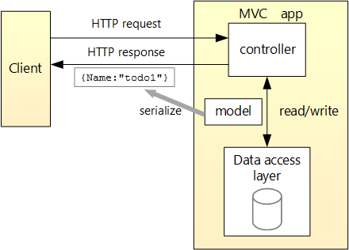
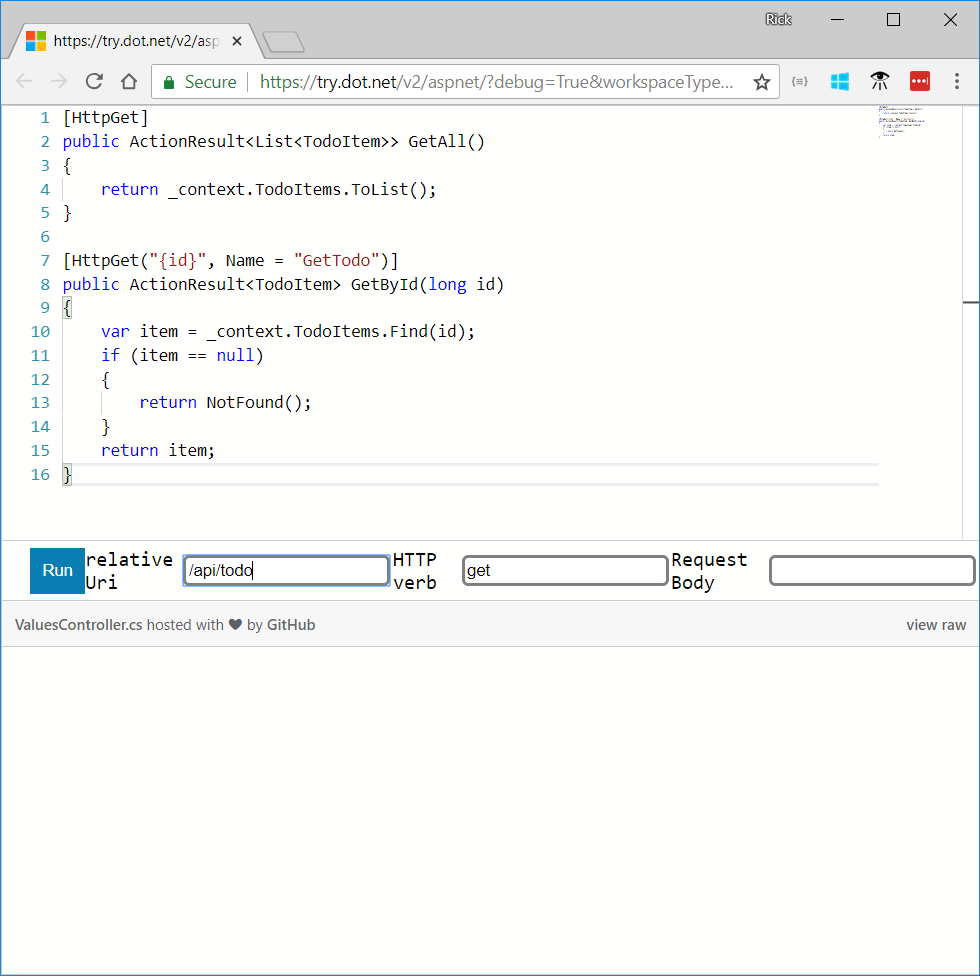

<!--
WHen Azure table storage is used, generate a new GUID for the PK. This tutorial previously used ConcurrentDictionary<Guid.NewGuid().ToString();, TodoItem>(); 

I switched to EF in-memory so I could get int's as PK. It's much easier to enter 1 than a GUID when reading/updating/deleting an item.  For Try .NET, they'll have to copy/paste the GUID PK.
-->

## Overview

This tutorial tests a Web API controller with the following API:

|API | Description | Request body | Response body |
|--- | ---- | ---- | ---- |
|GET /api/todo | Get all to-do items | None | Array of to-do items|
|GET /api/todo/{id} | Get an item by ID | None | To-do item|
|POST /api/todo | Add a new item | To-do item | To-do item |
|PUT /api/todo/{id} | Update an existing item &nbsp; | To-do item | None |
|DELETE /api/todo/{id} &nbsp; &nbsp; | Delete an item &nbsp; &nbsp; | None | None|

The following diagram shows the basic design of the app.



* The client is whatever consumes the web API (mobile app, browser, etc.). This tutorial provides a client to test the web API in the browser.

* A *model* is an object that represents the data in the app. In this case, the only model is a to-do item. Models are represented as C# classes, also known as **P**lain **O**ld **C**LR **O**bject (POCOs).

* A *controller* is an object that handles HTTP requests and creates the HTTP response. This app uses the `TodoController` .

* To keep the tutorial simple, the app doesn't use a persistent database. The sample app stores to-do items in an in-memory database.

### The model

The Web API app uses the following model to create, read, update, and delete (CRUD) data:

[!code-csharp[](first-web-api/samples/2.0/TodoApi/Models/TodoItem.cs)]

The model is an object representing the data in the app. 

When you create a new `TodoItem` item, you provide the name and completion status, the database generates the `Id`.

### The Web API controller

The following code shows the `TodoController` Web API controller:

[!code-csharp[](first-web-api2/samples/2.1/TodoApi/Controllers/TodoController.cs?name=TodoController2)]

The following code shows the `TodoController` class declaration and constructor:

[!code-csharp[](first-web-api2/samples/2.1/TodoApi/Controllers/TodoController.cs?name=TodoController)]

The preceding code shows:

* The declaration of the web api controller.
* The `[ApiController]` attribute to enable some convenient features. For information on features enabled by the attribute, see [Annotate class with ApiControllerAttribute](xref:web-api/index#annotate-class-with-apicontrollerattribute).

The controller's constructor uses [Dependency Injection](xref:fundamentals/dependency-injection) to inject the database context (`TodoContext`) into the controller. The database context is used in each of the [CRUD](https://wikipedia.org/wiki/Create,_read,_update_and_delete) methods in the controller. The constructor adds an item to the in-memory database if one doesn't exist.

## Get to-do items

The following code gets to-do items:

[!code-csharp[](first-web-api/samples/2.1/TodoApi/Controllers/TodoController.cs?name=snippet_GetAll)]

The preceding code implements the two GET endpoints:

* `GET /api/todo`
* `GET /api/todo/{id}`

Select **Run** with the relative URI of `/api/todo` to return all the to-do items:



Use the `ID` from the `GET /api/todo` output to test fetching a specific item.

### Routing and URL paths

The `[HttpGet]` attribute denotes a method that responds to an HTTP GET request. The URL path for each method is constructed as follows:

* Take the template string in the controller's `Route` attribute:

[!code-csharp[](first-web-api/samples/2.1/TodoApi/Controllers/TodoController.cs?name=TodoController&highlight=3)]

* Replace `[controller]` with the name of the controller, which is the controller class name minus the "Controller" suffix. For this sample, the controller class name is **Todo**Controller and the root name is "todo". ASP.NET Core [routing](xref:mvc/controllers/routing) is case insensitive.
* If the `[HttpGet]` attribute has a route template (such as `[HttpGet("/products")]`, append that to the path. This sample doesn't use a template. For more information, see [Attribute routing with Http[Verb] attributes](xref:mvc/controllers/routing#attribute-routing-with-httpverb-attributes).

In the following `GetById` method, `"{id}"` is a placeholder variable for the unique identifier of the to-do item. When `GetById` is invoked, it assigns the value of `"{id}"` in the URL to the method's `id` parameter.

[!code-csharp[](first-web-api/samples/2.1/TodoApi/Controllers/TodoController.cs?name=snippet_GetByID&highlight=1-2)]

`Name = "GetTodo"` creates a named route. Named routes:

* Enable the app to create an HTTP link using the route name.
* Are explained later in the tutorial.

### Return values

The `GetAll` method returns a collection of `TodoItem` objects. MVC automatically serializes the object to [JSON](https://www.json.org/) and writes the JSON into the body of the response message. The response code for this method is 200, assuming there are no unhandled exceptions. Unhandled exceptions are translated into 5xx errors.

In contrast, the `GetById` method returns the [ActionResult\<T> type](xref:web-api/action-return-types#actionresultt-type), which represents a wide range of return types. `GetById` has two different return types:

* If no item matches the requested ID, the method returns a 404 error. Returning [NotFound](/dotnet/api/microsoft.aspnetcore.mvc.controllerbase.notfound) returns an HTTP 404 response.
* Otherwise, the method returns 200 with a JSON response body. Returning `item` results in an HTTP 200 response.

### Test the create method

The following code shows the `Create` method:

[!code-csharp[](first-web-api/samples/2.1/TodoApi/Controllers/TodoController.cs?name=snippet_Create)]

The preceding code is an HTTP POST method, as indicated by the [[HttpPost]](/dotnet/api/microsoft.aspnetcore.mvc.httppostattribute) attribute. MVC gets the value of the to-do item from the body of the HTTP request.

The `CreatedAtRoute` method:

* Returns a 201 response. HTTP 201 is the standard response for an HTTP POST method that creates a new resource on the server.
* Adds a Location header to the response. The Location header specifies the URI of the newly created to-do item. See [10.2.2 201 Created](https://www.w3.org/Protocols/rfc2616/rfc2616-sec10.html).
* Uses the "GetTodo" named route to create the URL. The "GetTodo" named route is defined in `GetById`:

[!code-csharp[](first-web-api/samples/2.1/TodoApi/Controllers/TodoController.cs?name=snippet_GetByID&highlight=1-2)]

### Send a Create request

* Set the HTTP method to *POST*.
* Enter a request body with a to-do item resembling the following JSON:

```json
{
  "name":"walk dog",
  "isComplete":true
}
```

* Click the **Run** button.

The Location header URI can be used to access the new item. Copy the **Location** header value from the  **Response** pane and use that to get the new item
