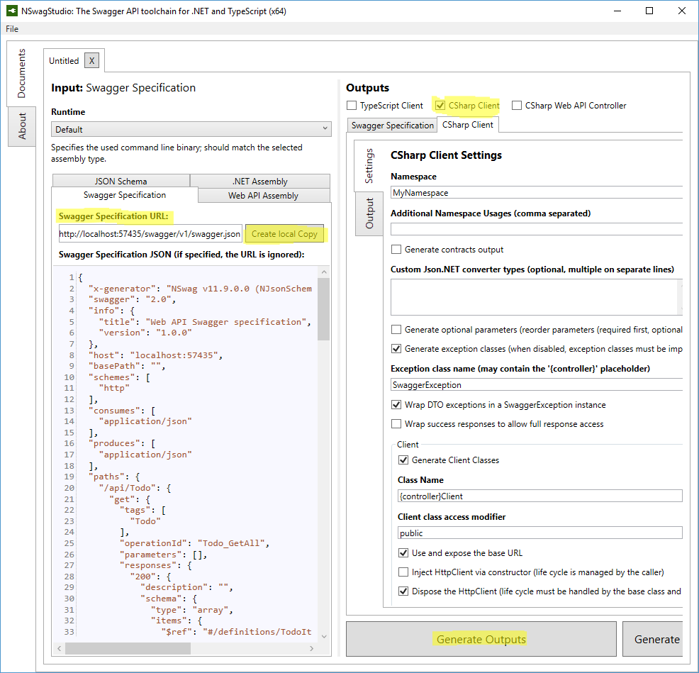
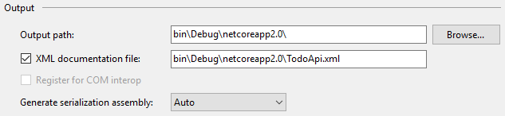

# Get started with NSwag

By [Christoph Nienaber](https://twitter.com/zuckerthoben) and [Rico Suter](https://rsuter.com)

Using [NSwag](https://github.com/RSuter/NSwag) with ASP.NET Core middleware requires the [NSwag.AspNetCore](https://www.nuget.org/packages/NSwag.AspNetCore/) NuGet package. The package consists of a Swagger generator, Swagger UI (v2 and v3), and [ReDoc UI](https://github.com/Rebilly/ReDoc).

It's highly recommended to make use of NSwag's code generation capabilities. Choose one of the following options for code generation:

* Use [NSwagStudio](https://github.com/NSwag/NSwag/wiki/NSwagStudio), a Windows desktop app for generating client code in C# and TypeScript for your API
* Use the [NSwag.CodeGeneration.CSharp](https://www.nuget.org/packages/NSwag.CodeGeneration.CSharp/) or [NSwag.CodeGeneration.TypeScript](https://www.nuget.org/packages/NSwag.CodeGeneration.TypeScript/) NuGet packages to do code generation inside your project
* Use NSwag from the [command line](https://github.com/NSwag/NSwag/wiki/CommandLine)
* Use the [NSwag.MSBuild](https://github.com/NSwag/NSwag/wiki/MSBuild) NuGet package

## Features

The main reason to use NSwag is the ability to not only introduce the Swagger UI and Swagger generator, but to make use of the flexible code generation capabilities. You don't need an existing API&mdash;you can use third-party APIs that incorporate Swagger and let NSwag generate a client implementation. Either way, the development cycle is expedited and you can more easily adapt to API changes.

## Package installation

The NSwag NuGet package can be added with the following approaches:

# [Visual Studio](#tab/visual-studio)

* From the **Package Manager Console** window:

    ```powershell
    Install-Package NSwag.AspNetCore
    ```

* From the **Manage NuGet Packages** dialog:
  * Right-click your project in **Solution Explorer** > **Manage NuGet Packages**
  * Set the **Package source** to "nuget.org"
  * Enter "NSwag.AspNetCore" in the search box
  * Select the "NSwag.AspNetCore" package from the **Browse** tab and click **Install**

# [Visual Studio for Mac](#tab/visual-studio-mac)

* Right-click the *Packages* folder in **Solution Pad** > **Add Packages...**
* Set the **Add Packages** window's **Source** drop-down to "nuget.org"
* Enter NSwag.AspNetCore in the search box
* Select the NSwag.AspNetCore package from the results pane and click **Add Package**

# [Visual Studio Code](#tab/visual-studio-code)

Run the following command from the **Integrated Terminal**:

```console
dotnet add TodoApi.NSwag.csproj package NSwag.AspNetCore
```

# [.NET Core CLI](#tab/netcore-cli)

Run the following command:

```console
dotnet add TodoApi.NSwag.csproj package NSwag.AspNetCore
```

---

# Add and configure Swagger middleware

Import the following namespaces in the `Info` class:

```csharp
using NSwag.AspNetCore;
using System.Reflection;
using NJsonSchema;
```

In the `Startup.Configure` method, enable the middleware for serving the generated Swagger specification and the Swagger UI:

[!code-cs[](../tutorials/web-api-help-pages-using-swagger/sample/TodoApi.NSwag/Startup.cs?name=snippet_Configure&highlight=4,7-10)]

Launch the app. Navigate to `/swagger` to view the Swagger UI. Navigate to `/swagger/v1/swagger.json` to view the Swagger specification.

## Code generation

### Via NSwagStudio

* Install `NSwagStudio` from the official [GitHub repository](https://github.com/RSuter/NSwag/wiki/NSwagStudio).

* Launch NSwagStudio. Enter the location of your *swagger.json* or copy it directly:



* Indicate the desired client output type. Options include **TypeScript Client**, **CSharp Client**, or **CSharp Web API Controller**. Using a Web API Controller is basically a reverse generation. It uses a specification of a service to rebuild the service.

* Click **Generate Outputs**.

* Here you see a complete client implementation of the *TodoApi.NSwag* sample in C#:


* Put the file into a client project (for example, a [Xamarin.Forms](https://developer.xamarin.com/guides/xamarin-forms/) app). Start consuming the API:

```csharp
var todoClient = new TodoClient();

// Gets all Todos from the Api
var allTodos = await todoClient.GetAllAsync();

// Create a new TodoItem and save it in the Api
var createdTodo = await todoClient.CreateAsync(new TodoItem);

// Get a single Todo by Id
var foundTodo = await todoClient.GetByIdAsync(1);
```

> [!NOTE]
> You can inject a base URL and/or a HTTP client into the API client. The best practice is to always [reuse the HttpClient](https://aspnetmonsters.com/2016/08/2016-08-27-httpclientwrong/).

You can now start implementing your API into client projects easily.

### Other ways to generate client code

You can generate the code in other ways, more suited to your workflow:

* [MSBuild](https://www.nuget.org/packages/NSwag.MSBuild/)

* [In code](https://github.com/NSwag/NSwag/wiki/SwaggerToCSharpClientGenerator)

* [T4 templates](https://github.com/NSwag/NSwag/wiki/T4)

## Customization

### XML comments

XML comments are enabled with the following approaches:

# [Visual Studio](#tab/visual-studio-xml)

* Right-click the project in **Solution Explorer** and select **Properties**
* Check the **XML documentation file** box under the **Output** section of the **Build** tab:



# [Visual Studio for Mac](#tab/visual-studio-mac-xml)

* Open the **Project Options** dialog > **Build** > **Compiler**
* Check the **Generate xml documentation** box under the **General Options** section:


# [Visual Studio Code](#tab/visual-studio-code-xml)

Manually add the following snippet to the *.csproj* file:

[!code-xml[](../tutorials/web-api-help-pages-using-swagger/sample/TodoApi.NSwag/TodoApiNSwag.csproj?range=7-9)]

---

## Data annotations

NSwag uses [Reflection](/dotnet/csharp/programming-guide/concepts/reflection), and the best practice for Web API actions is to return [IActionResult](/dotnet/api/microsoft.aspnetcore.mvc.iactionresult). Consequently, NSwag can't infer what your action is doing and what it returns. Consider the following example:

```csharp
public IActionResult Create([FromBody] TodoItem item)
{
    if (item == null)
    {
        return BadRequest();
    }

    _context.TodoItems.Add(item);
    _context.SaveChanges();

     return CreatedAtRoute("GetTodo", new { id = item.Id }, item);
}
```

The preceding action returns `IActionResult`, but inside the action it's returning either [CreatedAtRoute](/dotnet/api/system.web.http.apicontroller.createdatroute) or [BadRequest](/dotnet/api/system.web.http.apicontroller.badrequest). Data annotations are used to tell clients which HTTP response this action is returning. Decorate the action with the following attributes:

```csharp
[HttpPost]
[ProducesResponseType(typeof(TodoItem), 201)] // Created
[ProducesResponseType(typeof(TodoItem), 400)] // BadRequest
public IActionResult Create([FromBody] TodoItem item)
```

The Swagger generator can now accurately describe this action, and generated clients know what they receive when calling the endpoint. Decorating all actions with these attributes is highly recommended. For guidelines on what HTTP responses your API actions should return, see the [RFC 7231 specification](https://tools.ietf.org/html/rfc7231#section-4.3).
