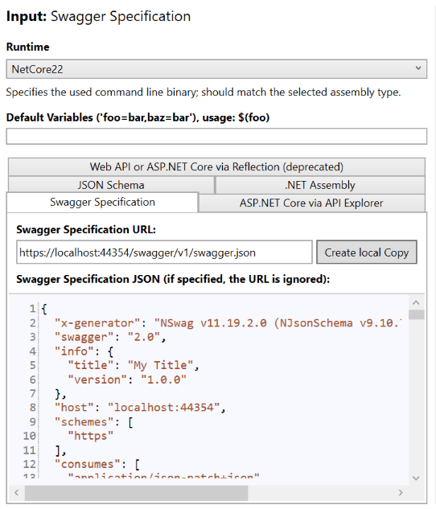
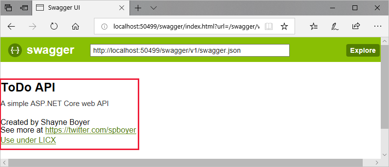

# Get started with NSwag and ASP.NET Core

:::moniker range=">= aspnetcore-6.0"
By [Christoph Nienaber](https://twitter.com/zuckerthoben), [Rico Suter](https://rsuter.com), and [Dave Brock](https://twitter.com/daveabrock)

[View or download sample code](https://github.com/dotnet/AspNetCore.Docs/tree/main/aspnetcore/tutorials/web-api-help-pages-using-swagger/samples/7.x/NSwagSample) ([how to download](xref:index#how-to-download-a-sample))

NSwag offers the following capabilities:

* The ability to utilize the Swagger UI and Swagger generator.
* Flexible code generation capabilities.

With NSwag, you don't need an existing API&mdash;you can use third-party APIs that incorporate Swagger and generate a client implementation. NSwag allows you to expedite the development cycle and easily adapt to API changes.

## Package installation

Install NSwag to:

* Generate the Swagger specification for the implemented web API.
* Serve the Swagger UI to browse and test the web API.
* Serve the Redoc to add API documentation for the Web API.

To use the [NSwag](https://github.com/RicoSuter/NSwag) ASP.NET Core middleware, install the [NSwag.AspNetCore](https://www.nuget.org/packages/NSwag.AspNetCore/) NuGet package. This package contains the middleware to generate and serve the Swagger specification, Swagger UI (v2 and v3), and [ReDoc UI](https://github.com/Rebilly/ReDoc).

Use one of the following approaches to install the NSwag NuGet package:

### [Visual Studio](#tab/visual-studio)

* From the **Package Manager Console** window:
  * Go to **View** > **Other Windows** > **Package Manager Console**
  * Navigate to the directory in which the `NSwagSample.csproj` file exists
  * Execute the following command:

    ```powershell
    Install-Package NSwag.AspNetCore
    ```

* From the **Manage NuGet Packages** dialog:
  * Right-click the project in **Solution Explorer** > **Manage NuGet Packages**
  * Set the **Package source** to "nuget.org"
  * Enter "NSwag.AspNetCore" in the search box
  * Select the "NSwag.AspNetCore" package from the **Browse** tab and click **Install**

### [Visual Studio for Mac](#tab/visual-studio-mac)

* Right-click the *Packages* folder in **Solution Pad** > **Add Packages...**
* Set the **Add Packages** window's **Source** drop-down to "nuget.org"
* Enter "NSwag.AspNetCore" in the search box
* Select the "NSwag.AspNetCore" package from the results pane and click **Add Package**

### [Visual Studio Code](#tab/visual-studio-code)

Run the following command from the **Integrated Terminal**:

```dotnetcli
dotnet add NSwagSample.csproj package NSwag.AspNetCore
```

### [.NET Core CLI](#tab/netcore-cli)

Run the following command:

```dotnetcli
dotnet add NSwagSample.csproj package NSwag.AspNetCore
```

---

## Add and configure Swagger middleware

Add and configure Swagger in your ASP.NET Core app by performing the following steps:

* Add the OpenApi generator to the services collection in `Program.cs`:

:::code language="csharp" source="web-api-help-pages-using-swagger/samples/7.x/NSwagSample/Snippets/Program.cs" id="snippet_ServicesDefault" highlight="4":::

* Enable the middleware for serving the generated OpenApi specification, the Swagger UI, and the Redoc UI, also in `Program.cs`:

:::code language="csharp" source="web-api-help-pages-using-swagger/samples/7.x/NSwagSample/Snippets/Program.cs" id="snippet_Middleware" highlight="5,9":::

* Launch the app. Navigate to:
  * `http://localhost:<port>/swagger` to view the Swagger UI.
  * `http://localhost:<port>/swagger/v1/swagger.json` to view the Swagger specification.

## Code generation

You can take advantage of NSwag's code generation capabilities by choosing one of the following options:

* [NSwagStudio](https://github.com/RicoSuter/NSwag/wiki/NSwagStudio): A Windows desktop app for generating API client code in C# or TypeScript.
* The [NSwag.CodeGeneration.CSharp](https://www.nuget.org/packages/NSwag.CodeGeneration.CSharp/) or [NSwag.CodeGeneration.TypeScript](https://www.nuget.org/packages/NSwag.CodeGeneration.TypeScript/) NuGet packages for code generation inside your project.
* NSwag from the [command line](https://github.com/RicoSuter/NSwag/wiki/CommandLine).
* The [NSwag.MSBuild](https://github.com/RicoSuter/NSwag/wiki/NSwag.MSBuild) NuGet package.
* The [Unchase OpenAPI (Swagger) Connected Service](https://marketplace.visualstudio.com/items?itemName=Unchase.unchaseopenapiconnectedservice): A Visual Studio Connected Service for generating API client code in C# or TypeScript. Also generates C# controllers for OpenAPI services with NSwag.

### Generate code with NSwagStudio

* Install NSwagStudio by following the instructions at the [NSwagStudio GitHub repository](https://github.com/RicoSuter/NSwag/wiki/NSwagStudio). On the NSwag release page, you can download an xcopy version which can be started without installation and admin privileges.
* Launch NSwagStudio and enter the `swagger.json` file URL in the **Swagger Specification URL** text box. For example, `http://localhost:5232/swagger/v1/swagger.json`.
* Click the **Create local Copy** button to generate a JSON representation of your Swagger specification.

:::image source="web-api-help-pages-using-swagger/_static/v6-nswag-NSwagStudio.png" alt-text="NSwag Studio imports the specification and exports a CSharp Client.":::

* In the **Outputs** area, click the **CSharp Client** checkbox. Depending on your project, you can also choose **TypeScript Client** or **CSharp Web API Controller**. If you select **CSharp Web API Controller**, a service specification rebuilds the service, serving as a reverse generation.
* Click **Generate Outputs** to produce a complete C# client implementation of the *TodoApi.NSwag* project. To see the generated client code, click the **CSharp Client** tab:

:::code language="csharp" source="web-api-help-pages-using-swagger/_static/v6-nswag-generated-todoclient.cs" range="19-55":::

> [!TIP]
> The C# client code is generated based on selections in the **Settings** tab. Modify the settings to perform tasks such as default namespace renaming and synchronous method generation.

* Copy the generated C# code into a file in the client project that will consume the API.
* Start consuming the web API:

:::code language="csharp" source="web-api-help-pages-using-swagger/samples/7.x/NSwagSample/Snippets/TodoHttpClientExample.cs":::

## Customize API documentation

OpenApi provides options for documenting the object model to ease the consumption of the web API.

### API info and description

In `Program.cs`, update `AddOpenApiDocument` to configure the document info of the Web API and include more information such as the author, license, and description.
Import the `NSwag` namespace first to use the `OpenApi` classes.

:::code language="csharp" source="web-api-help-pages-using-swagger/samples/7.x/NSwagSample/Program.cs" id="snippet_Services" highlight="1,8-24":::

The Swagger UI displays the version's information:

:::image source="web-api-help-pages-using-swagger/_static/v6-nswag-custom-info-swagger.png" alt-text="Swagger UI with version information.":::

### XML comments

To enable XML comments, perform the following steps:

#### [Visual Studio](#tab/visual-studio)

* Right-click the project in **Solution Explorer** and select *`Edit <project_name>.csproj`*.
* Manually add the highlighted lines to the `.csproj` file:

:::code language="xml" source="web-api-help-pages-using-swagger/samples/7.x/NSwagSample/NSwagSample.csproj" id="snippet_GenerateDocumentationFile" highlight="2":::

#### [Visual Studio for Mac](#tab/visual-studio-mac)

* From the *Solution Pad*, press **control** and click the project name. Navigate to **Tools** > **Edit File**.
* Manually add the highlighted lines to the `.csproj` file:

:::code language="xml" source="web-api-help-pages-using-swagger/samples/7.x/NSwagSample/NSwagSample.csproj" id="snippet_GenerateDocumentationFile" highlight="2":::

#### [Visual Studio Code](#tab/visual-studio-code)

Manually add the highlighted lines to the `.csproj` file:

:::code language="xml" source="web-api-help-pages-using-swagger/samples/7.x/NSwagSample/NSwagSample.csproj" id="snippet_GenerateDocumentationFile" highlight="2":::

#### [.NET Core CLI](#tab/netcore-cli)

Manually add the highlighted lines to the `.csproj` file:

:::code language="xml" source="web-api-help-pages-using-swagger/samples/7.x/NSwagSample/NSwagSample.csproj" id="snippet_GenerateDocumentationFile" highlight="2":::

---

Enabling XML comments provides debug information for undocumented public types and members. Undocumented types and members are indicated by the warning message. For example, the following message indicates a violation of warning code 1591:

```text
warning CS1591: Missing XML comment for publicly visible type or member 'TodoContext'
```

To suppress warnings project-wide, define a semicolon-delimited list of warning codes to ignore in the project file. Appending the warning codes to `$(NoWarn);` applies the [C# default values](https://github.com/dotnet/sdk/blob/2eb6c546931b5bcb92cd3128b93932a980553ea1/src/Tasks/Microsoft.NET.Build.Tasks/targets/Microsoft.NET.Sdk.CSharp.props#L16) too.

:::code language="xml" source="web-api-help-pages-using-swagger/samples/7.x/NSwagSample/NSwagSample.csproj" id="snippet_GenerateDocumentationFileWithNoWarn" highlight="3":::

To suppress warnings only for specific members, enclose the code in [#pragma warning](/dotnet/csharp/language-reference/preprocessor-directives/preprocessor-pragma-warning) preprocessor directives. This approach is useful for code that shouldn't be exposed via the API docs. In the following example, warning code CS1591 is ignored for the entire `TodoContext` class. Enforcement of the warning code is restored at the close of the class definition. Specify multiple warning codes with a comma-delimited list.

:::code language="csharp" source="web-api-help-pages-using-swagger/samples/7.x/NSwagSample/Models/TodoContext.cs" id="snippet_PragmaWarningDisable" highlight="3,10":::

### Data annotations

Mark the model with attributes, found in the <xref:System.ComponentModel.DataAnnotations?displayProperty=fullName> namespace, to help drive the Swagger UI components.

Add the `[Required]` attribute to the `Name` property of the `TodoItem` class:

:::code language="csharp" source="web-api-help-pages-using-swagger/samples/7.x/NSwagSample/Models/TodoItem.cs" highlight="10":::

The presence of this attribute changes the UI behavior and alters the underlying JSON schema:

:::code language="json" source="web-api-help-pages-using-swagger/_static/v6-nswag-swagger-schemas-todoitem.json" range="288-308" highlight="4-6":::

As the usage of data annotations in the web API increases, the UI and API help pages become more descriptive and useful.

### Describe response types

Developers consuming a web API are most concerned with what's returned&mdash;specifically response types and error codes (if not standard). The response types and error codes are denoted in the XML comments and data annotations.

The `Create` action returns an HTTP 201 status code on success. An HTTP 400 status code is returned when the posted request body is `null`. Without proper documentation in the Swagger UI, the consumer lacks knowledge of these expected outcomes. Fix that problem by adding the highlighted lines in the following example:

:::code language="csharp" source="web-api-help-pages-using-swagger/samples/7.x/NSwagSample/Controllers/TodoController.cs" id="snippet_Create" highlight="17-18,20-21":::

The Swagger UI now clearly documents the expected HTTP response codes (and the [XML comments](#xml-comments) are also displayed):

:::image source="web-api-help-pages-using-swagger/_static/v6-nswag-swagger-post.png" alt-text="Swagger UI showing POST Response Class description 'Returns the newly created Todo item' and '400 - If the item is null' for status code and reason under Response Messages.":::

Conventions can be used as an alternative to explicitly decorating individual actions with `[ProducesResponseType]`. For more information, see <xref:web-api/advanced/conventions>.

### Redoc

Redoc is an alternative to the Swagger UI.
It's similar because it also provides a documentation page for the Web API using the OpenAPI specification.
The difference is that Redoc UI is more focused on the documentation, and doesn't provide an interactive UI to test the API.

To enable Redoc, add its middleware to `Program.cs`:

:::code language="csharp" source="web-api-help-pages-using-swagger/samples/7.x/NSwagSample/Program.cs" id="snippet_Middleware" highlight="13-16":::

Run the application and navigate to `http://localhost:<port>/redoc` to view the Redoc UI:

:::image source="web-api-help-pages-using-swagger/_static/v6-nswag-redoc.png" alt-text="Redoc documentation for the Sample API.":::

:::moniker-end

:::moniker range="< aspnetcore-6.0"

By [Christoph Nienaber](https://twitter.com/zuckerthoben), [Rico Suter](https://rsuter.com), and [Dave Brock](https://twitter.com/daveabrock)

[View or download sample code](https://github.com/dotnet/AspNetCore.Docs/tree/main/aspnetcore/tutorials/web-api-help-pages-using-swagger/samples/2.1/TodoApi.NSwag) ([how to download](xref:index#how-to-download-a-sample))

NSwag offers the following capabilities:

* The ability to utilize the Swagger UI and Swagger generator.
* Flexible code generation capabilities.

With NSwag, you don't need an existing API&mdash;you can use third-party APIs that incorporate Swagger and generate a client implementation. NSwag allows you to expedite the development cycle and easily adapt to API changes.

## Register the NSwag middleware

Register the NSwag middleware to:

* Generate the Swagger specification for the implemented web API.
* Serve the Swagger UI to browse and test the web API.

To use the [NSwag](https://github.com/RicoSuter/NSwag) ASP.NET Core middleware, install the [NSwag.AspNetCore](https://www.nuget.org/packages/NSwag.AspNetCore/) NuGet package. This package contains the middleware to generate and serve the Swagger specification, Swagger UI (v2 and v3), and [ReDoc UI](https://github.com/Rebilly/ReDoc).

Use one of the following approaches to install the NSwag NuGet package:

### [Visual Studio](#tab/visual-studio)

* From the **Package Manager Console** window:
  * Go to **View** > **Other Windows** > **Package Manager Console**
  * Navigate to the directory in which the `TodoApi.csproj` file exists
  * Execute the following command:

    ```powershell
    Install-Package NSwag.AspNetCore
    ```

* From the **Manage NuGet Packages** dialog:
  * Right-click the project in **Solution Explorer** > **Manage NuGet Packages**
  * Set the **Package source** to "nuget.org"
  * Enter "NSwag.AspNetCore" in the search box
  * Select the "NSwag.AspNetCore" package from the **Browse** tab and click **Install**

### [Visual Studio for Mac](#tab/visual-studio-mac)

* Right-click the *Packages* folder in **Solution Pad** > **Add Packages...**
* Set the **Add Packages** window's **Source** drop-down to "nuget.org"
* Enter "NSwag.AspNetCore" in the search box
* Select the "NSwag.AspNetCore" package from the results pane and click **Add Package**

### [Visual Studio Code](#tab/visual-studio-code)

Run the following command from the **Integrated Terminal**:

```dotnetcli
dotnet add TodoApi.csproj package NSwag.AspNetCore
```

### [.NET Core CLI](#tab/netcore-cli)

Run the following command:

```dotnetcli
dotnet add TodoApi.csproj package NSwag.AspNetCore
```

---

## Add and configure Swagger middleware

Add and configure Swagger in your ASP.NET Core app by performing the following steps:

* In the `Startup.ConfigureServices` method, register the required Swagger services:

[!code-csharp[](../tutorials/web-api-help-pages-using-swagger/samples/2.0/TodoApi.NSwag/Startup.cs?name=snippet_ConfigureServices&highlight=8)]

* In the `Startup.Configure` method, enable the middleware for serving the generated Swagger specification and the Swagger UI:

[!code-csharp[](../tutorials/web-api-help-pages-using-swagger/samples/2.0/TodoApi.NSwag/Startup.cs?name=snippet_Configure&highlight=6-7)]

* Launch the app. Navigate to:
  * `http://localhost:<port>/swagger` to view the Swagger UI.
  * `http://localhost:<port>/swagger/v1/swagger.json` to view the Swagger specification.

## Code generation

You can take advantage of NSwag's code generation capabilities by choosing one of the following options:

* [NSwagStudio](https://github.com/RicoSuter/NSwag/wiki/NSwagStudio): A Windows desktop app for generating API client code in C# or TypeScript.
* The [NSwag.CodeGeneration.CSharp](https://www.nuget.org/packages/NSwag.CodeGeneration.CSharp/) or [NSwag.CodeGeneration.TypeScript](https://www.nuget.org/packages/NSwag.CodeGeneration.TypeScript/) NuGet packages for code generation inside your project.
* NSwag from the [command line](https://github.com/RicoSuter/NSwag/wiki/CommandLine).
* The [NSwag.MSBuild](https://github.com/RicoSuter/NSwag/wiki/NSwag.MSBuild) NuGet package.
* The [Unchase OpenAPI (Swagger) Connected Service](https://marketplace.visualstudio.com/items?itemName=Unchase.unchaseopenapiconnectedservice): A Visual Studio Connected Service for generating API client code in C# or TypeScript. Also generates C# controllers for OpenAPI services with NSwag.

### Generate code with NSwagStudio

* Install NSwagStudio by following the instructions at the [NSwagStudio GitHub repository](https://github.com/RicoSuter/NSwag/wiki/NSwagStudio). On the NSwag release page you can download an xcopy version which can be started without installation and admin privileges.
* Launch NSwagStudio and enter the `swagger.json` file URL in the **Swagger Specification URL** text box. For example, `http://localhost:44354/swagger/v1/swagger.json`.
* Click the **Create local Copy** button to generate a JSON representation of your Swagger specification.

  

* In the **Outputs** area, click the **CSharp Client** checkbox. Depending on your project, you can also choose **TypeScript Client** or **CSharp Web API Controller**. If you select **CSharp Web API Controller**, a service specification rebuilds the service, serving as a reverse generation.
* Click **Generate Outputs** to produce a complete C# client implementation of the *TodoApi.NSwag* project. To see the generated client code, click the **CSharp Client** tab:

```csharp
//----------------------
// <auto-generated>
//     Generated using the NSwag toolchain v12.0.9.0 (NJsonSchema v9.13.10.0 (Newtonsoft.Json v11.0.0.0)) (http://NSwag.org)
// </auto-generated>
//----------------------

namespace MyNamespace
{
    #pragma warning disable

    [System.CodeDom.Compiler.GeneratedCode("NSwag", "12.0.9.0 (NJsonSchema v9.13.10.0 (Newtonsoft.Json v11.0.0.0))")]
    public partial class TodoClient
    {
        private string _baseUrl = "https://localhost:44354";
        private System.Net.Http.HttpClient _httpClient;
        private System.Lazy<Newtonsoft.Json.JsonSerializerSettings> _settings;

        public TodoClient(System.Net.Http.HttpClient httpClient)
        {
            _httpClient = httpClient;
            _settings = new System.Lazy<Newtonsoft.Json.JsonSerializerSettings>(() =>
            {
                var settings = new Newtonsoft.Json.JsonSerializerSettings();
                UpdateJsonSerializerSettings(settings);
                return settings;
            });
        }

        public string BaseUrl
        {
            get { return _baseUrl; }
            set { _baseUrl = value; }
        }

        // code omitted for brevity
```

> [!TIP]
> The C# client code is generated based on selections in the **Settings** tab. Modify the settings to perform tasks such as default namespace renaming and synchronous method generation.

* Copy the generated C# code into a file in the client project that will consume the API.
* Start consuming the web API:

```csharp
 var todoClient = new TodoClient();

// Gets all to-dos from the API
 var allTodos = await todoClient.GetAllAsync();

 // Create a new TodoItem, and save it via the API.
var createdTodo = await todoClient.CreateAsync(new TodoItem());

// Get a single to-do by ID
var foundTodo = await todoClient.GetByIdAsync(1);
```

## Customize API documentation

Swagger provides options for documenting the object model to ease consumption of the web API.

### API info and description

In the `Startup.ConfigureServices` method, a configuration action passed to the `AddSwaggerDocument` method adds information such as the author, license, and description:

[!code-csharp[](../tutorials/web-api-help-pages-using-swagger/samples/2.0/TodoApi.NSwag/Startup2.cs?name=snippet_AddSwaggerDocument)]

The Swagger UI displays the version's information:



### XML comments

To enable XML comments, perform the following steps:

#### [Visual Studio](#tab/visual-studio)

* Right-click the project in **Solution Explorer** and select *`Edit <project_name>.csproj`*.
* Manually add the highlighted lines to the `.csproj` file:

[!code-xml[](../tutorials/web-api-help-pages-using-swagger/samples/2.1/TodoApi.NSwag/TodoApi.csproj?name=snippet_DocumentationFileElement&highlight=1-2,4)]

#### [Visual Studio for Mac](#tab/visual-studio-mac)

* From the *Solution Pad*, press **control** and click the project name. Navigate to **Tools** > **Edit File**.
* Manually add the highlighted lines to the `.csproj` file:

[!code-xml[](../tutorials/web-api-help-pages-using-swagger/samples/2.1/TodoApi.NSwag/TodoApi.csproj?name=snippet_DocumentationFileElement&highlight=1-2,4)]

#### [Visual Studio Code](#tab/visual-studio-code)

Manually add the highlighted lines to the `.csproj` file:

[!code-xml[](../tutorials/web-api-help-pages-using-swagger/samples/2.1/TodoApi.NSwag/TodoApi.csproj?name=snippet_DocumentationFileElement&highlight=1-2,4)]

#### [.NET Core CLI](#tab/netcore-cli)

Manually add the highlighted lines to the `.csproj` file:

[!code-xml[](../tutorials/web-api-help-pages-using-swagger/samples/2.1/TodoApi.NSwag/TodoApi.csproj?name=snippet_DocumentationFileElement&highlight=1-2,4)]

---

### Data annotations

Because NSwag uses [Reflection](/dotnet/csharp/programming-guide/concepts/reflection), and the recommended return type for web API actions is [ActionResult\<T>](xref:Microsoft.AspNetCore.Mvc.ActionResult%601), it can only infer the return type defined by `T`. You can't automatically infer other possible return types.

Consider the following example:

[!code-csharp[](../tutorials/web-api-help-pages-using-swagger/samples/2.1/TodoApi.NSwag/Controllers/TodoController.cs?name=snippet_CreateAction)]

The preceding action returns `ActionResult<T>`. Inside the action, it's returning <xref:Microsoft.AspNetCore.Mvc.ControllerBase.CreatedAtRoute%2A>. Since the controller has the [`[ApiController]`](xref:Microsoft.AspNetCore.Mvc.ApiControllerAttribute) attribute, a <xref:Microsoft.AspNetCore.Mvc.ControllerBase.BadRequest%2A> response is possible, too. For more information, see [Automatic HTTP 400 responses](xref:web-api/index#automatic-http-400-responses). Use data annotations to tell clients which HTTP status codes this action is known to return. Mark the action with the following attributes:

[!code-csharp[](../tutorials/web-api-help-pages-using-swagger/samples/2.1/TodoApi.NSwag/Controllers/TodoController.cs?name=snippet_CreateActionAttributes)]

In ASP.NET Core 2.2 or later, you can use conventions instead of explicitly decorating individual actions with `[ProducesResponseType]`. For more information, see <xref:web-api/advanced/conventions>.

The Swagger generator can now accurately describe this action, and generated clients know what they receive when calling the endpoint. As a recommendation, mark all actions with these attributes.

For guidelines on what HTTP responses your API actions should return, see [RFC 9110: HTTP Semantics (Section 9.3. Method Definitions)](https://www.rfc-editor.org/rfc/rfc9110#name-method-definitions).

:::moniker-end
