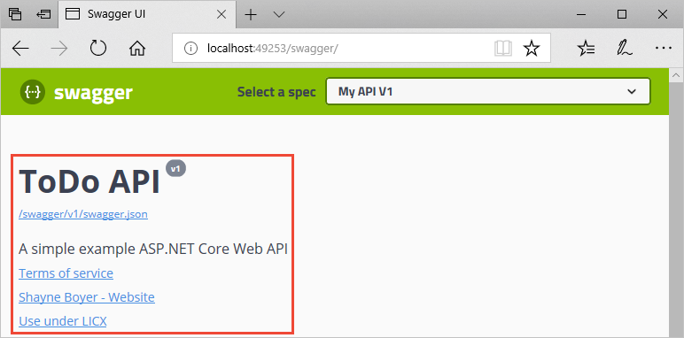
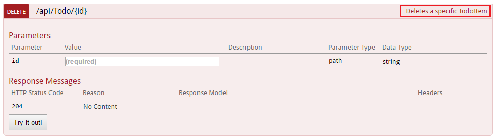
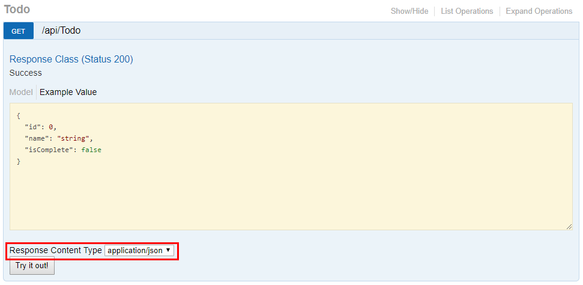
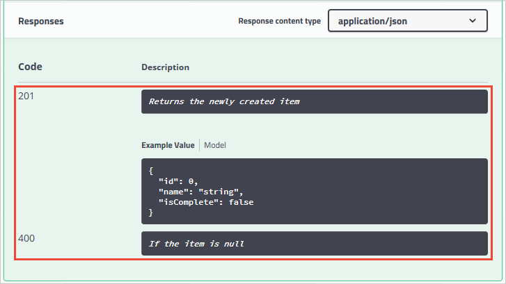
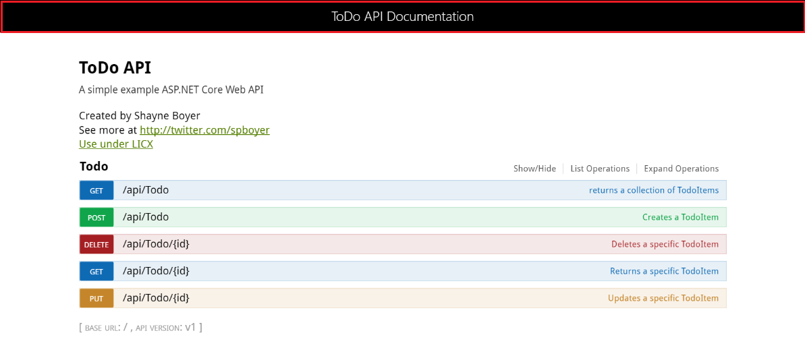

# Get started with Swashbuckle and ASP.NET Core

By [Shayne Boyer](https://twitter.com/spboyer) and [Scott Addie](https://twitter.com/Scott_Addie)

[View or download sample code](https://github.com/dotnet/AspNetCore.Docs/tree/master/aspnetcore/tutorials/web-api-help-pages-using-swagger/samples/) ([how to download](xref:index#how-to-download-a-sample))

There are three main components to Swashbuckle:

* [Swashbuckle.AspNetCore.Swagger](https://www.nuget.org/packages/Swashbuckle.AspNetCore.Swagger/): a Swagger object model and middleware to expose `SwaggerDocument` objects as JSON endpoints.

* [Swashbuckle.AspNetCore.SwaggerGen](https://www.nuget.org/packages/Swashbuckle.AspNetCore.SwaggerGen/): a Swagger generator that builds `SwaggerDocument` objects directly from your routes, controllers, and models. It's typically combined with the Swagger endpoint middleware to automatically expose Swagger JSON.

* [Swashbuckle.AspNetCore.SwaggerUI](https://www.nuget.org/packages/Swashbuckle.AspNetCore.SwaggerUI/): an embedded version of the Swagger UI tool. It interprets Swagger JSON to build a rich, customizable experience for describing the web API functionality. It includes built-in test harnesses for the public methods.

## Package installation

Swashbuckle can be added with the following approaches:

### [Visual Studio](#tab/visual-studio)

* From the **Package Manager Console** window:
  * Go to **View** > **Other Windows** > **Package Manager Console**
  * Navigate to the directory in which the *TodoApi.csproj* file exists
  * Execute the following command:

    ```powershell
    Install-Package Swashbuckle.AspNetCore -Version 5.0.0
    ```

* From the **Manage NuGet Packages** dialog:
  * Right-click the project in **Solution Explorer** > **Manage NuGet Packages**
  * Set the **Package source** to "nuget.org"
  * Ensure the "Include prerelease" option is enabled
  * Enter "Swashbuckle.AspNetCore" in the search box
  * Select the latest "Swashbuckle.AspNetCore" package from the **Browse** tab and click **Install**

### [Visual Studio for Mac](#tab/visual-studio-mac)

* Right-click the *Packages* folder in **Solution Pad** > **Add Packages...**
* Set the **Add Packages** window's **Source** drop-down to "nuget.org"
* Ensure the "Show pre-release packages" option is enabled
* Enter "Swashbuckle.AspNetCore" in the search box
* Select the latest "Swashbuckle.AspNetCore" package from the results pane and click **Add Package**

### [Visual Studio Code](#tab/visual-studio-code)

Run the following command from the **Integrated Terminal**:

```dotnetcli
dotnet add TodoApi.csproj package Swashbuckle.AspNetCore -v 5.0.0
```

### [.NET Core CLI](#tab/netcore-cli)

Run the following command:

```dotnetcli
dotnet add TodoApi.csproj package Swashbuckle.AspNetCore -v 5.0.0
```

---

## Add and configure Swagger middleware

In the `Startup` class, import the following namespace to use the `OpenApiInfo` class:

[!code-csharp[](../tutorials/web-api-help-pages-using-swagger/samples/2.0/TodoApi.Swashbuckle/Startup2.cs?name=snippet_InfoClassNamespace)]

Add the Swagger generator to the services collection in the `Startup.ConfigureServices` method:

::: moniker range="<= aspnetcore-2.0"

[!code-csharp[](../tutorials/web-api-help-pages-using-swagger/samples/2.0/TodoApi.Swashbuckle/Startup2.cs?name=snippet_ConfigureServices&highlight=8-11)]

::: moniker-end

::: moniker range=">= aspnetcore-2.1 <= aspnetcore-2.2"

[!code-csharp[](../tutorials/web-api-help-pages-using-swagger/samples/2.1/TodoApi.Swashbuckle/Startup2.cs?name=snippet_ConfigureServices&highlight=9-12)]

::: moniker-end

::: moniker range=">= aspnetcore-3.0"

[!code-csharp[](../tutorials/web-api-help-pages-using-swagger/samples/3.0/TodoApi.Swashbuckle/Startup2.cs?name=snippet_ConfigureServices&highlight=8-11)]

::: moniker-end

In the `Startup.Configure` method, enable the middleware for serving the generated JSON document and the Swagger UI:

::: moniker range=">= aspnetcore-2.1 <= aspnetcore-2.2"

[!code-csharp[](../tutorials/web-api-help-pages-using-swagger/samples/2.0/TodoApi.Swashbuckle/Startup2.cs?name=snippet_Configure&highlight=4,8-11)]

::: moniker-end

::: moniker range=">= aspnetcore-3.0"

[!code-csharp[](../tutorials/web-api-help-pages-using-swagger/samples/3.0/TodoApi.Swashbuckle/Startup2.cs?name=snippet_Configure&highlight=4,8-11)]

::: moniker-end

The preceding `UseSwaggerUI` method call enables the [Static File Middleware](xref:fundamentals/static-files). If targeting .NET Framework or .NET Core 1.x, add the [Microsoft.AspNetCore.StaticFiles](https://www.nuget.org/packages/Microsoft.AspNetCore.StaticFiles/) NuGet package to the project.

Launch the app, and navigate to `http://localhost:<port>/swagger/v1/swagger.json`. The generated document describing the endpoints appears as shown in [Swagger specification (swagger.json)](xref:tutorials/web-api-help-pages-using-swagger#swagger-specification-swaggerjson).

The Swagger UI can be found at `http://localhost:<port>/swagger`. Explore the API via Swagger UI and incorporate it in other programs.

> [!TIP]
> To serve the Swagger UI at the app's root (`http://localhost:<port>/`), set the `RoutePrefix` property to an empty string:
>
> [!code-csharp[](../tutorials/web-api-help-pages-using-swagger/samples/2.0/TodoApi.Swashbuckle/Startup3.cs?name=snippet_UseSwaggerUI&highlight=4)]

If using directories with IIS or a reverse proxy, set the Swagger endpoint to a relative path using the `./` prefix. For example, `./swagger/v1/swagger.json`. Using `/swagger/v1/swagger.json` instructs the app to look for the JSON file at the true root of the URL (plus the route prefix, if used). For example, use `http://localhost:<port>/<route_prefix>/swagger/v1/swagger.json` instead of `http://localhost:<port>/<virtual_directory>/<route_prefix>/swagger/v1/swagger.json`.

## Customize and extend

Swagger provides options for documenting the object model and customizing the UI to match your theme.

In the `Startup` class, add the following namespaces:

```csharp
using System;
using System.Reflection;
using System.IO;
```

### API info and description

The configuration action passed to the `AddSwaggerGen` method adds information such as the author, license, and description:

[!code-csharp[](../tutorials/web-api-help-pages-using-swagger/samples/2.0/TodoApi.Swashbuckle/Startup4.cs?name=snippet_AddSwaggerGen)]

The Swagger UI displays the version's information:



### XML comments

XML comments can be enabled with the following approaches:

#### [Visual Studio](#tab/visual-studio)

::: moniker range=">= aspnetcore-2.0"

* Right-click the project in **Solution Explorer** and select **Edit <project_name>.csproj**.
* Manually add the highlighted lines to the *.csproj* file:

[!code-xml[](../tutorials/web-api-help-pages-using-swagger/samples/2.1/TodoApi.Swashbuckle/TodoApi.csproj?name=snippet_SuppressWarnings&highlight=1-2,4)]

::: moniker-end

::: moniker range="<= aspnetcore-1.1"

* Right-click the project in **Solution Explorer** and select **Properties**.
* Check the **XML documentation file** box under the **Output** section of the **Build** tab.

::: moniker-end

#### [Visual Studio for Mac](#tab/visual-studio-mac)

::: moniker range=">= aspnetcore-2.0"

* From the *Solution Pad*, press **control** and click the project name. Navigate to **Tools** > **Edit File**.
* Manually add the highlighted lines to the *.csproj* file:

[!code-xml[](../tutorials/web-api-help-pages-using-swagger/samples/2.1/TodoApi.Swashbuckle/TodoApi.csproj?name=snippet_SuppressWarnings&highlight=1-2,4)]

::: moniker-end

::: moniker range="<= aspnetcore-1.1"

* Open the **Project Options** dialog > **Build** > **Compiler**
* Check the **Generate xml documentation** box under the **General Options** section

::: moniker-end

#### [Visual Studio Code](#tab/visual-studio-code)

Manually add the highlighted lines to the *.csproj* file:

::: moniker range=">= aspnetcore-2.0"

[!code-xml[](../tutorials/web-api-help-pages-using-swagger/samples/2.1/TodoApi.Swashbuckle/TodoApi.csproj?name=snippet_SuppressWarnings&highlight=1-2,4)]

::: moniker-end

::: moniker range="<= aspnetcore-1.1"

[!code-xml[](../tutorials/web-api-help-pages-using-swagger/samples/2.0/TodoApi.Swashbuckle/TodoApi.csproj?name=snippet_SuppressWarnings&highlight=1-2,4)]

::: moniker-end

#### [.NET Core CLI](#tab/netcore-cli)

Manually add the highlighted lines to the *.csproj* file:

::: moniker range=">= aspnetcore-2.0"

[!code-xml[](../tutorials/web-api-help-pages-using-swagger/samples/2.1/TodoApi.Swashbuckle/TodoApi.csproj?name=snippet_SuppressWarnings&highlight=1-2,4)]

::: moniker-end

::: moniker range="<= aspnetcore-1.1"

[!code-xml[](../tutorials/web-api-help-pages-using-swagger/samples/2.0/TodoApi.Swashbuckle/TodoApi.csproj?name=snippet_SuppressWarnings&highlight=1-2,4)]

::: moniker-end

---

Enabling XML comments provides debug information for undocumented public types and members. Undocumented types and members are indicated by the warning message. For example, the following message indicates a violation of warning code 1591:

```text
warning CS1591: Missing XML comment for publicly visible type or member 'TodoController.GetAll()'
```

To suppress warnings project-wide, define a semicolon-delimited list of warning codes to ignore in the project file. Appending the warning codes to `$(NoWarn);` applies the [C# default values](https://github.com/dotnet/sdk/blob/2eb6c546931b5bcb92cd3128b93932a980553ea1/src/Tasks/Microsoft.NET.Build.Tasks/targets/Microsoft.NET.Sdk.CSharp.props#L16) too.

::: moniker range=">= aspnetcore-2.0"

[!code-xml[](../tutorials/web-api-help-pages-using-swagger/samples/2.1/TodoApi.Swashbuckle/TodoApi.csproj?name=snippet_SuppressWarnings&highlight=3)]

::: moniker-end

::: moniker range="<= aspnetcore-1.1"

[!code-xml[](../tutorials/web-api-help-pages-using-swagger/samples/2.0/TodoApi.Swashbuckle/TodoApi.csproj?name=snippet_SuppressWarnings&highlight=3)]

::: moniker-end

To suppress warnings only for specific members, enclose the code in [#pragma warning](/dotnet/csharp/language-reference/preprocessor-directives/preprocessor-pragma-warning) preprocessor directives. This approach is useful for code that shouldn't be exposed via the API docs. In the following example, warning code CS1591 is ignored for the entire `Program` class. Enforcement of the warning code is restored at the close of the class definition. Specify multiple warning codes with a comma-delimited list.

```csharp
namespace TodoApi
{
#pragma warning disable CS1591
    public class Program
    {
        public static void Main(string[] args) =>
            BuildWebHost(args).Run();

        public static IWebHost BuildWebHost(string[] args) =>
            WebHost.CreateDefaultBuilder(args)
                .UseStartup<Startup>()
                .Build();
    }
#pragma warning restore CS1591
}
```

Configure Swagger to use the XML file that's generated with the preceding instructions. For Linux or non-Windows operating systems, file names and paths can be case-sensitive. For example, a *TodoApi.XML* file is valid on Windows but not CentOS.

::: moniker range=">= aspnetcore-3.0"

[!code-csharp[](../tutorials/web-api-help-pages-using-swagger/samples/3.0/TodoApi.Swashbuckle/Startup.cs?name=snippet_ConfigureServices&highlight=30-32)]

::: moniker-end

::: moniker range=">= aspnetcore-2.1 <= aspnetcore-2.2"

[!code-csharp[](../tutorials/web-api-help-pages-using-swagger/samples/2.1/TodoApi.Swashbuckle/Startup.cs?name=snippet_ConfigureServices&highlight=31-33)]

::: moniker-end

::: moniker range="= aspnetcore-2.0"

[!code-csharp[](../tutorials/web-api-help-pages-using-swagger/samples/2.0/TodoApi.Swashbuckle/Startup.cs?name=snippet_ConfigureServices&highlight=30-32)]

::: moniker-end

::: moniker range="<= aspnetcore-1.1"

[!code-csharp[](../tutorials/web-api-help-pages-using-swagger/samples/2.0/TodoApi.Swashbuckle/Startup1x.cs?name=snippet_ConfigureServices&highlight=30-32)]

::: moniker-end

In the preceding code, [Reflection](/dotnet/csharp/programming-guide/concepts/reflection) is used to build an XML file name matching that of the web API project. The [AppContext.BaseDirectory](xref:System.AppContext.BaseDirectory*) property is used to construct a path to the XML file. Some Swagger features (for example, schemata of input parameters or HTTP methods and response codes from the respective attributes) work without the use of an XML documentation file. For most features, namely method summaries and the descriptions of parameters and response codes, the use of an XML file is mandatory.

Adding triple-slash comments to an action enhances the Swagger UI by adding the description to the section header. Add a [\<summary>](/dotnet/csharp/programming-guide/xmldoc/summary) element above the `Delete` action:

[!code-csharp[](../tutorials/web-api-help-pages-using-swagger/samples/2.0/TodoApi.Swashbuckle/Controllers/TodoController.cs?name=snippet_Delete&highlight=1-3)]

The Swagger UI displays the inner text of the preceding code's `<summary>` element:



The UI is driven by the generated JSON schema:

```json
"delete": {
    "tags": [
        "Todo"
    ],
    "summary": "Deletes a specific TodoItem.",
    "operationId": "ApiTodoByIdDelete",
    "consumes": [],
    "produces": [],
    "parameters": [
        {
            "name": "id",
            "in": "path",
            "description": "",
            "required": true,
            "type": "integer",
            "format": "int64"
        }
    ],
    "responses": {
        "200": {
            "description": "Success"
        }
    }
}
```

Add a [\<remarks>](/dotnet/csharp/programming-guide/xmldoc/remarks) element to the `Create` action method documentation. It supplements information specified in the `<summary>` element and provides a more robust Swagger UI. The `<remarks>` element content can consist of text, JSON, or XML.

::: moniker range="<= aspnetcore-2.0"

[!code-csharp[](../tutorials/web-api-help-pages-using-swagger/samples/2.0/TodoApi.Swashbuckle/Controllers/TodoController.cs?name=snippet_Create&highlight=4-14)]

::: moniker-end

::: moniker range=">= aspnetcore-2.1 <= aspnetcore-2.2"

[!code-csharp[](../tutorials/web-api-help-pages-using-swagger/samples/2.1/TodoApi.Swashbuckle/Controllers/TodoController.cs?name=snippet_Create&highlight=4-14)]

::: moniker-end

::: moniker range=">= aspnetcore-3.0"

[!code-csharp[](../tutorials/web-api-help-pages-using-swagger/samples/3.0/TodoApi.Swashbuckle/Controllers/TodoController.cs?name=snippet_Create&highlight=4-14)]

::: moniker-end

Notice the UI enhancements with these additional comments:


### Data annotations

Mark the model with attributes, found in the [System.ComponentModel.DataAnnotations](/dotnet/api/system.componentmodel.dataannotations) namespace, to help drive the Swagger UI components.

Add the `[Required]` attribute to the `Name` property of the `TodoItem` class:

[!code-csharp[](../tutorials/web-api-help-pages-using-swagger/samples/2.0/TodoApi.Swashbuckle/Models/TodoItem.cs?highlight=10)]

The presence of this attribute changes the UI behavior and alters the underlying JSON schema:

```json
"definitions": {
    "TodoItem": {
        "required": [
            "name"
        ],
        "type": "object",
        "properties": {
            "id": {
                "format": "int64",
                "type": "integer"
            },
            "name": {
                "type": "string"
            },
            "isComplete": {
                "default": false,
                "type": "boolean"
            }
        }
    }
},
```

Add the `[Produces("application/json")]` attribute to the API controller. Its purpose is to declare that the controller's actions support a response content type of *application/json*:

::: moniker range="<= aspnetcore-2.0"

[!code-csharp[](../tutorials/web-api-help-pages-using-swagger/samples/2.0/TodoApi.Swashbuckle/Controllers/TodoController.cs?name=snippet_TodoController&highlight=1)]

::: moniker-end

::: moniker range=">= aspnetcore-2.1 <= aspnetcore-2.2"

[!code-csharp[](../tutorials/web-api-help-pages-using-swagger/samples/2.1/TodoApi.Swashbuckle/Controllers/TodoController.cs?name=snippet_TodoController&highlight=1)]

::: moniker-end

::: moniker range=">= aspnetcore-3.0"

[!code-csharp[](../tutorials/web-api-help-pages-using-swagger/samples/3.0/TodoApi.Swashbuckle/Controllers/TodoController.cs?name=snippet_TodoController&highlight=1)]

::: moniker-end

The **Response Content Type** drop-down selects this content type as the default for the controller's GET actions:



As the usage of data annotations in the web API increases, the UI and API help pages become more descriptive and useful.

### Describe response types

Developers consuming a web API are most concerned with what's returned&mdash;specifically response types and error codes (if not standard). The response types and error codes are denoted in the XML comments and data annotations.

The `Create` action returns an HTTP 201 status code on success. An HTTP 400 status code is returned when the posted request body is null. Without proper documentation in the Swagger UI, the consumer lacks knowledge of these expected outcomes. Fix that problem by adding the highlighted lines in the following example:

::: moniker range="<= aspnetcore-2.0"

[!code-csharp[](../tutorials/web-api-help-pages-using-swagger/samples/2.0/TodoApi.Swashbuckle/Controllers/TodoController.cs?name=snippet_Create&highlight=17,18,20,21)]

::: moniker-end

::: moniker range=">= aspnetcore-2.1 <= aspnetcore-2.2"

[!code-csharp[](../tutorials/web-api-help-pages-using-swagger/samples/2.1/TodoApi.Swashbuckle/Controllers/TodoController.cs?name=snippet_Create&highlight=17,18,20,21)]

::: moniker-end

::: moniker range=">= aspnetcore-3.0"

[!code-csharp[](../tutorials/web-api-help-pages-using-swagger/samples/3.0/TodoApi.Swashbuckle/Controllers/TodoController.cs?name=snippet_Create&highlight=17,18,20,21)]

::: moniker-end

The Swagger UI now clearly documents the expected HTTP response codes:



::: moniker range=">= aspnetcore-2.2"

In ASP.NET Core 2.2 or later, conventions can be used as an alternative to explicitly decorating individual actions with `[ProducesResponseType]`. For more information, see <xref:web-api/advanced/conventions>.

::: moniker-end

### Customize the UI

The stock UI is both functional and presentable. However, API documentation pages should represent your brand or theme. Branding the Swashbuckle components requires adding the resources to serve static files and building the folder structure to host those files.

If targeting .NET Framework or .NET Core 1.x, add the [Microsoft.AspNetCore.StaticFiles](https://www.nuget.org/packages/Microsoft.AspNetCore.StaticFiles) NuGet package to the project:

```xml
<PackageReference Include="Microsoft.AspNetCore.StaticFiles" Version="2.0.0" />
```

The preceding NuGet package is already installed if targeting .NET Core 2.x and using the [metapackage](xref:fundamentals/metapackage).

Enable Static File Middleware:

::: moniker range=">= aspnetcore-2.1 <= aspnetcore-2.2"

[!code-csharp[](../tutorials/web-api-help-pages-using-swagger/samples/2.1/TodoApi.Swashbuckle/Startup.cs?name=snippet_Configure&highlight=3)]

::: moniker-end

::: moniker range=">= aspnetcore-3.0"

[!code-csharp[](../tutorials/web-api-help-pages-using-swagger/samples/3.0/TodoApi.Swashbuckle/Startup.cs?name=snippet_Configure&highlight=3)]

::: moniker-end

Acquire the contents of the *dist* folder from the [Swagger UI GitHub repository](https://github.com/swagger-api/swagger-ui/tree/master/dist). This folder contains the necessary assets for the Swagger UI page.

Create a *wwwroot/swagger/ui* folder, and copy into it the contents of the *dist* folder.

Create a *custom.css* file, in *wwwroot/swagger/ui*, with the following CSS to customize the page header:

[!code-css[](../tutorials/web-api-help-pages-using-swagger/samples/2.0/TodoApi.Swashbuckle/wwwroot/swagger/ui/custom.css)]

Reference *custom.css* in the *index.html* file inside ui folder, after any other CSS files:

[!code-html[](../tutorials/web-api-help-pages-using-swagger/samples/2.0/TodoApi.Swashbuckle/wwwroot/swagger/ui/index.html?name=snippet_SwaggerUiCss&highlight=3)]

Browse to the *index.html* page at `http://localhost:<port>/swagger/ui/index.html`. Enter `https://localhost:<port>/swagger/v1/swagger.json` in the header's textbox, and click the **Explore** button. The resulting page looks as follows:



There's much more you can do with the page. See the full capabilities for the UI resources at the [Swagger UI GitHub repository](https://github.com/swagger-api/swagger-ui).
