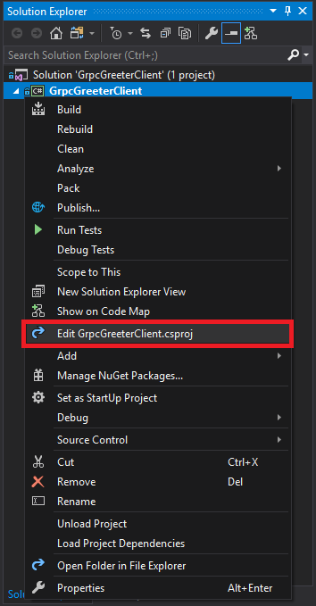

# Tutorial: Create a .NET Core gRPC client

By [John Luo](https://github.com/juntaoluo)

This tutorial shows how to create a .NET Core [gRPC](https://grpc.io/docs/guides/) client that can communicate with gRPC services.

At the end, you'll have a gRPC client that communicates with the gRPC Greeter service.

[!INCLUDE[View or download sample code](~/includes/grpc/downloadClient.md)]

In this tutorial, you:

> [!div class="checklist"]
> * Create a gRPC client.
> * Run the service against the gRPC Greeter service created in the previous tutorial.
> * Examine the project files.

[!INCLUDE[](~/includes/net-core-prereqs-all-3.0.md)]

## Create a .NET console application

# [Visual Studio](#tab/visual-studio)

Follow the instructions [here](https://docs.microsoft.com/en-us/dotnet/core/tutorials/with-visual-studio) to create a console app with the name *GrpcGreeterClient*.

# [Visual Studio Code](#tab/visual-studio-code)

Follow the instructions [here](https://docs.microsoft.com/en-us/dotnet/core/tutorials/with-visual-studio-code) to create a console app with the name *GrpcGreeterClient*.

# [Visual Studio for Mac](#tab/visual-studio-mac)

Follow the instructions [here](https://docs.microsoft.com/en-us/dotnet/core/tutorials/using-on-mac-vs-full-solution) to create a console app with the name *GrpcGreeterClient*.

<!-- End of VS tabs -->

---

## Add required packages

Add the following packages to the gRPC client project:

* [Grpc.Core](https://www.nuget.org/packages/Grpc.Core), which contains the C# API for the C-core client.
* [Google.Protobuf](https://www.nuget.org/packages/Google.Protobuf/), which contains protobuf message APIs for C#.
* [Grpc.Tools](https://www.nuget.org/packages/Grpc.Tools/), which contains C# tooling support for protobuf files. The tooling package isn't required at runtime, so the dependency is marked with `PrivateAssets="All"`.

Packages can be added with the following approaches:

### [Visual Studio](#tab/visual-studio)

### PMC option to install packages

* From Visual Studio, select **Tools** > **NuGet Package Manager** > **Package Manager Console**
* From the **Package Manager Console** window, navigate to the directory in which the *GrpcGreeterClient.csproj* file exists.
* Run the following command:

    ```powershell
    Install-Package Grpc.Core
    ```

* Repeat the `Install-Package` for Google.Protobuf and Grpc.Tools

<!-- Tutorials shouldn't have multiple options. Select what you think is the best approach. Recommend you removed this approach. -->

### Manage NuGet Packages option to install packages

* Right-click the project in **Solution Explorer** > **Manage NuGet Packages**
* Set the **Package source** to "nuget.org"
* Enter "Grpc.Core" in the search box
* Select the "Grpc.Core" package from the **Browse** tab and click **Install**
* Repeat for Google.Protobuf and Grpc.Tools

### [Visual Studio Code](#tab/visual-studio-code)

Run the following command from the **Integrated Terminal**:

```console
dotnet add TodoApi.csproj package Grpc.Core
```

Repeat for Google.Protobuf and Grpc.Tools

### [Visual Studio for Mac](#tab/visual-studio-mac)

* Right-click the *Packages* folder in **Solution Pad** > **Add Packages...**
* Set the **Add Packages** window's **Source** drop-down to "nuget.org"
* Enter "Grpc.Core" in the search box
* Select the "Grpc.Core" package from the results pane and click **Add Package**
* Repeat for Google.Protobuf and Grpc.Tools

---

## Add the greet.proto file

Copy the **Protos\greet.proto** file from the gRPC Greeter service to the gRPC client project. Add the **greet.proto** file to the `<Protobuf>` item group of the GrpcGreeterClient project file:

```XML
<Protobuf Include="Protos\greet.proto" GrpcServices="Client" />
```

> [!NOTE]
> You can open the project file of GrpcGreeterClient by right-clicking the project and selecting the **Edit GrpcGreeterClient.csproj** option from the dropdown menu.
>
> 
>
> Alternatively, you can navigate to the GrpcGreeterClient directory and edit the `GrpcGreeterClient.csproj` with your favorite editor.

The `GrpcServices="Client"` attribute is added so that only the C# client assets are generated for the included protobuf file. Build the client project to trigger the generation of the C# client assets.

## Create a GreeterClient and invoke the SayHello unary call

Add the following code to `Main` method of the `Program.cs` file of the gRPC client project:

[!code-cs[](~/tutorials/grpc/grpc-start/samples/GrpcGreeterClient/Program.cs?name=snippet)]

To access the required types the following using statements are required:

[!code-cs[](~/tutorials/grpc/grpc-start/samples/GrpcGreeterClient/Program.cs?name=using)]

The GreeterClient is created by instantiating a `Channel` containing the information for creating the connection to the gRPC service and using it to construct the `GreeterClient`:

[!code-cs[](~/tutorials/grpc/grpc-start/samples/GrpcGreeterClient/Program.cs?name=snippet&highlight=4-5)]

The GreeterClient contains the unary call `SayHello` which can be invoked asynchronously:

[!code-cs[](~/tutorials/grpc/grpc-start/samples/GrpcGreeterClient/Program.cs?name=snippet&highlight=7-8)]

The results of the `SayHello` call is stored in `reply` which can then be displayed:

[!code-cs[](~/tutorials/grpc/grpc-start/samples/GrpcGreeterClient/Program.cs?name=snippet&highlight=9)]

The `Channel` used by the client should be shut down when operations have finished to release all resources:

[!code-cs[](~/tutorials/grpc/grpc-start/samples/GrpcGreeterClient/Program.cs?name=snippet&highlight=11)]

> [!NOTE]
> You will need to build the project before the types in the **Greeter** namespace can be resolved. These types are generated automatically during build and are not be available before a build is run.

## Test the gRPC client with the gRPC Greeter service

# [Visual Studio](#tab/visual-studio)

* Ensure the Greeter service created in the previous tutorial is running.

* Once the service is running, return to the **GrpcGreeterClient** project set it as the Startup Project. Press Ctrl+F5 to run the client without the debugger.

  The client sends a greeting to the service with a message containing its name "GreeterClient". The service will send a message "Hello GreeterClient" as a response that is displayed in the command prompt.

  

  The service records the details of the successful call in the logs written to the command prompt.

  

# [Visual Studio Code / Visual Studio for Mac](#tab/visual-studio-code+visual-studio-mac)

* Ensure the Greeter service created in the previous tutorial is running.

* Run the Client project GrpcGreeter.Client from the separate command line using `dotnet run`.

The client sends a greeting to the service with a message containing its name "GreeterClient". The service will send a message "Hello GreeterClient" as a response that is displayed in the command prompt.

```console
Greeting: Hello GreeterClient
Press any key to exit...
```

The service records the details of the successful call in the logs written to the command prompt.

```console
dbug: Grpc.AspNetCore.Server.Internal.GrpcServiceBinder[1]
      Added gRPC method 'SayHello' to service 'Greet.Greeter'. Method type: 'Unary', route pattern: '/Greet.Greeter/SayHello'.
info: Microsoft.Hosting.Lifetime[0]
      Now listening on: http://localhost:50051
info: Microsoft.Hosting.Lifetime[0]
      Application started. Press Ctrl+C to shut down.
info: Microsoft.Hosting.Lifetime[0]
      Hosting environment: Development
info: Microsoft.Hosting.Lifetime[0]
      Content root path: C:\gh\Docs\aspnetcore\tutorials\grpc\grpc-start\samples\GrpcGreeter
info: Microsoft.AspNetCore.Hosting.Internal.GenericWebHostService[1]
      Request starting HTTP/2 POST http://localhost:50051/Greet.Greeter/SayHello application/grpc
info: Microsoft.AspNetCore.Routing.EndpointMiddleware[0]
      Executing endpoint 'gRPC - /Greet.Greeter/SayHello'
info: Microsoft.AspNetCore.Routing.EndpointMiddleware[1]
      Executed endpoint 'gRPC - /Greet.Greeter/SayHello'
info: Microsoft.AspNetCore.Hosting.Internal.GenericWebHostService[2]
      Request finished in 194.5798ms 200 application/grpc
```

<!-- End of combined VS/Mac tabs -->

---

### Examine the project files of the gRPC project

gRPC client GrpcGreeterClient file:

*Program.cs* contains the entry point and logic for the gRPC client.

## Additional resources

In this tutorial, you:

> [!div class="checklist"]
> * Create a gRPC client.
> * Run the service against the gRPC Greeter service created in the previous tutorial.
> * Examine the project files.

> [!div class="step-by-step"]
> [Previous: Create a gRPC Greeter Service](xref:tutorials/grpc/grpc-start)
