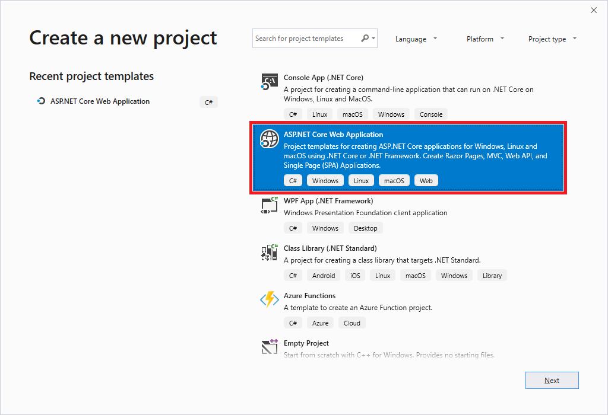
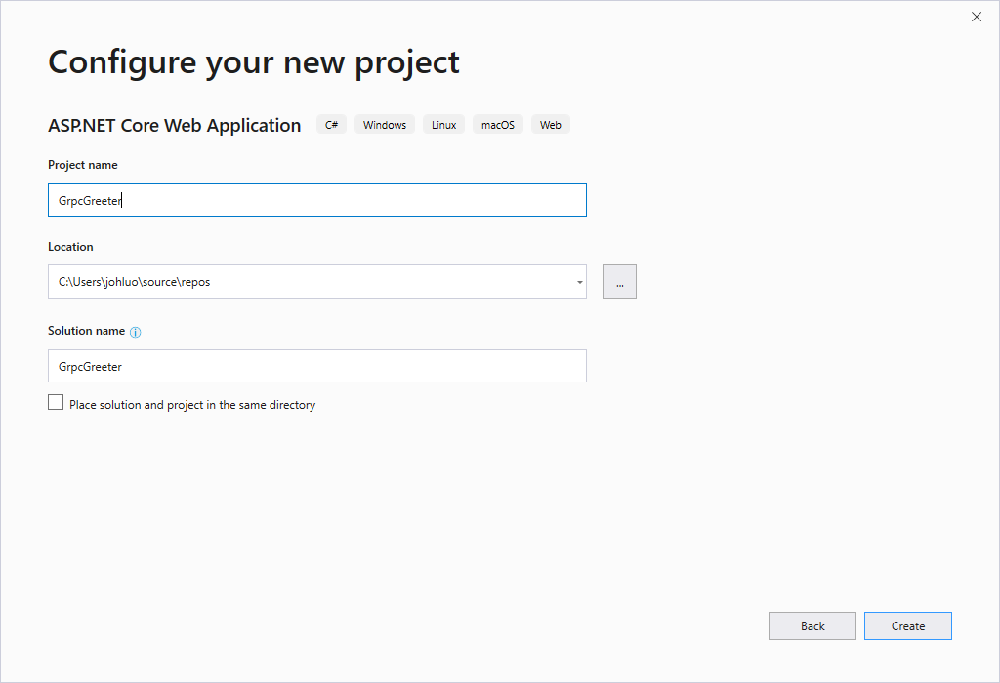
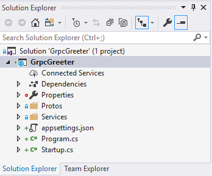
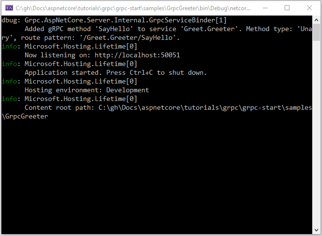
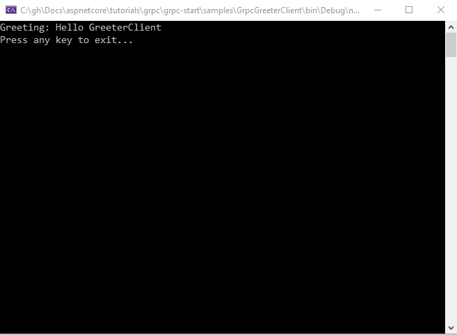
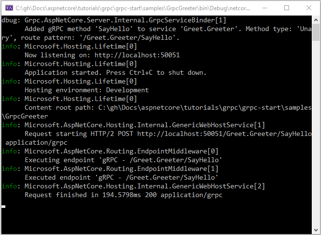

# Tutorial: Get started with gRPC service in ASP.NET Core

By [John Luo](https://github.com/juntaoluo)

This is the first tutorial of a series. [The series](xref:tutorials/grpc/index) teaches the basics of building a gRPC service on ASP.NET Core.

At the end, you'll have a gRPC service that echoes greetings.

[!INCLUDE[View or download sample code](~/includes/grpc/download.md)]

In this tutorial, you:

> [!div class="checklist"]
> * Create a gRPC service.
> * Run the service.
> * Examine the project files.

At the end of this tutorial you'll have a working gRPC service that you'll build on in later tutorials.

[!INCLUDE[](~/includes/net-core-prereqs-all-3.0.md)]

## Create a gRPC service

# [Visual Studio](#tab/visual-studio)

* From the Visual Studio **File** menu, select **New** > **Project**.

* Create a new ASP.NET Core Web Application.
  

* Name the project **GrpcGreeter**. It's important to name the project *GrpcGreeter* so the namespaces will match when you copy and paste code.

  

* Select **.NET Core** and **ASP.NET Core 3.0** in the dropdown. Choose the **gRPC Service** template.

  The following starter project is created:

  

# [Visual Studio Code](#tab/visual-studio-code)

* Open the [integrated terminal](https://code.visualstudio.com/docs/editor/integrated-terminal).

* Change directories (`cd`) to a folder which will contain the project.

* Run the following commands:

  ```console
  dotnet new grpc -o GrpcGreeter
  code -r GrpcGreeter
  ```

  * The `dotnet new` command creates a new gRPC service in the *GrpcGreeter* folder.
  * The `code` command opens the *GrpcGreeter* folder in a new instance of Visual Studio Code.

  A dialog box appears with **Required assets to build and debug are missing from 'GrpcGreeter'. Add them?**

* Select **Yes**

# [Visual Studio for Mac](#tab/visual-studio-mac)

From a terminal, run the following commands:

```console
  dotnet new grpc -o GrpcGreeter
  cd GrpcGreeter
```

The preceding commands use the [.NET Core CLI](/dotnet/core/tools/dotnet) to create a gRPC service.

## Open the project

From Visual Studio, select **File > Open**, and then select the *GrpcGreeter.sln* file.

<!-- End of VS tabs -->

---

## Run and test the service

# [Visual Studio](#tab/visual-studio)

* Ensure the **GrpcGreeter.Server** is set as the Startup Project and press Ctrl+F5 to run the gRPC service without the debugger.

  Visual Studio runs the service in a command prompt. The logs shows that the service started listening on `http://localhost:50051`.

  

* Once the service is running, set the **GrpcGreeter.Client** is set as the Startup Project and press Ctrl+F5 to run the client without the debugger.

  The client sends a greeting to the service with a message containing its name "GreeterClient". The service will send a message "Hello GreeterClient" as a response which is printed in the command prompt.

  

  The service records the details of the successful call in the logs written to the command prompt.

  

# [Visual Studio Code](#tab/visual-studio-code)

TODO

# [Visual Studio for Mac](#tab/visual-studio-mac)

TODO

<!-- End of VS tabs -->

---

## Examine the project files of the gRPC service GrpcGreeter.Server

Here's an overview of the main project folders and files of the gRPC service that you'll work with in later tutorials.

### greet.proto

This file defines the `Greeter` gRPC and is used to generate the gRPC server assets. For more information, see <xref:grpc/index>. This file is stored as Protos/greet.proto on disk.

### Services folder

Contains the implementation of the `Greeter` service. For more information, see <xref:fundamentals/static-files>.

### appSettings.json

Contains configuration data, such as protocol used by Kestrel. For more information, see <xref:fundamentals/configuration/index>.

### Program.cs

Contains the entry point for the gRPC service. For more information, see <xref:fundamentals/host/web-host>.

### Startup.cs

Contains code that configures app behavior. For more information, see <xref:fundamentals/startup>.

## Examine the project files of the gRPC client GrpcGreeter.Client

Here's an overview of the main project file of the gRPC client that you'll work with in later tutorials.

### greet.proto

This file defines the `Greeter` gRPC and is used to generate the gRPC client assets. For more information, see <xref:grpc/index>. This file is stored as Protos/greet.proto on disk.

### Program.cs

Contains the entry point and logic for the gRPC client.

## Next steps

In this tutorial, you:

> [!div class="checklist"]
> * Created a gRPC service.
> * Ran the service and a client to test the service.
> * Examined the project files.

Advance to the next tutorial in the series:

> [!div class="step-by-step"]
> [Next: Add a duplex streaming call](xref:tutorials/grpc/grpc-duplex-streaming)
