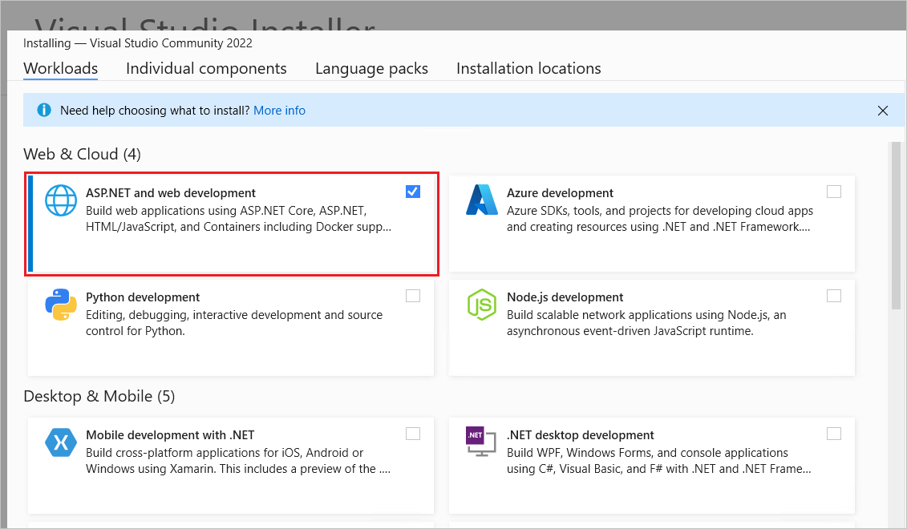
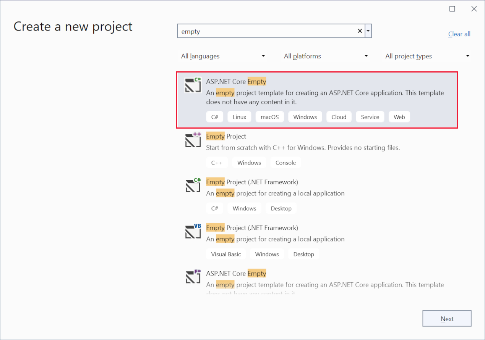
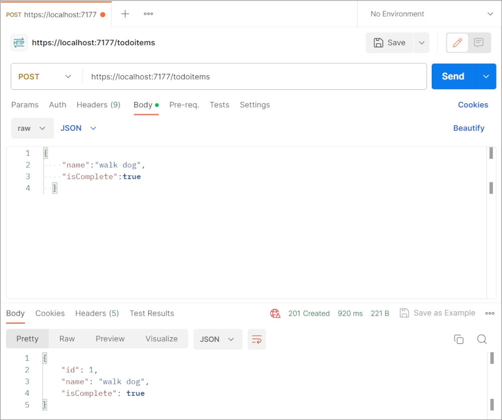

# Tutorial: Create a minimal web API with ASP.NET Core

<!-- TODO: Remove aspnetcore\tutorials\min-web-api\samples\6.x -->
By [Rick Anderson](https://twitter.com/RickAndMSFT)

Minimal APIs are architected to create HTTP APIs with minimal dependencies. They are ideal for microservices and apps that want to include only the minimum files, features, and dependencies in ASP.NET Core.

This tutorial teaches the basics of building a minimal web API with ASP.NET Core. For a tutorial on creating a web API project based on [controllers](xref:web-api/index) that contains more features, see [Create a web API](xref:tutorials/first-web-api).

## Overview

This tutorial creates the following API:

|API | Description | Request body | Response body |
|--- | ---- | ---- | ---- |
|`GET /` | Browser test, "Hello World" | None | Hello World!|
|`GET /todoitems` | Get all to-do items | None | Array of to-do items|
|`GET /todoitems/complete` | Get completed to-do items | None | Array of to-do items|
|`GET /todoitems/{id}` | Get an item by ID | None | To-do item|
|`POST /todoitems` | Add a new item | To-do item | To-do item |
|`PUT /todoitems/{id}` | Update an existing item &nbsp; | To-do item | None |
|`DELETE /todoitems/{id}` &nbsp; &nbsp; | Delete an item &nbsp; &nbsp; | None | None|

## Prerequisites

# [Visual Studio](#tab/visual-studio)

[!INCLUDE[](~/includes/net-prereqs-vs-6.0.md)]



# [Visual Studio Code](#tab/visual-studio-code)

[!INCLUDE[](~/includes/net-prereqs-vsc-6.0.md)]

<!-- add VS Mac later
# [Visual Studio for Mac](#tab/visual-studio-mac)

[!INCLUDE[](~/includes/net-prereqs-mac-6.0.md)]
-->
---

## Create a Web API project

# [Visual Studio](#tab/visual-studio)

* Start Visual Studio 2022 and select **Create a new project**.
* In the **Create a new project** dialog:
  * Enter `API` in the **Search for templates** search box.
  * Select the **ASP.NET Core Web API** template and select **Next**.
  
* Name the project *TodoApi* and select **Next**.
* In the **Additional information** dialog:

  * Select **.NET 6.0 (Long-term support)**
  * Remove **Use controllers (uncheck to use minimal APIs)**
  * Select **Create**

 

<!-- 

-->

<!-- Move this later since we don't need it now -->
# [Visual Studio Code](#tab/visual-studio-code)

* Open the [integrated terminal](https://code.visualstudio.com/docs/editor/integrated-terminal).
* Change directories (`cd`) to the folder that will contain the project folder.
* Run the following commands:

   ```dotnetcli
   dotnet new webapi -minimal -o TodoApi
   cd TodoApi
   code -r ../TodoApi
   ```

* When a dialog box asks if you want to trust the authors, select **Yes**.
* When a dialog box asks if you want to add required assets to the project, select **Yes**.

  The preceding command creates a new web minimal API project and opens it in Visual Studio Code.

<!-- add VS Mac later 
# [Visual Studio for Mac](#tab/visual-studio-mac)

* Select **File** > **New Solution**.

`  `

* In Visual Studio for Mac earlier than version 8.6, select **.NET Core** > **App** > **API** > **Next**. In version 8.6 or later, select **Web and Console** > **App** > **API** > **Next**.

`  `

* In the **Configure the new ASP.NET Core Web API** dialog, select the latest .NET Core 5.x **Target Framework**. Select **Next**.

* Enter *TodoApi* for the **Project Name** and then select **Create**.

 ` `

[!INCLUDE[](~/includes/mac-terminal-access.md)]
-->
---

### Examine the code

The `Program.cs` file contains the following code:

[!code-csharp[](min-web-api/samples/6.x/todo/Program.cs?name=snippet_default)]

The project template creates a `WeatherForecast` API with support for [Swagger](xref:tutorials/web-api-help-pages-using-swagger). Swagger is used to generate useful documentation and help pages for web APIs.

The following highlighted code adds support for Swagger:

[!code-csharp[](min-web-api/samples/6.x/todo/Program.cs?name=snippet_swagger&highlight=5-6,13-14)]

### Run the app

# [Visual Studio](#tab/visual-studio)

<!-- replace all of this with an include -->

Press Ctrl+F5 to run without the debugger.

[!INCLUDE[](~/includes/trustCertVS22.md)]

Visual Studio launches the [Kestrel web server](xref:fundamentals/servers/kestrel).

# [Visual Studio Code](#tab/visual-studio-code)

[!INCLUDE[](~/includes/trustCertVSC.md)]

Press Ctrl+F5 to run the app. A browser window is opened. Append `/swagger` to the URL in the browser, for example `https://localhost:7122/swagger`.

<!-- add VS Mac later 
# [Visual Studio for Mac](#tab/visual-studio-mac)

Select **Run** > **Start Debugging** to launch the app. Visual Studio for Mac launches a browser and navigates to `https://localhost:<port>`, where `<port>` is a randomly chosen port number. 
-->

---

The Swagger page `/swagger/index.html` is displayed. Select **`GET > Try it out> Execute`**. The page displays:

* The [Curl](https://curl.haxx.se/) command to test the WeatherForecast API.
* The URL to test the WeatherForecast API.
* The response code, body, and headers.
* A drop down list box with media types and the example value and schema.

Copy and paste the **Request URL** in the browser: `https://localhost:<port>/WeatherForecast`. JSON similar to the following is returned:

```json
[
  {
    "date": "2021-10-19T14:12:50.3079024-10:00",
    "temperatureC": 13,
    "summary": "Bracing",
    "temperatureF": 55
  },
  {
    "date": "2021-10-20T14:12:50.3080559-10:00",
    "temperatureC": -8,
    "summary": "Bracing",
    "temperatureF": 18
  },
  {
    "date": "2021-10-21T14:12:50.3080601-10:00",
    "temperatureC": 12,
    "summary": "Hot",
    "temperatureF": 53
  },
  {
    "date": "2021-10-22T14:12:50.3080603-10:00",
    "temperatureC": 10,
    "summary": "Sweltering",
    "temperatureF": 49
  },
  {
    "date": "2021-10-23T14:12:50.3080604-10:00",
    "temperatureC": 36,
    "summary": "Warm",
    "temperatureF": 96
  }
]
```

## Update the generated code

This tutorial focuses on creating a web API, so we'll delete the Swagger code and the `WeatherForecast` code. Replace the contents of the `Program.cs` file with the following:

[!code-csharp[](min-web-api/samples/6.x/todo/Program.cs?name=snippet_min)]

The following highlighted code creates a <xref:Microsoft.AspNetCore.Builder.WebApplicationBuilder> and a <xref:Microsoft.AspNetCore.Builder.WebApplication> with preconfigured defaults:

[!code-csharp[](min-web-api/samples/6.x/todo/Program.cs?name=snippet_min&highlight=1-2)]

The following code creates an HTTP GET endpoint `/` which returns `Hello World!`:

```csharp
app.MapGet("/", () => "Hello World!");
```

`app.Run();` runs the app.

Remove the two `"launchUrl": "swagger",` lines from the `Properties/launchSettings.json` file. When the `launchUrl` isn't specified, the web browser requests the `/` endpoint.

Run the app. `Hello World!` is displayed. The updated `Program.cs` file contains a minimal but complete app.

## Add NuGet packages

NuGet packages must be added to support the database and diagnostics used in this tutorial.

# [Visual Studio](#tab/visual-studio)

* From the **Tools** menu, select **NuGet Package Manager > Manage NuGet Packages for Solution**.
* Enter **Microsoft.EntityFrameworkCore.InMemory** in the search box, and then select `Microsoft.EntityFrameworkCore.InMemory`.
* Select the **Project** checkbox in the right pane and then select **Install**.
* Follow the preceding instructions to add the `Microsoft.AspNetCore.Diagnostics.EntityFrameworkCore` package.

# [Visual Studio Code](#tab/visual-studio-code)

* Run the following commands:

   ```dotnetcli
   dotnet add package Microsoft.EntityFrameworkCore.InMemory
   dotnet add package Microsoft.AspNetCore.Diagnostics.EntityFrameworkCore
     ```

<!-- add VS Mac later 
# [Visual Studio for Mac](#tab/visual-studio-mac)

Open a command terminal in the project folder and run the following command:

   ```dotnetcli
   dotnet add package Microsoft.EntityFrameworkCore.InMemory
   ```
   -->
---

## Add the API code

Replace the contents of the `Program.cs` file with the following code:

[!code-csharp[](min-web-api/samples/6.x/todo/Program.cs?name=snippet_all)]

## The model and database context classes

The sample app contains the following model:

[!code-csharp[](min-web-api/samples/6.x/todo/Program.cs?name=snippet_model)]

A *model* is a class that represents data that the app manages. The model for this app is the `Todo` class.

The sample app also contains the following database context class:

[!code-csharp[](min-web-api/samples/6.x/todo/Program.cs?name=snippet_cntx)]

The *database context* is the main class that coordinates [Entity Framework](/ef/core/) functionality for a data model. This class is created by deriving from the <xref:Microsoft.EntityFrameworkCore.DbContext?displayProperty=fullName> class.

The following highlighted code adds the database context to the [dependency injection (DI)](xref:fundamentals/dependency-injection) container and enables displaying database-related exceptions:

[!code-csharp[](min-web-api/samples/6.x/todo/Program.cs?name=snippet_DI&highlight=2-3)]

The DI container provides access to the database context and other services.

The following code creates an HTTP POST endpoint `/todoitems` to add data to the in-memory database:

[!code-csharp[](min-web-api/samples/6.x/todo/Program.cs?name=snippet_post)]

## Install Postman to test the app

This tutorial uses Postman to test the API.

* Install [Postman](https://www.getpostman.com/downloads/)
* Start the web app.
* Start Postman.
* Disable **SSL certificate verification**
  * From **File** > **Settings** (**General** tab), disable **SSL certificate verification**.
    > [!WARNING]
    > Re-enable SSL certificate verification after testing the controller.

<a name="post"></a>

### Test posting data

The following instructions post data to the app:

  * Create a new request.
  * Set the HTTP method to `POST`.
  * Set the URI to `https://localhost:<port>/todoitems`. For example: `https://localhost:5001/todoitems`
  * Select the **Body** tab.
  * Select **raw**.
  * Set the type to **JSON**.
  * In the request body enter JSON for a to-do item:
  
      ```json
      {
        "name":"walk dog",
        "isComplete":true
      }
      ```
  
  * Select **Send**.
    

## Examine the GET endpoints

The sample app implements several GET endpoints using calls to `MapGet`:

|API | Description | Request body | Response body |
|--- | ---- | ---- | ---- |
|`GET /` | Browser test, "Hello World" | None | `Hello World!`|
|`GET /todoitems` | Get all to-do items | None | Array of to-do items|
|`GET /todoitems/{id}` | Get an item by ID | None | To-do item|

[!code-csharp[](min-web-api/samples/6.x/todo/Program.cs?name=snippet_get)]

## Test the GET endpoints

Test the app by calling the two endpoints from a browser or Postman. For example:

* `GET https://localhost:5001/todoitems`
* `GET https://localhost:5001/todoitems/1`

The call to `GET /todoitems` produces a response similar to the following:

```json
[
  {
    "id": 1,
    "name": "Item1",
    "isComplete": false
  }
]
```

### Test the GET endpoints with Postman

* Create a new request.
* Set the HTTP method to **GET**.
* Set the request URI to `https://localhost:<port>/todoitems`. For example, `https://localhost:5001/todoitems`.
* Select **Send**.

This app uses an in-memory database. If the app is restarted, the GET request doesn't return any data. If no data is returned, first [POST](#post) data to the app.

## Return values

ASP.NET Core automatically serializes the object to [JSON](https://www.json.org) and writes the JSON into the body of the response message. The response code for this return type is [200 OK](https://developer.mozilla.org/docs/Web/HTTP/Status/200), assuming there are no unhandled exceptions. Unhandled exceptions are translated into 5xx errors.

The return types can represent a wide range of HTTP status codes. For example, `GET /todoitems/{id}` can return two different status values:

* If no item matches the requested ID, the method returns a [404 status](https://developer.mozilla.org/docs/Web/HTTP/Status/404) <xref:Microsoft.AspNetCore.Mvc.ControllerBase.NotFound%2A> error code.
* Otherwise, the method returns 200 with a JSON response body. Returning `item` results in an HTTP 200 response.

## Examine the PUT endpoint

The sample app implements a single PUT endpoint using `MapPut`:

[!code-csharp[](min-web-api/samples/6.x/todo/Program.cs?name=snippet_put)]

This method is similar to the `MapPost` method, except it uses HTTP PUT. A successful response returns [204 (No Content)](https://www.w3.org/Protocols/rfc2616/rfc2616-sec9.html). According to the HTTP specification, a PUT request requires the client to send the entire updated entity, not just the changes. To support partial updates, use [HTTP PATCH](xref:Microsoft.AspNetCore.Mvc.HttpPatchAttribute).

### Test the PUT endpoint

This sample uses an in-memory database that must be initialized each time the app is started. There must be an item in the database before you make a PUT call. Call GET to ensure there's an item in the database before making a PUT call.

Update the to-do item that has Id = 1 and set its name to `"feed fish"`:

```json
{
  "Id": 1,
  "name": "feed fish",
  "isComplete": false
}
```

<!--
The following image shows the Postman update:
 
``
-->

## Examine the DELETE endpoint

The sample app implements a single DELETE endpoint using `MapDelete`:

[!code-csharp[](min-web-api/samples/6.x/todo/Program.cs?name=snippet_delete)]

Use Postman to delete a to-do item:

* Set the method to `DELETE`.
* Set the URI of the object to delete (for example `https://localhost:5001/todoitems/1`).
* Select **Send**.

<a name="over-post-v6"></a>

## Prevent over-posting

Currently the sample app exposes the entire `Todo` object. Production apps typically limit the data that's input and returned using a subset of the model. There are multiple reasons behind this and security is a major one. The subset of a model is usually referred to as a Data Transfer Object (DTO), input model, or view model. **DTO** is used in this article.

A DTO may be used to:

* Prevent over-posting.
* Hide properties that clients are not supposed to view.
* Omit some properties in order to reduce payload size.
* Flatten object graphs that contain nested objects. Flattened object graphs can be more convenient for clients.

To demonstrate the DTO approach, update the `Todo` class to include a secret field:

[!code-csharp[](min-web-api/samples/6.x/todoDTO/Program.cs?name=snippet_secret&highlight=6)]

The secret field needs to be hidden from this app, but an administrative app could choose to expose it.

Verify you can post and get the secret field.

Create a DTO model:

[!code-csharp[](min-web-api/samples/6.x/todoDTO/Program.cs?name=snippet_DTO)]

Update the code to use `TodoItemDTO`:

[!code-csharp[](min-web-api/samples/6.x/todoDTO/Program.cs?name=snippet_all)]

Verify you can't post or get the secret field.

## Differences between minimal APIs and APIs with controllers

- No support for filters: For example, no support for  <xref:Microsoft.AspNetCore.Mvc.Filters.IAsyncAuthorizationFilter>, <xref:Microsoft.AspNetCore.Mvc.Filters.IAsyncActionFilter>, <xref:Microsoft.AspNetCore.Mvc.Filters.IAsyncExceptionFilter>, <xref:Microsoft.AspNetCore.Mvc.Filters.IAsyncResultFilter>,  and <xref:Microsoft.AspNetCore.Mvc.Filters.IAsyncResourceFilter>.
- No support for model binding, i.e. <xref:Microsoft.AspNetCore.Mvc.ModelBinding.IModelBinderProvider>, <xref:Microsoft.AspNetCore.Mvc.ModelBinding.IModelBinder>. Support can be added with a custom binding shim.
  - No support for binding from forms. This includes binding <xref:Microsoft.AspNetCore.Http.IFormFile>. We plan to add support for `IFormFile` in the future.
- No built-in support for validation, i.e. <xref:Microsoft.AspNetCore.Mvc.ModelBinding.Validation.IModelValidator>
- No support for [application parts](xref:mvc/extensibility/app-parts) or the [application model](xref:mvc/controllers/application-model). There's no way to apply or build your own conventions.
- No built-in view rendering support. We recommend using [Razor Pages](xref:tutorials/razor-pages/razor-pages-start) for rendering views.
- No support for [JsonPatch](https://www.nuget.org/packages/Microsoft.AspNetCore.JsonPatch/)
- No support for [OData](https://www.nuget.org/packages/Microsoft.AspNetCore.OData/)
- No support for [ApiVersioning](https://www.nuget.org/packages/Microsoft.AspNetCore.Mvc.Versioning/). See [this issue](https://github.com/dotnet/aspnet-api-versioning/issues/751) for more details.
## Use JsonOptions

The following code uses <xref:Microsoft.AspNetCore.Http.Json.JsonOptions>:

[!code-csharp[](min-web-api/samples/6.x/WebMinJson/Program.cs?name=snippet_1)]

The following code uses <xref:System.Text.Json.JsonSerializerOptions>:

[!code-csharp[](min-web-api/samples/6.x/WebMinJson/Program.cs?name=snippet_2)]

The preceding code uses [web defaults](/dotnet/standard/serialization/system-text-json-configure-options#web-defaults-for-jsonserializeroptions), which converts property names to camel case.

## Test minimal API

For an example of testing a minimal API app, see [this GitHub sample](https://github.com/davidfowl/CommunityStandUpMinimalAPI/blob/main/TodoApi.Tests/TodoTests.cs).

## Publish to Azure

For information on deploying to Azure, see [Quickstart: Deploy an ASP.NET web app](/azure/app-service/quickstart-dotnetcore).

## Additional resources

* <xref:fundamentals/minimal-apis>
