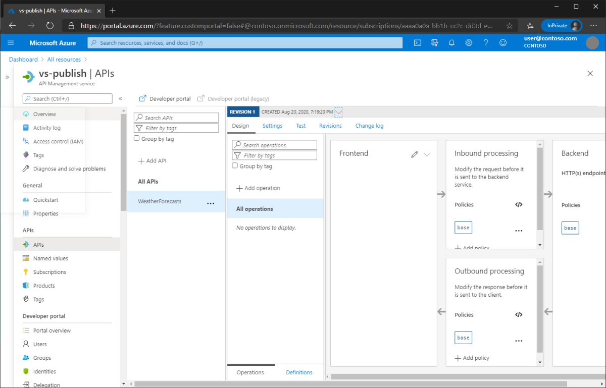

# Publish an ASP.NET Core web API to Azure API Management with Visual Studio

By [Matt Soucoup](https://twitter.com/codemillmatt)

## Set up

- Open a [free Azure account](https://azure.microsoft.com/free/dotnet/) if you don't have one.
- [Create a new Azure API Management instance](/azure/api-management/get-started-create-service-instance) if you haven't already.
- [Create a web API app project](xref:tutorials/first-web-api#create-a-web-project).

## Configure the app

Adding Swagger definitions to the ASP.NET Core web API allows Azure API Management to read the app's API definitions. Complete the following steps.

### Add Swagger

1. Add the [Swashbuckle.AspNetCore](https://www.nuget.org/packages/Swashbuckle.AspNetCore) NuGet package to the ASP.NET Core web API project:

    

1. Add the following line to the `Startup.ConfigureServices` method:
    
    ```csharp
    services.AddSwaggerGen();
    ```
    
1. Add the following line to the `Startup.Configure` method:

    ```csharp
    app.UseSwagger();
    ```

### Change the API routing

Next, you'll change the URL structure needed to access the `Get` action of the `WeatherForecastController`. Complete the following steps:

1. Open the `WeatherForecastController.cs` file.
1. Delete the `[Route("[controller]")]` class-level attribute. The class definition will look like the following:

    ```csharp
    [ApiController]
    public class WeatherForecastController : ControllerBase
    ```

1. Add a `[Route("/")]` attribute to the `Get()` action. The function definition will look like the following:

    ```csharp
    [HttpGet]
    [Route("/")]
    public IEnumerable<WeatherForecast> Get()
    ```

## Publish the web API to Azure App Service

Complete the following steps to publish the ASP.NET Core web API to Azure API Management:

1. Publish the API app to Azure App Service.
1. Add a blank API to the Azure API Management service instance.
1. Publish the ASP.NET Core web API app to the Azure API Management service instance.

### Publish the API app to Azure App Service

Complete the following steps to publish the ASP.NET Core web API to Azure API Management:

1. In **Solution Explorer**, right-click the project and select **Publish**:

    

1. In the **Publish** dialog, select **Azure** and select the **Next** button:

    

1. Select **Azure App Service (Windows)** and select the **Next** button:

    

1. Select **Create a new Azure App Service**.

    

    The **Create App Service** dialog appears. The **App Name**, **Resource Group**, and **App Service Plan** entry fields are populated. You can keep these names or change them.
1. Select the **Create** button.

    

After creation is completed, the dialog is automatically closed and the **Publish** dialog gets focus again. The instance that was created is automatically selected.


At this point, you need to add an API to the Azure API Management service. Leave Visual Studio open while you complete the following tasks.

### Add an API to Azure API Management

1. Open the API Management Service instance created previously in the Azure portal. Select the **APIs** blade:

  

1. Select the 3 dots next to **Echo API** and then select **Delete** from the pop-up menu to remove it.

  

1. From the **Add a new API** panel, select the **Blank API** tile:

  

1. Enter the following values in the **Create a blank API** dialog that appears:    

    - **Display Name**: *WeatherForecasts*
    - **Name**: *weatherforecasts*
    - **API Url suffix**: *v1*
    - Leave the **Web service URL** field empty.

1. Select the **Create** button.

    

The blank API is created.



### Publish the ASP.NET Core web API to Azure API Management

1. Switch back to Visual Studio. The **Publish** dialog should still be open where you left off before.
1. Select the newly published Azure App Service so it's highlighted.
1. Select the **Next** button.

    

1. The dialog now shows the Azure API Management service created before. Expand it and the *APIs* folder to see the blank API you created.
1. Select the blank API's name and select the **Finish** button.

    

1. The dialog closes and a summary screen appears with information about the publish. Select the **Publish** button.

    

    The web API will publish to both Azure App Service and Azure API Management. A new browser window will appear and show the API running in Azure App Service. You can close that window.

1. Switch back to the Azure API Management instance in the Azure portal.
1. Refresh the browser window.
1. Select the blank API you created in the preceding steps. It's now populated and you can explore around.

    

### Configure the published API name

Notice the name of the API is different than what you named it. The published API is named *WeatherAPI*; however, you named it *WeatherForecasts* when you created it. Complete the following steps to fix the name:


1. Delete the following line from the `Startup.ConfigureServices` method:
    
    ```csharp
    services.AddSwaggerGen();
    ```

1. Add the following code to the `Startup.ConfigureServices` method:
    
    ```csharp
    services.AddSwaggerGen(config =>
    {
        config.SwaggerDoc("v1", new Microsoft.OpenApi.Models.OpenApiInfo
        {
            Title = "WeatherForecasts",
            Version = "v1"
        });
    });
    ```

1. Open the newly created publish profile. It can be found from **Solution Explorer** in the *Properties/PublishProfiles* folder.

    

1. Change the `<OpenAPIDocumentName>` element's value from `v1` to `WeatherForecasts`.

    

1. Republish the ASP.NET Core web API and open the Azure API Management instance in the Azure portal.
1. Refresh the page in your browser. You'll see the name of the API is now correct.

    

### Verify the web API is working

You can test the deployed ASP.NET Core web API in Azure API Management from the Azure portal with the following steps:

1. Open the **Test** tab.
1. Select **/** or the **Get** operation.
1. Select **Send**.

    

A successful response will look like the following:


## Clean up

When you've finished testing the app, go to the [Azure portal](https://portal.azure.com/) and delete the app.

1. Select **Resource groups**, then select the resource group you created.

    

1. In the **Resource groups** page, select **Delete**.

    

1. Enter the name of the resource group and select **Delete**. Your app and all other resources created in this tutorial are now deleted from Azure.

## Additional resources

- [Azure API Management](/azure/api-management/api-management-key-concepts)
- [Azure App Service](/azure/app-service/app-service-web-overview)
