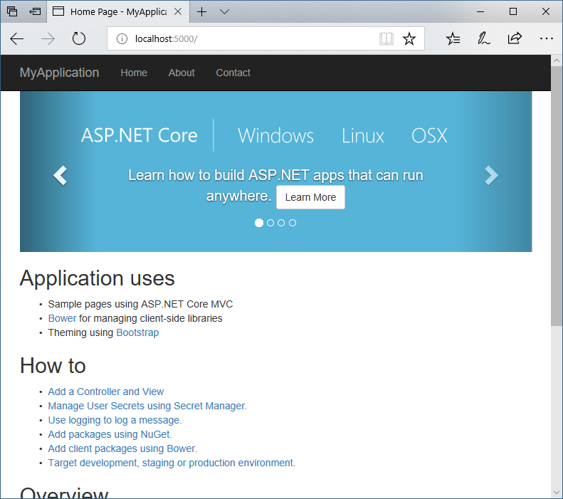
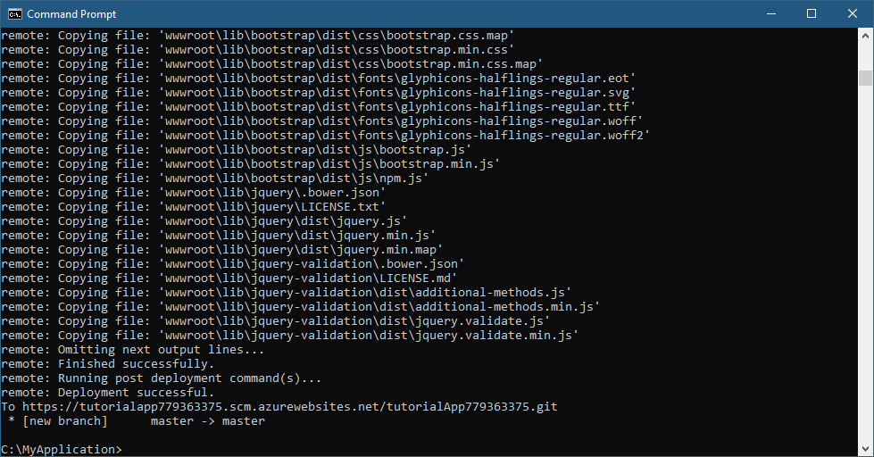
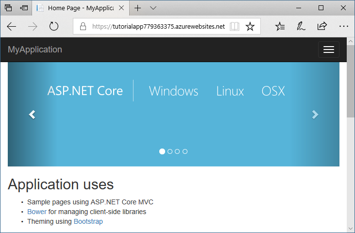

# Deploy an ASP.NET Core application to Azure App Service from the command line

By [Cam Soper](https://twitter.com/camsoper)

This tutorial will show you how to build and deploy an ASP.NET Core application to Microsoft Azure App Service using command line tools.  When finished, you'll have a web application built in ASP.NET MVC Core hosted as an Azure App Service Web App.  This tutorial is written using Windows command line tools, but can be applied to macOS and Linux environments, as well.  

In this tutorial, you learn how to:

> [!div class="checklist"]
> * Create an Azure App Service website using Azure CLI
> * Deploy an ASP.NET Core application to Azure App Service using the Git command line tool

## Prerequisites

To complete this tutorial, you'll need:

* A [Microsoft Azure subscription](https://azure.microsoft.com/free/)
* [.NET Core](https://www.microsoft.com/net/download/core)
* [Git](https://www.git-scm.com/) command line client

## Create a web application

Create a new directory for the web application, create a new ASP.NET Core MVC application, and then run the website locally.

```cmd
REM Create the directory and navigate to it.
REM These commands are Windows-specific. The Bash equivalents are mkdir and cd.
md MyApplication
cd MyApplication

REM Create a new ASP.NET Core MVC application
dotnet new mvc

REM Run the application
dotnet run
```


You can then test the application by browsing to the displayed address (usually `http://localhost:5000`).




## Create the Azure App Service instance

Using either the [Azure Cloud Shell](/azure/cloud-shell/quickstart), create a resource group, App Service plan, and an App Service web app.

```azurecli-interactive
# Generate a unique Web App name
let randomNum=$RANDOM*$RANDOM
webappname=tutorialApp$randomNum

# Create the DotNetAzureTutorial resource group
az group create --name DotNetAzureTutorial --location EastUS

# Create an App Service plan.
az appservice plan create --name $webappname --resource-group DotNetAzureTutorial --sku FREE

# Create the Web App
az webapp create --name $webappname --resource-group DotNetAzureTutorial --plan $webappname
```

Before you deploy, you need to set the account-level deployment credentials.  Use the script below, making sure to include your own values for the user name and password.

```azurecli-interactive
az webapp deployment user set --user-name <desired user name> --password <desired password>
```

You'll also need the deployment URL to deploy the application using Git.  Retrieve the URL like this.

```azurecli-interactive
az webapp deployment source config-local-git -n $webappname -g DotNetAzureTutorial --query [url] -o tsv
```
Note the displayed URL ending in `.git`.  You'll need it in the next step.

## Deploy the application using Git

You're ready to deploy from your local machine using Git.

> [!NOTE] It's safe to ignore any warnings from Git about line endings.

```cmd
REM Initialize the local Git repository
git init

REM Add the contents of the working directory to the repo
git add --all

REM Commit the changes to the local repo
git commit -a -m "Initial commit"

REM Add the URL as a Git remote repository
git remote add azure <THE GIT URL YOU NOTED EARLIER>

REM Push the local repository to the remote
git push azure master
```

You will be prompted for the deployment credentials you set earlier.  After authenticating, the application will be built remotely and deployed.



## Test the application

Test the application by browsing to `https://<web app name>.azurewebsites.net`.  To display the address in the Cloud Shell (or Azure CLI), use the following:

```azurecli-interactive
az webapp show -n $webappname -g DotNetAzureTutorial --query defaultHostName -o tsv
```



## Clean up

When you're done testing the app and inspecting the code and resources, you can delete the web app and plan by deleting the resource group.

```azurecli-interactive
az group delete -n DotNetAzureTutorial
```

## Next steps

In this tutorial, you learned how to:

> [!div class="checklist"]
> * Create an Azure App Service website using Azure CLI
> * Deploy an ASP.NET Core application to Azure App Service using the Git command line tool

Next, learn to use the command line to deploy an existing web app that uses CosmosDB.

> [!div class="nextstepaction"]
> [Deploy to Azure from the command line with .NET Core](/dotnet/azure/dotnet-quickstart-xplat)