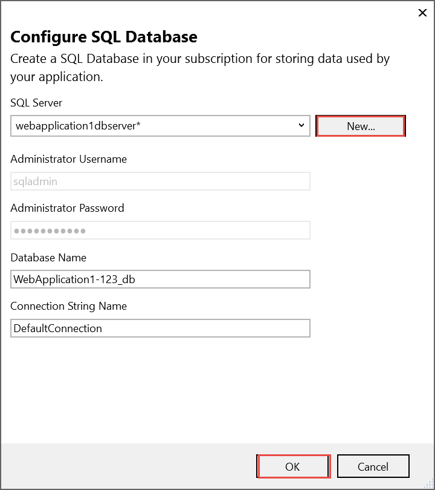
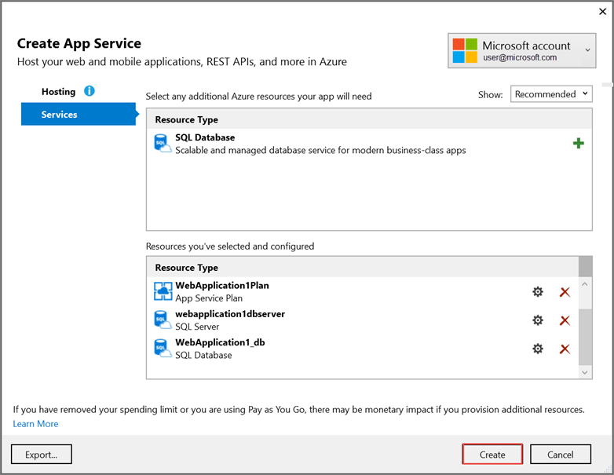
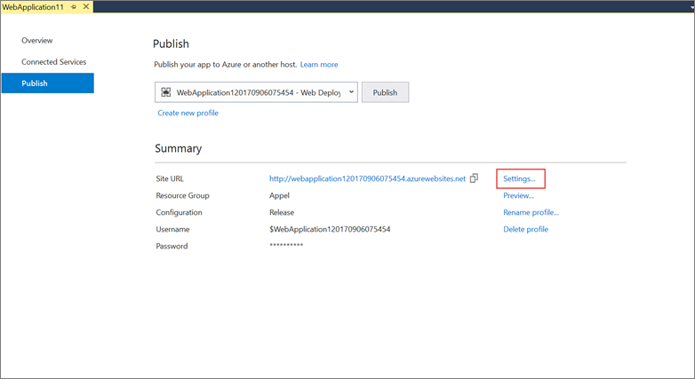
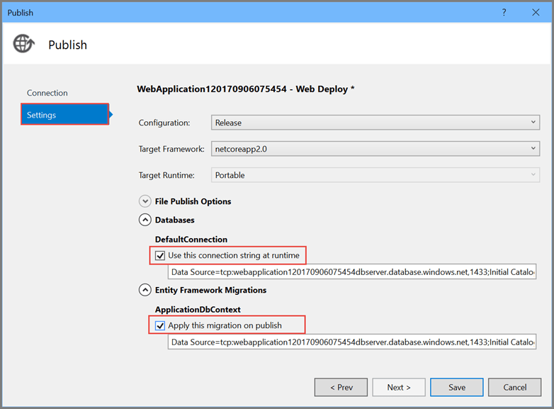
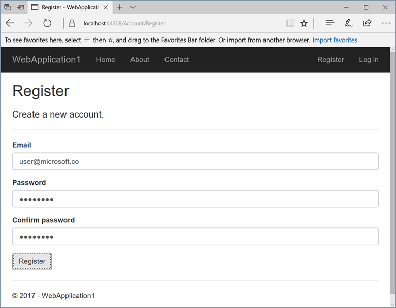

# Publish an ASP.NET Core web app to Azure App Service using Visual Studio

By [Rick Anderson](https://twitter.com/RickAndMSFT), [Cesar Blum Silveira](https://github.com/cesarbs), and [Rachel Appel](https://twitter.com/rachelappel)

## Set up the development environment

* Install the latest [Azure SDK for Visual Studio](https://www.visualstudio.com/vs/azure-tools/). The SDK installs Visual Studio if you don't already have it.

* Verify your [Azure account](https://portal.azure.com/). You can [open a free Azure account](https://azure.microsoft.com/pricing/free-trial/) or [Activate Visual Studio subscriber benefits](https://azure.microsoft.com/pricing/member-offers/msdn-benefits-details/).

## Create a web app

In the Visual Studio Start Page, select **File > New > Project...**

Complete the **New Project** dialog:

* In the left pane, select **.NET Core**.

* In the center pane, select **ASP.NET Core Web Application**.

* Select **OK**.

In the **New ASP.NET Core Web Application** dialog:

* Select **Web Application**.

* Select **Change Authentication**.

The **Change Authentication** dialog appears. 

* Select **Individual User Accounts**.

* Select **OK** to return to the **New ASP.NET Core Web Application**, then select **OK** again.

 

Visual Studio creates the solution.

## Run the app locally

* Choose **Debug** then **Start Without Debugging** to run the app locally.

* Click the **About** and **Contact** links to verify the web application works.

* Select **Register** and register a new user. You can use a fictitious email address. When you submit, the page displays the following error:

    *"Internal Server Error: A database operation failed while processing the request. SQL exception: Cannot open the database. Applying existing migrations for Application DB context may resolve this issue."*

* Select **Apply Migrations** and, once the page updates, refresh the page.

The app displays the email used to register the new user and a **Log out** link.

## Deploy the app to Azure

Close the web page, return to Visual Studio, and select **Stop Debugging** from the **Debug** menu.

Right-click on the project in Solution Explorer and select **Publish...**.

In the **Publish** dialog, select **Microsoft Azure App Service** and click **Publish**.

* Name the app a unique name. 

* Select an MSDN subscription.

* Select **New...** for the resource group and enter a name for the new resource group.

* Select **New...** for the app service plan and select a location near you. You can keep the name that is generated by default.

* Select the **Services** tab to create a new database.

* Select the green **+** icon to create a new SQL Database

* Select **New...** on the **Configure SQL Database** dialog to create a new database.

The **Configure SQL Server** dialog appears.

* Enter an administrator user name and password, and then select **OK**. Don't forget the user name and password you create in this step. You can keep the default **Server Name**. 

* Enter names for the database and connection string.

> [!NOTE]
> "admin" is not allowed as the administrator user name.

* Select **OK**.

Visual Studio returns to the **Create App Service** dialog.

* Select **Create** on the **Create App Service** dialog.

* Click the **Settings** link in the **Publish** dialog.

On the **Settings** page of the **Publish** dialog:

  * Expand **Databases** and check **Use this connection string at runtime**.

  * Expand **Entity Framework Migrations** and check **Apply this migration on publish**.

* Select **Save**. Visual Studio returns to the **Publish** dialog. 

Click **Publish**. Visual Studio will publish your app to Azure and launch the cloud app in your browser.

### Test your app in Azure

* Test the **About** and **Contact** links

* Register a new user

### Update the app

* Edit the *Pages/About.cshtml* Razor page and change its contents. For example, you can modify the paragraph to say "Hello ASP.NET Core!":

    [!code-html[About](publish-to-azure-webapp-using-vs/sample/about.cshtml?highlight=9&range=1-9)]

* Right-click on the project and select **Publish...** again.

* After the app is published, verify the changes you made are available on Azure.

### Clean up

When you have finished testing the app, go to the [Azure portal](https://portal.azure.com/) and delete the app.

* Select **Resource groups**, then select the resource group you created.

* In the **Resource groups** page, select **Delete**.

* Enter the name of the resource group and select **Delete**. Your app and all other resources created in this tutorial are now deleted from Azure.

### Next steps

* [Getting started with ASP.NET Core MVC and Visual Studio](first-mvc-app/start-mvc.md)

* [Introduction to ASP.NET Core](../index.md)

* [Fundamentals](../fundamentals/index.md)
