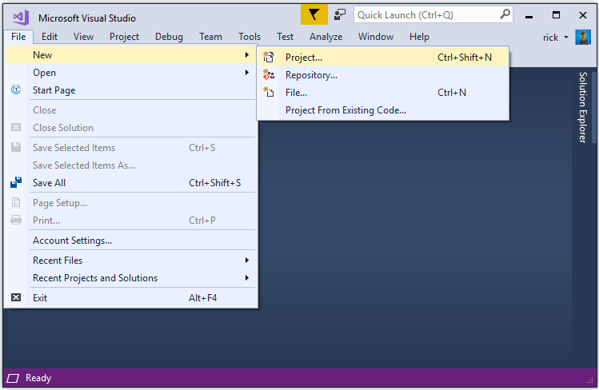
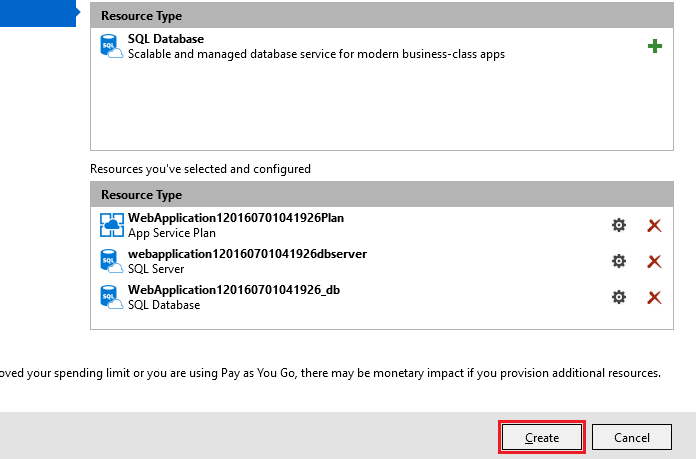

# Publish an ASP.NET Core web app to Azure App Service using Visual Studio

By [Rick Anderson](https://twitter.com/RickAndMSFT) and [Cesar Blum Silveira](https://github.com/cesarbs)

## Set up the development environment

* Install the latest [Azure SDK for Visual Studio](https://www.visualstudio.com/features/azure-tools-vs). The SDK installs Visual Studio if you don't already have it.

> [!NOTE]
> The SDK installation can take more than 30 minutes if your machine doesn't have many of the dependencies.

* Install [.NET Core + Visual Studio tooling](http://go.microsoft.com/fwlink/?LinkID=798306)

* Verify your [Azure account](https://portal.azure.com/). You can [open a free Azure account](https://azure.microsoft.com/pricing/free-trial/) or [Activate Visual Studio subscriber benefits](https://azure.microsoft.com/pricing/member-offers/msdn-benefits-details/).

## Create a web app

In the Visual Studio Start Page, tap **New Project...**.


Alternatively, you can use the menus to create a new project. Tap **File > New > Project...**.



Complete the **New Project** dialog:

* In the left pane, tap **Web**

* In the center pane, tap **ASP.NET Core Web Application (.NET Core)**

* Tap **OK**


In the **New ASP.NET Core Web Application (.NET Core)** dialog:

* Tap **Web Application**

* Verify **Authentication** is set to **Individual User Accounts**

* Verify **Host in the cloud** is **not** checked

* Tap **OK**


## Test the app locally

* Press **Ctrl-F5** to run the app locally

* Tap the **About** and **Contact** links. Depending on the size of your device, you might need to tap the navigation icon to show the links


* Tap **Register** and register a new user. You can use a fictitious email address. When you submit, you'll get the following error:


You can fix the problem in two different ways:

* Tap **Apply Migrations** and, once the page updates, refresh the page; or

* Run the following from a command prompt in the project's directory:

  <!-- literal_block {"ids": [], "xml:space": "preserve"} -->

  ```
  dotnet ef database update
     ```

The app displays the email used to register the new user and a **Log off** link.


## Deploy the app to Azure

Right-click on the project in Solution Explorer and select **Publish...**.


In the **Publish** dialog, tap **Microsoft Azure App Service**.


Tap **New...** to create a new resource group. Creating a new resource group will make it easier to delete all the Azure resources you create in this tutorial.


Create a new resource group and app service plan:

* Tap **New...** for the resource group and enter a name for the new resource group

* Tap **New...** for the  app service plan and select a location near you. You can keep the default generated name

* Tap **Explore additional Azure services** to create a new database


* Tap the green **+** icon to create a new SQL Database


* Tap **New...** on the **Configure SQL Database** dialog to create a new database server.


* Enter an administrator user name and password, and then tap **OK**. Don't forget the user name and password you create in this step. You can keep the default **Server Name**


> [!NOTE]
> "admin" is not allowed as the administrator user name.

* Tap **OK** on the  **Configure SQL Database** dialog


* Tap **Create** on the **Create App Service** dialog



* Tap **Next** in the **Publish** dialog


* On the **Settings** stage of the **Publish** dialog:

  * Expand **Databases** and check **Use this connection string at runtime**

  * Expand **Entity Framework Migrations** and check **Apply this migration on publish**

* Tap **Publish** and wait until Visual Studio finishes publishing your app


Visual Studio will publish your app to Azure and launch the cloud app in your browser.

### Test your app in Azure

* Test the **About** and **Contact** links

* Register a new user


### Update the app

* Edit the `Views/Home/About.cshtml` Razor view file and change its contents. For example:

<!-- literal_block {"ids": [], "linenos": false, "xml:space": "preserve", "language": "html", "highlight_args": {"hl_lines": [7]}} -->

```html
@{
       ViewData["Title"] = "About";
   }
   <h2>@ViewData["Title"].</h2>
   <h3>@ViewData["Message"]</h3>

   <p>My updated about page.</p>
   ```

* Right-click on the project and tap **Publish...** again


* After the app is published, verify the changes you made are available on Azure

### Clean up

When you have finished testing the app, go to the [Azure portal](https://portal.azure.com/) and delete the app.

* Select **Resource groups**, then tap the resource group you created


* In the **Resource group** blade, tap **Delete**


* Enter the name of the resource group and tap **Delete**. Your app and all other resources created in this tutorial are now deleted from Azure

### Next steps

* [Getting started with ASP.NET Core MVC and Visual Studio](first-mvc-app/start-mvc.md)

* [Introduction to ASP.NET Core](../index.md)

* [Fundamentals](../fundamentals/index.md)
