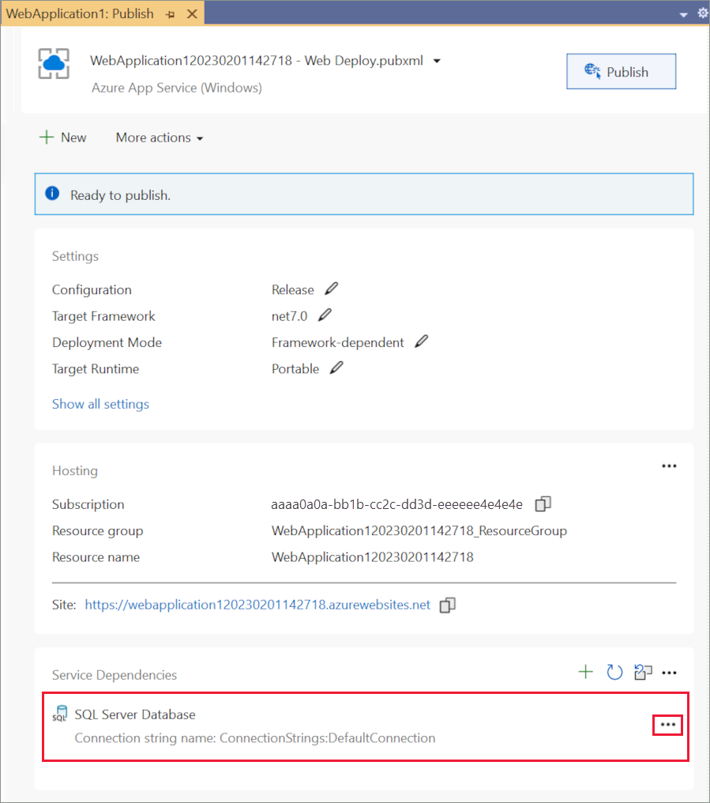
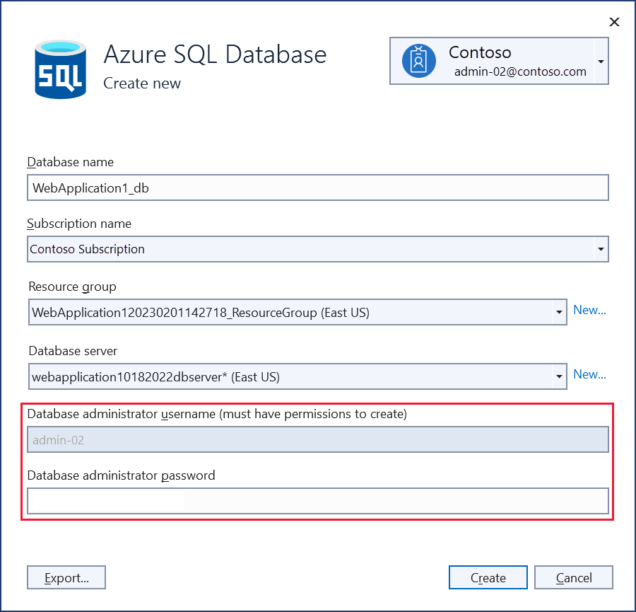
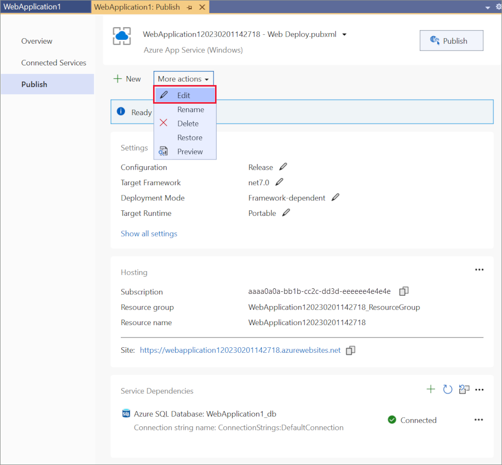

# Publish an ASP.NET Core app to Azure with Visual Studio

[!INCLUDE [Azure App Service Preview Notice](../includes/azure-apps-preview-notice.md)]

To troubleshoot an App Service deployment issue, see <xref:test/troubleshoot-azure-iis>.

## Set up

Open a [free Azure account](https://azure.microsoft.com/free/dotnet/) if you don't have one.

## Create a web app

Start Visual Studio 2022 and select **Create a new project**.

In the **Create a new project** dialog, select **ASP.NET Core Web App**, and then select **Next**.

In the **Configure your new project** dialog, name your project, and then select **Next**.

In the **Additional information** dialog:

* In the **Framework** input, select **.NET 7.0 (Standard Term Support)**.
* In the **Authentication type** input, select **Individual Accounts**, and then select **Create**.

Visual Studio creates the solution.

## Run the app

* Press F5 to run the project.

### Register a user

* Select **Register** and register a new user. You can use a fictitious email address. When you submit, the page displays the following error:

    *"A database operation failed while processing the request. Applying existing migrations may resolve this issue"*
* Select **Apply Migrations** and, once the page updates, refresh the page.

* A **Register confirmation** page is displayed. Select **Click here to confirm your account**.
* A **Confirm email** page is displayed.
* Log in as the new user.

The app displays the email used to register the new user and a **Logout** link.

* Stop the application by closing the browser, or in Visual Studio select **Debug** > **Stop Debugging**.
* In Visual Studio select **Build** > **Clean Solution** to  clean project items  and avoid file contention.

## Deploy the app to Azure

Right-click on the project in Solution Explorer and select **Publish**.

In the **Publish** dialog:

* Select **Azure**.
* Select **Next**.

In the **Publish** dialog:

* Select **Azure App Service (Windows)**.
* Select **Next**.

In the **Publish** dialog, in the **App Service** tab, select **Create new**.

The **Create App Service** dialog appears:

* The **Name**, **Resource Group**, and **Hosting Plan** entry fields are populated. You can keep these names or change them.
* Select **Create**.

After creation is completed the dialog is automatically closed and the **Publish** dialog gets focus again:

* The new instance that was just created is automatically selected.
* Select **Finish**.

The **Publish profile creation progress** dialog confirms the publish profile was created. Select **Close**.

Next you see the **Publish Profile summary** page. Visual Studio has detected that this application requires a SQL Server database which it has listed in the Service Dependencies pane. Select the ellipsis (**...**) and then **Connect**.

The **Connect to dependency** dialog appears:

* Select **Azure SQL Database**.
* Select **Next**.

In the **Connect to Azure SQL database** dialog, select **Create new**.

The **Create Azure SQL Database** appears:

* The **Database name**, **Resource Group**, **Database server** and **App Service Plan** entry fields are populated. You can keep these values or change them.
* Enter the **Database administrator username** and **Database administrator password** for the selected **Database server** (note the account you use must have the necessary permissions to create the new Azure SQL database)
* Select **Create**.

After creation is completed the dialog is automatically closed and the **Connect to Azure SQL Database** dialog gets focus again:

* The new instance that was just created is automatically selected.
* Select **Next**.

In the next step of the **Connect to Azure SQL Database** dialog:

* Enter the **Database connection user name** and **Database connection password** fields. These are the details your application will use to connect to the database at runtime. Best practice is to avoid using the same details as the admin username and password used in the previous step.
* Select **Finish**.

The **Dependency configuration progress** dialog confirms the Azure SQL Database is configured. Select **Close**.

In the **Publish Profile summary** page select **More actions** > **Edit**:

On the **Settings** tab of the **Publish** dialog:

* Expand **Databases** and check **Use this connection string at runtime**.
* Expand **Entity Framework Migrations** and select **Apply this migration on publish**.

* Select **Save**. Visual Studio returns to the **Publish** dialog.

Click **Publish**. Visual Studio publishes your app to Azure. When the deployment completes.

The app is opened in a browser. Register a new user and log in as the new user to validate the database deployment and run-time connection.

### Update the app

* Edit the `Pages/Index.cshtml` Razor page and change its contents, then save the changes. For example, you can modify the paragraph to say "Hello ASP.NET Core!":

    [!code-html[Index](publish-to-azure-webapp-using-vs/sample/index.cshtml?highlight=10&range=1-12)]

* Select **Publish** from the **Publish Profile summary** page again.

* After the app is published, refresh the page and verify that the changes you made are available on Azure.

### Clean up

When you have finished testing the app, go to the [Azure portal](https://portal.azure.com/) and delete the app.

* Select **Resource groups**, then select the resource group you created.

* In the **Resource group** page, select **Delete resource group**.

* Enter the name of the resource group and select **Delete**. Your app and all other resources created in this tutorial are now deleted from Azure.

## Additional resources

* [Azure App Service](/azure/app-service/app-service-web-overview)
* [Azure resource groups](/azure/azure-resource-manager/resource-group-overview#resource-groups)
* [Azure SQL Database](/azure/sql-database/)
* <xref:host-and-deploy/visual-studio-publish-profiles>
* <xref:test/troubleshoot-azure-iis>
