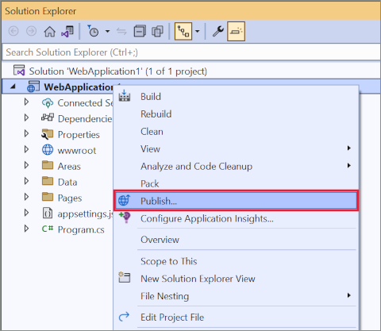
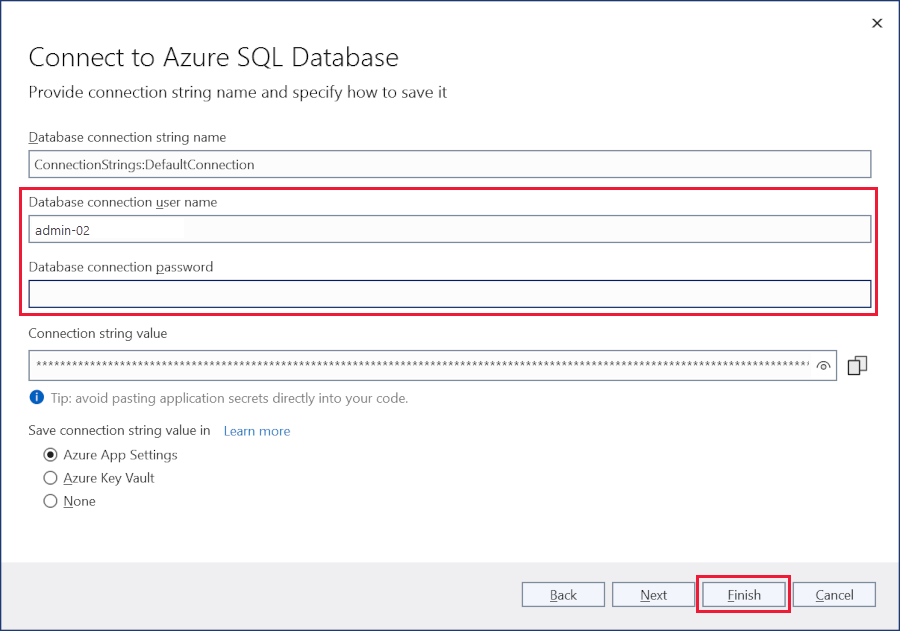
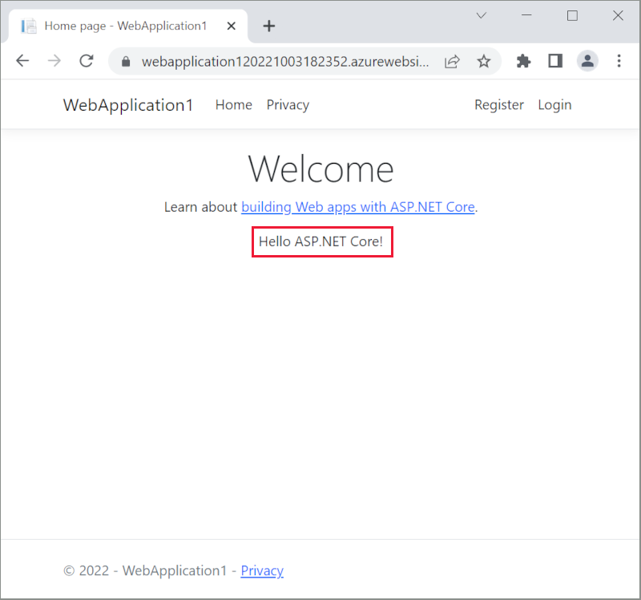

# Publish an ASP.NET Core app to Azure with Visual Studio

By [Rick Anderson](https://twitter.com/RickAndMSFT)
:::moniker range=">= aspnetcore-3.0"

[!INCLUDE [Azure App Service Preview Notice](../includes/azure-apps-preview-notice.md)]

:::moniker-end

If you're working on macOS, see [Publish a Web app to Azure App Service using Visual Studio for Mac](/visualstudio/mac/publish-app-svc).

To troubleshoot an App Service deployment issue, see <xref:test/troubleshoot-azure-iis>.

## Set up

* Open a [free Azure account](https://azure.microsoft.com/free/dotnet/) if you don't have one. 

## Create a web app

In the Visual Studio Start Page, select **File** > **New** > **Project**.

Complete the **New Project** dialog:

* Select **ASP.NET Core Web Application**.
* Select **Next**.

In the **New ASP.NET Core Web Application** dialog:

* Select **Web Application**.
* Select **Change** under Authentication.

The **Change Authentication** dialog appears. 

* Select **Individual User Accounts**.
* Select **OK** to return to the **New ASP.NET Core Web Application**, then select **Create**.

 

Visual Studio creates the solution.

## Run the app

* Press CTRL+F5 to run the project.
* Test the **Privacy** link.

### Register a user

* Select **Register** and register a new user. You can use a fictitious email address. When you submit, the page displays the following error:

    *"A database operation failed while processing the request. Applying existing migrations for Application DB context may resolve this issue."*
* Select **Apply Migrations** and, once the page updates, refresh the page.

The app displays the email used to register the new user and a **Logout** link.

## Deploy the app to Azure

Right-click on the project in Solution Explorer and select **Publish**.

In the **Publish** dialog:

* Select **Azure**.
* Select **Next**.

In the **Publish** dialog:

* Select **Azure App Service (Linux)**.
* Select **Next**.

In the **Publish** dialog, select **Create a new Azure App Service**.

The **Create App Service** dialog appears:

* The **App Name**, **Resource Group**, and **App Service Plan** entry fields are populated. You can keep these names or change them.
* Select **Create**.

After creation is completed the dialog is automatically closed and the **Publish** dialog gets focus again:

* The new instance that was just created is automatically selected.
* Select **Finish**.

Next you see the **Publish Profile summary** page. Visual Studio has detected that this application requires a SQL Server database and it's asking you to configure it. Select **Configure**.

The **Configure dependency** dialog appears:

* Select **Azure SQL Database**.
* Select **Next**.

In the **Configure Azure SQL database** dialog, select **Create a SQL Database**.

The **Create Azure SQL Database** appears:

* The **Database name**, **Resource Group**, **Database server** and **App Service Plan** entry fields are populated. You can keep these values or change them.
* Enter the **Database administrator username** and **Database administrator password** for the selected **Database server** (note the account you use must have the necessary permissions to create the new Azure SQL database)
* Select **Create**.

After creation is completed the dialog is automatically closed and the **Configure Azure SQL Database** dialog gets focus again:

* The new instance that was just created is automatically selected.
* Select **Next**.

In the next step of the **Configure Azure SQL Database** dialog:

* Enter the **Database connection user name** and **Database connection password** fields. These are the details your application will use to connect to the database at runtime. Best practice is to avoid using the same details as the admin username & password used in the previous step.
* Select **Finish**.

In the **Publish Profile summary** page select **Settings**:

On the **Settings** page of the **Publish** dialog:

* Expand **Databases** and check **Use this connection string at runtime**.
* Expand **Entity Framework Migrations** and check **Apply this migration on publish**.

* Select **Save**. Visual Studio returns to the **Publish** dialog. 

Click **Publish**. Visual Studio publishes your app to Azure. When the deployment completes, the app is opened in a browser.

### Update the app

* Edit the `Pages/Index.cshtml` Razor page and change its contents. For example, you can modify the paragraph to say "Hello ASP.NET Core!":

    [!code-html[Index](publish-to-azure-webapp-using-vs/sample/index.cshtml?highlight=10&range=1-12)]

* Select **Publish** from the **Publish Profile summary** page again.

* After the app is published, verify the changes you made are available on Azure.

### Clean up

When you have finished testing the app, go to the [Azure portal](https://portal.azure.com/) and delete the app.

* Select **Resource groups**, then select the resource group you created.

* In the **Resource groups** page, select **Delete**.

* Enter the name of the resource group and select **Delete**. Your app and all other resources created in this tutorial are now deleted from Azure.

## Additional resources

* For Visual Studio Code, see [Publish profiles](xref:host-and-deploy/visual-studio-publish-profiles#publish-profiles).
* [Azure App Service](/azure/app-service/app-service-web-overview)
* [Azure resource groups](/azure/azure-resource-manager/resource-group-overview#resource-groups)
* [Azure SQL Database](/azure/sql-database/)
* <xref:host-and-deploy/visual-studio-publish-profiles>
* <xref:test/troubleshoot-azure-iis>
