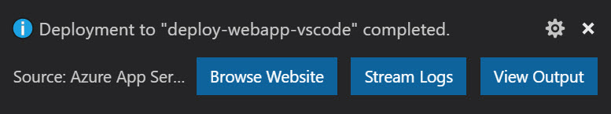
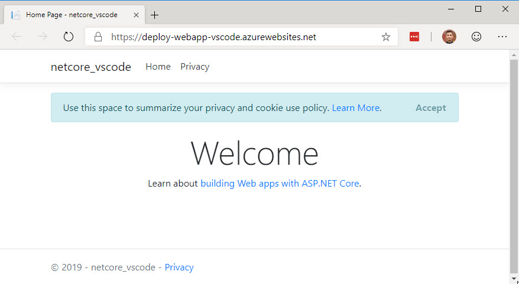

# Publish an ASP.NET Core app to Azure with Visual Studio Code

With this tutorial, you'll learn how to create an ASP.Net Core MVC Application and deploy it within Visual Studio Code. The tutorial assumes familiarity with VS Code. For more information, see [Getting started with VS Code](https://code.visualstudio.com/docs). This tutorial will work on Windows, macOS, or Linux environments. Be sure to use the correct path separating characters (`\` vs `/`) for your environment.

[!INCLUDE [Azure App Service Preview Notice](../includes/azure-apps-preview-notice.md)]

To troubleshoot an App Service deployment issue, see <xref:test/troubleshoot-azure-iis>.

## Prerequisites

* An Azure subscription. Get a [free Azure account](https://azure.microsoft.com/free/dotnet/) if you don't have one.
* [.NET SDK](https://dotnet.microsoft.com/download) (latest stable release).
* [Visual Studio Code](https://code.visualstudio.com/Download).
  * [C# Extension](https://marketplace.visualstudio.com/items?itemName=ms-dotnettools.csharp).
  * [Azure App Service Extension](https://marketplace.visualstudio.com/items?itemName=ms-azuretools.vscode-azureappservice). Use the extension to sign into Azure before proceeding.

## Create an ASP.Net Core MVC project

1. Open the [integrated terminal](https://code.visualstudio.com/docs/editor/integrated-terminal).
1. Set your working directory (`cd`) to the directory that will contain the project.
1. Run the following commands:

    ```dotnetcli
    dotnet new mvc -o MyMVCapp
    code -r MyMVCapp
    ```

    For the preceding commands:  

    * `dotnet new mvc -o MyMVCapp` 
      * Creates a new ASP.NET Core MVC project in the *MyMVCapp* folder.
    * `code -r MyMVCapp`
      * Loads the `MyMVCapp.csproj` project file in Visual Studio Code.
      * Visual Studio Code updates the integrated terminal to the project directory.

> [!NOTE]
> If a dialog box appears with **Required assets to build and debug are missing from 'MyMVCapp'. Add them?**, select **Yes**.

A new ASP.NET Core MVC project is created in a *MyMVCapp* folder with a structure similar to the following:

```cmd
      appsettings.Development.json
      appsettings.json
<DIR> bin
<DIR> Controllers
<DIR> Models
      MyMVCapp.csproj
<DIR> obj
      Program.cs
<DIR> Properties
<DIR> Views
<DIR> wwwroot
```

A `.vscode` folder will be created under the project structure. It will contain utility files to help you build and debug your ASP.NET Core web app.

## Test the project

Before deploying the app to Azure, make sure it is running properly on your local machine.

1. Open the [integrated terminal](https://code.visualstudio.com/docs/editor/integrated-terminal) (if needed).
1. Set up the a trusted HTTPS development certificate:

    [!INCLUDE[](~/includes/trustCertVSC.md)]

1. Run the following command:

    ```dotnetcli
    dotnet run
    ```

    The preceding command:

    * Starts [Kestrel](xref:fundamentals/servers/kestrel), ASP.NET Core's built-in web server.
    * Displays a URL to test the web app such as `http://localhost:<port>`, where `<port>` is the random port number set in `Properties\launchSettings.json` at project creation.
  
    The output shows messages similar to the following, indicating that the app is running and awaiting requests:

    ```dotnetcli
    $ dotnet run
    Building...
    info: Microsoft.Hosting.Lifetime[14]
        Now listening on: https://localhost:7064
    info: Microsoft.Hosting.Lifetime[14]
        Now listening on: http://localhost:5119
    info: Microsoft.Hosting.Lifetime[0]
        Application started. Press Ctrl+C to shut down.
    info: Microsoft.Hosting.Lifetime[0]
        Hosting environment: Development
    info: Microsoft.Hosting.Lifetime[0]
        Content root path: D:\Src\MyMVCapp\
    ```

1. <kbd>Ctrl</kbd>+*click* the HTTPS URL in the output to test the web app in a browser. In the example above, the URL is `https://localhost:7064`.
1. Press <kbd>Ctrl</kbd>+<kbd>C</kbd> in the integrated terminal to shut down the web app after testing it.

## Generate the deployment package locally

1. In the integrated terminal, use the following command to generate a `Release` package in a folder located at `bin/Publish`:

    ```dotnetcli
    dotnet publish -c Release -o ./bin/Publish
    ```

    A new `Publish` subfolder will be created in the `bin` folder. This folder contains the files to be deployed to Azure.

    :::image type="content" source="publish-to-azure-webapp-using-vscode/_static/publish-folder.png" alt-text="Publish folder structure" lightbox="publish-to-azure-webapp-using-vscode/_static/publish-folder.png":::

## Publish to Azure App Service

Leveraging the Azure App Service extension for Visual Studio Code, follow the steps below to publish the website directly to the Azure App Service.

### Create a new Azure Web App resource

If you don't have an existing Azure Web App resource to publish to, you must create one.

1. In the Azure extension tab, in the **RESOURCES** pane, expand the subscription you wish to use.
1. Right-click **App Services** and select **Create New Web App...**. 
1. Follow the prompts:
    1. Enter a unique name for the web app.
    1. Select the most recent stable .NET runtime (such as `.NET 6 (LTS)`). Do not select the ASP.NET runtime, which is for .NET Framework apps.
    1. Select your pricing tier. Free (F1) is acceptable for this tutorial.  

### Publish to Azure

1. Right click the `bin\Publish` folder and select `Deploy to Web App...` and follow the prompts.
    1. Select the subscription where the Azure Web App resource is located.
    1. Select the Azure Web App resource to which you will publish.
    1. Select **Deploy** when prompted with a confirmation dialog.
1. Once the deployment is finished, click `Browse Website` to validate the deployment.

    

    Once you click `Browse Website`, you'll navigate to it using your default browser:

    

> [!TIP] 
> You can repeat the above steps to redeploy the app to the same Azure Web App resource as needed. Be sure to run `dotnet publish` again before you deploy to Azure.

## Next steps

* [Create your first Azure DevOps pipeline](/azure/devops/pipelines/create-first-pipeline)

## Additional resources

* [Azure App Service](/azure/app-service/app-service-web-overview)
* [Azure resource groups](/azure/azure-resource-manager/resource-group-overview#resource-groups)
