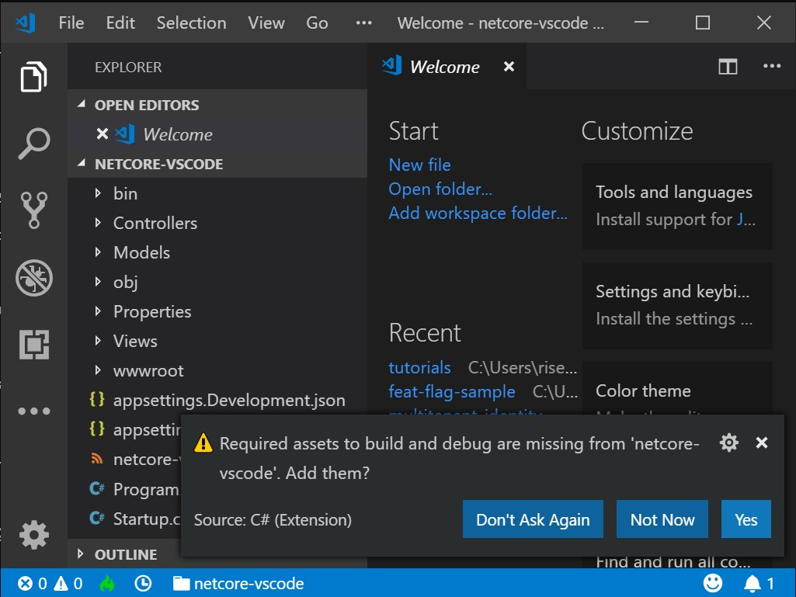
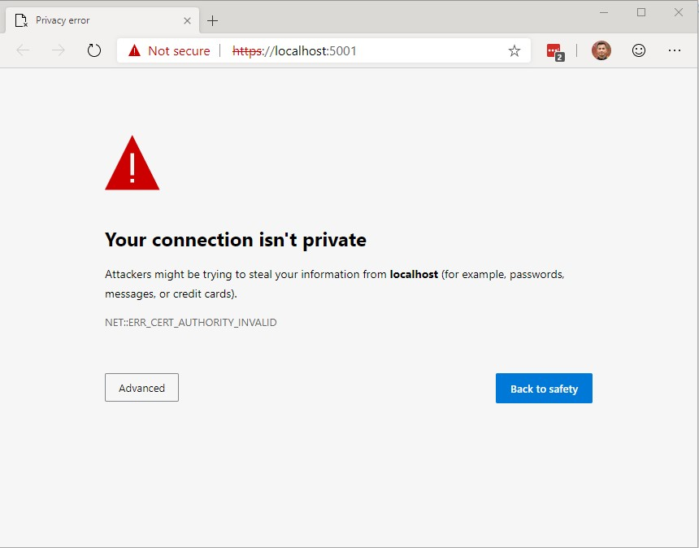
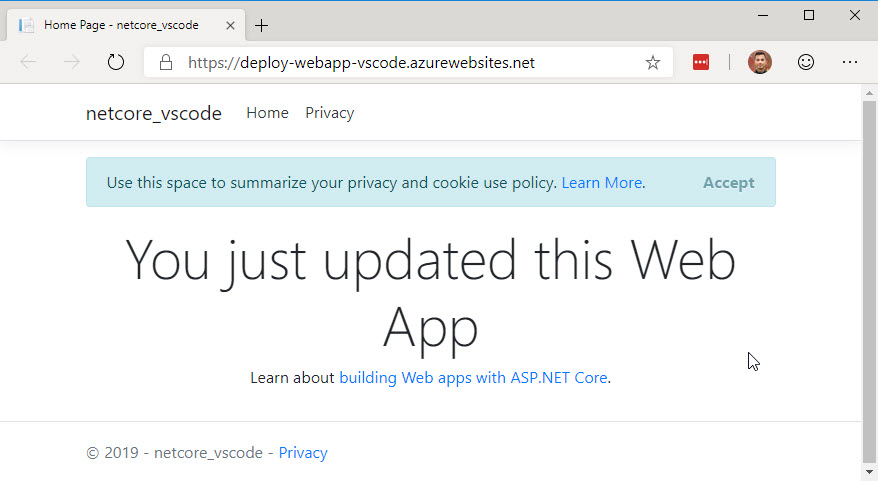

# Publish an ASP.NET Core app to Azure with Visual Studio Code

By [Ricardo Serradas](https://twitter.com/ricardoserradas)

[!INCLUDE [Azure App Service Preview Notice](../includes/azure-apps-preview-notice.md)]

To troubleshoot an App Service deployment issue, see <xref:test/troubleshoot-azure-iis>.

## Intro

With this tutorial, you'll learn how to create an ASP.Net Core MVC Application
and deploy it within Visual Studio Code.

## Set up

- Open a [free Azure account](https://azure.microsoft.com/free/dotnet/) if you don't have one.
- Install [.NET Core SDK](https://dotnet.microsoft.com/download)
- Install [Visual Studio Code](https://code.visualstudio.com/Download)
  - Install the [C# Extension](https://marketplace.visualstudio.com/items?itemName=ms-dotnettools.csharp) to Visual Studio Code
  - Install the [Azure App Service Extension](https://marketplace.visualstudio.com/items?itemName=ms-azuretools.vscode-azureappservice)
  to Visual Studio Code and configure it before proceeding

## Create an ASP.Net Core MVC project

Using a terminal, navigate to the folder you want the project to be created on
and use the following command:

```dotnetcli
dotnet new mvc
```

You'll have a folder structure similar to the following:

```cmd
      appsettings.Development.json
      appsettings.json
<DIR> Controllers
<DIR> Models
      netcore-vscode.csproj
<DIR> obj
      Program.cs
<DIR> Properties
      Startup.cs
<DIR> Views
<DIR> wwwroot
```

## Open it with Visual Studio Code

After your project is created, you can open it with Visual Studio Code
by using one of the options below:

### Through the command line

Use the following command within the folder you created the project:

```cmd
> code .
```

If the command below does not work, check if your installation is configured
properly by referencing [this link](https://code.visualstudio.com/docs/setup/setup-overview#_cross-platform).

### Through Visual Studio Code interface

- Open Visual Studio Code
- On the menu, select `File > Open Folder`
- Select the root of the folder you created the MVC Project

When you open the project folder, you'll receive a message saying that required
assets to build and debug are missing. Accept the help to add them.



A `.vscode` folder will be created under the project structure. It will contain the following files:

```cmd
launch.json
tasks.json
```

These are utility files to help you build and debug your .NET Core Web App.

## Run the app

Before we deploy the app to Azure, make sure it is running
properly on your local machine.

- Press F5 to run the project

Your web app will start running on a new tab of your default browser. You may
notice a privacy warning as soon as it starts. This is because your app will
start either using HTTP and HTTPS, and it navigates to the HTTPS endpoint
by default.



To keep the debugging session, click `Advanced` and then `Continue to localhost (unsafe)`.

## Generate the deployment package locally

- Open Visual Studio Code terminal
- Use the following command to generate a `Release` package to a sub folder called `publish`:
  - `dotnet publish -c Release -o ./publish`
- A new `publish` folder will be created under the project structure


## Publish to Azure App Service

Leveraging the Azure App Service extension for Visual Studio Code, follow the
steps below to publish the website directly to the Azure App Service.

### If you're creating a new Web App

- Right click the `publish` folder and select `Deploy to Web App...`
- Select the subscription you want to create the Web App
- Select `Create New Web App`
- Enter a name for the Web App

The extension will create the new Web App and will automatically start
deploying the package to it. Once the deployment is finished, click
`Browse Website` to validate the deployment.


Once you click `Browse Website`, you'll navigate to it using your default browser:


### If you're deploying to an existing Web App

- Right click the `publish` folder and select `Deploy to Web App...`
- Select the subscription the existing Web App resides
- Select the Web App from the list
- Visual Studio Code will ask you if you want to overwrite the
existing content. Click `Deploy` to confirm

The extension will deploy the updated content to the Web App. Once it's done,
click `Browse Website` to validate the deployment.



## Next steps

- [Create your first Azure DevOps pipeline](/azure/devops/pipelines/create-first-pipeline)

## Additional resources

- [Azure App Service](/azure/app-service/app-service-web-overview)
- [Azure resource groups](/azure/azure-resource-manager/resource-group-overview#resource-groups)
