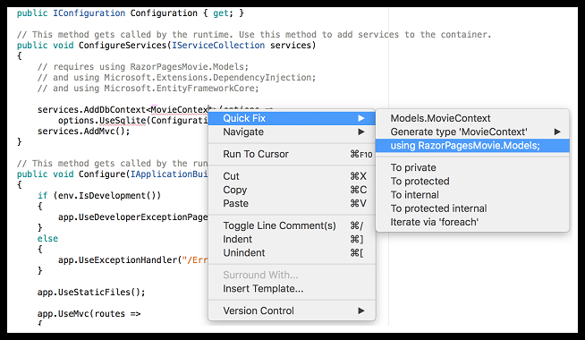
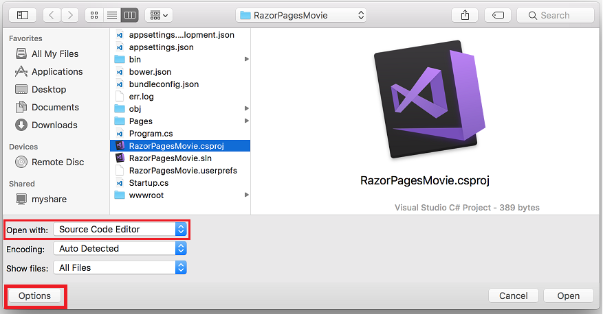

# Adding a model to a Razor Pages app in ASP.NET Core with Visual Studio for Mac

[!INCLUDE[model1](../../includes/RP/model1.md)]

## Add a data model

* In Solution Explorer, right-click the **RazorPagesMovie** project, and then select **Add** > **New Folder**. Name the folder *Models*.
* Right-click the *Models* folder, and then select **Add** > **New File**.
* In the **New File** dialog:

  * Select **General** in the left pane.
  * Select **Empty Class** in the center pain.
  * Name the class **Movie** and select **New**.

[!INCLUDE[model 2](../../includes/RP/model2.md)]
[!INCLUDE[model 2a](../../includes/RP/model2a.md)]

[!code-csharp[Main](../../tutorials/razor-pages/razor-pages-start/sample/RazorPagesMovie/Startup.cs?name=snippet_ConfigureServices2&highlight=3-6)]

Right click on a red squiggly line, for example `MovieContext` in the line `services.AddDbContext<MovieContext>(options =>`. Select **Quick Fix > using RazorPagesMovie.Models;**. Visual studio adds the using statement.

Build the project to verify you don't have any errors.

### Entity Framework Core NuGet packages for migrations

The EF tools for the command-line interface (CLI) are provided in [Microsoft.EntityFrameworkCore.Tools.DotNet](https://www.nuget.org/packages/Microsoft.EntityFrameworkCore.Tools.DotNet). To install this package, add it to the `DotNetCliToolReference` collection in the *.csproj* file. **Note:** You have to install this package by editing the *.csproj* file; you can't use the `install-package` command or the package manager GUI.

To edit a *.csproj* file:

* Select **File > Open**, and then select the *.csproj* file.
* Select **Options**.
* Change **Open with** to **Source Code Editor**.

The following code shows the updated *csproj* file.

[!code-xml]

[!INCLUDE[model3](../../includes/RP/model3.md)]
[!INCLUDE[model 4x](../../includes/RP/model4x.md)]

[!INCLUDE[model 4 exit](../../includes/RP/model4exit.md)]

[!INCLUDE[model 4](../../includes/RP/model4.md)]

### Add the Pages/Movies files to the project

* In Visual Studio, Right-click the *Pages* folder and select **Add > Add existing Folder**.
* Select the *Movies* folder.
* In the *Chosse files to include in the project* dialog, select **Include All**.

The next tutorial explains the files created by scaffolding.

>[!div class="step-by-step"]
[Previous: Getting Started](xref:tutorials/razor-pages-mac/razor-pages-start)
[Next: Scaffolded Razor Pages](xref:tutorials/razor-pages/page)
