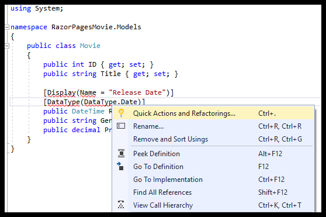

# Update the generated pages

By [Rick Anderson](https://twitter.com/RickAndMSFT)

We have a good start to the movie app, but the presentation isn't ideal. We don't want to see the time (12:00:00 AM in the image below) and **ReleaseDate** should be **Release Date** (two words).

## Update the generated code

Open the *Models/Movie.cs* file and add the highlighted lines shown in the following code:

[!code-csharp[Main](razor-pages-start/sample/RazorPagesMovie/Models/MovieDate.cs?name=snippet_1&highlight=10-11)]

Right click on a red squiggly line > ** Quick Actions and Refactorings**.

  

Select `using System.ComponentModel.DataAnnotations;`

  

  Visual studio adds `using System.ComponentModel.DataAnnotations;`.

[!INCLUDE[model1](../../includes/RP/da2.md)]

>[!div class="step-by-step"]
[Previous: Working with SQL Server LocalDB](xref:tutorials/razor-pages/sql)
[Adding Search](xref:tutorials/razor-pages/search)
