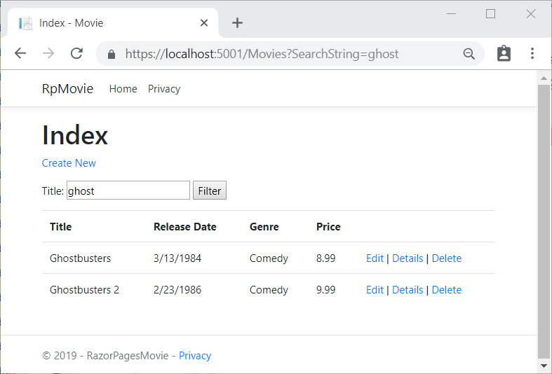

# Tutorial: Create a Razor Pages web app with ASP.NET Core

This series of tutorials explains the basics of building a Razor Pages web app. 

[!INCLUDE]

This series includes the following tutorials:

1. [Create a Razor Pages web app](xref:tutorials/razor-pages/razor-pages-start)
1. [Add a model to a Razor Pages app](xref:tutorials/razor-pages/model)
1. [Scaffold (generate) Razor pages](xref:tutorials/razor-pages/page)
1. [Work with a database](xref:tutorials/razor-pages/sql)
1. [Update Razor pages](xref:tutorials/razor-pages/da1)
1. [Add search](xref:tutorials/razor-pages/search)
1. [Add a new field](xref:tutorials/razor-pages/new-field)
1. [Add validation](xref:tutorials/razor-pages/validation)

At the end, you'll have an app that can display and manage a database of movies.

