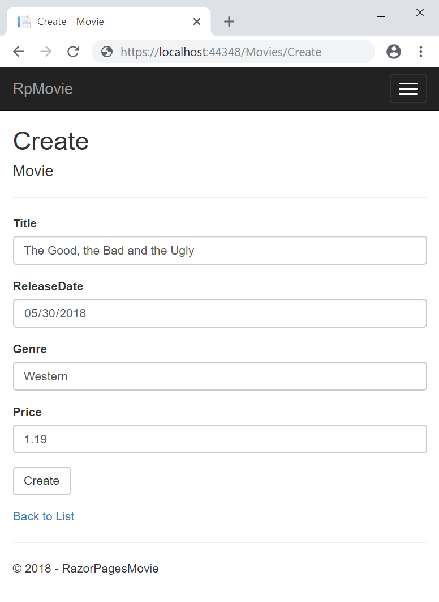
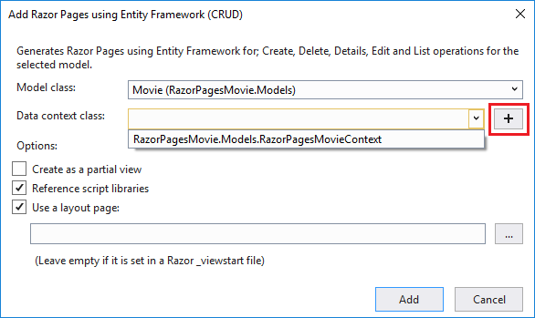

# Add a model to a Razor Pages app in ASP.NET Core

By [Rick Anderson](https://twitter.com/RickAndMSFT)

::: moniker range=">= aspnetcore-3.0"

<!-- In the next update on the CLI version, let the scaffolder do the same work the VS driven scaffolder does. That is, create the DB context, etc -->

In this section, classes are added for managing movies. The app's model classes use [Entity Framework Core (EF Core)](/ef/core) to work with the database. EF Core is an object-relational mapper (O/RM) that simplifies data access.

The model classes are known as POCO classes (from "plain-old CLR objects") because they don't have any dependency on EF Core. They define the properties of the data that are stored in the database.

[!INCLUDE[View or download sample code](~/includes/rp/download.md)]

## Add a data model

# [Visual Studio](#tab/visual-studio)

Right-click the **RazorPagesMovie** project > **Add** > **New Folder**. Name the folder *Models*.

Right click the *Models* folder. Select **Add** > **Class**. Name the class **Movie**.

[!INCLUDE [model 1b](~/includes/RP/model1b.md)]

# [Visual Studio Code](#tab/visual-studio-code)

* Add a folder named *Models*.
* Add a class to the *Models* folder named *Movie.cs*.

[!INCLUDE [model 1b](~/includes/RP/model1b.md)]

[!INCLUDE [model 2](~/includes/RP/model2.md)]

# [Visual Studio for Mac](#tab/visual-studio-mac)

* In Solution Pad, right-click the **RazorPagesMovie** project, and then select **Add** > **New Folder...**. Name the folder *Models*.
* Right-click the *Models* folder, and then select **Add** > **New File...**.
* In the **New File** dialog:

  * Select **General** in the left pane.
  * Select **Empty Class** in the center pane.
  * Name the class **Movie** and select **New**.

[!INCLUDE [model 1b](~/includes/RP/model1b.md)]

---

Build the project to verify there are no compilation errors.

## Scaffold the movie model

In this section, the movie model is scaffolded. That is, the scaffolding tool produces pages for Create, Read, Update, and Delete (CRUD) operations for the movie model.

# [Visual Studio](#tab/visual-studio)

Create a *Pages/Movies* folder:

* Right click on the *Pages* folder > **Add** > **New Folder**.
* Name the folder *Movies*

Right click on the *Pages/Movies* folder > **Add** > **New Scaffolded Item**.


In the **Add Scaffold** dialog, select **Razor Pages using Entity Framework (CRUD)** > **Add**.


Complete the **Add Razor Pages using Entity Framework (CRUD)** dialog:

* In the **Model class** drop down, select **Movie (RazorPagesMovie.Models)**.
* In the **Data context class** row, select the **+** (plus) sign and change the generated name from RazorPagesMovie.**Models**.RazorPagesMovieContext to RazorPagesMovie.**Data**.RazorPagesMovieContext. [This change](https://developercommunity.visualstudio.com/content/problem/652166/aspnet-core-ef-scaffolder-uses-incorrect-namespace.html) is not required. It creates the database context class with the correct namespace.
* Select **Add**.


The *appsettings.json* file is updated with the connection string used to connect to a local database.

# [Visual Studio Code](#tab/visual-studio-code)

<!--  Until https://github.com/aspnet/Scaffolding/issues/582 is fixed windows needs backslash or the namespace is namespace RazorPagesMovie.Pages_Movies rather than namespace RazorPagesMovie.Pages.Movies
-->

* Open a command window in the project directory (The directory that contains the *Program.cs*, *Startup.cs*, and *.csproj* files).
* Install the scaffolding tool:

  ```dotnetcli
   dotnet tool install --global dotnet-aspnet-codegenerator
   ```

* **For Windows**: Run the following command:

  ```dotnetcli
  dotnet aspnet-codegenerator razorpage -m Movie -dc RazorPagesMovieContext -udl -outDir Pages\Movies --referenceScriptLibraries
  ```

* **For macOS and Linux**: Run the following command:

  ```dotnetcli
  dotnet aspnet-codegenerator razorpage -m Movie -dc RazorPagesMovieContext -udl -outDir Pages/Movies --referenceScriptLibraries
  dotnet tool install --global dotnet-aspnet-codegenerator
  ```

[!INCLUDE [explains scaffold gen params](~/includes/RP/model4.md)]

[!INCLUDE [use SQL Server in production](~/includes/RP/sqlitedev.md)]

# [Visual Studio for Mac](#tab/visual-studio-mac)

Create a *Pages/Movies* folder:

* Right click on the *Pages* folder > **Add** > **New Folder**.
* Name the folder *Movies*

Right click on the *Pages/Movies* folder > **Add** > **New Scaffolding...**.


In the **New Scaffolding** dialog, select **Razor Pages using Entity Framework (CRUD)** > **Next**.


Complete the **Add Razor Pages using Entity Framework (CRUD)** dialog:

* In the **Model class** drop down, select, or type, **Movie (RazorPagesMovie.Models)**.
* In the **Data context class** row, type the name for the new class, RazorPagesMovie.**Data**.RazorPagesMovieContext. [This change](https://developercommunity.visualstudio.com/content/problem/652166/aspnet-core-ef-scaffolder-uses-incorrect-namespace.html) is not required. It creates the database context class with the correct namespace.
* Select **Add**.


The *appsettings.json* file is updated with the connection string used to connect to a local database.

### Add EF tools

Run the following .NET Core CLI command:

```dotnetcli
dotnet tool install --global dotnet-ef
```

The preceding command adds the Entity Framework Core Tools for the .NET Core CLI.

---

### Files created

# [Visual Studio](#tab/visual-studio)

The scaffold process creates and updates the following files:

* *Pages/Movies*: Create, Delete, Details, Edit, and Index.
* *Data/RazorPagesMovieContext.cs*

### Updated

* *Startup.cs*

The created and updated files are explained in the next section.

# [Visual Studio for Mac](#tab/visual-studio-mac)

The scaffold process creates and updates the following files:

* *Pages/Movies*: Create, Delete, Details, Edit, and Index.
* *Data/RazorPagesMovieContext.cs*

### Updated

* *Startup.cs*

The created and updated files are explained in the next section.

# [Visual Studio Code](#tab/visual-studio-code)

The scaffold process creates the following files:

* *Pages/Movies*: Create, Delete, Details, Edit, and Index.

The created files are explained in the next section.

---

<a name="pmc"></a>

## Initial migration

# [Visual Studio](#tab/visual-studio)

In this section, the Package Manager Console (PMC) is used to:

* Add an initial migration.
* Update the database with the initial migration.

From the **Tools** menu, select **NuGet Package Manager** > **Package Manager Console**.

  

In the PMC, enter the following commands:

```powershell
Add-Migration InitialCreate
Update-Database
```

# [Visual Studio Code](#tab/visual-studio-code)

[!INCLUDE [initial migration](~/includes/RP/model3.md)]

# [Visual Studio for Mac](#tab/visual-studio-mac)

[!INCLUDE [initial migration](~/includes/RP/model3.md)]

---

The preceding commands generate the following warning: "No type was specified for the decimal column 'Price' on entity type 'Movie'. This will cause values to be silently truncated if they do not fit in the default precision and scale. Explicitly specify the SQL server column type that can accommodate all the values using 'HasColumnType()'."

You can ignore that warning, it will be fixed in a later tutorial.

The migrations command generates code to create the initial database schema. The schema is based on the model specified in `DbContext`. The `InitialCreate` argument is used to name the migrations. Any name can be used, but by convention a name is selected that describes the migration.

The `update` command runs the `Up` method in migrations that have not been applied. In this case, `update` runs the `Up` method in  *Migrations/\<time-stamp>_InitialCreate.cs* file, which creates the database.

# [Visual Studio](#tab/visual-studio)

### Examine the context registered with dependency injection

ASP.NET Core is built with [dependency injection](xref:fundamentals/dependency-injection). Services (such as the EF Core DB context) are registered with dependency injection during application startup. Components that require these services (such as Razor Pages) are provided these services via constructor parameters. The constructor code that gets a DB context instance is shown later in the tutorial.

The scaffolding tool automatically created a DB context and registered it with the dependency injection container.

Examine the `Startup.ConfigureServices` method. The highlighted line was added by the scaffolder:

[!code-csharp[](razor-pages-start/sample/RazorPagesMovie30/Startup.cs?name=snippet_ConfigureServices&highlight=5-6)]

The `RazorPagesMovieContext` coordinates EF Core functionality (Create, Read, Update, Delete, etc.) for the `Movie` model. The data context (`RazorPagesMovieContext`) is derived from [Microsoft.EntityFrameworkCore.DbContext](/dotnet/api/microsoft.entityframeworkcore.dbcontext). The data context specifies which entities are included in the data model.

[!code-csharp[](~/tutorials/razor-pages/razor-pages-start/sample/RazorPagesMovie22/Data/RazorPagesMovieContext.cs)]

The preceding code creates a [DbSet\<Movie>](/dotnet/api/microsoft.entityframeworkcore.dbset-1) property for the entity set. In Entity Framework terminology, an entity set typically corresponds to a database table. An entity corresponds to a row in the table.

The name of the connection string is passed in to the context by calling a method on a [DbContextOptions](/dotnet/api/microsoft.entityframeworkcore.dbcontextoptions) object. For local development, the [ASP.NET Core configuration system](xref:fundamentals/configuration/index) reads the connection string from the *appsettings.json* file.

# [Visual Studio Code](#tab/visual-studio-code)

Examine the `Up` method.

# [Visual Studio for Mac](#tab/visual-studio-mac)

Examine the `Up` method.

---

<a name="test"></a>

### Test the app

* Run the app and append `/Movies` to the URL in the browser (`http://localhost:port/movies`).

If you get the error:

```console
SqlException: Cannot open database "RazorPagesMovieContext-GUID" requested by the login. The login failed.
Login failed for user 'User-name'.
```

You missed the [migrations step](#pmc).

* Test the **Create** link.

  

  > [!NOTE]
  > You may not be able to enter decimal commas in the `Price` field. To support [jQuery validation](https://jqueryvalidation.org/) for non-English locales that use a comma (",") for a decimal point and for non US-English date formats, the app must be globalized. For globalization instructions, see [this GitHub issue](https://github.com/dotnet/AspNetCore.Docs/issues/4076#issuecomment-326590420).

* Test the **Edit**, **Details**, and **Delete** links.

The next tutorial explains the files created by scaffolding.

## Additional resources

> [!div class="step-by-step"]
> [Previous: Get Started](xref:tutorials/razor-pages/razor-pages-start)
> [Next: Scaffolded Razor Pages](xref:tutorials/razor-pages/page)

::: moniker-end

<!--  ::: moniker previous version   -->
::: moniker range="< aspnetcore-3.0"

In this section, classes are added for managing movies in a cross-platform [SQLite database](https://www.sqlite.org/index.html). Apps created from an ASP.NET Core template use a SQLite database. The app's model classes are used with [Entity Framework Core (EF Core)](/ef/core) ([SQLite EF Core Database Provider](/ef/core/providers/sqlite)) to work with the database. EF Core is an object-relational mapping (ORM) framework that simplifies data access.

The model classes are known as POCO classes (from "plain-old CLR objects") because they don't have any dependency on EF Core. They define the properties of the data that are stored in the database.

[!INCLUDE[](~/includes/rp/download.md)]

## Add a data model

# [Visual Studio](#tab/visual-studio)

Right-click the **RazorPagesMovie** project > **Add** > **New Folder**. Name the folder *Models*.

Right click the *Models* folder. Select **Add** > **Class**. Name the class **Movie**.

[!INCLUDE [model 1b](~/includes/RP/model1b.md)]

# [Visual Studio Code](#tab/visual-studio-code)

* Add a folder named *Models*.
* Add a class to the *Models* folder named *Movie.cs*.

[!INCLUDE [model 1b](~/includes/RP/model1b.md)]

[!INCLUDE [model 2](~/includes/RP/model2.md)]

# [Visual Studio for Mac](#tab/visual-studio-mac)

* In Solution Explorer, right-click the **RazorPagesMovie** project, and then select **Add** > **New Folder**. Name the folder *Models*.
* Right-click the *Models* folder, and then select **Add** > **New File**.
* In the **New File** dialog:

  * Select **General** in the left pane.
  * Select **Empty Class** in the center pane.
  * Name the class **Movie** and select **New**.

[!INCLUDE [model 1b](~/includes/RP/model1b.md)]

---

Build the project to verify there are no compilation errors.

## Scaffold the movie model

In this section, the movie model is scaffolded. That is, the scaffolding tool produces pages for Create, Read, Update, and Delete (CRUD) operations for the movie model.

# [Visual Studio](#tab/visual-studio)

Create a *Pages/Movies* folder:

* Right click on the *Pages* folder > **Add** > **New Folder**.
* Name the folder *Movies*

Right click on the *Pages/Movies* folder > **Add** > **New Scaffolded Item**.


In the **Add Scaffold** dialog, select **Razor Pages using Entity Framework (CRUD)** > **Add**.


Complete the **Add Razor Pages using Entity Framework (CRUD)** dialog:
<!-- In the next section, change 
(plus) sign and accept the generated name 
to use Data, it should not use models. That will make the namespace the same for the VS version and the CLI version
-->

* In the **Model class** drop down, select **Movie (RazorPagesMovie.Models)**.
* In the **Data context class** row, select the **+** (plus) sign and accept the generated name **RazorPagesMovie.Models.RazorPagesMovieContext**.
* Select **Add**.



The *appsettings.json* file is updated with the connection string used to connect to a local database.

# [Visual Studio Code](#tab/visual-studio-code)

<!--  Until https://github.com/aspnet/Scaffolding/issues/582 is fixed windows needs backslash or the namespace is namespace RazorPagesMovie.Pages_Movies rather than namespace RazorPagesMovie.Pages.Movies
-->

* Open a command window in the project directory (The directory that contains the *Program.cs*, *Startup.cs*, and *.csproj* files).

* **For Windows**: Run the following command:

  ```dotnetcli
  dotnet aspnet-codegenerator razorpage -m Movie -dc RazorPagesMovieContext -udl -outDir Pages\Movies --referenceScriptLibraries
  ```

* **For macOS and Linux**: Run the following command:

  ```dotnetcli
  dotnet aspnet-codegenerator razorpage -m Movie -dc RazorPagesMovieContext -udl -outDir Pages/Movies --referenceScriptLibraries
  ```

[!INCLUDE [explains scaffold gen params](~/includes/RP/model4.md)]

# [Visual Studio for Mac](#tab/visual-studio-mac)

Create a *Pages/Movies* folder:

* Right click on the *Pages* folder > **Add** > **New Folder**.
* Name the folder *Movies*

Right click on the *Pages/Movies* folder > **Add** > **New Scaffolded Item**.


In the **Add New Scaffolding** dialog, select **Razor Pages using Entity Framework (CRUD)** > **Add**.


Complete the **Add Razor Pages using Entity Framework (CRUD)** dialog:

* In the **Model class** drop down, select or type **Movie**.
* In the **Data context class** row, type select the **RazorPagesMovieContext** this will create a new db context class with the correct namespace. In this case it will be  **RazorPagesMovie.Models.RazorPagesMovieContext**.
* Select **Add**.


The *appsettings.json* file is updated with the connection string used to connect to a local database.

---

The scaffold process creates and updates the following files:

### Files created

* *Pages/Movies*: Create, Delete, Details, Edit, and Index.
* *Data/RazorPagesMovieContext.cs*

### File updated

* *Startup.cs*

The created and updated files are explained in the next section.

<a name="pmc"></a>

## Initial migration

# [Visual Studio](#tab/visual-studio)

In this section, the Package Manager Console (PMC) is used to:

* Add an initial migration.
* Update the database with the initial migration.

From the **Tools** menu, select **NuGet Package Manager** > **Package Manager Console**.

  

In the PMC, enter the following commands:

```powershell
Add-Migration Initial
Update-Database
```

The `Add-Migration` command generates code to create the initial database schema. The schema is based on the model specified in the `DbContext` (In the *RazorPagesMovieContext.cs* file). The `InitialCreate` argument is used to name the migration. Any name can be used, but by convention a name that describes the migration is used. For more information, see <xref:data/ef-mvc/migrations>.

The `Update-Database` command runs the `Up` method in the *Migrations/\<time-stamp>_InitialCreate.cs* file. The `Up` method creates the database.

# [Visual Studio Code](#tab/visual-studio-code)

[!INCLUDE [initial migration](~/includes/RP/model3.md)]

# [Visual Studio for Mac](#tab/visual-studio-mac)

[!INCLUDE [initial migration](~/includes/RP/model3.md)]

---
> [!NOTE]
> The preceding commands generate the following warning: "*No type was specified for the decimal column 'Price' on entity type 'Movie'. This will cause values to be silently truncated if they do not fit in the default precision and scale. Explicitly specify the SQL server column type that can accommodate all the values using 'HasColumnType()'.*" You can ignore that warning, it will be fixed in a later tutorial.

# [Visual Studio](#tab/visual-studio)

### Examine the context registered with dependency injection

ASP.NET Core is built with [dependency injection](xref:fundamentals/dependency-injection). Services (such as the EF Core DB context) are registered with dependency injection during application startup. Components that require these services (such as Razor Pages) are provided these services via constructor parameters. The constructor code that gets a DB context instance is shown later in the tutorial.

The scaffolding tool automatically created a DB context and registered it with the dependency injection container.

Examine the `Startup.ConfigureServices` method. The highlighted line was added by the scaffolder:

[!code-csharp[](razor-pages-start/sample/RazorPagesMovie22/Startup.cs?name=snippet_ConfigureServices&highlight=15-18)]

The `RazorPagesMovieContext` coordinates EF Core functionality (Create, Read, Update, Delete, etc.) for the `Movie` model. The data context (`RazorPagesMovieContext`) is derived from [Microsoft.EntityFrameworkCore.DbContext](/dotnet/api/microsoft.entityframeworkcore.dbcontext). The data context specifies which entities are included in the data model.

[!code-csharp[](~/tutorials/razor-pages/razor-pages-start/sample/RazorPagesMovie22/Data/RazorPagesMovieContext.cs)]

The preceding code creates a [DbSet\<Movie>](/dotnet/api/microsoft.entityframeworkcore.dbset-1) property for the entity set. In Entity Framework terminology, an entity set typically corresponds to a database table. An entity corresponds to a row in the table.

The name of the connection string is passed in to the context by calling a method on a [DbContextOptions](/dotnet/api/microsoft.entityframeworkcore.dbcontextoptions) object. For local development, the [ASP.NET Core configuration system](xref:fundamentals/configuration/index) reads the connection string from the *appsettings.json* file.

# [Visual Studio Code](#tab/visual-studio-code)

Examine the `Up` method.

# [Visual Studio for Mac](#tab/visual-studio-mac)

Examine the `Up` method.

---

<a name="test"></a>

### Test the app

* Run the app and append `/Movies` to the URL in the browser (`http://localhost:port/movies`).

If you get the error:

```console
SqlException: Cannot open database "RazorPagesMovieContext-GUID" requested by the login. The login failed.
Login failed for user 'User-name'.
```

You missed the [migrations step](#pmc).

* Test the **Create** link.

  

  > [!NOTE]
  > You may not be able to enter decimal commas in the `Price` field. To support [jQuery validation](https://jqueryvalidation.org/) for non-English locales that use a comma (",") for a decimal point and for non US-English date formats, the app must be globalized. For globalization instructions, see [this GitHub issue](https://github.com/dotnet/AspNetCore.Docs/issues/4076#issuecomment-326590420).

* Test the **Edit**, **Details**, and **Delete** links.

The next tutorial explains the files created by scaffolding.

## Additional resources

> [!div class="step-by-step"]
> [Previous: Get Started](xref:tutorials/razor-pages/razor-pages-start)
> [Next: Scaffolded Razor Pages](xref:tutorials/razor-pages/page)

::: moniker-end
