# Part 2, add a model to a Razor Pages app in ASP.NET Core

By [Rick Anderson](https://twitter.com/RickAndMSFT)

:::moniker range=">= aspnetcore-6.0"

<!-- In the next update on the CLI version, let the scaffolder do the same work the VS driven scaffolder does. That is, create the DB context, etc -->

In this tutorial, classes are added for managing movies in a database. The app's model classes use [Entity Framework Core (EF Core)](/ef/core) to work with the database. EF Core is an object-relational mapper (O/RM) that simplifies data access. You write the model classes first, and EF Core creates the database.

The model classes are known as POCO classes (from "**P**lain-**O**ld **C**LR **O**bjects") because they don't have a dependency on EF Core. They define the properties of the data that are stored in the database.

## Add a data model

# [Visual Studio](#tab/visual-studio)

1. In **Solution Explorer**, right-click the *RazorPagesMovie* project > **Add** > **New Folder**. Name the folder *Models*.
1. Right-click the *Models* folder. Select **Add** > **Class**. Name the class *Movie*.
1. Add the following properties to the `Movie` class:

   [!code-csharp[](~/tutorials/razor-pages/razor-pages-start/sample/RazorPagesMovie60/Models/Movie.cs?name=snippet1)]

The `Movie` class contains:

* The `ID` field is required by the database for the primary key.
* A [[DataType]](xref:System.ComponentModel.DataAnnotations.DataTypeAttribute) attribute that specifies the type of data in the `ReleaseDate` property. With this attribute:

  * The user isn't required to enter time information in the date field.
  * Only the date is displayed, not time information.

# [Visual Studio Code](#tab/visual-studio-code)

1. Add a folder named *Models*.
1. Add a class to the *Models* folder named `Movie.cs`.

Add the following properties to the `Movie` class:

[!code-csharp[](~/tutorials/razor-pages/razor-pages-start/sample/RazorPagesMovie60/Models/Movie.cs?name=snippet1)]

The `Movie` class contains:

* An `ID` field to provide a primary key for the database.
* A [[DataType]](xref:System.ComponentModel.DataAnnotations.DataTypeAttribute) attribute to specify the type of data in the `ReleaseDate` field. With this attribute:

  * The user is not required to enter time information in the date field.
  * Only the date is displayed, not time information.

<a name="dc6"></a>

### Add NuGet packages and EF tools

[!INCLUDE[](~/includes/add-EF-NuGet-SQLite-CLI-6.md)]

# [Visual Studio for Mac](#tab/visual-studio-mac)

1. In the **Solution Tool Window**, right-click the *RazorPagesMovie* project, and then select **Add** > **New Folder...**. Name the folder *Models*.
1. Right-click the *Models* folder, and then select **Add** > **New File...**.
1. In the **New File** dialog:
   1. Select **General** in the left pane.
   1. Select **Empty Class** in the center pane.
   1. Name the class **Movie** and select **Create**.

1. Add the following properties to the `Movie` class:

   [!code-csharp[](~/tutorials/razor-pages/razor-pages-start/sample/RazorPagesMovie60/Models/Movie.cs?name=snippet1)]

The `Movie` class contains:

* An `ID` field to provide a primary key for the database.
* A [[DataType]](xref:System.ComponentModel.DataAnnotations.DataTypeAttribute) attribute to specify the type of data in the `ReleaseDate` field. With this attribute:

  * The user isn't required to enter time information in the date field.
  * Only the date is displayed, not time information.

---

[DataAnnotations](xref:System.ComponentModel.DataAnnotations) are covered in a later tutorial.

Build the project to verify there are no compilation errors.

## Scaffold the movie model

In this section, the movie model is scaffolded. That is, the scaffolding tool produces pages for Create, Read, Update, and Delete (CRUD) operations for the movie model.

# [Visual Studio](#tab/visual-studio)

1. Add the NuGet package `Microsoft.EntityFrameworkCore.Design`, which is required for the scaffolding tool.
   1. From the **Tools** menu, select **NuGet Package Manager** > **Manage NuGet Packages for Solution**
      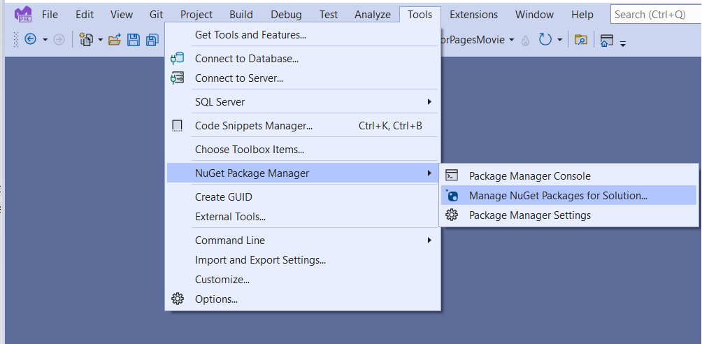
   1. Select the **Browse** tab.
   1. Enter `Microsoft.EntityFrameworkCore.Design` and select it from the list.
   1. Check **Project** and then Select **Install**
   1. Select **I Accept** in the **License Acceptance** dialog.
      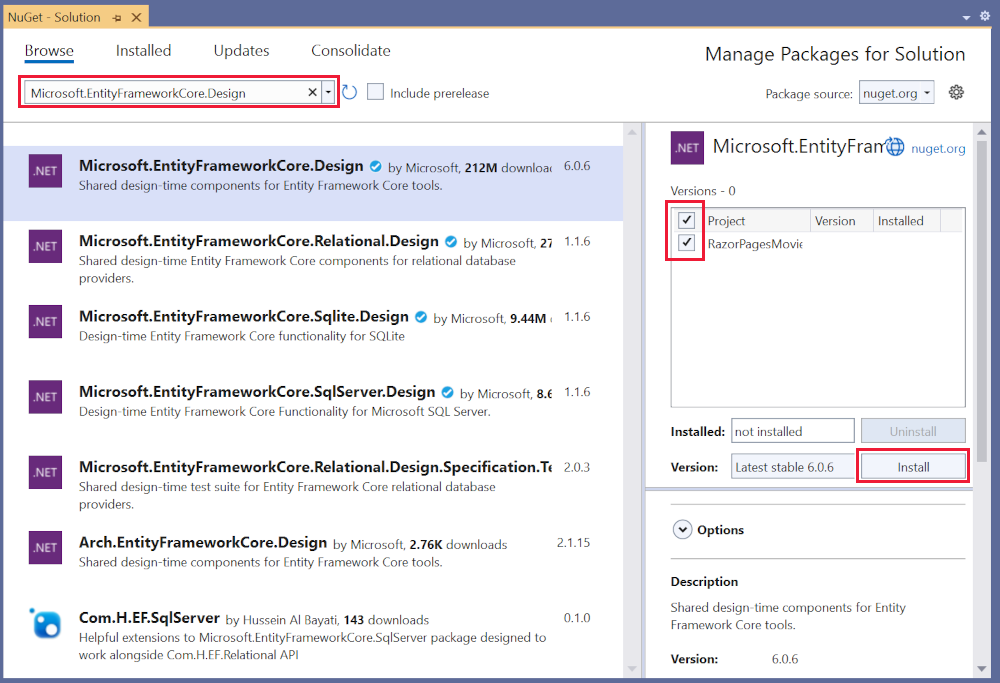

1. Create the *Pages/Movies* folder:
   1. Right-click on the *Pages* folder > **Add** > **New Folder**.
   1. Name the folder *Movies*.

1. Right-click on the *Pages/Movies* folder > **Add** > **New Scaffolded Item**.

   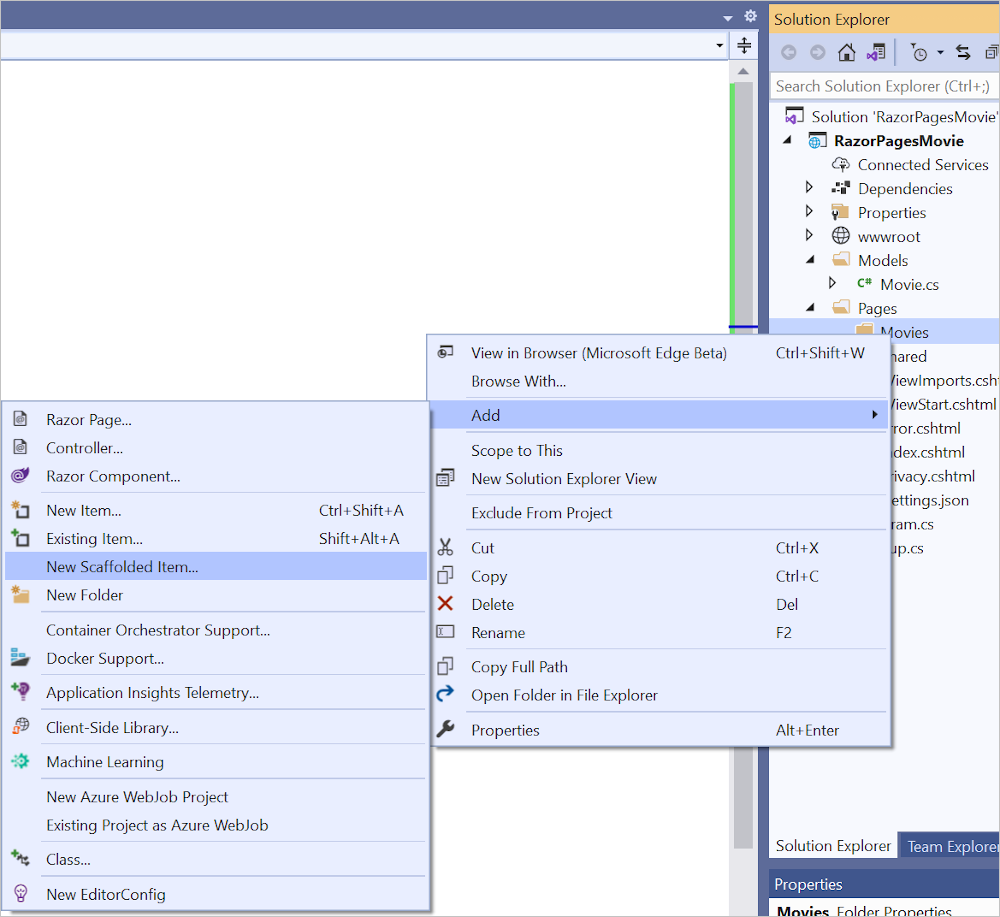

1. In the **Add New Scaffold** dialog, select **Razor Pages using Entity Framework (CRUD)** > **Add**.

   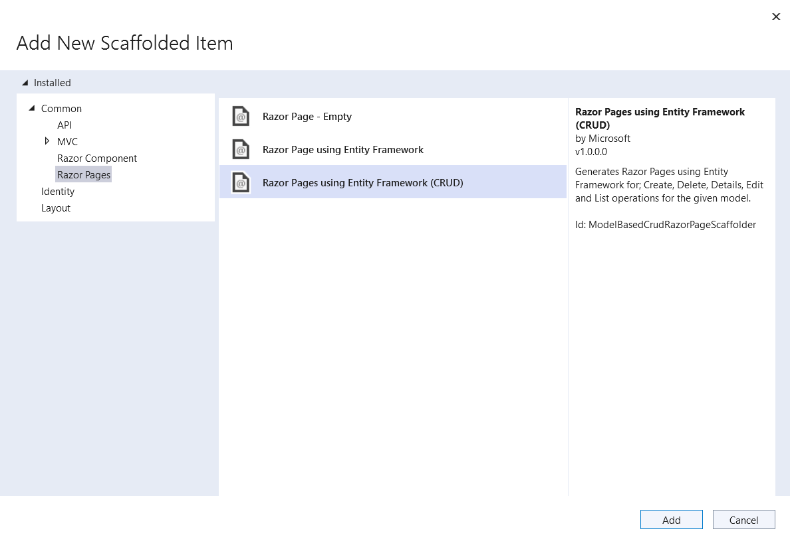

1. Complete the **Add Razor Pages using Entity Framework (CRUD)** dialog:
   1. In the **Model class** drop down, select **Movie (RazorPagesMovie.Models)**.
   1. In the **Data context class** row, select the **+** (plus) sign.
      1. In the **Add Data Context** dialog, the class name `RazorPagesMovie.Data.RazorPagesMovieContext` is generated.
   1. Select **Add**.

   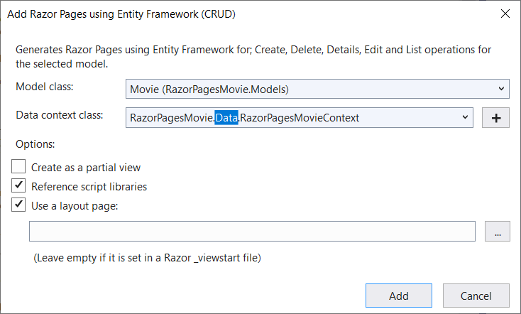
   
   If you get an error message that says you need to install the `Microsoft.EntityFrameworkCore.SqlServer` package, repeat the steps starting with **Add** > **New Scaffolded Item**.

The `appsettings.json` file is updated with the connection string used to connect to a local database.

# [Visual Studio Code](#tab/visual-studio-code)

* Open a command shell to the project directory, which contains the `Program.cs` and `.csproj` files. Run the following command:

  ```dotnetcli
  dotnet-aspnet-codegenerator razorpage -m Movie -dc RazorPagesMovieContext -udl -outDir Pages/Movies --referenceScriptLibraries -sqlite
  ```

<a name="codegenerator"></a>
The following table details the ASP.NET Core code generator options.

| Option               | Description|
| ----------------- | ------------ |
| `-m`  | The name of the model. |
| `-dc`  | The `DbContext` class to use. |
| `-udl` | Use the default layout. |
| `-outDir` | The relative output folder path to create the views. |
| `--referenceScriptLibraries` | Adds `_ValidationScriptsPartial` to Edit and Create pages |

Use the `-h` option to get help on the `dotnet-aspnet-codegenerator razorpage` command:

```dotnetcli
dotnet-aspnet-codegenerator razorpage -h
```

For more information, see [dotnet-aspnet-codegenerator](xref:fundamentals/tools/dotnet-aspnet-codegenerator).

[!INCLUDE[](~/includes/DevProdSQLite.md)]

# [Visual Studio for Mac](#tab/visual-studio-mac)

1. Create a *Pages/Movies* folder:
   1. Right-click on the *Pages* folder > **Add** > **New Folder**.
   1. Name the folder *Movies*.

1. Right-click on the *Pages/Movies* folder > **Add** > **New Scaffolding...**.

   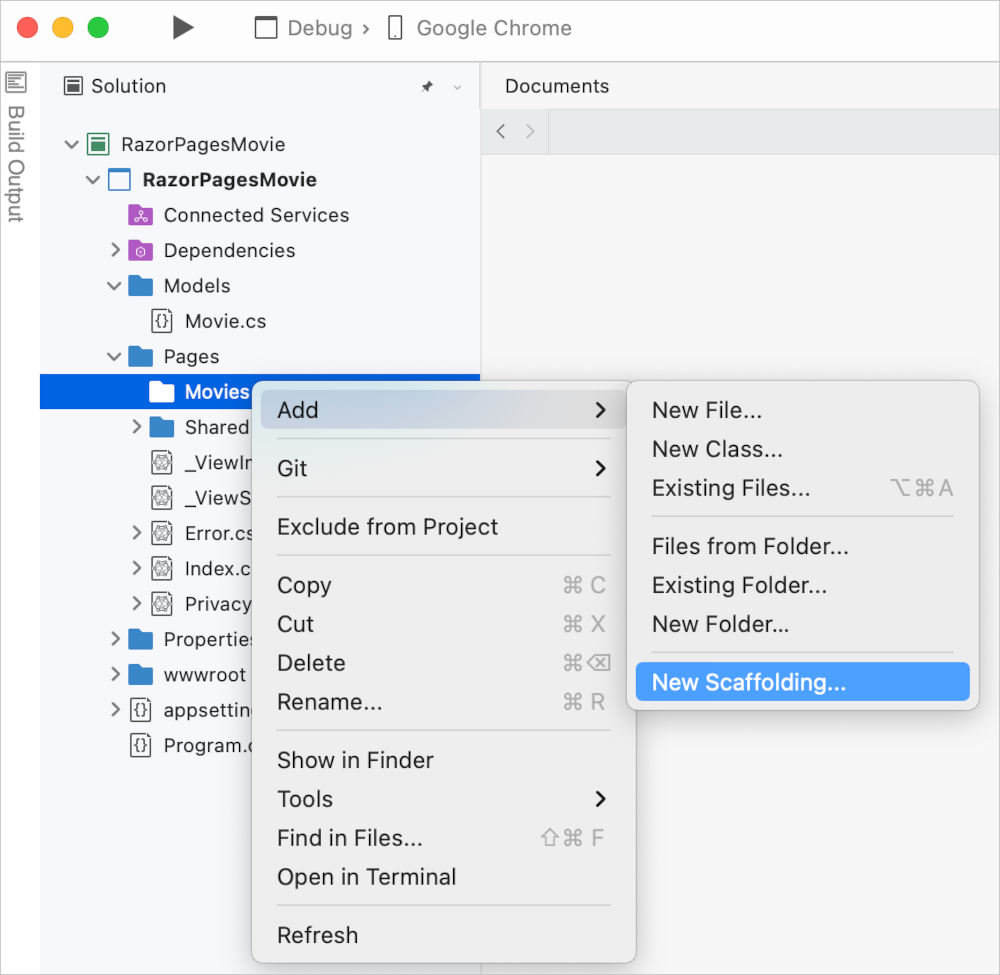

1. In the **New Scaffolding** dialog, select **Razor Pages using Entity Framework (CRUD)** > **Next**.

   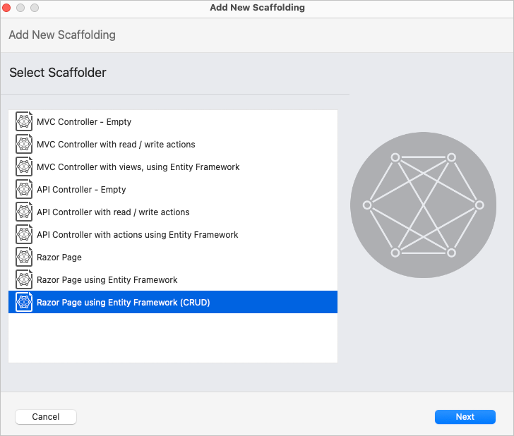

1. Complete the **Add Razor Pages using Entity Framework (CRUD)** dialog:
   1. In the **Model class to use:** row, enter `Movie`.
   1. In the **DbContext Class to use:** row, name the class `RazorPagesMovie.Data.RazorPagesMovieContext`.
   1. Select **Finish**.

   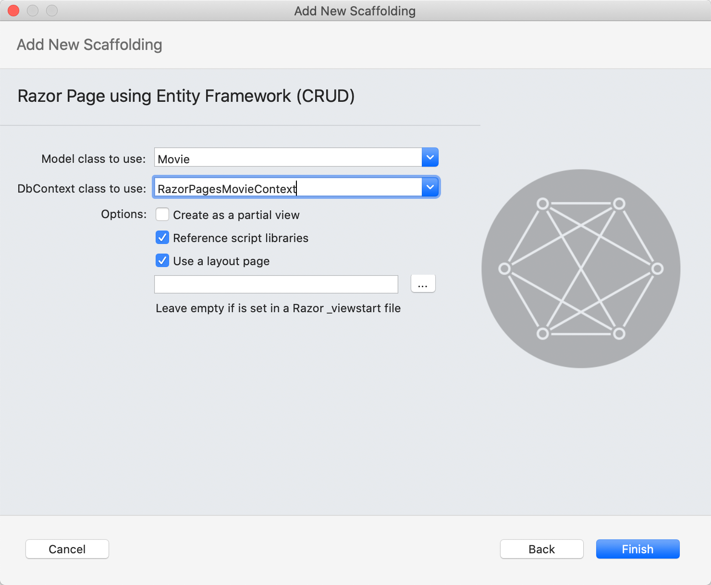

The `appsettings.json` file is updated with the connection string used to connect to a local database.

[!INCLUDE[](~/includes/RP/sqlitedev.md)]

---

### Files created and updated

The scaffold process creates the following files:

* *Pages/Movies*: Create, Delete, Details, Edit, and Index.
* `Data/RazorPagesMovieContext.cs`

The created files are explained in the next tutorial.

The scaffold process adds the following highlighted code to the `Program.cs` file:

# [Visual Studio](#tab/visual-studio)
[!code-csharp[](~/tutorials/razor-pages/razor-pages-start/sample/RazorPagesMovie60/Program.cs?name=snippet_all&highlight=1-3,9-10)]
# [Visual Studio Code / Visual Studio for Mac](#tab/visual-studio-code+visual-studio-mac)
[!code-csharp[](~/tutorials/razor-pages/razor-pages-start/sample/RazorPagesMovie60/Program.cs?name=snippet_all_sl&highlight=1-3,9-10)]

---

The `Program.cs` changes are explained later in this tutorial.

<a name="pmc6"></a>

## Create the initial database schema using EF's migration feature

The migrations feature in Entity Framework Core provides a way to:

* Create the initial database schema.
* Incrementally update the database schema to keep it in sync with the app's data model.  Existing data in the database is preserved.

# [Visual Studio](#tab/visual-studio)

In this section, the **Package Manager Console** (PMC) window is used to:

* Add an initial migration.
* Update the database with the initial migration.

1. From the **Tools** menu, select **NuGet Package Manager** > **Package Manager Console**.

   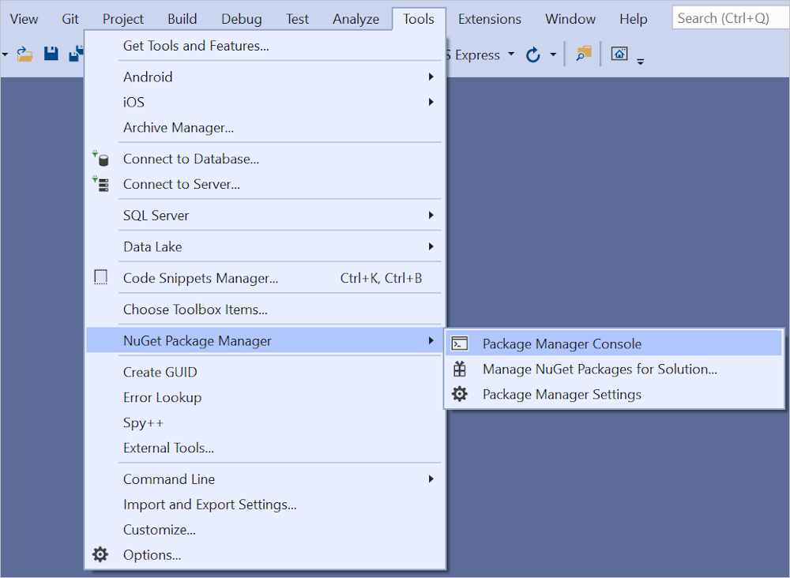

1. In the PMC, enter the following commands:

   ```powershell
   Add-Migration InitialCreate
   Update-Database

   ```

# [Visual Studio Code / Visual Studio for Mac](#tab/visual-studio-code+visual-studio-mac)

* Run the following .NET CLI commands:

  ```dotnetcli
  dotnet tool install --global dotnet-ef
  dotnet ef migrations add InitialCreate
  dotnet ef database update
  ```

> [!NOTE]
> For SQLite, column type for the `Price` field is set to `TEXT`. This is resolved in a later step.

---

The preceding commands install [the Entity Framework Core tools](/ef/core/get-started/overview/install#get-the-entity-framework-core-tools) and run the `migrations` command to generate code that creates the initial database schema.

The following warning is displayed, which is addressed in a later step:

> No type was specified for the decimal column 'Price' on entity type 'Movie'. This will cause values to be silently truncated if they do not fit in the default precision and scale. Explicitly specify the SQL server column type that can accommodate all the values using 'HasColumnType()'.

The `migrations` command generates code to create the initial database schema. The schema is based on the model specified in `DbContext`. The `InitialCreate` argument is used to name the migrations. Any name can be used, but by convention a name is selected that describes the migration.

The `update` command runs the `Up` method in migrations that have not been applied. In this case, `update` runs the `Up` method in the `Migrations/<time-stamp>_InitialCreate.cs` file, which creates the database.

### Examine the context registered with dependency injection

ASP.NET Core is built with [dependency injection](xref:fundamentals/dependency-injection). Services, such as the EF Core database context, are registered with dependency injection during application startup. Components that require these services (such as Razor Pages) are provided via constructor parameters. The constructor code that gets a database context instance is shown later in the tutorial.

The scaffolding tool automatically created a database context and registered it with the dependency injection container. The following highlighted code is added to the `Program.cs` file by the scaffolder:

# [Visual Studio](#tab/visual-studio)

[!code-csharp[](~/tutorials/razor-pages/razor-pages-start/sample/RazorPagesMovie60/Program.cs?name=snippet_all&highlight=9-10)]

# [Visual Studio Code / Visual Studio for Mac](#tab/visual-studio-code+visual-studio-mac)
[!code-csharp[](~/tutorials/razor-pages/razor-pages-start/sample/RazorPagesMovie60/Program.cs?name=snippet_all_sl&highlight=9-10)]

---

The data context `RazorPagesMovieContext`:

* Derives from [Microsoft.EntityFrameworkCore.DbContext](xref:Microsoft.EntityFrameworkCore.DbContext).
* Specifies which entities are included in the data model.
* Coordinates EF Core functionality, such as Create, Read, Update and Delete, for the `Movie` model.

[!code-csharp[](~/tutorials/razor-pages/razor-pages-start/sample/RazorPagesMovie60/Data/RazorPagesMovieContext.cs?name=snippet_1)]

The preceding code creates a [DbSet\<Movie>](xref:Microsoft.EntityFrameworkCore.DbSet%601) property for the entity set. In Entity Framework terminology, an entity set typically corresponds to a database table. An entity corresponds to a row in the table.

The name of the connection string is passed in to the context by calling a method on a [DbContextOptions](xref:Microsoft.EntityFrameworkCore.DbContextOptions) object. For local development, the [Configuration system](xref:fundamentals/configuration/index) reads the connection string from the `appsettings.json` file.

<a name="test"></a>

## Build the app

Build the app. The compiler generates several `nullable` warnings. See [this GitHub issue](https://github.com/dotnet/Scaffolding/issues/1594),  [Nullable reference types (NRTs) and .NET compiler null-state static analysis](xref:migration/50-to-60#review-breaking-changes), and [Nullable reference types](/dotnet/csharp/nullable-references) for more information.

### Fix the warning messages

In this section, you can either disable nullable warnings or fix the scaffolded code. To eliminate the warnings from nullable reference types, remove the following line from the `RazorPagesMovie .csproj` file:

```xml
<Nullable>enable</Nullable>
```

Alternatively, fix the scaffolded code. The `RazorPagesMovieContext` generates the following warning:

> Warning CS8618 Non-nullable property 'Movie' must contain a non-null value when exiting constructor. Consider declaring the property as nullable.

To fix the warning, apply the suggestion and declare the `Movie` property [nullable](/dotnet/csharp/nullable-references).

[!code-csharp[](~/tutorials/razor-pages/razor-pages-start/sample/RazorPagesMovie60/Data/RazorPagesMovieContext.cs?name=snippet_fix)]

The `?` declares the property nullable.

An alternative approach is to disable the CS8618 [warning with pragma](/dotnet/fundamentals/code-analysis/suppress-warnings) statements:

[!code-csharp[](~/tutorials/razor-pages/razor-pages-start/sample/RazorPagesMovie60/Data/RazorPagesMovieContext.cs?name=snippet_prag)]

For the warnings in the Razor Pages C# code behind files, use the [pragma](/dotnet/csharp/language-reference/preprocessor-directives#pragmas) C# preprocessor directive to disable warnings. For example, use the following highlighted code in the `Pages/Movies/Index.cshtml.cs` file:

[!code-csharp[](~/tutorials/razor-pages/razor-pages-start/snapshot_sample6/Pages/Movies/Index.cshtml.cs?name=snippet&highlight=3-4,21,22)]

The `Pages/Movies/Delete.cshtml.cs` file requires the following `pragma` statements:

```csharp
#pragma warning disable CS8618
#pragma warning disable CS8601
#pragma warning disable CS8602
#pragma warning disable CS8604
// Class
#pragma warning restore CS8618
#pragma warning restore CS8601
#pragma warning restore CS8602
#pragma warning restore CS8604
```

### Test the app

1. Run the app and append `/Movies` to the URL in the browser (`http://localhost:port/movies`).

   If you receive the following error:

   ```console
   SqlException: Cannot open database "RazorPagesMovieContext-GUID" requested by the login. The login failed.
   Login failed for user 'User-name'.
   ```

   You missed the [migrations step](#pmc6).

1. Test the **Create** link.

   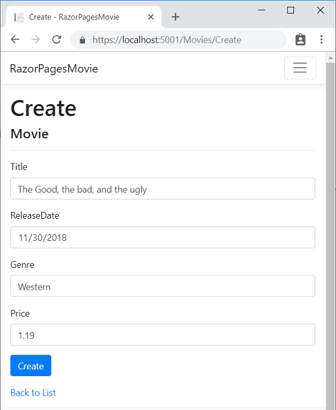

   > [!NOTE]
   > You may not be able to enter decimal commas in the `Price` field. To support [jQuery validation](https://jqueryvalidation.org/) for non-English locales that use a comma (",") for a decimal point and for non US-English date formats, the app must be globalized. For globalization instructions, see [this GitHub issue](https://github.com/dotnet/AspNetCore.Docs/issues/4076#issuecomment-326590420).

1. Test the **Edit**, **Details**, and **Delete** links.

The next tutorial explains the files created by scaffolding.

## Troubleshooting with the completed sample

If you run into a problem you can't resolve, compare your code to the completed project. [View or download completed project](https://github.com/dotnet/AspNetCore.Docs/tree/main/aspnetcore/tutorials/razor-pages/razor-pages-start/sample/RazorPagesMovie60) ([how to download](xref:index#how-to-download-a-sample)).

## Additional resources

> [!div class="step-by-step"]
> [Previous: Get Started](xref:tutorials/razor-pages/razor-pages-start)
> [Next: Scaffolded Razor Pages](xref:tutorials/razor-pages/page)

:::moniker-end

:::moniker range="= aspnetcore-5.0"

<!-- In the next update on the CLI version, let the scaffolder do the same work the VS driven scaffolder does. That is, create the DB context, etc -->

In this section, classes are added for managing movies in a database. The app's model classes use [Entity Framework Core (EF Core)](/ef/core) to work with the database. EF Core is an object-relational mapper (O/RM) that simplifies data access. You write the model classes first, and EF Core creates the database.

The model classes are known as POCO classes (from "**P**lain-**O**ld **C**LR **O**bjects") because they don't have a dependency on EF Core. They define the properties of the data that are stored in the database.

[View or download sample code](https://github.com/dotnet/AspNetCore.Docs/tree/main/aspnetcore/tutorials/razor-pages/razor-pages-start/sample/RazorPagesMovie50) ([how to download](xref:index#how-to-download-a-sample)).

## Add a data model

# [Visual Studio](#tab/visual-studio)

1. In **Solution Explorer**, right-click the *RazorPagesMovie* project > **Add** > **New Folder**. Name the folder *Models*.
1. Right-click the *Models* folder. Select **Add** > **Class**. Name the class *Movie*.
1. Add the following properties to the `Movie` class:

   [!code-csharp[](~/tutorials/razor-pages/razor-pages-start/sample/RazorPagesMovie22/Models/Movie.cs?name=snippet1)]

The `Movie` class contains:

* The `ID` field is required by the database for the primary key.
* `[DataType(DataType.Date)]`: The [[DataType]](xref:System.ComponentModel.DataAnnotations.DataTypeAttribute) attribute specifies the type of the data (`Date`). With this attribute:

  * The user isn't required to enter time information in the date field.
  * Only the date is displayed, not time information.

# [Visual Studio Code](#tab/visual-studio-code)

1. Add a folder named *Models*.
1. Add a class to the *Models* folder named `Movie.cs`.

Add the following properties to the `Movie` class:

[!code-csharp[](~/tutorials/razor-pages/razor-pages-start/sample/RazorPagesMovie22/Models/Movie.cs?name=snippet1)]

The `Movie` class contains:

* The `ID` field is required by the database for the primary key.
* `[DataType(DataType.Date)]`: The [[DataType]](xref:System.ComponentModel.DataAnnotations.DataTypeAttribute) attribute specifies the type of the data (`Date`). With this attribute:

  * The user is not required to enter time information in the date field.
  * Only the date is displayed, not time information.

<a name="dc"></a>

### Add NuGet packages and EF tools

[!INCLUDE[](~/includes/add-EF-NuGet-SQLite-CLI-5.md)]

# [Visual Studio for Mac](#tab/visual-studio-mac)

1. In the **Solution Tool Window**, control-click the *RazorPagesMovie* project, and then select **Add** > **New Folder...**. Name the folder *Models*.
1. Control-click the *Models* folder, and then select **Add** > **New File...**.
1. In the **New File** dialog:
   1. Select **General** in the left pane.
   1. Select **Empty Class** in the center pane.
   1. Name the class **Movie** and select **New**.

1. Add the following properties to the `Movie` class:

   [!code-csharp[](~/tutorials/razor-pages/razor-pages-start/sample/RazorPagesMovie22/Models/Movie.cs?name=snippet1)]

The `Movie` class contains:

* The `ID` field is required by the database for the primary key.
* `[DataType(DataType.Date)]`: The [[DataType]](xref:System.ComponentModel.DataAnnotations.DataTypeAttribute) attribute specifies the type of the data (`Date`). With this attribute:

  * The user is not required to enter time information in the date field.
  * Only the date is displayed, not time information.

---

[DataAnnotations](xref:System.ComponentModel.DataAnnotations) are covered in a later tutorial.

Build the project to verify there are no compilation errors.

## Scaffold the movie model

In this section, the movie model is scaffolded. That is, the scaffolding tool produces pages for Create, Read, Update, and Delete (CRUD) operations for the movie model.

# [Visual Studio](#tab/visual-studio)

1. Create a *Pages/Movies* folder:
   1. Right-click on the *Pages* folder > **Add** > **New Folder**.
   1. Name the folder *Movies*.

1. Right-click on the *Pages/Movies* folder > **Add** > **New Scaffolded Item**.

   

1. In the **Add Scaffold** dialog, select **Razor Pages using Entity Framework (CRUD)** > **Add**.

   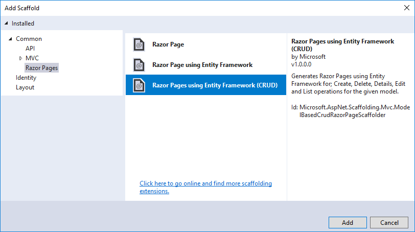

1. Complete the **Add Razor Pages using Entity Framework (CRUD)** dialog:
   1. In the **Model class** drop down, select **Movie (RazorPagesMovie.Models)**.
   1. In the **Data context class** row, select the **+** (plus) sign.
      1. In the **Add Data Context** dialog, the class name `RazorPagesMovie.Data.RazorPagesMovieContext` is generated.
   1. Select **Add**.

   

The `appsettings.json` file is updated with the connection string used to connect to a local database.

# [Visual Studio Code](#tab/visual-studio-code)

* Open a command shell to the project directory, which contains the `Program.cs`, `Startup.cs`, and `.csproj` files. Run the following command:

  ```dotnetcli
  dotnet-aspnet-codegenerator razorpage -m Movie -dc RazorPagesMovieContext -udl -outDir Pages/Movies --referenceScriptLibraries -sqlite
  ```

<a name="codegenerator"></a>
The following table details the ASP.NET Core code generator options.

| Option               | Description|
| ----------------- | ------------ |
| `-m`  | The name of the model. |
| `-dc`  | The `DbContext` class to use. |
| `-udl` | Use the default layout. |
| `-outDir` | The relative output folder path to create the views. |
| `--referenceScriptLibraries` | Adds `_ValidationScriptsPartial` to Edit and Create pages |

Use the `-h` option to get help on the `dotnet-aspnet-codegenerator razorpage` command:

```dotnetcli
dotnet-aspnet-codegenerator razorpage -h
```

For more information, see [dotnet-aspnet-codegenerator](xref:fundamentals/tools/dotnet-aspnet-codegenerator).

[!INCLUDE[](~/includes/RP/sqlitedev.md)]

# [Visual Studio for Mac](#tab/visual-studio-mac)

1. Create a *Pages/Movies* folder:
   1. Control-click on the *Pages* folder > **Add** > **New Folder**.
   1. Name the folder *Movies*.

1. Control-click on the *Pages/Movies* folder > **Add** > **New Scaffolding...**.

   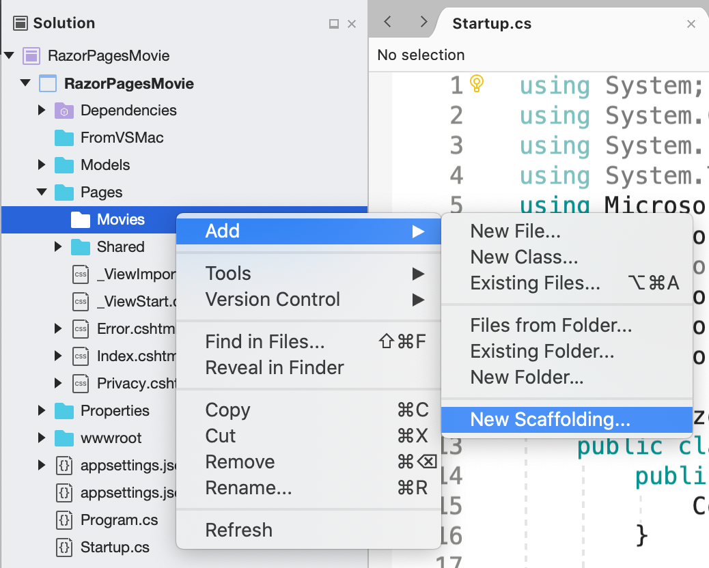

1. In the **New Scaffolding** dialog, select **Razor Pages using Entity Framework (CRUD)** > **Next**.

   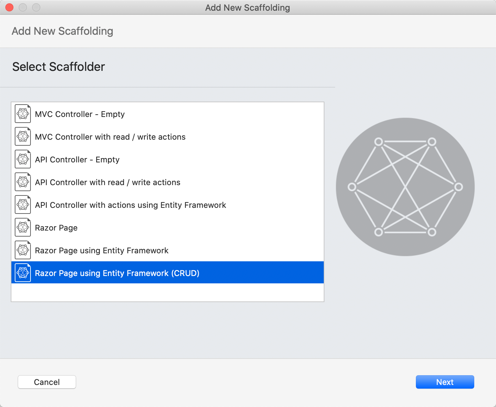

1. Complete the **Add Razor Pages using Entity Framework (CRUD)** dialog:
   1. In the **DbContext Class to use:** row, name the class `RazorPagesMovie.Data.RazorPagesMovieContext`.
   1. Select **Finish**.

   

The `appsettings.json` file is updated with the connection string used to connect to a local database.

[!INCLUDE[](~/includes/RP/sqlitedev.md)]

---

### Files created and updated

The scaffold process creates the following files:

* *Pages/Movies*: Create, Delete, Details, Edit, and Index.
* `Data/RazorPagesMovieContext.cs`

#### Updated files

* `Startup.cs`

The created and updated files are explained in the next section.

<a name="pmc"></a>

## Create the initial database schema using EF's migration feature

The migrations feature in Entity Framework Core provides a way to:

* Create the initial database schema.
* Incrementally update the database schema to keep it in sync with the application's data model.  Existing data in the database is preserved.

# [Visual Studio](#tab/visual-studio)

In this section, the **Package Manager Console** (PMC) window is used to:

* Add an initial migration.
* Update the database with the initial migration.

1. From the **Tools** menu, select **NuGet Package Manager** > **Package Manager Console**.

   

1. In the PMC, enter the following commands:

   ```powershell
   Add-Migration InitialCreate
   Update-Database
   ```

# [Visual Studio Code / Visual Studio for Mac](#tab/visual-studio-code+visual-studio-mac)

* Run the following .NET CLI commands:

  ```dotnetcli
  dotnet ef migrations add InitialCreate
  dotnet ef database update
  ```

> [!NOTE]
> For SQLite, column type for the `Price` field is set to `TEXT`. This is resolved in a later step.

---

For SQL Server, the preceding commands generate the following warning: "No type was specified for the decimal column 'Price' on entity type 'Movie'. This will cause values to be silently truncated if they do not fit in the default precision and scale. Explicitly specify the SQL server column type that can accommodate all the values using 'HasColumnType()'."

Ignore the warning, as it will be addressed in a later step.

The `migrations` command generates code to create the initial database schema. The schema is based on the model specified in `DbContext`. The `InitialCreate` argument is used to name the migrations. Any name can be used, but by convention a name is selected that describes the migration.

The `update` command runs the `Up` method in migrations that have not been applied. In this case, `update` runs the `Up` method in the `Migrations/<time-stamp>_InitialCreate.cs` file, which creates the database.

# [Visual Studio](#tab/visual-studio)

### Examine the context registered with dependency injection

ASP.NET Core is built with [dependency injection](xref:fundamentals/dependency-injection). Services, such as the EF Core database context, are registered with dependency injection during application startup. Components that require these services (such as Razor Pages) are provided via constructor parameters. The constructor code that gets a database context instance is shown later in the tutorial.

The scaffolding tool automatically created a database context and registered it with the dependency injection container.

Examine the `Startup.ConfigureServices` method. The highlighted line was added by the scaffolder:

[!code-csharp[](razor-pages-start/sample/RazorPagesMovie30/Startup.cs?name=snippet_ConfigureServices&highlight=5-6)]

The `RazorPagesMovieContext` coordinates EF Core functionality, such as Create, Read, Update and Delete, for the `Movie` model. The data context (`RazorPagesMovieContext`) is derived from [Microsoft.EntityFrameworkCore.DbContext](xref:Microsoft.EntityFrameworkCore.DbContext). The data context specifies which entities are included in the data model.

[!code-csharp[](~/tutorials/razor-pages/razor-pages-start/sample/RazorPagesMovie50/Data/RazorPagesMovieContext.cs)]

The preceding code creates a [DbSet\<Movie>](xref:Microsoft.EntityFrameworkCore.DbSet%601) property for the entity set. In Entity Framework terminology, an entity set typically corresponds to a database table. An entity corresponds to a row in the table.

The name of the connection string is passed in to the context by calling a method on a [DbContextOptions](xref:Microsoft.EntityFrameworkCore.DbContextOptions) object. For local development, the [Configuration system](xref:fundamentals/configuration/index) reads the connection string from the `appsettings.json` file.

# [Visual Studio Code / Visual Studio for Mac](#tab/visual-studio-code+visual-studio-mac)

Examine the `Up` method.

---

<a name="test"></a>

## Test the app

1. Run the app and append `/Movies` to the URL in the browser (`http://localhost:port/movies`).

   If you receive the following error:

   ```console
   SqlException: Cannot open database "RazorPagesMovieContext-GUID" requested by the login. The login failed.
   Login failed for user 'User-name'.
   ```

   You missed the [migrations step](#pmc).

1. Test the **Create** link.

   

   > [!NOTE]
   > You may not be able to enter decimal commas in the `Price` field. To support [jQuery validation](https://jqueryvalidation.org/) for non-English locales that use a comma (",") for a decimal point and for non US-English date formats, the app must be globalized. For globalization instructions, see [this GitHub issue](https://github.com/dotnet/AspNetCore.Docs/issues/4076#issuecomment-326590420).

1. Test the **Edit**, **Details**, and **Delete** links.

[!INCLUDE[s](~/includes/sql-log.md)]

The next tutorial explains the files created by scaffolding.

## Additional resources

> [!div class="step-by-step"]
> [Previous: Get Started](xref:tutorials/razor-pages/razor-pages-start)
> [Next: Scaffolded Razor Pages](xref:tutorials/razor-pages/page)

:::moniker-end

:::moniker range="< aspnetcore-5.0"

<!-- In the next update on the CLI version, let the scaffolder do the same work the VS driven scaffolder does. That is, create the DB context, etc -->

In this section, classes are added for managing movies. The app's model classes use [Entity Framework Core (EF Core)](/ef/core) to work with the database. EF Core is an object-relational mapper (O/RM) that simplifies data access.

The model classes are known as POCO classes (from "plain-old CLR objects") because they don't have any dependency on EF Core. They define the properties of the data that are stored in the database.

[View or download sample code](https://github.com/dotnet/AspNetCore.Docs/tree/main/aspnetcore/tutorials/razor-pages/razor-pages-start/sample/RazorPagesMovie30) ([how to download](xref:index#how-to-download-a-sample)).

## Add a data model

# [Visual Studio](#tab/visual-studio)

Right-click the **RazorPagesMovie** project > **Add** > **New Folder**. Name the folder *Models*.

Right-click the *Models* folder. Select **Add** > **Class**. Name the class **Movie**.

Add the following properties to the `Movie` class:

[!code-csharp[](~/tutorials/razor-pages/razor-pages-start/sample/RazorPagesMovie22/Models/Movie.cs?name=snippet1)]

The `Movie` class contains:

* The `ID` field is required by the database for the primary key.
* `[DataType(DataType.Date)]`: The [DataType](xref:System.ComponentModel.DataAnnotations.DataTypeAttribute) attribute specifies the type of the data (`Date`). With this attribute:

  * The user is not required to enter time information in the date field.
  * Only the date is displayed, not time information.

[DataAnnotations](xref:System.ComponentModel.DataAnnotations) are covered in a later tutorial.

# [Visual Studio Code](#tab/visual-studio-code)

* Add a folder named *Models*.
* Add a class to the *Models* folder named `Movie.cs`.

Add the following properties to the `Movie` class:

[!code-csharp[](~/tutorials/razor-pages/razor-pages-start/sample/RazorPagesMovie22/Models/Movie.cs?name=snippet1)]

The `Movie` class contains:

* The `ID` field is required by the database for the primary key.
* `[DataType(DataType.Date)]`: The [DataType](xref:System.ComponentModel.DataAnnotations.DataTypeAttribute) attribute specifies the type of the data (`Date`). With this attribute:

  * The user is not required to enter time information in the date field.
  * Only the date is displayed, not time information.

[DataAnnotations](xref:System.ComponentModel.DataAnnotations) are covered in a later tutorial.

<a name="dc"></a>

### Add NuGet packages and EF tools

[!INCLUDE[](~/includes/add-EF-NuGet-SQLite-CLI.md)]

### Add a database context class

* In the *RazorPagesMovie* project, create a new folder named *Data*.
* Add the following `RazorPagesMovieContext` class to the *Data* folder:

  [!code-csharp[](~/tutorials/razor-pages/razor-pages-start/sample/RazorPagesMovie30/Data/RazorPagesMovieContext.cs)]

The preceding code creates a `DbSet` property for the entity set. In Entity Framework terminology, an entity set typically corresponds to a database table, and an entity corresponds to a row in the table. The code won't compile until dependencies are added in a later step.

<a name="cs"></a>

### Add a database connection string

Add a connection string to the `appsettings.json` file as shown in the following highlighted code:

[!code-json[](~/tutorials/razor-pages/razor-pages-start/sample/RazorPagesMovie30/appsettings_SQLite.json?highlight=10-12)]

<a name="reg"></a>

### Register the database context

Add the following `using` statements at the top of `Startup.cs`:

```csharp
using RazorPagesMovie.Data;
using Microsoft.EntityFrameworkCore;
```

Register the database context with the [dependency injection](xref:fundamentals/dependency-injection) container in `Startup.ConfigureServices`.

[!code-csharp[](~/tutorials/razor-pages/razor-pages-start/sample/RazorPagesMovie30/Startup.cs?name=snippet_UseSqlite&highlight=5-6)]

# [Visual Studio for Mac](#tab/visual-studio-mac)

* In the **Solution Tool Window**, control-click the **RazorPagesMovie** project, and then select **Add** > **New Folder...**. Name the folder *Models*.
* Right-click the *Models* folder, and then select **Add** > **New File...**.
* In the **New File** dialog:

  * Select **General** in the left pane.
  * Select **Empty Class** in the center pane.
  * Name the class **Movie** and select **New**.

Add the following properties to the `Movie` class:

[!code-csharp[](~/tutorials/razor-pages/razor-pages-start/sample/RazorPagesMovie22/Models/Movie.cs?name=snippet1)]

The `Movie` class contains:

* The `ID` field is required by the database for the primary key.
* `[DataType(DataType.Date)]`: The [DataType](xref:System.ComponentModel.DataAnnotations.DataTypeAttribute) attribute specifies the type of the data (`Date`). With this attribute:

  * The user is not required to enter time information in the date field.
  * Only the date is displayed, not time information.

---

[DataAnnotations](xref:System.ComponentModel.DataAnnotations) are covered in a later tutorial.

Build the project to verify there are no compilation errors.

## Scaffold the movie model

In this section, the movie model is scaffolded. That is, the scaffolding tool produces pages for Create, Read, Update, and Delete (CRUD) operations for the movie model.

# [Visual Studio](#tab/visual-studio)

Create a *Pages/Movies* folder:

* Right-click on the *Pages* folder > **Add** > **New Folder**.
* Name the folder *Movies*.

Right-click on the *Pages/Movies* folder > **Add** > **New Scaffolded Item**.

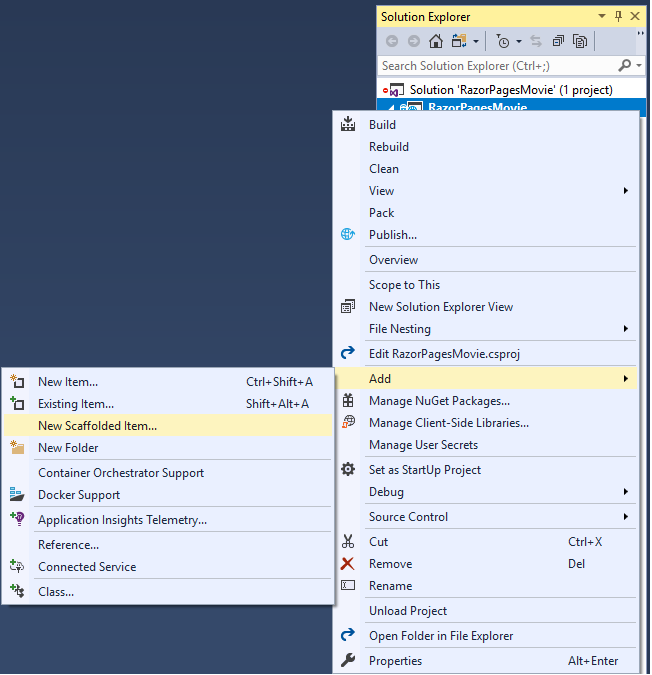

In the **Add Scaffold** dialog, select **Razor Pages using Entity Framework (CRUD)** > **Add**.


Complete the **Add Razor Pages using Entity Framework (CRUD)** dialog:

* In the **Model class** drop down, select **Movie (RazorPagesMovie.Models)**.
* In the **Data context class** row, select the **+** (plus) sign and change the generated name from RazorPagesMovie.**Models**.RazorPagesMovieContext to RazorPagesMovie.**Data**.RazorPagesMovieContext. [This change](https://developercommunity.visualstudio.com/content/problem/652166/aspnet-core-ef-scaffolder-uses-incorrect-namespace.html) is not required. It creates the database context class with the correct namespace.
* Select **Add**.


The `appsettings.json` file is updated with the connection string used to connect to a local database.

# [Visual Studio Code](#tab/visual-studio-code)

<!--  Until https://github.com/aspnet/Scaffolding/issues/582 is fixed windows needs backslash or the namespace is namespace RazorPagesMovie.Pages_Movies rather than namespace RazorPagesMovie.Pages.Movies
-->

* Open a command window in the project directory, which contains the `Program.cs`, `Startup.cs`, and `.csproj` files.

* **For Windows**: Run the following command:

  ```dotnetcli
  dotnet-aspnet-codegenerator razorpage -m Movie -dc RazorPagesMovieContext -udl -outDir Pages\Movies --referenceScriptLibraries
  ```

* **For macOS and Linux**: Run the following command:

  ```dotnetcli
  dotnet-aspnet-codegenerator razorpage -m Movie -dc RazorPagesMovieContext -udl -outDir Pages/Movies --referenceScriptLibraries
  ```

<a name="codegenerator"></a>
The following table details the ASP.NET Core code generator options:

| Option               | Description|
| ----------------- | ------------ |
| `-m`  | The name of the model. |
| `-dc`  | The `DbContext` class to use. |
| `-udl` | Use the default layout. |
| `-outDir` | The relative output folder path to create the views. |
| `--referenceScriptLibraries` | Adds `_ValidationScriptsPartial` to Edit and Create pages |

Use the `-h` option to get help on the `dotnet-aspnet-codegenerator razorpage` command:

```dotnetcli
dotnet-aspnet-codegenerator razorpage -h
```

For more information, see [dotnet-aspnet-codegenerator](xref:fundamentals/tools/dotnet-aspnet-codegenerator).

### Use SQLite for development, SQL Server for production

When SQLite is selected, the template generated code is ready for development. The following code shows how to inject <xref:Microsoft.AspNetCore.Hosting.IWebHostEnvironment> into Startup. `IWebHostEnvironment` is injected so `ConfigureServices` can use SQLite in development and SQL Server in production.

[!code-csharp[](~/includes/RP/code/StartupDevProd.cs?name=snippet&highlight=5,10,14)]

# [Visual Studio for Mac](#tab/visual-studio-mac)

Create a *Pages/Movies* folder:

* Right-click on the *Pages* folder > **Add** > **New Folder**.
* Name the folder *Movies*.

Right-click on the *Pages/Movies* folder > **Add** > **New Scaffolding...**.


In the **New Scaffolding** dialog, select **Razor Pages using Entity Framework (CRUD)** > **Next**.


Complete the **Add Razor Pages using Entity Framework (CRUD)** dialog:

* In the **Model class** drop down, select, or type, **Movie (RazorPagesMovie.Models)**.
* In the **Data context class** row, type the name for the new class, RazorPagesMovie.**Data**.RazorPagesMovieContext. [This change](https://developercommunity.visualstudio.com/content/problem/652166/aspnet-core-ef-scaffolder-uses-incorrect-namespace.html) is not required. It creates the database context class with the correct namespace.
* Select **Add**.


The `appsettings.json` file is updated with the connection string used to connect to a local database.

### Add EF tools

Run the following .NET Core CLI command:

```dotnetcli
dotnet tool install --global dotnet-ef
```

The preceding command adds the Entity Framework Core Tools for the .NET Core CLI. For more information, see [Entity Framework Core tools reference - .NET Core CLI](/ef/core/miscellaneous/cli/dotnet).

### Use SQLite for development, SQL Server for production

When SQLite is selected, the template generated code is ready for development. The following code shows how to inject <xref:Microsoft.AspNetCore.Hosting.IWebHostEnvironment> into Startup. `IWebHostEnvironment` is injected so `ConfigureServices` can use SQLite in development and SQL Server in production.

[!code-csharp[](~/includes/RP/code/StartupDevProd.cs?name=snippet&highlight=5,10,14)]

---

### Files created

# [Visual Studio](#tab/visual-studio)

The scaffold process creates and updates the following files:

* *Pages/Movies*: Create, Delete, Details, Edit, and Index.
* `Data/RazorPagesMovieContext.cs`

### Updated

* `Startup.cs`

The created and updated files are explained in the next section.

# [Visual Studio for Mac](#tab/visual-studio-mac)

The scaffold process creates and updates the following files:

* *Pages/Movies*: Create, Delete, Details, Edit, and Index.
* `Data/RazorPagesMovieContext.cs`

### Updated

* `Startup.cs`

The created and updated files are explained in the next section.

# [Visual Studio Code](#tab/visual-studio-code)

The scaffold process creates the following files:

* *Pages/Movies*: Create, Delete, Details, Edit, and Index.

The created files are explained in the next section.

---

<a name="pmc"></a>

## Initial migration

# [Visual Studio](#tab/visual-studio)

In this section, the Package Manager Console (PMC) is used to:

* Add an initial migration.
* Update the database with the initial migration.

From the **Tools** menu, select **NuGet Package Manager** > **Package Manager Console**.

  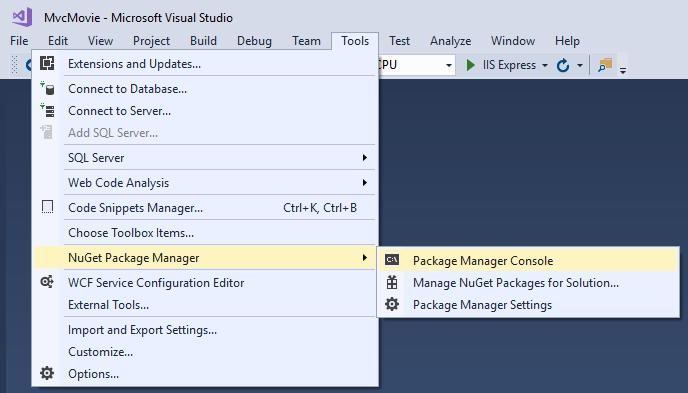

In the PMC, enter the following commands:

```powershell
Add-Migration InitialCreate
Update-Database
```

# [Visual Studio Code / Visual Studio for Mac](#tab/visual-studio-code+visual-studio-mac)

[!INCLUDE [more information on the CLI for EF Core](~/includes/ef-cli.md)]

Run the following .NET Core CLI commands:

```dotnetcli
dotnet ef migrations add InitialCreate
dotnet ef database update
```

---

The preceding commands generate the following warning: "No type was specified for the decimal column 'Price' on entity type 'Movie'. This will cause values to be silently truncated if they do not fit in the default precision and scale. Explicitly specify the SQL server column type that can accommodate all the values using 'HasColumnType()'."

Ignore the warning, as it will be addressed in a later step.

The migrations command generates code to create the initial database schema. The schema is based on the model specified in `DbContext`. The `InitialCreate` argument is used to name the migrations. Any name can be used, but by convention a name is selected that describes the migration.

The `update` command runs the `Up` method in migrations that have not been applied. In this case, `update` runs the `Up` method in  `Migrations/<time-stamp>_InitialCreate.cs` file, which creates the database.

# [Visual Studio](#tab/visual-studio)

### Examine the context registered with dependency injection

ASP.NET Core is built with [dependency injection](xref:fundamentals/dependency-injection). Services, such as the EF Core database context context, are registered with dependency injection during application startup. Components that require these services, such as Razor Pages, are provided via constructor parameters. The constructor code that gets a database context context instance is shown later in the tutorial.

The scaffolding tool automatically created a database context context and registered it with the dependency injection container.

Examine the `Startup.ConfigureServices` method. The highlighted line was added by the scaffolder:

[!code-csharp[](razor-pages-start/sample/RazorPagesMovie30/Startup.cs?name=snippet_ConfigureServices&highlight=5-6)]

The `RazorPagesMovieContext` coordinates EF Core functionality, such as Create, Read, Update and Delete, for the `Movie` model. The data context (`RazorPagesMovieContext`) is derived from [Microsoft.EntityFrameworkCore.DbContext](xref:Microsoft.EntityFrameworkCore.DbContext). The data context specifies which entities are included in the data model.

[!code-csharp[](~/tutorials/razor-pages/razor-pages-start/sample/RazorPagesMovie30/Data/RazorPagesMovieContext.cs)]

The preceding code creates a [DbSet\<Movie>](xref:Microsoft.EntityFrameworkCore.DbSet%601) property for the entity set. In Entity Framework terminology, an entity set typically corresponds to a database table. An entity corresponds to a row in the table.

The name of the connection string is passed in to the context by calling a method on a [DbContextOptions](xref:Microsoft.EntityFrameworkCore.DbContextOptions) object. For local development, the [Configuration system](xref:fundamentals/configuration/index) reads the connection string from the `appsettings.json` file.

# [Visual Studio Code / Visual Studio for Mac](#tab/visual-studio-code+visual-studio-mac)

Examine the `Up` method.

---

<a name="test"></a>

### Test the app

* Run the app and append `/Movies` to the URL in the browser (`http://localhost:port/movies`).

If you get the error:

```console
SqlException: Cannot open database "RazorPagesMovieContext-GUID" requested by the login. The login failed.
Login failed for user 'User-name'.
```

You missed the [migrations step](#pmc).

* Test the **Create** link.

  

  > [!NOTE]
  > You may not be able to enter decimal commas in the `Price` field. To support [jQuery validation](https://jqueryvalidation.org/) for non-English locales that use a comma (",") for a decimal point and for non US-English date formats, the app must be globalized. For globalization instructions, see [this GitHub issue](https://github.com/dotnet/AspNetCore.Docs/issues/4076#issuecomment-326590420).

* Test the **Edit**, **Details**, and **Delete** links.

The next tutorial explains the files created by scaffolding.

## Additional resources

> [!div class="step-by-step"]
> [Previous: Get Started](xref:tutorials/razor-pages/razor-pages-start)
> [Next: Scaffolded Razor Pages](xref:tutorials/razor-pages/page)

:::moniker-end
